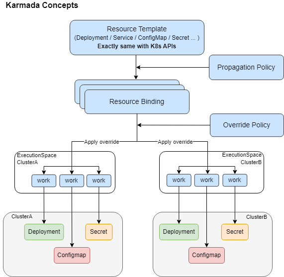

# Karmada


[](/LICENSE)
[](https://github.com/karmada-io/karmada/releases)
[](https://slack.cncf.io)
[](https://bestpractices.coreinfrastructure.org/projects/5301)

[](https://goreportcard.com/report/github.com/karmada-io/karmada)
[](https://codecov.io/gh/karmada-io/karmada)

## Karmada: Open, Multi-Cloud, Multi-Cluster Kubernetes Orchestration

Karmada (Kubernetes Armada) is a Kubernetes management system that enables you to run your cloud-native applications across multiple Kubernetes clusters and clouds, with no changes to your applications. By speaking Kubernetes-native APIs and providing advanced scheduling capabilities, Karmada enables truly open, multi-cloud Kubernetes.

Karmada aims to provide turnkey automation for multi-cluster application management in multi-cloud and hybrid cloud scenarios,
with key features such as centralized multi-cloud management, high availability, failure recovery, and traffic scheduling.


Karmada is a sandbox project of the [Cloud Native Computing Foundation](https://cncf.io/) (CNCF).

## Why Karmada:
- __K8s Native API Compatible__
    - Zero change upgrade, from single-cluster to multi-cluster
    - Seamless integration of existing K8s tool chain

- __Out of the Box__
    - Built-in policy sets for scenarios, including: Active-active, Remote DR, Geo Redundant, etc.
    - Cross-cluster applications auto-scaling, failover and load-balancing on multi-cluster.

- __Avoid Vendor Lock-in__
    - Integration with mainstream cloud providers
    - Automatic allocation, migration across clusters
    - Not tied to proprietary vendor orchestration

- __Centralized Management__
    - Location agnostic cluster management
    - Support clusters in Public cloud, on-prem or edge

- __Fruitful Multi-Cluster Scheduling Policies__
    - Cluster Affinity, Multi Cluster Splitting/Rebalancing,
    - Multi-Dimension HA: Region/AZ/Cluster/Provider

- __Open and Neutral__
    - Jointly initiated by Internet, finance, manufacturing, teleco, cloud providers, etc.
    - Target for open governance with CNCF


**Notice: this project is developed in continuation of Kubernetes [Federation v1](https://github.com/kubernetes-retired/federation) and [v2](https://github.com/kubernetes-sigs/kubefed). Some basic concepts are inherited from these two versions.**


## Architecture


The Karmada Control Plane consists of the following components:

- Karmada API Server
- Karmada Controller Manager
- Karmada Scheduler

ETCD stores the Karmada API objects, the API Server is the REST endpoint all other components talk to, and the Karmada Controller Manager performs operations based on the API objects you create through the API server.

The Karmada Controller Manager runs the various controllers,  the controllers watch Karmada objects and then talk to the underlying clusters' API servers to create regular Kubernetes resources.

1. Cluster Controller: attach Kubernetes clusters to Karmada for managing the lifecycle of the clusters by creating cluster objects.
2. Policy Controller: the controller watches PropagationPolicy objects. When the PropagationPolicy object is added, it selects a group of resources matching the resourceSelector and creates ResourceBinding with each single resource object.
3. Binding Controller: the controller watches ResourceBinding object and create Work object corresponding to each cluster with a single resource manifest.
4. Execution Controller: the controller watches Work objects. When Work objects are created, it will distribute the resources to member clusters.


## Concepts

**Resource template**: Karmada uses Kubernetes Native API definition for federated resource template, to make it easy to integrate with existing tools that already adopt on Kubernetes

**Propagation Policy**: Karmada offers a standalone Propagation(placement) Policy API to define multi-cluster scheduling and spreading requirements.
- Support 1:n mapping of Policy: workload, users don't need to indicate scheduling constraints every time creating federated applications.
- With default policies, users can just interact with K8s API

**Override Policy**: Karmada provides standalone Override Policy API for specializing cluster relevant configuration automation. E.g.:
- Override image prefix according to member cluster region
- Override StorageClass according to cloud provider


The following diagram shows how Karmada resources are involved when propagating resources to member clusters.



## Quick Start

This guide will cover:
- Install `karmada` control plane components in a Kubernetes cluster which is known as `host cluster`.
- Join a member cluster to `karmada` control plane.
- Propagate an application by using `karmada`.

### Prerequisites
- [Go](https://golang.org/) version v1.19+
- [kubectl](https://kubernetes.io/docs/tasks/tools/install-kubectl/) version v1.19+
- [kind](https://kind.sigs.k8s.io/) version v0.14.0+

### Install the Karmada control plane

#### 1. Clone this repo to your machine:
```
git clone https://github.com/karmada-io/karmada
```

#### 2. Change to the karmada directory:
```
cd karmada
```

#### 3. Deploy and run Karmada control plane:

run the following script:

```
# hack/local-up-karmada.sh
```
This script will do following tasks for you:
- Start a Kubernetes cluster to run the Karmada control plane, aka. the `host cluster`.
- Build Karmada control plane components based on a current codebase.
- Deploy Karmada control plane components on the `host cluster`.
- Create member clusters and join Karmada.

If everything goes well, at the end of the script output, you will see similar messages as follows:
```
Local Karmada is running.

To start using your Karmada environment, run:
  export KUBECONFIG="$HOME/.kube/karmada.config"
Please use 'kubectl config use-context karmada-host/karmada-apiserver' to switch the host and control plane cluster.

To manage your member clusters, run:
  export KUBECONFIG="$HOME/.kube/members.config"
Please use 'kubectl config use-context member1/member2/member3' to switch to the different member cluster.
```

There are two contexts in Karmada:
- karmada-apiserver `kubectl config use-context karmada-apiserver`
- karmada-host `kubectl config use-context karmada-host`

The `karmada-apiserver` is the **main kubeconfig** to be used when interacting with the Karmada control plane, while `karmada-host` is only used for debugging Karmada installation with the host cluster. You can check all clusters at any time by running: `kubectl config view`. To switch cluster contexts, run `kubectl config use-context [CONTEXT_NAME]`


### Demo


### Propagate application
In the following steps, we are going to propagate a deployment by Karmada.

#### 1. Create nginx deployment in Karmada.
First, create a [deployment](samples/nginx/deployment.yaml) named `nginx`:
```
kubectl create -f samples/nginx/deployment.yaml
```

#### 2. Create PropagationPolicy that will propagate nginx to member cluster
Then, we need to create a policy to propagate the deployment to our member cluster.
```
kubectl create -f samples/nginx/propagationpolicy.yaml
```

#### 3. Check the deployment status from Karmada
You can check deployment status from Karmada, don't need to access member cluster:
```
$ kubectl get deployment
NAME    READY   UP-TO-DATE   AVAILABLE   AGE
nginx   2/2     2            2           20s
```

## Kubernetes compatibility

|                        | Kubernetes 1.16 | Kubernetes 1.17 | Kubernetes 1.18 | Kubernetes 1.19 | Kubernetes 1.20 | Kubernetes 1.21 | Kubernetes 1.22 | Kubernetes 1.23 | Kubernetes 1.24 | Kubernetes 1.25 |
|------------------------|-----------------|-----------------|-----------------|-----------------|-----------------|-----------------|-----------------|-----------------|-----------------|-----------------|
| Karmada v0.9           | ✓               | ✓               | ✓               | ✓               | ✓               | ✓               | ✓               | ✓               | ✓               | ✓               |
| Karmada v0.10          | ✓               | ✓               | ✓               | ✓               | ✓               | ✓               | ✓               | ✓               | ✓               | ✓               |
| Karmada v1.0           | ✓               | ✓               | ✓               | ✓               | ✓               | ✓               | ✓               | ✓               | ✓               | ✓               |
| Karmada v1.1           | ✓               | ✓               | ✓               | ✓               | ✓               | ✓               | ✓               | ✓               | ✓               | ✓               |
| Karmada v1.2           | ✓               | ✓               | ✓               | ✓               | ✓               | ✓               | ✓               | ✓               | ✓               | ✓               |
| Karmada v1.3           | ✓               | ✓               | ✓               | ✓               | ✓               | ✓               | ✓               | ✓               | ✓               | ✓               |
| Karmada v1.4           | ✓               | ✓               | ✓               | ✓               | ✓               | ✓               | ✓               | ✓               | ✓               | ✓               |
| Karmada HEAD (master)  | ✓               | ✓               | ✓               | ✓               | ✓               | ✓               | ✓               | ✓               | ✓               | ✓               |

Key:
* `✓` Karmada and the Kubernetes version are exactly compatible.
* `+` Karmada has features or API objects that may not be present in the Kubernetes version.
* `-` The Kubernetes version has features or API objects that Karmada can't use.

## Meeting

Regular Community Meeting:
* Tuesday at 14:30 UTC+8 (Chinese)(biweekly). [Convert to your timezone.](https://www.thetimezoneconverter.com/?t=14%3A30&tz=GMT%2B8&)
* TBD (English)(biweekly). [Please propose the time](https://github.com/karmada-io/karmada/issues/1560) if you are interested to attend.

Resources:
- [Meeting Notes and Agenda](https://docs.google.com/document/d/1y6YLVC-v7cmVAdbjedoyR5WL0-q45DBRXTvz5_I7bkA/edit)
- [Meeting Calendar](https://calendar.google.com/calendar/embed?src=karmadaoss%40gmail.com&ctz=Asia%2FShanghai) | [Subscribe](https://calendar.google.com/calendar/u/1?cid=a2FybWFkYW9zc0BnbWFpbC5jb20)
- [Meeting Link](https://zoom.com/my/karmada)

## Contact

If you have questions, feel free to reach out to us in the following ways:

- [mailing list](https://groups.google.com/forum/#!forum/karmada)
- [slack](https://cloud-native.slack.com/archives/C02MUF8QXUN) | [Join](https://slack.cncf.io/)
- [twitter](https://twitter.com/karmada_io)

## Talks and References

|                  | Link                                                                                                                    |
|------------------|-------------------------------------------------------------------------------------------------------------------------|
| KubeCon(EU 2021) | [Beyond federation: automating multi-cloud workloads with K8s native APIs](https://www.youtube.com/watch?v=LJJoaGszBVk) |
| KubeCon(EU 2022) | TBD                                                                                                                     |

For blogs please refer to [website](https://karmada.io/blog/).

## Contributing

If you're interested in being a contributor and want to get involved in
developing the Karmada code, please see [CONTRIBUTING](CONTRIBUTING.md) for
details on submitting patches and the contribution workflow.

## License

Karmada is under the Apache 2.0 license. See the [LICENSE](LICENSE) file for details.
