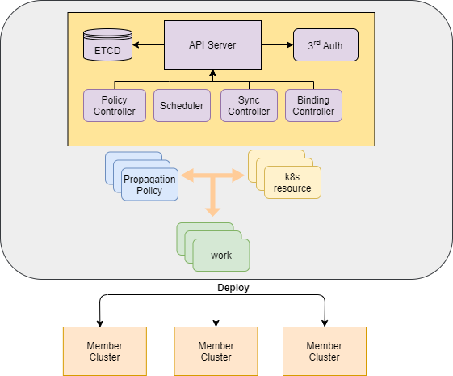

# Karmada

Karmada is a multi-cluster management system with compatible k8s native API. 
Karmada aims to provide one-stop solution for multi-cluster management and cross-cluster applications in multi-cloud and hybrid cloud scenarios.

Its key capabilities include:

- Cluster life cycle management, including cluster creation, registration, destroy, and monitoring
- Cross-cluster application lifecycle management, including cross-cluster application deployment, monitoring, etc.
- Dynamic scheduling of cross-cluster applications, including cross-cluster load balancing, failure recovery, etc.



----

## To start using Karmada

Get karmada if you don't have it.

```
git clone https://github.com/huawei-cloudnative/karmada
```

Install karmada's [Custom Resource Definitions](https://kubernetes.io/docs/concepts/extend-kubernetes/api-extension/custom-resources/#customresourcedefinitions) via `kubectl apply`, and wait a few seconds for the CRDs to be committed in the kube-apiserver:

```
kubectl apply -f install/crds.yaml
```

Run the following command to install karmada components:

```
kubectl apply -f install/karmada.yaml
```

Ensure corresponding Kubernetes pods are deployed and have a `STATUS` of `Running`:

```
kubectl get pods -n karmada-system
```

## To start developing Karmada

The [community repository] hosts all information about building Karmada from source, how to contribute code and documentation, who to contact about what, etc.

If you want to build Karmada right away,follow the steps:

##### You have a working [Go environment].

```
mkdir -p $GOPATH/src/huawei-cloudnative
cd $GOPATH/src/huawei-cloudnative
git clone https://github.com/huawei-cloudnative/karmada
cd karmada
make
```
