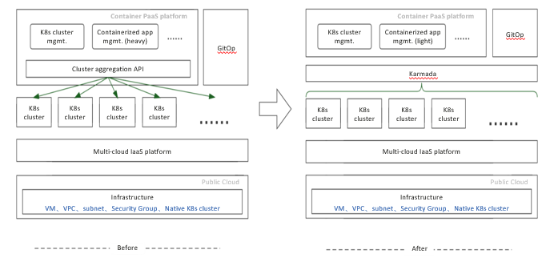

<!-- START doctoc generated TOC please keep comment here to allow auto update -->
<!-- DON'T EDIT THIS SECTION, INSTEAD RE-RUN doctoc TO UPDATE -->
**Table of Contents**  *generated with [DocToc](https://github.com/thlorenz/doctoc)*

- [VIPKID: Building a PaaS Platform with Karmada to Run Containers](#vipkid-building-a-paas-platform-with-karmada-to-run-containers)
  - [Background](#background)
  - [Born Multi-Cloud and Cross-Region](#born-multi-cloud-and-cross-region)
    - [Multi-Cluster Policy](#multi-cluster-policy)
    - [Cluster Disaster Recovery](#cluster-disaster-recovery)
  - [Challenges and Pain Points](#challenges-and-pain-points)
    - [Running the Same Application in Different Clusters](#running-the-same-application-in-different-clusters)
    - [Quickly Migrating Applications upon Faults](#quickly-migrating-applications-upon-faults)
  - [Why Karmada](#why-karmada)
    - [Any Solutions Available?](#any-solutions-available)
    - [Karmada, the Solution of Choice](#karmada-the-solution-of-choice)
  - [Karmada at VIPKID](#karmada-at-vipkid)
    - [Containerization Based on Karmada](#containerization-based-on-karmada)
  - [Benefits](#benefits)
  - [Gains](#gains)

<!-- END doctoc generated TOC please keep comment here to allow auto update -->

# VIPKID: Building a PaaS Platform with Karmada to Run Containers

Author: Ci Yiheng, Backend R&D Expert, VIPKID

## Background

VIPKID is an online English education platform with more than 80,000 teachers and 1 million trainees. 
It has delivered 150 million training sessions across countries and regions. To provide better services, 
VIPKID deploys applications by region and close to teachers and trainees. Therefore, 
VIPKID purchased dozens of clusters from multiple cloud providers around the world to build its internal infrastructure.

## Born Multi-Cloud and Cross-Region

VIPKID provides services internationally. Native speakers can be both teaching students in China and studying with Chinese teachers.
To provide optimal online class experience, VIPKID sets up a low-latency network and deploys computing services close to teachers and trainees separately.
Such deployment depends on resources from multiple public cloud vendors. Managing multi-cloud resources has long become a part of VIPKID's IaaS operations.

### Multi-Cluster Policy

We first tried the single-cluster mode to containerize our platform, simple and low-cost. We dropped it after evaluating the network quality and infrastructure (network and storage) solutions across clouds and regions, and our project period. There are two major reasons:
1) Network latency and stability between clouds cannot be guaranteed.
2) Different vendors have different solutions for container networking and storage.
   Costs would be high if we wanted to resolve these problems. Finally, we decided to configure Kubernetes clusters by cloud vendor and region. That's why we have so many clusters.

### Cluster Disaster Recovery

DR(Disaster Recovery) becomes easier for containers than VMs. Kubernetes provides DR solutions for pods and nodes, but not single clusters. Thanks to the microservice reconstruction, we can quickly create a cluster or scale an existing one to transfer computing services.

## Challenges and Pain Points

### Running the Same Application in Different Clusters

During deployment, we found that the workloads of the same application vary greatly in different clusters in terms of images, startup parameters (configurations), and release versions. In the early stage, we wanted that our developers can directly manage applications on our own PaaS platform. However, the increasing customization made it more and more difficult to abstract the differences.

We had to turn to our O&M team, but they also failed in some complex scenarios. This is not DevOps. It does not reduce costs or increase efficiency.

### Quickly Migrating Applications upon Faults

Fault migration can be focused on applications or clusters. The application-centric approach focuses on the 
self-healing of key applications and the overall load in multi-cluster mode. 
The cluster-centric approach focuses on the disasters (such as network faults) that may impact all clusters or on the 
delivery requirements when creating new clusters. You need to set different policies for these approaches.

**Application-centric: Dynamic Migration**

Flexibly deploying an application in multiple clusters can ensure its stability. For example, if an instance in a cluster is faulty and cannot be quickly recovered, a new instance needs to be created automatically in another cluster of the same vendor or region based on the preset policy.

**Cluster-centric: Quick Cluster Startup**

Commonly, we start a new cluster to replace the unavailable one or to deliver services which depend on a specific cloud vendor or region. It would be best if clusters can be started as fast as pods.

## Why Karmada

### Any Solutions Available?

Your service systems may evolve fast and draw clear lines for modules. To address the pain points, you need to, to some extent, abstract, decouple and reconstruct your systems.

For us, service requirements were deeply coupled with cluster resources. We wanted to decouple them via multi-cluster management. Specifically, use the self-developed platform to manage the application lifecycle, and use a system to manage operation instructions on cluster resources.

We probed into the open source communities to find products that support multi-cluster management. However, most products either serve as a platform like ours or manage resources by cluster.

We wanted to manage multiple Kubernetes clusters like one single, large cluster. In this way, a workload can be regarded as an independent application (or a version of an application) instead of a replica of an application in multiple clusters.

We also wanted to lower the access costs as much as possible. We surveyed and evaluated many solutions in the communities and decided on Karmada.

### Karmada, the Solution of Choice

Karmada has the following advantages:
1) Karmada allows us to manage multiple clusters like one single cluster and manage resources in an application-centric approach. In addition, almost all configuration differences can be independently declared through the Override policies in Karmada, simple, intuitive, and easy to manage.
2) Karmada uses native Kubernetes APIs. We need no adaption and the access cost is low. Karmada also manifests configurations through CRDs. It dynamically turns distribution and differentiated configurations into Propagation and Override policies and delivers them to the Karmada control plane.
3) Karmada sits under the open governance of a neutral community. The community welcomes open discussions on requirements and ideas and we got technically improved while contributing to the community.

## Karmada at VIPKID

Our platform caters to all container-based deployments, covering stateful or stateless applications, hybrid deployment of online and offline jobs, AI, and big data services. This platform does not rely on any public cloud. Therefore, we cannot use any encapsulated products of cloud vendors.

We use the internal IaaS platform to create and scale out clusters, configure VPCs, subnets, and security groups of different vendors. In this way, vendor differences become the least of worries for our PaaS platform.

In addition, we provide GitOps for developers to manage system applications and components. This is more user-friendly and efficient for skilled developers.

### Containerization Based on Karmada

At the beginning, we designed a component (cluster aggregation API) in the platform to interact with Kubernetes clusters. We retained the native Kubernetes APIs and added some cluster-related information.
However, there were complex problems during the implementation. For example, as the PaaS system needed to render declarations of different resources to multiple clusters, the applications we maintained in different clusters were irrelevant. We made much effort to solve these problems, even after CRDs were introduced. The system still needed to keep track of the details of each cluster, which goes against what cluster aggregation API is supposed to do.
When there are a large number of clusters that go online and offline frequently, we need to change the configurations in batches for applications in the GitOps model to ensure normal cluster running. However, GitOps did not cope with the increasing complexity as expected.

The following figure shows the differences before and after we used Karmada.

**After Karmada is introduced, the multi-cluster aggregation layer is truly unified.** We can manage resources by application on the Karmada control plane. We only need to interact with Karmada, not the clusters, which simplifies containerized application management and enables our PaaS platform to fully focus on service requirements.
With Karmada integrated into GitOps, system components can be easily released and upgraded in each cluster, exponentially more efficient than before.

## Benefits

Managing Kubernetes resources by application simplifies the platform and greatly improves utilization. Here are the improvements brought by Karmada.

**1) Higher deployment efficiency**

Before then, we needed to send deployment instructions to each cluster and monitor the deployment status, which required us to continuously check resources and handle exceptions. Now, application statuses are automatically collected and detected by Karmada.

**2) Differentiated control on applications**

Adopting DevOps means developers can easily manage the lifecycle of applications.
We leverage Karmada Override policies to directly interconnect with application profiles such as environment variables, startup parameters, and image repositories so that developers can better control the differences of applications in different clusters.

**3) Quick cluster startup and adaptation to GitOps**

Basic services (system and common services) are configured for all clusters in Karmada Propagation policies and managed by Karmada when a new cluster is created. These basic services can be delivered along with the cluster, requiring no manual initialization and greatly shortening the delivery process.
Most basic services are managed by the GitOps system, which is convenient and intuitive.

**4) Short reconstruction period and no impact on services**

Thanks to the support of native Kubernetes APIs, we can quickly integrate Karmada into our platform. 
We use Karmada the way we use Kubernetes. The only thing we need to configure is Propagation policies, 
which can be customized by resource name, resource type, or LabelSelector.

## Gains

Since February 2021, three of us have become contributors to the Karmada community. 
We witness the releases of Karmada from version 0.5.0 to 1.0.0. To write codes that satisfy all is challenging. 
We have learned a lot from the community during the practice, and we always welcome more of you to join us.

