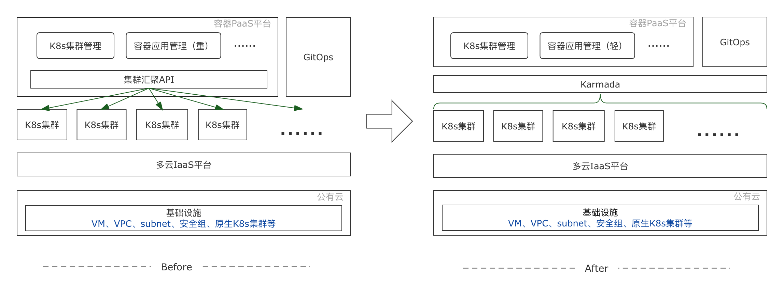

# VIPKID基于Karmada的容器PaaS平台落地实践

本篇文章来自在线教育平台VIPKID在容器体系设计过程中的落地实践，从VIPKID的业务背景、业务挑战、选型过程、引入Karmada前后的对比以及收益等方面深入剖析了VIPKID容器化改造过程。

## 业务背景

VIPKID的业务覆盖数十个国家和地区，签约教师数量超过8万名，为全球100万学员提供教育服务，累计授课1.5亿节。为了更好的为教师和学员提供服务，相关应用会按地域就近部署，比如面向教师的服务会贴近教师所在的地域部署，面向学员的服务直接部署在学员侧。为此，VIPKID从全球多个云供应商采购了数十个集群用于构建VIPKID内部基础设施。

### 无法躲开的多云，多Region

VIPKID的业务形态是将国内外的教育资源进行互换互补，包括过去的北美外教资源引入到国内和将现在国内的教育服务提供到海外。

为了追求优质的上课体验，除了组建了一个稳定低延迟的互通链路外，不同形态的计算服务都要就近部署，比如教师客户端的依赖服务，要优先部署在海外，而家长客户端的依赖服务则首选国内。

因此VIPKID使用了国内外多个公有云厂商的网络资源和计算资源。对多云的资源管理，很早就成为了VIPKID的IaaS管理系统的一部分。

### K8s多集群策略

在VIPKID容器体系设计之初，我们首选的方案是单集群模式，该方案的优势是结构简单且管理成本低。但综合评估多云之间和多Region的网络质量与基础设施（网络和存储）方案，并综合我们的项目周期，只能放弃这个想法。主要原因有两点：
1）不同云之间的网络延迟和稳定性无法保证
2）各家云厂商的容器网络和存储方案均有差异

若要解决以上问题，需要耗费较高的成本。最后，我们按照云厂商和Region的维度去配置K8s集群，如此就拥有很多K8s集群。

### 集群的容灾

容灾对于容器而言，相比传统的VM资源已经友好得多。K8s解决了大部分Pod和Node级别的Case，但单个集群的灾难处理，还需要我们自行解决，由于VIPKID早期已经完成了微服务化的改造，因此可以利用快速创建新集群或者扩容现有特定集群的方式来快速进行计算服务的转移。

## 业务挑战及痛点

### 如何对待不同集群中的同一个应用？

在多云部署过程中，我们遇到了一个很复杂的问题：同一个应用在不同集群中的workload几乎都是不同的，比如使用的镜像、启动参数（配置）甚至有时候连发布版本都不一样。前期我们是依赖自己容器PaaS平台来管理这些差异，但随着差异需求增多，场景也越来越多，差异抽象越发困难。

我们的初衷是让开发者可以直接在我们的PaaS平台上管理其应用，但因为复杂的差异越来越难以管理，最终只能依赖运维同学协助操作。另外，在某些复杂场景下，运维同学也难以快速、准确的进行管理，如此偏离了DevOps理念，不仅增加了管理成本，而且降低了使用效率。

### 如何快速完成故障迁移？

对于故障迁移，这里我从应用和集群两个不同视角来描述，应用视角看重关键应用的自愈能力以及能否在多集群状态下保障整体的负载能力。而集群维度则更看重集群整体级别的灾难或对新集群的交付需求，比如网络故障，此时应对策略会有不同。

**应用视角：应用的动态迁移**
从应用出发，保障关键应用的稳定性，可以灵活的调整应用在多集群中的部署情况。例如某关键应用在A集群的实例出现故障且无法快速恢复，那就需要根据事先制定的策略，在同厂商或同Region下的集群中创建实例，并且这一切应该是自动的。

**集群视角：新集群如何快速ready**
新集群的创建在我们的业务场景很常见。比如当某个K8s集群不可用时，我们的期望是通过拉起新集群的方式进行快速修复，再如，业务对新的云厂商或者Region有需求时候，我们也需要能够快速交付集群资源。我们希望他能够像启动Pod一样迅速。

## Why Karmada

### 不自己造轮子，着眼开源社区

上述列举的痛点，若只试图满足暂时的需求是远远不够的，系统在快速发展过程中必须要适当的进行抽象和解耦，并且随着系统组成模块的角色分工逐渐清晰，也需要适当的重构。

对于我们的容器PaaS平台而言，业务需求与集群资源耦合越发严重，我们将解耦的切面画在了多集群的管理上，由我们自研的平台管理应用的生命周期，另外一个系统管理集群资源的操作指令。

明确需求后，我们就开始在开源社区寻找与调研这类产品，但找到的开源产品都是平台层的，也就是与我们自研平台解决思路类似，并且大多是以集群视角来进行操作的，所有资源首先在集群的维度上就被割裂开了，并不符合我们对应用视角的诉求。

以应用为视角，可以理解为将多个K8s集群作为一个大型集群来管理，这样一个workload就可以看做是一个应用（或一个应用的某个版本）而不是散落在多个集群中同一个应用的多个workload。

另外一个原则是尽量低的接入成本。我们调研了开源社区的多种方案，综合评估后，发现Karmada比较符合我们的需求。

### 就它了， Karmada！

试用Karmada后，发现有以下几方面优势：

**1）Karmada真正意义的实现了以一个K8s集群视角来管理多集群的能力**，让我们能够以应用视角管理多集群中的资源。另外，Karmada的OverridePolicy设计几乎所有差异都可以单独声明出来，简单直观且便于管理，这与我们内部对应用画像在不同集群之间的应用差异不谋而合。

**2）Karmada完全使用了K8s原生API**，使得我们可以像原来一样使用，同时也表明我们在后续的接入成本会很低。并且Karmada的CRD相对来讲也更容易理解，我们平台的服务画像模块可以很容易的将分发和差异配置动态渲染成Propagation和Override策略，下发给Karmada控制面。

**3）开源开放的社区治理模式**，也是我们团队最看重的一点。在试用Karmada过程中，不论是我们自己还是社区方面对需求的理解和设想的解决方案，都可以在社区中开放讨论。同时，在参与代码贡献过程中，我们团队整体技术能力也显著提升。

## Karmada at VIPKID

我们的容器平台，承载了整个公司所有的容器化部署诉求，包括有无状态、在离线业务和AI大数据等。并且要求PaaS平台的设计和实施不会对某一家公有云产生任何依赖，因此我们无法使用云厂商封装过的一些产品。

我们会依赖内部的IaaS平台去管理多家云厂商的各类基础设施，包括K8s集群的创建、扩容、VPC，子网以及安全组的配置。这个很重要，因为这让我们可以标准化多个云厂商的K8s集群，让上层PaaS平台几乎无需关心厂商级别的差异。

另外，对于系统级别的应用和组件，我们为开发者创建了另外一条管理渠道，那就是使用GitOps。这对高阶开发者来说要更加友好，对系统应用的组件安装部署更为高效。

### 基于Karmada的容器化改造方案

在平台落地之初，我们单独剥离了一个组件（上图左侧的“集群汇聚API”），专门和K8s集群进行交互，并且向上保留K8s原生API，也会附加一些和集群相关信息。

但在落地过程中，“容器应用管理”系统需要进行许多操作适配多集群下的复杂情况。比如虽然PaaS系统看起来是一个应用，但系统需要渲染不同的完整资源声明到不同的集群，使得我们在真正维护多集群应用时仍然是不相关的、割裂的，因为我们没办法在底层解决这个问题。诸如此类问题的解决还是占用了团队不少的资源，尤其是引入CRD资源后，还需要重复的解决这方面的问题。并且这个系统无法不去关心每个集群里面的细节状况，如此背离了我们设计“集群汇聚API”组件的初衷。

另外，由于GitOps也需要与集群强相关，在集群数量较大，并且经常伴随集群上下线的情况下，此时，若要正常运转就需要对GitOps的应用配置进行批量变更，随之增加的复杂度，让整体效果并未达到预期。

下图是VIPKID引入Karmada之前和之后的架构对比：

**引入Karmada后，多集群聚合层得以真正的统一**，我们可以在Karmada控制平面以应用维度去管理资源，多数情况下都不需要深入到受控集群中，只需要与Karmada交互即可。如此极大的简化了我们的“容器应用管理”系统。现在，我们的PaaS平台可以完全倾注于业务需求，Karmada强大的能力已经满足了当前我们的各类需求。

而GitOps体系使用Karmada后，系统级组件也可以简单的在各个集群中进行发布和升级，不仅让我们体验到了GitOps本身的便利，更是让我们收获到了GitOps*Karmada的成倍级的效率提升。

## 收益

以应用为维度来管理K8s资源，降低了平台复杂度，同时大幅提升使用效率。下面以我们PaaS平台特性入手，来描述引入Karmada后的改变。

**1）多集群应用的部署速度显著提升：** 先前在部署时需要向每个集群发送部署指令，随之监测部署状态是否异常。如此就需要不断的检查多个集群中的资源状态，然后再根据异常情况做不同的处理，这个过程逻辑繁琐并且缓慢。引入Karmada后，Karmada会自动收集和汇聚应用在各个集群的状态，这样我们可以通过Karmada来感知应用状态。

**2）应用的差异控制可开放给开发者：** DevOps文化最重要的一点就是开发者要能够完全参与进来，能够便捷地对应用全生命周期进行管理。我们充分利用了Karmada的Override策略，直接与应用画像对接，让开发者可以清晰的了解和控制应用在不同集群的差异，现已支持环境变量，启动参数，镜像仓库。

**3）集群的快速拉起&对GitOps适配：** 我们将基础服务（系统级和通用类型服务）在Karmada的Propagation设定为全量集群，在新集群创建好以后，直接加入到Karmada中进行纳管，这些基础服务可以伴随集群交付一并交付，节省了我们对集群做基础服务初始化的操作，大大缩短了交付环节和时间。并且大部分基础服务都是由我们的GitOps体系管理的，相比过去一个个集群的配置来讲，既方便又直观。

**4）平台改造周期短，业务无感知：** 得益于Karmada的原生K8s API，我们花了很少的时间在接入Karmada上。Karmada真正做到了原来怎么用K8s现在继续怎么用就可以了。唯一需要考虑的是Propagation策略的定制，可以按照资源名字的维度，也可以按照资源类型或LabelSelector的维度来声明，极其方便。

### 参与开源项目的收获

从2021年的2月份接触到Karmada项目以来，我们团队先后有3人成为了Karmada社区的Contributor，从0.5.0到1.0.0版本，参与和见证了多个feature的发布。同时Karmada也见证了我们团队的成长。

把自己的需求写成代码很简单，把自己的需求和其他人讨论，对所有人的需求进行圈定和取舍，选择一个符合大家的解决方案，再转换成代码，难度则会升级。我们团队在此期间收获了很多，也成长了许多，并且为能够参与Karmada项目建设而感到自豪，希望更多的开发者能加入Karmada社区，一起让社区生态更加繁荣！