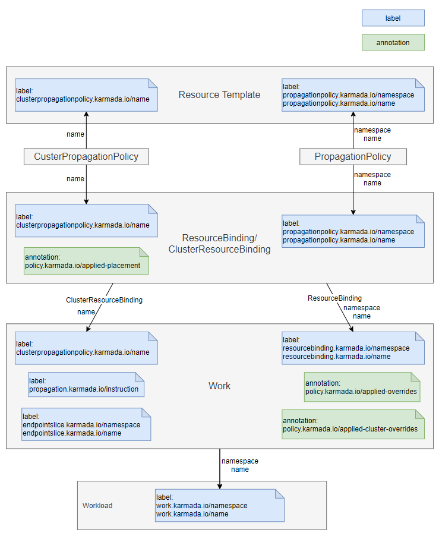

# Karmada Object association mapping

## Review

This picture is made by draw.io. If you need to update the **Review**, you can use the file [object-association-map.drawio](./object-association-map.drawio).  

## Label/Annotation information table

> Note:
> These labels and annotations are managed by the Karmada. Please do not modify them.

| Object                 | Tag        | KeyName                                                      | Usage                                                        |
| ---------------------- | ---------- | ------------------------------------------------------------ | ------------------------------------------------------------ |
| ResourceTemplate       | label      | propagationpolicy.karmada.io/namespace propagationpolicy.karmada.io/name | The labels can be used to determine whether the current resource template is claimed by PropagationPolicy. |
|                        | label      | clusterpropagationpolicy.karmada.io/name                     | The label can be used to determine whether the current resource template is claimed by ClusterPropagationPolicy. |
| ResourceBinding        | label      | propagationpolicy.karmada.io/namespace propagationpolicy.karmada.io/name | Through those two labels, logic can find the associated ResourceBinding from the PropagationPolicy or trace it back from the ResourceBinding to the corresponding PropagationPolicy. |
|                        | label      | clusterpropagationpolicy.karmada.io/name                     | Through the label, logic can find the associated ResourceBinding from the ClusterPropagationPolicy or trace it back from the ResourceBinding to the corresponding ClusterPropagationPolicy. |
|                        | annotation | policy.karmada.io/applied-placement                          | Record applied placement declaration. The placement could be either PropagationPolicy's or ClusterPropagationPolicy's. |
| ClusterResourceBinding | label      | clusterpropagationpolicy.karmada.io/name                     | Through the label, logic can find the associated ClusterResourceBinding from the ClusterPropagationPolicy or trace it back from the ClusterResourceBinding to the corresponding ClusterPropagationPolicy. |
|                        | annotation | policy.karmada.io/applied-placement                          | Record applied placement declaration. The placement could be either PropagationPolicy's or ClusterPropagationPolicy's. |
| Work                   | label      | resourcebinding.karmada.io/namespace resourcebinding.karmada.io/name | Through those two labels, logic can find the associated WorkList from the ResourceBinding or trace it back from the Work to the corresponding ResourceBinding. |
|                        | label      | clusterresourcebinding.karmada.io/name                       | Through the label, logic can find the associated WorkList from the ClusterResourceBinding or trace it back from the Work to the corresponding ClusterResourceBinding. |
|                        | label      | propagation.karmada.io/instruction                           | Valid values includes: - suppressed: indicates that the resource should not be propagated. |
|                        | label      | endpointslice.karmada.io/namespace endpointslice.karmada.io/name | Those labels are added to work object, which is report by member cluster, to specify service associated with EndpointSlice. |
|                        | annotation | policy.karmada.io/applied-overrides                          | Record override items, the overrides items should be sorted alphabetically in ascending order by OverridePolicy's name. |
|                        | annotation      | policy.karmada.io/applied-cluster-overrides                  | Record override items, the overrides items should be sorted alphabetically in ascending order by ClusterOverridePolicy's name. |
| Workload               | label      | work.karmada.io/namespace work.karmada.io/name | The labels can be used to determine whether the current workload is managed by karmada. Through those labels, logic can find the associated Work or trace it back from the Work to the corresponding Workload. |
