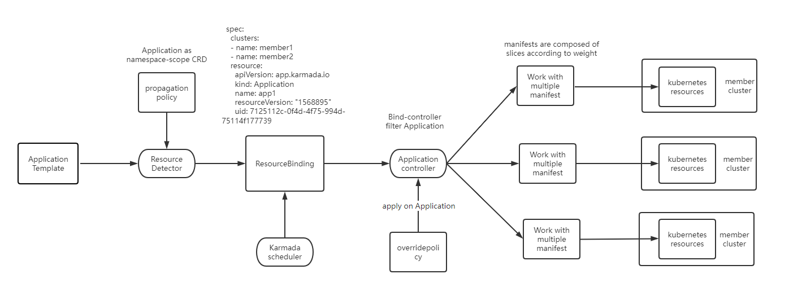
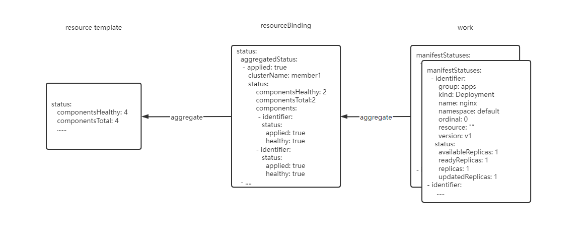
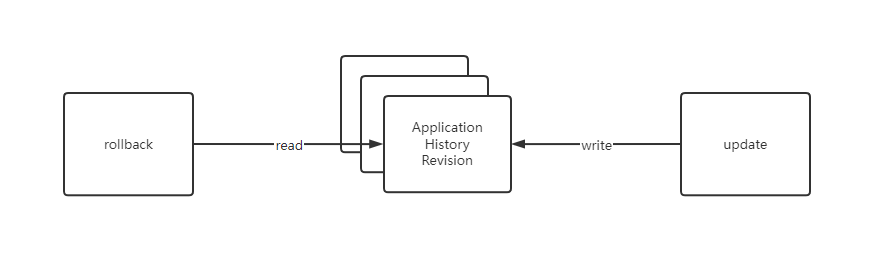

# Support multi-cluster applications in Karmada

## Summary

Enable users to manage multi-cluster applications in Karmada.

## Motivation

### Goals

* Release 1.3
- Support multiple application sources, including Kubernetes yamls, Helm chart and so on.
- Support multi-cluster distribution of applications.
- Support status collection for applications in different clusters.

* Release 1.4
- Support rollback of applications.
- Support rolling upgrade of applications.
- Support cross-cluster failover of applications.

### Non-Goals

## Proposal

### User Stories (Optional)

#### Story 1

Imagine that you have an application which consists of varios Kubernetes resources including more than one workloads and you want to apply the application to multiple clusters.

You may want:

- Package scheduling of applications based on API enablement and resource of applications.
- Status collection and aggregation for applications in different clusters.
- Differentiated configuration applied to multiple clusters.
- Rollback of applications.

#### Story 2

Imagine that you have an application which is installed in multiple clusters and there is a new application version.

You may want:

- Flexible upgrade strategy.
- Cross-cluster migration applied in case of cluster failure.

## Design Details

### Application Distribution

We will introduce a new component to split a complete application into a work with multiple manifests. The installation order of each kubernetes resource is specified by the user.



### Status Collection

Status of Application can be collected normally, from work to resourceBinding, then to resource template.



### Application Rollback

Each update to the application will save the historical version information to `ApplicationRevision`. Rollback will load the information about a historical version and update the application.



### Scheduler Enhance

Karmada-scheduler will enhance original plugins for Applications to support scheduling based on API and resource.

### Define the scope of Application

#### New Application APIGroup

We provides a new api group called `application.karmada.io` and a new crd called `application`.
```golang
package v1alpha1

import (
	corev1 "k8s.io/api/core/v1"
	apiextensionsv1 "k8s.io/apiextensions-apiserver/pkg/apis/apiextensions/v1"
	metav1 "k8s.io/apimachinery/pkg/apis/meta/v1"
	"k8s.io/apimachinery/pkg/types"

	workv1alpha1 "github.com/karmada-io/karmada/pkg/apis/work/v1alpha1"
)

// ComponentType tracks the component type of Application: objectTemplate, helmTemplate.
type ComponentType string

// Constants
const (
	// ObjectType Used to indicate that the component is packaged by the Kubernetes object.
	ObjectType ComponentType = "objectTemplate"
	// HelmType Used to indicate that that the component is packaged by the Helm chart.
	HelmType ComponentType = "helmTemplate"
)

// +kubebuilder:object:root=true
// +kubebuilder:resource:categories=all,shortName=app
// +kubebuilder:subresource:status

// Application is the Schema for the applications API.
type Application struct {
	metav1.TypeMeta   `json:",inline"`
	metav1.ObjectMeta `json:"metadata,omitempty"`

	Spec   ApplicationSpec   `json:"spec,omitempty"`
	Status ApplicationStatus `json:"status,omitempty"`
}

// +kubebuilder:object:root=true

// ApplicationList contains a list of Application.
type ApplicationList struct {
	metav1.TypeMeta `json:",inline"`
	metav1.ListMeta `json:"metadata,omitempty"`
	Items           []Application `json:"items"`
}

// ApplicationSpec defines the specification for an application.
type ApplicationSpec struct {
	// Components indicates the components of the application.
	Components []Component `json:"components,omitempty"`

	// RevisionHistoryLimit limits the number of items kept in the application's revision history
	// which is mainly used for informational purposes as well as for rollbacks to previous versions.
	// Default is 10.
	// +optional
	RevisionHistoryLimit *int32 `json:"revisionHistoryLimit,omitempty"`

	// DisplayInfo indicates the display info of the application.
	// +optional
	DisplayInfo DisplayInfo `json:"displayInfo,omitempty"`
}

// Component defines a minimal component of Application.
type Component struct {
	// Name indicates the name of a component.
	Name string `json:"name"`

	// Type indicates the type of a component, only support objectTemplate and helmTemplate now.
	// + required
	Type ComponentType `json:"type,omitempty"`

	// ObjectTemplate indicates the component source based on the Kubernetes object.
	// This is a mutually exclusive setting with "HelmTemplate".
	ObjectTemplate ObjectTemplate `json:"objectTemplate,omitempty"`

	// HelmTemplate indicates the component source based on the Helm chart.
	// This is a mutually exclusive setting with "ObjectTemplate".
	HelmTemplate HelmTemplate `json:"helmTemplate,omitempty"`

	// ComponentKinds indicates the APIs which the component needs.
	// If users do not set, the controller will set this field automatically.
	// +optional
	ComponentKinds []metav1.GroupVersionKind `json:"componentKinds,omitempty"`

	// Resource indicates the resource info about the component.
	// If users do not set, the controller will set this field automatically.
	// +optional
	Resource Resource `json:"resource,omitempty"`
}

type RepoType string

const (
	// HelmRepo indicates files of the Helm chart is from Helm repo.
	HelmRepo RepoType = "helm"

	// GitRepo indicates files of the Helm chart is from Git repo.
	GitRepo RepoType = "git"
)

// HelmTemplate is inspired by Fluxcd, https://github.com/fluxcd/flux2.
// We currently use Fluxcd as the implementation for installing the application packaged by Helm.
type HelmTemplate struct {
	// RepoType indicates the repo type of the Helm chart.
	// + required
	RepoType RepoType `json:"repoType,omitempty"`

	// Url indicates the url of the Helm chart.
	// + required
	Url string `json:"url,omitempty"`

	// Chart indicates the name of the Helm chart.
	// + required
	Chart string `json:"chart,omitempty"`

	// Namespace indicate the namespace which the Helm release installs.
	// Default is the namespace of Application.
	// + optional
	Namespace string `json:"namespace,omitempty"`

	// Version indicates the version of the Helm chart.
	// + optional
	Version string `json:"version,omitempty"`

	// Values indicates the values of the Helm chart.
	// +optional
	Values *apiextensionsv1.JSON `json:"values,omitempty"`
}

// Resource defines the resource info about the Component.
type Resource struct {
	// Request indicates the resource request which the Component needs.
	Request corev1.ResourceList `json:"request,omitempty"`
}

// ObjectTemplate is a common template for the application packaged by Kubernetes object.
type ObjectTemplate struct {
	// ObjectReference indicates the objectReference of an component.
	ObjectReference ObjectReference `json:"objectReference,omitempty"`

	// Weight indicates the weight of the installation order.
	// + optional
	Weight *int32 `json:"weight,omitempty"`
}

// ObjectReference contains enough information to locate the referenced object inside current cluster.
type ObjectReference struct {
	// APIVersion represents the API version of the referent.
	APIVersion string `json:"apiVersion"`

	// Kind represents the Kind of the referent.
	Kind string `json:"kind"`

	// Namespace represents the namespace for the referent.
	// For non-namespace scoped resources(e.g. 'ClusterRole')，do not need specify Namespace,
	// and for namespace scoped resources, Namespace is required.
	// If Namespace is not specified, means the resource is non-namespace scoped.
	// +optional
	Namespace string `json:"namespace,omitempty"`

	// Name represents the name of the referent.
	Name string `json:"name"`

	// UID of the referent.
	// +optional
	UID types.UID `json:"uid,omitempty"`

	// ResourceVersion represents the internal version of the referenced object, that can be used by clients to
	// determine when object has changed.
	// +optional
	ResourceVersion string `json:"resourceVersion,omitempty"`
}

// ApplicationStatus defines controller's the observed state of Application.
type ApplicationStatus struct {
	// ObservedGeneration is the most recent generation observed. It corresponds to the
	// Object's generation, which is updated on mutation by the API Server.
	// +optional
	ObservedGeneration int64 `json:"observedGeneration,omitempty" protobuf:"varint,1,opt,name=observedGeneration"`

	// Conditions represents the latest state of the object.
	// +optional
	// +patchMergeKey=type
	// +patchStrategy=merge
	Conditions []metav1.Condition `json:"conditions,omitempty" patchStrategy:"merge" patchMergeKey:"type" protobuf:"bytes,10,rep,name=conditions"`

	// History contains information about the application's revision history.
	History []RevisionHistory `json:"history,omitempty"`

	// Resources embeds a list of object statuses.
	// +optional
	ComponentList `json:",inline,omitempty"`

	// ComponentsReady: number of the components with a healthy Condition.
	// +optional
	ComponentsHealthy int64 `json:"componentsHealthy,omitempty"`

	// ComponentsTotal: total number of the components targeted by this Application.
	// +optional
	ComponentsTotal int64 `json:"componentsTotal,omitempty"`
}

// RevisionHistory stores the revision history of the application.
type RevisionHistory struct {
	// Name is a name of the RevisionHistory.
	// For example, if the application name is "example" and revision is 1, then this field will be "example-v1".
	// + required
	Name string `json:"name"`

	// Revision is an auto incrementing identifier of the RevisionHistory.
	// + required
	Revision int64 `json:"revision"`

	// UpdatedAt indicates the time the update of the application completed.
	UpdatedAt metav1.Time `json:"updatedAt,omitempty"`
}

// ComponentList is a generic status holder for the top level resource.
type ComponentList struct {
	// componentsStatus hold the status for all components.
	componentsStatus []ApplicationComponentStatus `json:"componentsStatus,omitempty"`
}

// AggregatedStatus represents the aggregated status of components including deployment status and health status.
type AggregatedStatus struct {
	// Applied indicates whether the component is applied.
	Applied bool `json:"applied,omitempty"`

	// Healthy indicates whether the component is healthy.
	Healthy bool `json:"healthy,omitempty"`
}

// ApplicationComponentStatus is a generic status holder for components.
type ApplicationComponentStatus struct {
	// Identifier represents the identity of a resource linking to manifests in spec.
	// +required
	Identifier workv1alpha1.ResourceIdentifier `json:"identifier"`

	// Status represents the aggregated status of components.
	Status AggregatedStatus `json:"status,omitempty"`
}

// DisplayInfo is inspired by kubernetes-sigs/application, https://github.com/kubernetes-sigs/application.
// DisplayInfo is mainly used by displaying metadata info of applications.
type DisplayInfo struct {
	// ComponentGroupKinds is a list of Kinds for Application's components (e.g. Deployments, Pods, Services, CRDs). It
	// can be used in conjunction with the Application's Selector to list or watch the Applications components.
	ComponentGroupKinds []metav1.GroupKind `json:"componentKinds,omitempty"`

	// Descriptor regroups information and metadata about an application.
	Descriptor Descriptor `json:"descriptor,omitempty"`

	// Selector is a label query over kinds that created by the application. It must match the component objects' labels.
	// More info: https://kubernetes.io/docs/concepts/overview/working-with-objects/labels/#label-selectors
	Selector *metav1.LabelSelector `json:"selector,omitempty"`

	// Info contains human readable key,value pairs for the Application.
	// +patchStrategy=merge
	// +patchMergeKey=name
	Info []InfoItem `json:"info,omitempty" patchStrategy:"merge" patchMergeKey:"name"`
}

// Descriptor defines the Metadata and information about the Application.
type Descriptor struct {
	// Type is the type of the application (e.g. WordPress, MySQL, Cassandra).
	Type string `json:"type,omitempty"`

	// Version is an optional version indicator for the Application.
	Version string `json:"version,omitempty"`

	// Description is a brief string description of the Application.
	Description string `json:"description,omitempty"`

	// Icons is an optional list of icons for an application. Icon information includes the source, size,
	// and mime type.
	Icons []ImageSpec `json:"icons,omitempty"`

	// Maintainers is an optional list of maintainers of the application. The maintainers in this list maintain the
	// the source code, images, and package for the application.
	Maintainers []ContactData `json:"maintainers,omitempty"`

	// Owners is an optional list of the owners of the installed application. The owners of the application should be
	// contacted in the event of a planned or unplanned disruption affecting the application.
	Owners []ContactData `json:"owners,omitempty"`

	// Keywords is an optional list of key words associated with the application (e.g. MySQL, RDBMS, database).
	Keywords []string `json:"keywords,omitempty"`

	// Links are a list of descriptive URLs intended to be used to surface additional documentation, dashboards, etc.
	Links []Link `json:"links,omitempty"`

	// Notes contain a human readable snippets intended as a quick start for the users of the Application.
	// CommonMark markdown syntax may be used for rich text representation.
	Notes string `json:"notes,omitempty"`
}

// ImageSpec contains information about an image used as an icon.
type ImageSpec struct {
	// The source for image represented as either an absolute URL to the image or a Data URL containing
	// the image. Data URLs are defined in RFC 2397.
	Source string `json:"src"`

	// (optional) The size of the image in pixels (e.g., 25x25).
	Size string `json:"size,omitempty"`

	// (optional) The mine type of the image (e.g., "image/png").
	Type string `json:"type,omitempty"`
}

// ContactData contains information about an individual or organization.
type ContactData struct {
	// Name is the descriptive name.
	Name string `json:"name,omitempty"`

	// Url could typically be a website address.
	URL string `json:"url,omitempty"`

	// Email is the email address.
	Email string `json:"email,omitempty"`
}

// Link contains information about an URL to surface documentation, dashboards, etc.
type Link struct {
	// Description is human readable content explaining the purpose of the link.
	Description string `json:"description,omitempty"`

	// Url typically points at a website address.
	URL string `json:"url,omitempty"`
}

// InfoItem is a human readable key,value pair containing important information about how to access the Application.
type InfoItem struct {
	// Name is a human readable title for this piece of information.
	Name string `json:"name,omitempty"`

	// Type of the value for this InfoItem.
	Type InfoItemType `json:"type,omitempty"`

	// Value is human readable content.
	Value string `json:"value,omitempty"`

	// ValueFrom defines a reference to derive the value from another source.
	ValueFrom *InfoItemSource `json:"valueFrom,omitempty"`
}

// InfoItemType is a string that describes the value of InfoItem
type InfoItemType string

const (
	// ValueInfoItemType const string for value type
	ValueInfoItemType InfoItemType = "Value"
	// ReferenceInfoItemType const string for ref type
	ReferenceInfoItemType InfoItemType = "Reference"
)

// InfoItemSource represents a source for the value of an InfoItem.
type InfoItemSource struct {
	// Type of source.
	Type InfoItemSourceType `json:"type,omitempty"`

	// Selects a key of a Secret.
	SecretKeyRef *SecretKeySelector `json:"secretKeyRef,omitempty"`

	// Selects a key of a ConfigMap.
	ConfigMapKeyRef *ConfigMapKeySelector `json:"configMapKeyRef,omitempty"`

	// Select a Service.
	ServiceRef *ServiceSelector `json:"serviceRef,omitempty"`

	// Select an Ingress.
	IngressRef *IngressSelector `json:"ingressRef,omitempty"`
}

// InfoItemSourceType is a string
type InfoItemSourceType string

// Constants for info type
const (
	SecretKeyRefInfoItemSourceType    InfoItemSourceType = "SecretKeyRef"
	ConfigMapKeyRefInfoItemSourceType InfoItemSourceType = "ConfigMapKeyRef"
	ServiceRefInfoItemSourceType      InfoItemSourceType = "ServiceRef"
	IngressRefInfoItemSourceType      InfoItemSourceType = "IngressRef"
)

// ConfigMapKeySelector selects a key from a ConfigMap.
type ConfigMapKeySelector struct {
	// The ConfigMap to select from.
	corev1.ObjectReference `json:",inline"`
	// The key to select.
	Key string `json:"key,omitempty"`
}

// SecretKeySelector selects a key from a Secret.
type SecretKeySelector struct {
	// The Secret to select from.
	corev1.ObjectReference `json:",inline"`
	// The key to select.
	Key string `json:"key,omitempty"`
}

// ServiceSelector selects a Service.
type ServiceSelector struct {
	// The Service to select from.
	corev1.ObjectReference `json:",inline"`
	// The optional port to select.
	Port *int32 `json:"port,omitempty"`
	// The optional HTTP path.
	Path string `json:"path,omitempty"`
	// Protocol for the service
	Protocol string `json:"protocol,omitempty"`
}

// IngressSelector selects an Ingress.
type IngressSelector struct {
	// The Ingress to select from.
	corev1.ObjectReference `json:",inline"`
	// The optional host to select.
	Host string `json:"host,omitempty"`
	// The optional HTTP path.
	Path string `json:"path,omitempty"`
	// Protocol for the ingress
	Protocol string `json:"protocol,omitempty"`
}
```

#### Example
```
apiVersion: application.karmada.io/v1alpha1
kind: Application
metadata:
  name: test-1
spec:
  components:
    - name: ref-deploy
      type: objectTemplate
      objectTemplate:
        objectReference:
          apiVersion: apps/v1
          kind: Deployment
          name: test
          namespace: default
        weight: 1
    - name: ref-configmap
      type: objectTemplate
      objectTemplate:
        objectReference:
          apiVersion: v1
          kind: Configmap
          name: test
          namespace: default
        weight: 2
status:
  componentsReady: 2
  componentsTotal: 2
  components:
    - identifier:
        kind: Configmap
        name: test
        namespace: default
        ordinal: 0
        resource: ""
        version: v1
      status:
        applied: true
        healthy: true
    - identifier:
        group: app
        kind: Deployment
        name: nginx
        namespace: default
        ordinal: 1
        resource: ""
        version: v1
      status:
        applied: true
        healthy: true
```

### Test Plan

- Unit Test covering.
- E2E covering.
