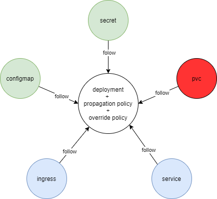
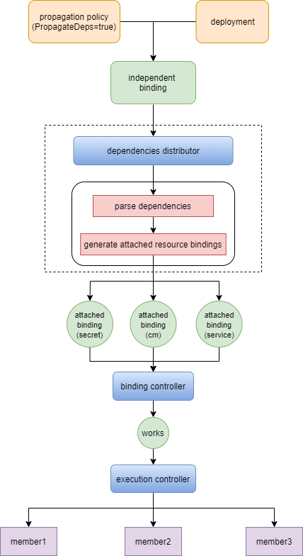

# Dependencies Automatically Propagation

## Summary

Secrets or ConfigMaps can be mounted as data volumes or exposed as environment variables to be used by containers in a Pod.
Meanwhile, users can expose the application running on a set of Pods by Service.

Thus, it is necessary to propagate the relevant resource into the same member clusters when deploying a Pod by Karmada, i.e,
Pod dependencies(ConfigMaps and Secrets) and dependents(Services and Ingresses) should "follow" the delegate pods.

Usually, users don't create Pods directly. Instead, create them using workload resources such as Deployment, StatefulSet, or Job.
So I take Deployment as an example. The dependencies of deployment include ConfigMaps, Secrets, PVCs, Services, etc.



Till now, Karmada provides two ways to propagate dependent resources for a Deployment:
- All dependent resources share the same propagation policy with the Deployment.
- Create individual propagation policy for each dependent resource, but users need to make sure the resource scheduled to needed clusters.

These methods work for most cases, but still has disadvantages:
- For the first method, the dependencies(like configmaps and secrets) will be bound with one Deployment which means it can't be mounted by other Deployments.
- For the second method, users should keep watching the scheduling result of the Deployment.

This proposal aims to provide a strategy to intelligently propagate dependencies for workload resources such as Deployment.

## Motivation

Users need to deploy dependent resources manually when deploying Pods or workload resources by Karmada. It is a heavy burden to maintain target clusters for
dependent resources.

### Goals

- Provide a strategy to automatically propagate dependent resources of workload resources to needed clusters.

### Non-Goals

- Deprecate the default propagate process for dependent resources.
* Relevant resources like ConfigMap, Secret, and Service can be propagated by propagation policy as usual.

## Proposal

This proposal introduces a new controller to intelligently propagate dependent resources.
When the user propagates a deployment, the corresponding Karmada Controllers will propagate the dependencies.

This proposal is divided into several steps, see below:

- `PropagationPolicy` API changes to add `PropagateDeps`.
- `ResourceBinding` API changes to add `PropagateDeps` and `RequiredBy`.
- New controllers to intelligently propagate dependent resources(named dependencies distributor).
- New ResourceInterpreter to parse the dependent resources of the given object.
- Associated docs and architecture diagram as a supplement.

### User Stories

#### Story 1

Imagine that user creates a deployment and a PropagationPolicy, and the `PropagateDeps` is `True`.
- Condition:
  - The deployment references a ConfigMap and a Secret.
- Result:
  - When the referred ConfigMap and Secret are created, they will be propagated to the same clusters as the deployment.

## Design Details

For better illustration, I classify resource binding into two categories, independent resource binding, and attached resource binding.

An independent resource binding will be created when a resource is matched by a propagation policy.

Attached resource bindings will be created when the controller propagates dependent resources.

Here's the architecture design diagram.



**Note:**
- To enable auto-propagating dependencies, users need to turn on the `PropagateDeps` feature gate in `karmada-controller-manager` by `--feature-gates=PropagateDeps=true`
- Each dependent resource has an individual attached resource binding.
- The controller parses dependencies from the raw resource template, which means the dependencies introduced by the override policy can't be identified.

### API Changes

We propose to extend the `PropagationPolicy` and `ResourceBinding` API. (The `ClusterPropagationPolicy` and `ClusterResourceBining` should be extended accordingly.)

```go

// PropagationSpec represents the desired behavior of PropagationPolicy.
type PropagationSpec struct {
// PropagateDeps tells if relevant resources should be propagated automatically.
// Take 'Deployment' which referencing 'ConfigMap' and 'Secret' as an example, when 'propagateDeps' is 'true',
// the referencing resources could be omitted(for saving config effort) from 'resourceSelectors' as they will be
// propagated along with the Deployment. In addition to the propagating process, the referencing resources will be
// migrated along with the Deployment in the fail-over scenario.
//
// Defaults to false.
// +optional
PropagateDeps bool `json:"propagateDeps,omitempty"`
}
```

```go
// ResourceBindingSpec represents the expectation of ResourceBinding.
type ResourceBindingSpec struct {
// PropagateDeps tells if relevant resources should be propagated automatically.
// It is inherited from PropagationPolicy or ClusterPropagationPolicy.
// default false.
// +optional
PropagateDeps bool `json:"propagateDeps,omitempty"`

// RequiredBy represents the list of Bindings that depend on the referencing resource.
// +optional
RequiredBy []BindingSnapshot `json:"requiredBy,omitempty"`
}

// BindingSnapshot is a snapshot of a ResourceBinding or ClusterResourceBinding.
type BindingSnapshot struct {
// Namespace represents the namespace of the Binding.
// It is required for ResourceBinding.
// If Namespace is not specified, means the referencing is ClusterResourceBinding.
// +optional
Namespace string `json:"namespace,omitempty"`

// Name represents the name of the Binding.
// +required
Name string `json:"name"`

// Clusters represents the scheduled result.
// +optional
Clusters []TargetCluster `json:"clusters,omitempty"`
}
```

### Example
Suppose we create a deployment named `myapp` which references configmap.
```yaml
apiVersion: apps/v1
kind: Deployment
metadata:
  name: myapp
  labels:
    app: myapp
spec:
  replicas: 1
  selector:
    matchLabels:
      app: myapp
  template:
    metadata:
      labels:
        app: myapp
    spec:
      containers:
        - image: nginx
          name: nginx
          volumeMounts:
            - name: configmap
              mountPath: "/configmap"
      volumes:
        - name: configmap
          configMap:
            name: my-config
```

Creating a propagation policy to propagate the deployment to specific clusters. To enable auto-propagating dependencies, we need to set `propagateDeps` as `true`.
```yaml
apiVersion: policy.karmada.io/v1alpha1
kind: PropagationPolicy
metadata:
  name: myapp-propagation
spec:
  propagateDeps: true
  resourceSelectors:
    - apiVersion: apps/v1
      kind: Deployment
      name: myapp
  placement:
    clusterAffinity:
      clusterNames:
        - member1
        - member2
    replicaScheduling:
      replicaSchedulingType: Duplicated
```

Then creating the reference configmap.
```yaml
apiVersion: v1
kind: ConfigMap
metadata:
  name: my-config
data:
  nginx.properties: |
    proxy-connect-timeout: "10s"
    proxy-read-timeout: "10s"
    client-max-body-size: "2m"
```

The resource binding of `my-config` will be created by `dependencies distributor`. And the `spec` field will be:
```yaml
spec:
  requiredBy:
    - clusters:
        - name: member1
          replicas: 1
        - name: member2
          replicas: 1
      name: myapp-deployment
      namespace: default
  resource:
    apiVersion: v1
    kind: ConfigMap
    name: my-config
    namespace: default
    resourceVersion: "757297"
```

### Test Plan

- Propose E2E test cases according to user stories above:
* Test if the dependent resources propagated to needed clusters.

## Alternatives
