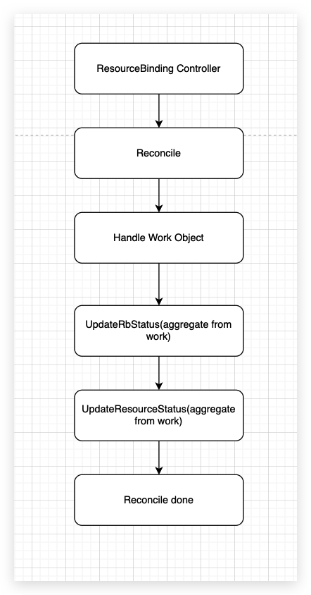
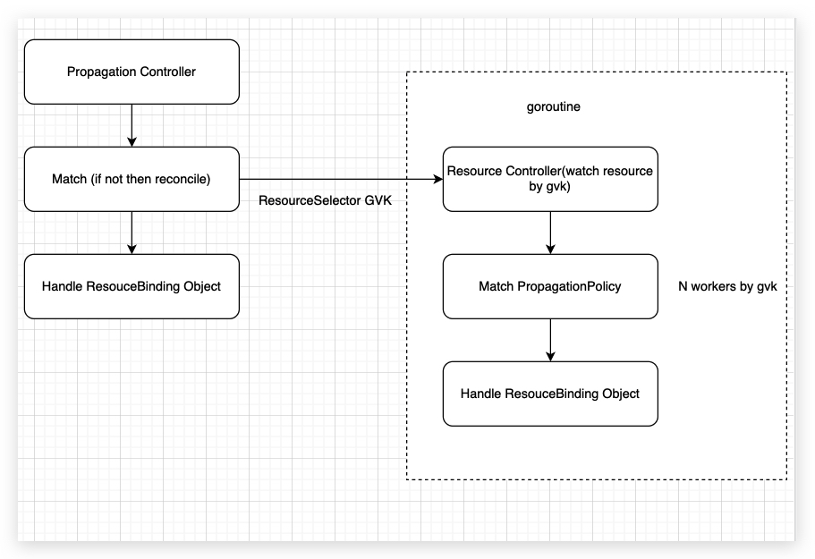

# Remove Detector and Add PropagationPolicy and ClusterPropagationPolicy Controller

## Summary

In karmada controller, we have common controllers like, ResourceBinding Controller, ClusterController.And there is also a unordinary controller called detector, which is in charge of detecting resource changes in host cluster and finding the matching propagation policy, if the matching policy is found, it will add resource to `waitingObjects`.But there are some flaws :

1. The detector has to watch all resource changes in host cluster, which is not efficient, and can be easily be reach the limit of `--http2-max-streams-per-connection`, which is set to 250 by default(https://github.com/kubernetes/kubernetes/pull/60054).

2. There is a chance that the detector will miss the policy matching, then ResourceBinding will not be created, thus the resource will not be propagated.Chances will be greater if we increase the worker number of the detector, which is hardcoded to 1 by default.But the worker number should be configurable by user, for example, we have tons of resources in host cluster, and they have lots of events, the detector can't handle the events in time.

3. When a PropagationPolicy is created, the corresponding ResourceBinding object is getting reconciled many times, which is not efficient.

there are some issues related with detector or resourcebinding controller:

* https://github.com/karmada-io/karmada/issues/1353
* https://github.com/karmada-io/karmada/issues/1309
* https://github.com/karmada-io/karmada/issues/1195
* https://github.com/karmada-io/karmada/issues/679
* https://github.com/karmada-io/karmada/issues/670

In my case, we have 500 PropagationPolicy and 200 deployment, 100 service 100 ingress 100 networkpolicy in the same host cluster, in worst case, we can see over 10 minutes delay of propagation.

So this KEP recommends to remove the detector controller and add propagation policy controller and cluster propagation policy controller, then there would be no more unordinary controller in karmada-controller-manager.

## Motivation

Detector is not suitable for large-scale, the worst case scenario is that the detector can't handle event in time.

### Goals

* separate PropagationPolicy Controller from detector
* separate ClusterPropagationPolicy Controller from detector
* separate ResourceBinding reconcile from detector, put it back to ResourceBinding Controller
* add Resource Controller and its lifecycle is controlled by PropagationPolicy or ClusterPropagationPolicy Controller

### Non-Goals

## Proposal

### User Stories (Optional)

<!--
Detail the things that people will be able to do if this KEP is implemented.
Include as much detail as possible so that people can understand the "how" of
the system. The goal here is to make this feel real for users without getting
bogged down.
-->

#### Story 1

#### Story 2

### Notes/Constraints/Caveats (Optional)

<!--
What are the caveats to the proposal?
What are some important details that didn't come across above?
Go in to as much detail as necessary here.
This might be a good place to talk about core concepts and how they relate.
-->

### Risks and Mitigations

<!--
What are the risks of this proposal, and how do we mitigate? 

How will security be reviewed, and by whom?

How will UX be reviewed, and by whom?

Consider including folks who also work outside the SIG or subproject.
-->

## Design Details

The KEP is composed of two parts:

1. ResourceBinding Controller
2. PropagationPolicy(ClusterPropagationPolicy) Controller and ResourceBinding Controller

in ResourceBinding Controller part, we should move `ReconcileResourceBinding` in detector back to ResourceBinding Controller.

Here is the workflow of ResourceBinding Controller:

in the new workflow, resource status is aggregated in ResourceBinding Controller in a single ResourceBinding reconcile.

in the second part, the new PropagationPolicy Controller is in charge of reconciling the PropagationPolicy, and do the PropagationPolicy and resource template matching, if the matching fails, then put the PropagationPolicy back to PropagationPolicy Controller queue to be reconciled again.Then the detector will be removed.When a PropagationPolicy is getting reconciled, the `ResourceSelectors` in the PropagationPolicy will determine which Resource Controller will be started, so PropagationPolicy will not watch all resources in host cluster, if we have many different resources(GVKs) in host cluster, it can easily reach the limit of `--http2-max-streams-per-connection`.And when resource gets any updates, Resource Controller will do the resource reconcile, and do the policy matching if the resource is not matched by any policy.In Resource Controller, we can increase the worker number of the Resource Controller by GVK.When a PropagatePolicy is deleted, it will check whether to stop the corresponding Resource Controller or not, which is shared by GVK, if all `ResourceSelectors` in all PropagationPolicy don't have the corresponding GVK, then the Resource Controller will be stopped.Here is the workflow.

### Test Plan

<!--
**Note:** *Not required until targeted at a release.*

Consider the following in developing a test plan for this enhancement:
- Will there be e2e and integration tests, in addition to unit tests?
- How will it be tested in isolation vs with other components?

No need to outline all of the test cases, just the general strategy. Anything
that would count as tricky in the implementation, and anything particularly
challenging to test, should be called out.

-->

## Alternatives

<!--
What other approaches did you consider, and why did you rule them out? These do
not need to be as detailed as the proposal, but should include enough
information to express the idea and why it was not acceptable.
-->

<!--
Note: This is a simplified version of kubernetes enhancement proposal template.
https://github.com/kubernetes/enhancements/tree/3317d4cb548c396a430d1c1ac6625226018adf6a/keps/NNNN-kep-template
-->
