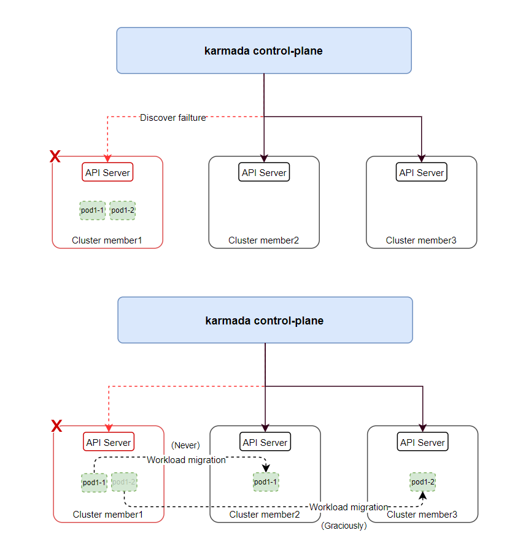

# Configurable cluster failover

## Summary

In the multi-cluster scenario, workloads may be deployed in multiple clusters to improve service high availability. In Karmada, when a cluster fails, the cluster status will be marked as unavailable and some taints will be added. After detecting a cluster failover, the taint-manager will evict workloads from fault cluster. And then the evicted workloads will be scheduled to other clusters that are the best-fit.

However, users are very cautious about cross-cluster failover of services for different businesses due to their different attributes. These different services respond differently for the cluster failure. They may have different migration configurations. Even we do not want to migrate the specific workload and prefer to manually solve the cluster failure.

In a word, providing a configurable cluster failover is neccessary for users.

## Motivation

The cluster administrators want to configure the cluster failover behavior for different applications. 

## Goals

- Extend the API of PropagationPolicy/ClusterPropagationPolicy to provide users with the configuration of cluster failover.
- Propose the implementation ideas for involved components, including `karmada-controller-manager`, `karmada-webhook`.
  For example, `karmada-controller-manager` needs to adjust the logic of `taint-manager` to apply the policy API. `Karmada-webhook` needs to
  verify the new added fields.

## Non-Goals

## Proposal

### Dependency

The failover feature is controlled by the `Failover` feature gate. `Failover` feature gate has evolved to Beta since Karmada v1.4 and is enabled by default.
When configuring failover behavior in the policy, make sure that `Failover` feature gate is enabled.

The graceful eviction feature is controlled by the `GracefulEviction` feature gate. `GracefulEviction` feature gate has evolved to Beta since Karmada v1.4 and is enabled by default. When configuring failover behavior with purgeMode `Graciously` and `Never`, make sure that `GracefulEviction` feature gate is enabled.

### User Stories (Optional)

#### As a user, I deploy different applications in multiple clusters. I hope they have different `GracePeriodSeconds` for graceful eviction.

Supposing I deploy different applications in multiple clusters. I hope they will be gracefully evicted when detecting a cluster failure. But their image sizes are different, and they may have different startup time on their first initialization. Therefore, I hope they have different `GracePeriodSeconds` so that old replicas will not be deleted before the new replicas start.

## Design Details



### API change

The configuration of failover behavior includes:

* `PurgeMode` which represents how to deal with the legacy applications on the cluster from which the application is migrated.
* `GracePeriodSeconds` which is the maximum waiting duration in seconds before application on the migrated cluster should be deleted.

#### PropagationPolicy API change

```golang
// FailoverBehavior indicates failover behaviors in case of an application or
// cluster failure.
type FailoverBehavior struct {
    // Application indicates failover behaviors in case of application failure.
    // If this value is nil, failover is disabled.
    // If set, the PropagateDeps should be true so that the dependencies could
    // be migrated along with the application.
    // +optional
    Application *ApplicationFailoverBehavior `json:"application,omitempty"`
  
    // Cluster indicates failover behaviors in case of cluster failure.
    // If not set, Karmada will gracefully evict the workloads.
    // The default `GracePeriodSeconds` is from `--graceful-eviction-timeout` option 
    // in karmada-controller-manager.
    // +optional
    Cluster *ClusterFailoverBehavior `json:"cluster,omitempty"`
}

// ClusterFailoverBehavior indicates cluster failover behaviors.
type ClusterFailoverBehavior struct {
    // PurgeMode represents how to deal with the legacy applications on the
    // cluster from which the application is migrated.
    // Valid options are "Immediately", "Graciously" and "Never".
    // Defaults to "Graciously".
    // +kubebuilder:default=Graciously
    // +optional
    PurgeMode PurgeMode `json:"purgeMode,omitempty"`

    // GracePeriodSeconds is the maximum waiting duration in seconds before
    // application on the migrated cluster should be deleted.
    // Required only when PurgeMode is "Graciously".
    // If not set, defaults to `--graceful-eviction-timeout` option 
    // in karmada-controller-manager.
    // If the application on the new cluster cannot reach a Healthy state,
    // Karmada will delete the application after GracePeriodSeconds is reached.
    // Value must be positive integer.
    // +optional
    GracePeriodSeconds *int32 `json:"gracePeriodSeconds,omitempty"`
}
```

For example, 

```yaml
apiVersion: policy.karmada.io/v1alpha1
kind: PropagationPolicy
metadata:
  name: nginx-propagation
spec:
  resourceSelectors:
    - apiVersion: apps/v1
      kind: Deployment
      name: nginx
  failover:
    cluster:
      purgeMode: Graciously
      gracePeriodSeconds: 100
  placement:
    clusterAffinity:
      clusterNames:
        - member1
        - member2
```

The corresponding resourceBinding is like:

```yaml
spec:
    clusters:
    - name: member2
      replicas: 2
    failover:
      cluster:
        purgeMode: Graciously
        gracePeriodSeconds: 100
    gracefulEvictionTasks:
    - creationTimestamp: "2023-06-05T11:33:31Z"
      fromCluster: member1
      producer: TaintManager
      reason: TaintUntolerated
      replicas: 1
      gracePeriodSeconds: 100
```

### Component change

#### karmada-controller-manager

`karmada-controller-manager` will adjust the logic of `taint-manager` to do the cluster failover according the configurable policy.
Whether the cluster failover is enabled depends on the tolerationSeconds of `ClusterTolerations` in `PropagationPolicy`. 
If it is not set, it means that will tolerate the taint forever (do not evict). 

#### karmada-webhook

Since we add some new fields to APIs, karmada-webhook should perform extra validation work to prevent misleading configuration.

### Test Plan

- Unit Test covering.
- E2E Test covering.
