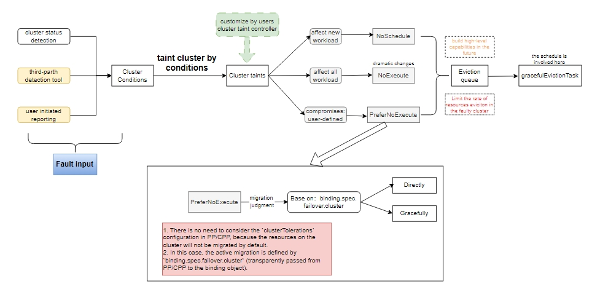

# Optimize Cluster Failover

## Summary

The [Cluster Failover](https://karmada.io/docs/next/userguide/failover/failover-overview) feature aims to significantly enhance the availability of services in a multi-cluster environment. As a crucial and feature-rich functionality, we have always attached great importance to user feedback and continuously iterated and optimized it, striving to create a more excellent user experience. This time, we have carried out a large-scale and comprehensive upgrade of the Failover feature.

In this proposal, we have made in-depth adjustments to the architecture of the Failover feature. Clear constraints have been added to the cluster failure mechanism, enabling unified control over the resource migration behavior triggered by cluster failures and ensuring that the migration process is more standardized and orderly.

In terms of configurability, we have optimized from multiple dimensions such as system configuration and policy API definition, providing users with a wider space for customization and meeting diverse business needs.

In addition, we have also conducted a meticulous investigation of the sources that may trigger migration behavior outside the controller, eliminating all implicit cluster failover behaviors and further enhancing the stability and predictability of the system.

## Motivation

In all currently released versions of Karmada, when the Failover function is enabled, the behavior is as follows: when the system detects an abnormal cluster health status condition (the cluster health status monitoring takes debounce into account, and the status condition will only be modified if the abnormality or normality persists within a sliding time window), it will automatically set the status condition of the cluster object to "NotReady". Then, the system will automatically add taint{effect: NoExecute} to the target cluster object. This taint will trigger the migration of all resources on the target cluster, including non-workload resources (such as Configmap, Secret), workload resources (such as Deployment, StatefulSet), and CRD resources, after 5 minutes (this time is a configurable default value, which is the taint toleration time and is added by the system by default when the propagation policy is created. If the user configures the corresponding toleration, it will override this configuration).

Based on the collected user feedback, the following aspects of the Failover function need improvement:

1. In some versions[1], the Failover function is enabled by default. However, users lacked sufficient understanding and expectation management regarding the impacts of the migration behavior. They had to manually configure to disable the feature without adequate preparation, resulting in a poor user experience. (In versions after [1], the Failover feature has been disabled by default, and users need to explicitly enable it. Therefore, there is no need to improve this aspect anymore.)
2. The current Failover feature requires users to plan in advance for possible taints and configure tolerations for workloads that they don't want to migrate. There is a lack of a mechanism that allows users to easily configure a large number of business applications to not migrate by default, with only a small number of them migrating.
3. There are corner cases in the implementation of the `gracefulEvictionTask` for the cleaning results of cluster failure migration. This causes the elements in the [gracefulEvictionTask slice](https://github.com/karmada-io/karmada/blob/678362ba9ae3e02737e421b21a363a3b95be3b94/pkg/apis/work/v1alpha2/binding_types.go#L111) of the binding object to fail to be cleared, and this issue cannot be fixed with a simple patch.
4. The condition judgment for cluster failures is relatively simplistic and cannot be customized by users (Once the Failover function is enabled, a cluster will definitely be tainted with taint{effect: NoExecute} when a specific condition occurs).
5. The Failover function lacks consideration for the overall health status of the member cluster in Karmada and the corresponding migration downgrade measures. Continuing failover may instead lead to an increase in the explosion radius. For example, when 50% of the member clusters fail, Karmada's cluster failover will not slow down or even stop.
6. Even after the Failover function is disabled, there are still user-initiated actions that can trigger resource migration on the cluster. For example:
- If a user actively adds a taint{effect: NoExecute} to a cluster, it will still trigger the migration of resources on that cluster.
- During the process of a user removing a cluster, the system will add a taint{key: cluster.karmada.io/terminating, effect: NoExecute} to the cluster, thus triggering the migration of resources on the cluster.

> Note[1]: Versions v1.9.0-9, v1.10.0-7, and v1.11.0-3 of Karmada.

### Goals

The most crucial objective of this design optimization is to make the cluster failure migration mechanism clearer to users, improve its configurability, and eliminate all implicit cluster failover behaviors.

**Goal one:** Define clear constraints for the cluster failure migration mechanism. Specifically, the Failover FeatureGate controls whether migration occurs, and relevant configuration parameters of cluster failover regulate the overall migration rate of the system, etc.

**Goal two:** Enable users to define "how to respond to cluster failover", that is, the migration strategy of workloads after a cluster failure occurs, such as the migration method and toleration time, at the workload granularity.

**Goal three:** Modify the conditional judgment mechanism for cluster failures and introduce support for user-defined extensions

**Goal four:** Fix the issue in the implementation of the queue for eviction results of cluster failure migration, where elements in the `gracefulEvictionTask` cannot be cleared due to corner cases.

### Non-Goals

1. In the cluster failure detection, provide specific extended implementations for the cluster status detection method.

2. Provide advanced Failover capabilities, such as resource eviction based on strategies like workload priority and remaining resources.

## Proposal

### User Stories (Optional)

#### Story 1

As an administrator or an operation and maintenance personnel, one should be able to explicitly view and judge during daily inspections and maintenance processes:

- At the system configuration level: Whether the cluster failure migration is enabled.
- At the cluster failure condition judgment level: Which cluster status conditions will mark a cluster as failure, thus triggering the failure migration of resources on the cluster.
- At the application-level cluster failover strategy: For a specific workload, what is its specific migration strategy when a cluster failure occurs.

#### Story 2

As an application maintenance personnel, one should be able to customize the migration strategy for the cluster failure scenario:

- For general workloads, when a hard failure occurs in the cluster (such failures will affect most of the workloads), trigger the migration of most workloads on the cluster;
- For workloads with high resource requirements, when a partial failure occurs in the cluster (such failures will only affect a part of the workloads, causing some workloads to be unable to run or their performance to be affected), only trigger the migration of such workloads.

#### Story 3

As a conservative and cautious user, a large number of businesses adopt a fixed redundant deployment scheme, and I don't want any non-human-initiated migrations to occur in the event of a cluster failure. A small number of businesses support a dynamic HA deployment scheme, and I hope that when a cluster failure occurs, the affected parts of these businesses can be migrated to a new healthy cluster.

## Design Details

The overall process of Cluster failover is as follows:



Regarding the overall process of Cluster Failover, after re-sorting, it is divided into the following stages:
1. Input of cluster status conditions.
2. Matching of cluster failure strategies.
3. System response to failures (preventing the scheduling of new workloads or triggering workload failure migration).

### Overall Design Principles

Below, we present the overall design principles of Cluster Failover:

1. Judgment of cluster failure conditions
- The sources for judging cluster failures are diverse. The cluster status detection that Karmada supports by default will first be reflected in `cluster.status.conditions`.
- After the Karmada system determines that a cluster has a failure, it will add corresponding taints to the cluster object. In cases of severe failures, the migration process will be triggered.
- Users can define "which taints should be added to the cluster object when certain conditions occur" by configuring the "taint cluster by conditions" rule.
- For more complex scenarios of cluster failure judgment, users can directly implement a custom "cluster taint controller" to control how to add and remove taints from the cluster.

2. Reconsider the types of taints and adjust them into the following categories according to the severity of cluster failures and the scope of affected workloads:
- Impact new workloads' scheduling and running: taint{effect: NoSchedule}. New workloads will not be scheduled, and will not trigger resource migration.
- Impact all workloads' scheduling and running: taint{effect: NoExecute}(Reserve semantics: Hard migration, requiring users to add relevant comments to remind them of the impact in the API definition). New workloads will not be scheduled, and existing workloads will be migrated.
- Add a new type of taint between taint{effect: NoSchedule} and taint{effect: NoExecute}: taint{effect: PreferNoExecute}.
    - Default to not migrating, no need to consider tolerations (defined in `PP/CPP.spec.placement.clusterTolerations`).
    - Active migration strategy, which can be configured through `PP/CPP.spec.failover.cluster`.

3. Application-level cluster failover strategy:
- Reinstate: Hard migration for taint{effect: NoExecute}.
    - Migration method: graceful or directly (need to be decided).
- New addition: Respond to taint{effect: PreferNoExecute}.
- The failure migration strategy at the workload granularity needs to include the following elements: :
    - Migration method: Graciously, Directly
    - Toleration time

4. Eviction queue (The queue maintained in memory)
- It is necessary to consider the overall health of the Karmada and have the ability to downgrade eviction behavior and slow down queue processing.
- During the eviction process, that is, when there are workloads to be evicted in the queue and the original faulty cluster recovers, the migration of these workloads can be abandoned.
- Metrics for administrators need to be provided to facilitate problem location.
- In the future, eviction based on workload priority, remaining resources, etc. can be considered, and advanced capabilities can be built relying on the eviction queue.

5. Failover FeatureGate

The Failover FeatureGate can impose overall constraints on the cluster failure migration mechanism. Once the Failover FeatureGate is turned off, the cluster failure judgment will no longer take effect, and no resources will be migrated.

In light of the above design principles, it has been sorted out that the following parts in the current system do not meet the objectives of this proposal:
1. In the judgment of cluster failure conditions, the "taint cluster by conditions" rule is not provided for users to define.
2. The design of several types of taints is incomplete and needs to be supplemented.
3. There is no application-level cluster failure migration strategy provided.
4. The current eviction queue lacks the ability to be downgraded, and the queue does not provide metrics for administrators.
5. The Failover FeatureGate cannot impose overall constraints on the cluster failure mechanism. Users can still trigger resource migration by adding taints.

Next, let's introduce the design solutions for each of the above parts that do not meet the objectives one by one.

### Cluster failure condition judgment

Cluster failure condition judgment involves assessing the status conditions of a faulty cluster object to add various taints to the cluster. This process is referred to as "taint cluster by conditions".

This proposal adds a new API: ClusterTaintPolicy, which can be used to describe what taints should be added to the target cluster when certain cluster status conditions are met. The relevant logic can be implemented by adding a new controller. This controller is responsible for monitoring changes in the cluster status conditions, that is, the `.status.conditions` field of the Cluster object, and then deciding how to modify the taints of the Cluster object according to the ClusterTaintPolicy API defined by the user. When the matching conditions are no longer met, the taints added to the target cluster will be removed.

Key design considerations for ClusterTaintPolicy:
- To avoid over-design, ClusterTaintPolicy currently mainly provides condition judgment based on `cluster.status.conditions` as input. More input conditions can be added as needed in the future.
- When making input condition judgments based on `cluster.status.conditions`, in addition to `condition.type` and `condition.status`, time-dimension matching is also required to prevent taint jitter caused by frequent changes in cluster conditions and make the system overly sensitive. However, also to avoid over-design, in the initial version, only simple time-window-based judgments can be provided. For example, if the condition indicating that the cluster is disconnected persists for 5 minutes, add a taint; if the condition indicating that the cluster has re - established connection holds for 3 minutes, remove the taint.

The ClusterTaintPolicy resource is a Cluster scope resource. Its API group is `policy.karmada.io` and the API version is `v1alpha1`.

```go
// ClusterTaintPolicy defines how Karmada would taint clusters according
// to conditions on clusters.
type ClusterTaintPolicy struct {
    metav1.TypeMeta   `json:",inline"`
    metav1.ObjectMeta `json:"metadata,omitempty"`

    // Spec represents the desired behavior of ClusterTaintPolicy.
    // +required
    Spec ClusterTaintPolicySpec `json:"spec"`
}

type ClusterTaintPolicySpec struct {
    // TargetCluster specifies the clusters that ClusterTaintPolicy needs to pay attention to.
    // For clusters that meet the MatchConditions, TaintsToAdd will be added.
    // If targetCluster is not set, any cluster can be selected.
    // +optional
    TargetCluster *ClusterAffinity `json:"targetCluster,omitempty"`

    // MatchConditions indicates the conditions to match for triggering
    // the taint controller to add taints on the cluster object.
    // The match conditions are ANDed.
    // If empty, the TaintsToAdd will be added.
    // +optional
    MatchConditions []MatchCondition `json:"matchConditions,omitempty"`

    // TaintsToAdd specifies the NoExecute effect taints that
    // need to be applied to the clusters which match with ClusterAffinity.
    // +optional
    TaintsToAdd []TaintToAdd `json:"taintsToAdd,omitempty"`
}

// MatchCondition represents the condition match detail of activating the failover relevant taints on clusters.
type MatchCondition struct {
    // ConditionType specifies the ClusterStatus condition type.
    ConditionType string `json:"conditionType"`

    // Operator represents a relationship to a set of values.
    // Valid operators are In, NotIn.
    Operator MatchConditionOperator `json:"operator"`

    // StatusValues is an array of metav1.ConditionStatus values.
    // The item specifies the ClusterStatus condition status.
    StatusValues []metav1.ConditionStatus `json:"statusValues"`
}

// A MatchCondition operator is the set of operators that can be used in the match condition.
type MatchConditionOperator string

const (
    MatchConditionOpIn    MatchConditionOperator = "In"
    MatchConditionOpNotIn MatchConditionOperator = "NotIn"
)

// TaintToAdd describes the taint that needs to be applied to the cluster.
type TaintToAdd struct {
    // Key represents the taint key to be applied to a cluster.
    // +required
    Key string `json:"key"`

    // Effect represents the taint effect to be applied to a cluster.
    // +required
    Effect  corev1.TaintEffect `json:"effect"`

    // Value represents the taint value corresponding to the taint key.
    // +optional
    Value string `json:"value,omitempty"`

    // AddOnMatchSeconds is the duration in seconds for which the
    // MatchConditions must be continuously matched before adding the
    // specified taint to the cluster.
    // This provides stability by ensuring the condition persists long enough
    // before taking action.
    // Defaults to 300 seconds (5 minutes).
    // +optional
    // +kubebuilder:default=300
    // +kubebuilder:validation:Minimum=1
    AddOnMatchSeconds *int32 `json:"addOnMatchSeconds,omitempty"`

    // RemoveOnMismatchSeconds is the duration in seconds for which the
    // MatchConditions must be continuously unmatched before removing
    // the taint from the cluster.
    // This prevents premature taint removal during brief connection recoveries.
    // Defaults to 180 seconds (3 minutes).
    // +optional
    // +kubebuilder:default=180
    // +kubebuilder:validation:Minimum=1
    RemoveOnMismatchSeconds *int32 `json:"removeOnMismatchSeconds,omitempty"`
}
```

Let's take an example to explain the processing logic of "taint cluster by conditions", the user creates the following ClusterTaintPolicy resource:

```yaml
apiVersion: "policy.karmada.io/v1alpha1"
kind: "ClusterTaintPolicy"
metadata:
  name: "detect-cluster-not-ready"
spec:
  targetCluster:
    clusterNames:
    - "member1"
    - "member2"
  matchConditions:
  - conditionType: "Ready"
    operator: "In"
    statusValues:
    - "False"
    - "Unknown"
  taintsToAdd:
  - key: "cluster.karmada.io/not-ready"
    effect: PreferNoExecute
    addOnMatchSeconds: 300
    removeOnMismatchSeconds: 180
```

When the status condition of cluster member1 is changed to:

```yaml
apiVersion: cluster.karmada.io/v1alpha1
kind: Cluster
metadata:
  name: member1
spec:
  apiEndpoint: https://172.18.0.4:6443
status:
  conditions:
  - lastTransitionTime: "2025-01-17T02:36:26Z"
    message: "cluster is not reachable"
    reason: ClusterNotReachable
    status: False
    type: Ready
```

When the controller watches to the change of the cluster status, it will judge the cluster status condition, match the `detect-cluster-not-ready` ClusterTaintPolicy resource, and add the corresponding taint to the cluster member1 after 5 minutes:

```yaml
apiVersion: cluster.karmada.io/v1alpha1
kind: Cluster
metadata:
  name: member1
spec:
  apiEndpoint: https://172.18.0.4:6443
  taint:
  - effect: PreferNoExecute
    key: cluster.karmada.io/not-ready
    timeAdded: "2025-01-17T02:41:26Z"
```

At this point, cluster member1 is tainted with taint{key: cluster.karmada.io/not-ready, effect: PreferNoExecute}.

### Design of Taint Types and Behaviors

At present, there are two kinds of taints used in the Karmada system: NoSchedule and NoExecute. NoSchedule affects the scheduling and operation of new workloads. When there is a NoSchedule taint on the cluster, the newly created workloads will not be scheduled to the cluster, which ensures that the workloads on the cluster will not be migrated. NoExecute taints affects the scheduling and operation of all workloads. It is a hard migration. When there is a NoExecute taint on the cluster, not only will the newly created workloads not be scheduled to the cluster, but also the existing workloads on the cluster will be migrated.

Currently, two types of taints are used in the Karmada system: taint{effect: NoSchedule} and taint{effect: NoExecute}.
- Taint{effect: NoSchedule}: It affects the scheduling and running of new workloads. When there is a taint{effect: NoSchedule} on a cluster, newly created workloads in the system will not be scheduled to this cluster. This ensures that the resources on the cluster will not be migrated.
- Taint{effect: NoExecute} affects the scheduling and running of all workloads. It is a mandatory migration. When there is a taint{effect: NoExecute} on a cluster, not only will newly create workloads not be scheduled to this cluster, but also the existing workloads on the cluster will be migrated.

The statistics of taint{effect: NoSchedule} and taint{effect: NoExecute} blemishes involved in the current Karmada system are as follows:

| Taint Effect | Taint Key | When was it added | When was it cleaned |
| --- | --- | --- | --- |
| NoSchedule | cluster.karmada.io/unreachable | When the Cluster Ready Condition is Unknown | When the Cluster Ready Condition is True of False |
| NoSchedule | cluster.karmada.io/not-ready | When the Cluster Ready Condition is False | When the Cluster Ready Condition is True or Unknown |
| NoExecute | cluster.karmada.io/unreachable | When the Cluster Ready Condition is Unknown | When the Cluster Ready Condition is True of False |
| NoExecute | cluster.karmada.io/not-ready | When the Cluster Ready Condition is False | When the Cluster Ready Condition is True or Unknown |
| NoExecute | cluster.karmada.io/terminating | When the Cluster is being deleted | None |

The design updates in this proposal are as follows:

1. No more implicit and automatic addition of taints: In this proposal, these taints will no longer be automatically added by the system. Instead, they need to be defined through the "ClusterTaintPolicy" rules.
2. New taint type: We propose to introduce a new type of taint: taint{effect: PreferNoExecute}. The effect of this taint lies between taint{effect: NoSchedule} and taint{effect: NoExecute}. It is designed to represent the cluster state that only affects the scheduling and running of some applications. When there is a taint{effect: PreferNoExecute} on a cluster, there is no need to consider tolerations. By default, the resources on the cluster will not be migrated. This is a behavioral mechanism significantly different from taint{effect: NoSchedule} and taint{effect: NoExecute}. In this case, the active migration strategy for this taint is configured through the `spec.failover.cluster` in PropagationPolicy and ClusterPropagationPolicy, and this configuration will be transparently passed to the ResourceBinding and ClusterResourceBinding objects.
3. To facilitate the distinction of concepts, we can collectively refer to the migrations triggered by taint{effect: NoExecute} as migrations or passive migrations, and the migrations triggered by taint{effect: PreferNoExecute} as active migrations, because taint{effect: PreferNoExecute} allows applications to stay in place without any toleration.

For the API definition of `PP/CPP.spec.failover.cluster`, please refer to the next section: Application-level cluster failover strategy design.

### Application-level cluster failover strategy design

We plan to introduce an application-level cluster failover strategy to configure an active migration policy for the PreferNoExecute taint.

Introducing new fields in PropagationPolicy/ClusterPropagationPolicy `.spec.failover` API as follows:

```go
// FailoverBehavior indicates failover behaviors in case of an application or
// cluster failure.
type FailoverBehavior struct {
    …

    // Cluster indicates failover behaviors in case of cluster failure.
    // The cluster failure here refers to the cluster taint that contains
    // the taint whose effect is PreferNoExecute.
    //
    // PreferNoExecute taints do not need to consider the setting of tolerations.
    //
    // If this value is nil, failover is disabled.
    // +optional
    Cluster *ClusterFailoverBehavior `json:"cluster,omitempty"`
}

// ClusterFailoverBehavior indicates cluster failover behaviors.
type ClusterFailoverBehavior struct {
    // PurgeMode represents how to deal with the legacy applications on the
    // cluster from which the application is migrated.
    // Valid options are "Directly", "Gracefully".
    // Defaults to "Gracefully".
    // +kubebuilder:validation:Enum=Directly;Gracefully
    // +kubebuilder:default=Gracefully
    // +optional
    PurgeMode PurgeMode `json:"purgeMode,omitempty"`

    // TolerationSeconds represents the time system should wait for
    // performing failover process after the PreferNoExecute
    // taint occurs on the cluster.
    // If not specified, system will immediately perform failover process.
    // Defaults to 300s.
    // +kubebuilder:default=300
    // +optional
    TolerationSeconds *int32 `json:"tolerationSeconds,omitempty"`
}

const (
    // PurgeModeDirectly indicates resource will be migrated directly after the tolerated time has exceeded.
    PurgeModeDirectly PurgeMode = "Directly"
    // PurgeModeGracefully indicates that after exceeding the tolerance time, the resource will be migrated in a graceful manner.
    PurgeModeGracefully PurgeMode = "Gracefully"
)
```

Here is an example of YAML:

```yaml
apiVersion: policy.karmada.io/v1alpha1
kind: PropagationPolicy
metadata:
  name: nginx-propagation
spec:
  resourceSelectors:
  - apiVersion: apps/v1
    kind: Deployment
    name: nginx
  placement:
    clusterAffinity:
      clusterNames:
      - member1
      - member2
  failover:
    cluster:
      pureMode: Directly
      tolerationSeconds: 100
```

After the user applies this PropagationPolicy to Karmada to propagate the deployment nginx resource, when the member cluster member1 is tainted with taint{effect: PreferNoExecute} by the "taint cluster by conditions" rules, the deployment nginx propagated to the member1 cluster will be evicted after 100 seconds.

If the user does not configure the `.spec.failover.cluster` field in the PropagationPolicy, the resources matched by this PropagationPolicy will not trigger a migration after the cluster is tainted with taint{effect: PreferNoExecute}.

Here, we would like to emphasize the difference between `pp/cpp.spec.placement.clusterTolerations` and `pp/cpp.spec.failover.cluster,tolerationSeconds`. For the former, it only takes effect for taints with the taint{effect: NoSchedule} and taint{effect: NoExecute}; while for the latter, it only takes effect for taints with the taint{effect: PreferNoExecute}.

> Note that we also need to state this effective rule in the API of PP/CPP.

### Eviction Queue

In order to control the eviction behavior more precisely, this proposal suggests introducing an eviction queue. The key design points of the eviction queue are as follows:

1. The stage at which the eviction queue plays a role in the entire Failover process is that when a taint occurs on a cluster, after the taint-manager determines which resources are affected, it will add the affected resources to the eviction queue. This operation is carried out before processing the `gracefulEvictionTask` field of the binding object.
2. The consumption rate of the eviction queue should have multiple rate configuration items. The queue can calculate based on dimensions such as the health level of the overall clusters managed by Karmada and the remaining available resources, and make the consumption rate of the queue fall into different rate intervals.
3. The `gracefulEvictionTask` field in the binding object is defined as the decision result of the eviction. When the distribution result of the resource on the failover cluster is moved into the `gracefulEvictionTask`, the Karmada system has already made the final judgment that the resource needs to be migrated. Subsequently, the scheduler gives the scheduling result, and the `gracefulEvictionController` is responsible for cleaning up the obsolete instances.
4. In order to improve the success rate of the scheduler's scheduling after the eviction decision is made and the end-to-end success rate of the migration, when processing the elements in the eviction queue, the controller should add the judgment of pre-scheduling to avoid meaningless evictions.
5. Regarding the observability of the status of resources entering and leaving the eviction queue, since it is currently considered to implement the eviction queue in the controller's memory, the time and status of resources entering and leaving the eviction queue cannot be directly observed. They can be exposed through events and conditions. For the status of the eviction queue itself, such as the length of queued applications and the consumption rate interval, etc., they can be exposed through metrics.

The eviction queue described in this section refers to the fact that when the cluster is determined to be faulty (containing NoExecute or PreferNoExecute taints), the affected resources[2] on the cluster are added to the eviction queue, which is a queue in memory managed by the controller. Each failed cluster creates a separate eviction queue. The lifecycle of the queue begins with the cluster fail and ends with the cluster recovery. In this way, for a healthy cluster, there will be no corresponding eviction queue in the controller.

When a cluster is determined to be faulty (with taint{effect: NoExecute} or taint{effect: PreferNoExecute}), the taint-manager will identify the affected resources[2] and add them to the eviction queue. This queue is a memory-based queue managed by the controller, and all faulty clusters share one eviction queue.

> Note[2]: How to determine the affected resources varies depending on the type of taint:
> For a taint{effect: NoExecute}, the resource is an affected resource when the resource-related tolerance policy cannot tolerate the taint or can only tolerate it for a period of time.
> For the taint{effect: PreferNoExecute}, there is no need to consider the tolerance policy. By checking the RB/CRB object associated with the resource, it is determined whether the `.spec.failover.cluster` is configured, and if so, it indicates that the resource is an affected resource.

#### Multiple rate configuration

How does the eviction queue control the rate of resource eviction? By drawing on the control method of the node-controller in Kubernetes for the rate of adding taints to nodes, this proposal plans to introduce the following control parameters in the karmada-controller-manager component:
- resource-eviction-rate: The number of resources to be evicted per second, with a default value of 0.5, that is, one resource is evicted every 2 seconds.
- secondary-resource-eviction-rate: The secondary resource eviction rate. When there are too many cluster failures in the Karmada instance, the resource eviction rate will be reduced to the secondary level, with a default value of 0.1.
- unhealthy-cluster-threshold: The unhealthy threshold of the cluster, with a default value of 0.55. That is, when the number of cluster failures in the Karmada instance exceeds 55%, the Karmada instance is considered unhealthy.
- large-cluster-num-threshold: The large-scale threshold of the Karmada instance, with a default value of 10. When the number of clusters in the Karmada instance exceeds this threshold, the Karmada instance is considered to be a large-scale federation. When the number of faulty clusters in a large-scale federation exceeds 55%, the resource eviction rate will be reduced to 0.1; if it is a small-scale federation, the rate will be directly reduced to 0, that is, the resource eviction will be stopped.

In the Kubernetes, the scope of nodes is divided according to the availability zone of the node, and the threshold is for nodes in the same availability zone. For a cluster, it may itself be deployed in multiple availability zones, and in addition, different clusters may belong to different cloud providers. Therefore, the current proposal does not consider the availability zone of the cluster first, but directly analyzes the entire Karmada instance.

#### Improvement of the scheduling success rate

In order to improve the success rate of the scheduler's scheduling after the eviction decision is made and the end-to-end success rate of the migration, when the eviction queue processes elements, situations where scheduling cannot succeed should be excluded as much as possible to avoid meaningless evictions.

The NamespacedName value of the resourceBinding/clusterResourceBinding of the resource object stored in the eviction queue. When processing an element, the resource propagation policy will be obtained according to the element information. Then, based on the ClusterAffinity in the propagation policy, it will be determined whether there is a target cluster available for migration. If not, the eviction of the resource will be abandoned and the eviction fails. The specific judgment logic is as follows:
- When the resource propagation policy is of the Duplicate type: If the user has set the SpreadConstraint and its Min value is not greater than the number of clusters that can still match the ClusterAffinity except for the faulty cluster, it means that there is a target cluster available for migration.
- When the resource propagation policy is of the Divided type: Excluding the clusters that belong to the previous scheduling result, if there are still clusters that can match the ClusterAffinity, it means that there is a target cluster available for migration.

#### The observability of the eviction queue

In this proposal, the following metrics are planned to be added for the eviction queue:

- evict_total: The number of elements in the queue, with labels:
  - cluster_name: Identifies the name of the cluster to which the queue belongs, facilitating the differentiation of queues from different clusters.
- evict_kind_total: The number of elements of different types in the queue, with labels:
  - cluster_name: Identifies the name of the cluster to which the queue belongs, facilitating the differentiation of queues from different clusters.
  - resource_kind: Marks the type of the enqueued resource, which is formed by concatenating the APIVersion and Kind of the resource.
- evict_rate: The number of resources processed and removed from the eviction queue per unit of time, with labels:
  - cluster_name: Identifies the name of the cluster to which the queue belongs, facilitating the differentiation of queues from different clusters.
- evict_processing_latency_seconds: The time interval from when a resource is enqueued to when it is processed, with labels:
  - cluster_name: Identifies the name of the cluster to which the queue belongs, facilitating the differentiation of queues from different clusters.
- evict_success_rate: The ratio of the number of successfully processed resources to the total number of processed resources, with labels:
  - cluster_name: Identifies the name of the cluster to which the queue belongs, facilitating the differentiation of queues from different clusters.
- cluster_fault_num: The number of faulty clusters.
- cluster_fault_rate: The failure rate of clusters in a Karmada instance.

#### The scenario of a faulty cluster's recovery

If there are still resources in the eviction queue that have not been processed, when the faulty cluster recovers, the elements in the eviction queue that belong to this cluster will be abandoned. Therefore, the unprocessed resources will be prevented from entering the migration process.

One situation that requires attention is that after a cluster fails, even if the user modifies the resource's tolerance policy or the application failure migration policy, causing the resource to gain or lose the qualification for eviction, the final eviction behavior will not change as a result. Therefore, it is required that users define the relevant policies in advance.

### FeatureGate

This proposal plans to **keep the Failover FeatureGate and deprecate the GracefulEviction FeatureGate**.

- The Failover FeatureGate will control the start and stop of the entire Cluster Failover function. This means that even if the user actively adds taint{effect: NoExecute} or taint{effect: PreferNoExecute} to the cluster or does so through a custom controller, the Karmada system will not perform the migration of any resource due to this.
- Regarding the behavior of graceful eviction, it will be uniformly controlled by the `PurgeMode` field in the application-level cluster failure migration strategy. Therefore, we will no longer need the GracefulEviction FeatureGate.

The above is the detailed design we have provided in accordance with the design principles, targeting the parts of the current system that do not meet the objectives. The following content will provide solutions to the problems existing in the execution process of the eviction results and present some optimization points for the previous design.

### Problems in the Execution of Eviction Results

Provide a solution for the existing issue at https://github.com/karmada-io/karmada/issues/3747.

#### Problem Analysis

After a cluster fails, there is a prerequisite for determining whether a resource can enter the eviction process. The judgment condition is that `binding.Status.schedulerObservedGeneration == binding.Generation` is true.

Here is how to define a successful scheduling. The current logic is as follows:
- If the scheduling is completed and the scheduling result is not empty, it is regarded as a successful scheduling.
- If the scheduling is completed but the scheduling result is empty, it is regarded as a failed scheduling, and no retry will be carried out.
- If the scheduling is not completed, it is regarded as a failed scheduling, and a retry will be carried out until it is successful.

After a successful scheduling, set `binding.Status.schedulerObservedGeneration = binding.Generation`.

The main reason for this problem is the second point mentioned above. Since the scheduling result is empty and does not meet the prerequisite condition, logically, it cannot enter the gracefulEvictionTask cleaning process of the graceful_eviction_controller. After the cluster recovers, due to the ClusterEviction plugin in the scheduler, the target resources will not be able to be scheduled to this cluster, thus creating a logical deadlock.

#### Solution Strategy

To solve this problem, the following three strategies need to be adopted:

1. Deprecate the `graceful-eviction-timeout` parameter of the controller, which means that the controller will not perform timeout cleanup on the elements in the `gracefulEvictionTask`;
2. Deprecate the ClusterEviction plugin in the scheduler, allowing resources to be scheduled to the clusters that already exist in the `gracefulEvictionTask`. If a cluster exists both in the scheduling result and the `gracefulEvictionTask` simultaneously, the `graceful_eviction_controller` is responsible for clearing the target elements in the `gracefulEvictionTask` (this can be achieved by adding a new eviction plugin mentioned below. The logic of this plugin is to determine whether a certain cluster exists both in the scheduling result and the eviction queue. If so, pass).

Why was it necessary to add the ClusterEviction plugin to the scheduler before, and why is it being removed now?

At the beginning of the Failover feature design, the expected behavior of the system was that once the resources in a faulty cluster were evicted and moved into the `gracefulEvictionTask`, the eviction action would not be revoked, even if the faulty cluster recovered and the migration action had not been executed. In the current proposal, to provide a better user experience for the Failover feature, when the cluster recovers from a failure and the migration action has not been executed, the system can return to the state before the cluster failure, so there is no change in state for the user. Therefore, we have designed the above strategies and plan to deprecate the ClusterEviction plugin in the scheduler.

Based on the above two strategies, the expected behavior of the system is as follows:

**Once a resource starts migrating, the migration action will continue until the new instance runs successfully.**

In addition, we need to raise the threshold for migration in subsequent iterative designs and try our best to avoid workload migration.

#### System Behavior Analysis

When a cluster fails, the binding object moves the instances in the faulty cluster into the `gracefulEvictionTask`, which in turn triggers the scheduler to perform scheduling. Depending on different scheduling results, the logical processing after the cluster recovers will also vary:

| Scheduling Result | Running status of the new instance| Whether elements in gracefulEvictionTask are cleared | System Behavior |
| --- | --- | --- | --- |
| Scheduling Success | Running | No | Wait until the migration is complete |
| Scheduling Success | Running | Yes | Wait until the migration is complete |
| Scheduling Success | Not Running (To be deployed or failed to be started) | No | Wait until the migration is complete |
| Scheduling Success | Not Running (To be deployed or failed to be started) | Yes | Wait until the migration is complete |
| Scheduling is complete but result is empty | N/A | No | Trigger schedule, restore to the scheduling result before the cluster failure, and the elements in the gracefulEvictionTask are cleaned up |
| Scheduling Failure | N/A | No | Trigger schedule, restore to the scheduling result before the cluster failure, and the elements in the gracefulEvictionTask are cleaned up |

As can be seen from the above table, for the latter two scenarios (that is, the two scenarios of scheduling failure), the system seems to have done "useless work": first, the instances in the faulty cluster are moved into the `gracefulEvictionTask`, and then, after the faulty cluster recovers, these elements are removed from the `gracefulEvictionTask`. However, the above situation does not occur every time a cluster fails. It is only possible to enter this processing logic when the scheduling fails and the faulty cluster recovers. In addition, this kind of processing is not a piece of useless work completed at a certain moment, but the best decision made by the system after a period of accumulation, aiming to restore the business to a stable state as quickly as possible. Therefore, even if it seems like "useless work", it is still worthwhile.

### Other Optimization Points

1. In the `graceful_eviction_controller`, plugins are introduced when performing cleanup actions on the elements in the `GracefulEvictionTask`. Each item of the plugin is used to check whether an element can be cleaned up. The plugins can be configured by users in the form of controller parameters, such as `evict-plugins`, to enable specified plugins.

At the current stage, only a built-in plugin named `ResourceHealth` is available. It makes a judgment based on the `Health` field in the aggregated status of the `binding` object. If the value is `Healthy`, the plugin passes; otherwise, it fails. More plugins can be extended in the future. For example, when the MCI feature is enabled, it can check whether the cleanup of the `EndpointSlice` resources at the backend of the load resources is completed.

As long as any one of the enabled plugins passes, the target element can be cleaned up.

2. The Karmada system no longer needs to use the karmada-webhook component to add a default tolerance of 300 seconds for the taint{effect: NoExecute} on the cluster to the PropagationPolicy/ClusterPropagationPolicy resources. The definition of the tolerance policy is completely handled by the user.

3. The startup of the taint-manager controller is controlled by the `controllers` parameter, instead of starting together with the cluster-controller. The `enable-taint-manager` parameter of the controller will be abandoned.

So far, the analysis of all the contents of the functional design in this proposal has been completed.

## System failure impact and response

1. What conditions can cause functional failure, and will they cause a system avalanche?

When the controller component switches the primary or restarts, the eviction queue in the memory will be rebuilt and continue to be evicted, and the resources in the graceful eviction task will not be affected. When the cluster is restored, in order to make the system state stable quickly, the unexpected resources in the eviction queue will be terminated and the migration will be stopped.

The eviction queue will be adjusted according to the proportion of failed clusters in the Karmada instance and the size of the cluster. When most of the clusters fail, the eviction of resources will be suspended to prevent system avalanches.

In addition, when the cluster is disconnected, the system does not add a NoExecute taint directly to the cluster, which causes changes that are too drastic and require the user to define explicitly.

2. How can administrators manually intervene in the escape mechanism, and what operations can they perform to help the system recover? The focus is on manual migration or stopping the migration.

When a cluster failure has not occurred, the methods to prevent resource migration are as follows:
- Disable the Failover FeatureGate;
- Modify the application-level cluster failure migration policy, or modify the tolerance policy of the resource association policy;

When a cluster failure occurs, the methods to stop resource migration are as follows:
- Modify the TaintClusterByCondition resource so that the judgment of the cluster failure condition does not hold;
- Delete the NoExecute or PreferNoExecute taints added to the cluster object;
- Edit the ResourceBinding object and modify the scheduling result or gracefulEvictionTask;

3. After the cluster fails, the scheduler has completed the scheduling, but the new instance still cannot run in the new cluster. How should the user intervene after the faulty cluster recovers?

The management and operation and maintenance personnel will need to shut down the controller and the scheduler first, and then modify the scheduling results of the ResourceBinding and the `gracefulEvictionTask`, and restore the resource distribution situation to the state before the cluster failure.

## Graduation Criteria

**Set beta to true**

- Support the adjustment of the eviction rate for failure migration according to application priorities, remaining resources, etc.
- Expand a more comprehensive and three-dimensional cluster health status detection mechanism.
- Add support for the PreferNoSchedule taint and clarify its usage scenarios and functions.
- Transition the definition of the TaintClusterByCondition API to the beta version.
- Transition the definition of the pp/cpp.spec.failover.cluster API to the beta version.
- Complete the E2E tests.

**GA Graduation**

- Scalability/performance testing.
- The definition of the TaintClusterByCondition API reaches General Availability (GA).
- The definition of the pp/cpp.spec.failover.cluster API reaches General Availability (GA).

## Notes/Constraints/Caveats (Optional)

No

## Risks and Mitigations

No

## Analysis of the impacts on related features

1. Cluster Taint Eviction

The cluster taint eviction function will only take effect when the Failover FeatureGate is enabled.

This is actually a correction of the previous functional design. When users disable Failover, the system should not have any resource migration behavior caused by cluster failures.

2、karmadactl unjoin

**Function introduction**

When users use the `karmadactl unjoin` command, a NoExecute taint with the key `cluster.karmada.io/terminating` will be added to the cluster object. The purpose is to migrate the resources on this cluster to other clusters before deleting the cluster object, to gracefully remove the cluster. This change was introduced by [PR2373](https://github.com/karmada-io/karmada/pull/2373).

According to the design principle of judging cluster failure conditions, the Karmada system should not actively add taint{effect: NoExecute} to the target cluster.

**Modification conclusion**

Learn from the experience of `kubectl` and provide users with a separate `karmadactl drain` command to evict resources on the target cluster.

In addition, Karmada provides a strategy for [resource retention on clusters](https://karmada.io/docs/next/tutorials/resource-migration/#step-5-set-preserveresourcesondeletion-for-propagationpolicy), and users can define whether to retain resources in member clusters through this strategy.

## Analysis of the Impacts of Version Upgrade

Due to the modifications in this proposal, the behaviors of cluster failure migration and cluster taint eviction have changed. Users need to take care of the following when upgrading to the new version:

1. The cluster taint eviction function will only take effect when the Failover feature is enabled: `--feature-gates:Failover=true`.
2. When the cluster health status is determined to be abnormal, the system will not automatically add the taint{effect: NoExecute} to the target cluster. Users need to define the ClusterTaintPolicy resource.
3. The Karmada system will no longer add a default 300 second tolerance for the taint{key: cluster.karmada.io/not-ready, effect: NoExecute} or taint{key: cluster.karmada.io/unschedulable, effect: NoExecute}.

### Test Plan

UT:
Add unit tests (UT) for the newly added functions.

E2E:
1. Test the judgment of cluster failure conditions;
2. Test the migration of resources on the cluster after simulating a cluster failure.

The original design document (in Chinese) is [Cluster Failover Optimize](https://docs.google.com/document/d/17tEIe3I28kqnfZA5Q8rySuN0oOX_XfkWcUKkkSt-9_s/edit?hl=zh-cn&pli=1&tab=t.0#heading=h.fgq65xoes44g).