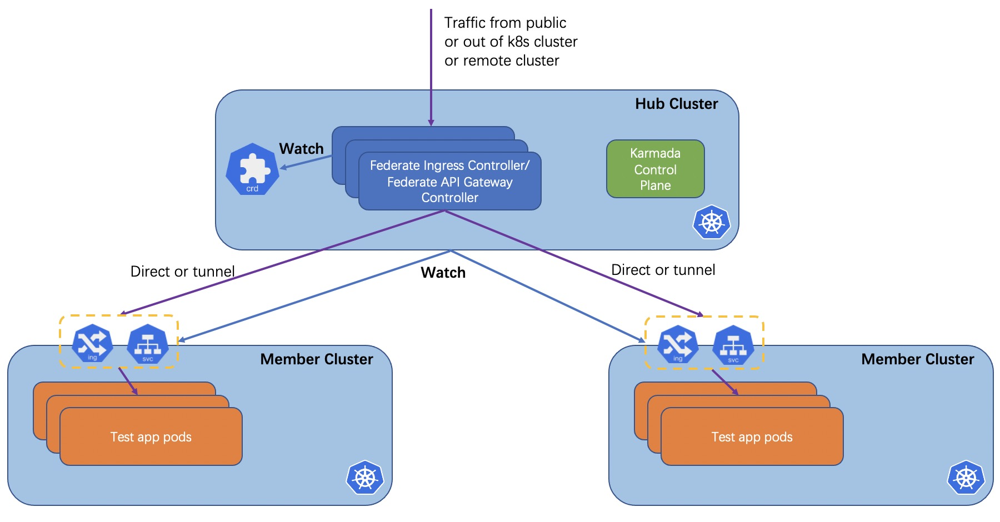
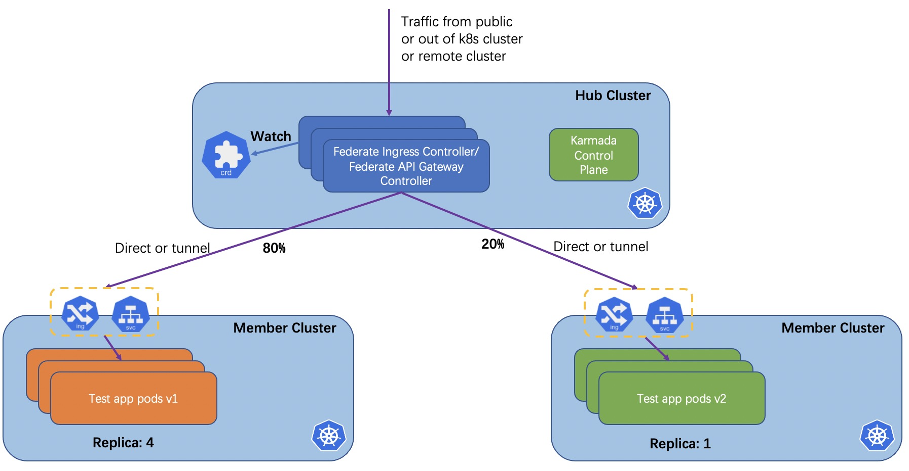

# Federated Ingress Controller & Federated API Gateway Controller

<!--
This is the title of your KEP. Keep it short, simple, and descriptive. A good
title can help communicate what the KEP is and should be considered as part of
any review.
-->

## Summary
Federated Ingress Controller provides a federated ingress(api gateway) in hub cluster.As workloads (deployment/statefulset/pod/etc) can be deployed to multi clusters, we need a traffic entrance to expose services to multi clusters's workloads.
<!--
This section is incredibly important for producing high-quality, user-focused
documentation such as release notes or a development roadmap. 

A good summary is probably at least a paragraph in length.
-->

## Motivation

<!--
This section is for explicitly listing the motivation, goals, and non-goals of
this KEP.  Describe why the change is important and the benefits to users.
-->

### Goals
- Provides federated ingess or api gateway
- Provides a service exposing solution for federated application
- Provides ingress ability for federated applications canary or blue/green deployment strategy
<!--
List the specific goals of the KEP. What is it trying to achieve? How will we
know that this has succeeded?
-->

### Non-Goals

<!--
What is out of scope for this KEP? Listing non-goals helps to focus discussion
and make progress.
-->

## Proposal

<!--
This is where we get down to the specifics of what the proposal actually is.
This should have enough detail that reviewers can understand exactly what
you're proposing, but should not include things like API designs or
implementation. What is the desired outcome and how do we measure success?.
The "Design Details" section below is for the real
nitty-gritty.
-->

### User Stories (Optional)

<!--
Detail the things that people will be able to do if this KEP is implemented.
Include as much detail as possible so that people can understand the "how" of
the system. The goal here is to make this feel real for users without getting
bogged down.
-->

#### Story 1
1. User deploy a federated application (deployment+svc+ingress) to cluster 1 and cluster 2.
2. User want to expose only one dns domain like kubernetes ingress resource to the federated application workloads in cluster 1 and cluster 2.

#### Story 2
1. User deploy a federated application (deployment+svc+ingress) to cluster 1 and cluster 2.
2. User want to execute canary deployment strategy across two clusters. For example, upgrade workload to v2 in cluster 2 and workload remains to v1 in cluster 1.

### Notes/Constraints/Caveats (Optional)

<!--
What are the caveats to the proposal?
What are some important details that didn't come across above?
Go in to as much detail as necessary here.
This might be a good place to talk about core concepts and how they relate.
-->

### Risks and Mitigations

<!--
What are the risks of this proposal, and how do we mitigate? 

How will security be reviewed, and by whom?

How will UX be reviewed, and by whom?

Consider including folks who also work outside the SIG or subproject.
-->

## Design Details

### Architecture

1. Federated Ingress Controller (federated api gateway controlle) is installed in hub cluster.
2. New CRDs: FederatedIngress.
3. Workload in member cluster is exposed by ingress or nodePort service.
4. Federated Ingress Controller will watch ingresses and services configured in FederatedIngress. When endpoints of ingresses and services dynamic change, Federated Ingress Controller will update FederatedIngress accordingly.
5. In canary scenario, each ingress or service is set to a weighted percentage. Workloads in different member cluster is set to different version.

<!--
This section should contain enough information that the specifics of your
change are understandable. This may include API specs (though not always
required) or even code snippets. If there's any ambiguity about HOW your
proposal will be implemented, this is the place to discuss them.
-->

### Test Plan

<!--
**Note:** *Not required until targeted at a release.*

Consider the following in developing a test plan for this enhancement:
- Will there be e2e and integration tests, in addition to unit tests?
- How will it be tested in isolation vs with other components?

No need to outline all of the test cases, just the general strategy. Anything
that would count as tricky in the implementation, and anything particularly
challenging to test, should be called out.

-->

## Alternatives

<!--
What other approaches did you consider, and why did you rule them out? These do
not need to be as detailed as the proposal, but should include enough
information to express the idea and why it was not acceptable.
-->

<!--
Note: This is a simplified version of kubernetes enhancement proposal template.
https://github.com/kubernetes/enhancements/tree/3317d4cb548c396a430d1c1ac6625226018adf6a/keps/NNNN-kep-template
-->