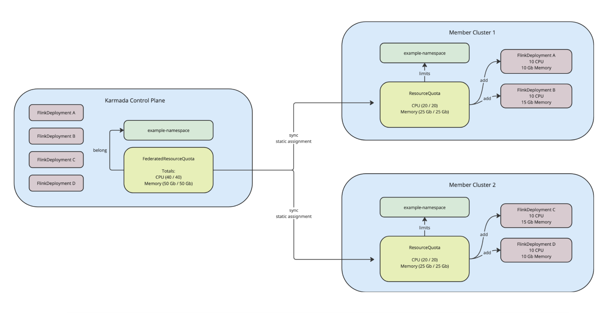
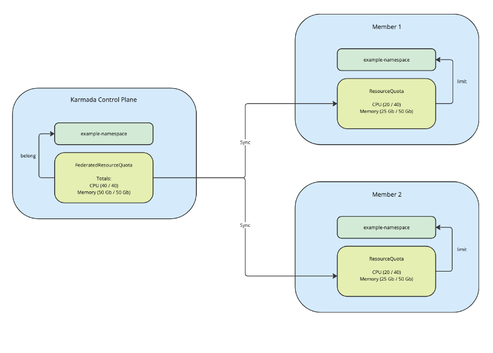
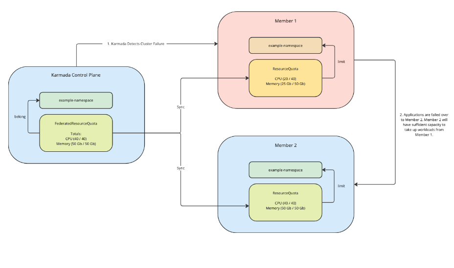
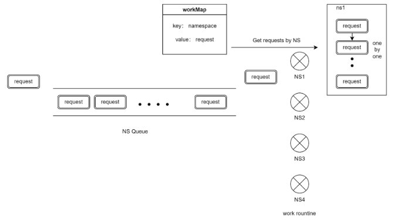

# Enhance FederatedResourceQuota to enforce Resource Limits on Karmada Control Plane

## Summary

This proposal aims to enhance the existing FederatedResourceQuota API to impose namespaced resource limits directly on the Karmada control-plane level. This feature enhancement has several benefits, including:

1. Track resource consumption and limits from a unified place
2. Prevent users from over-consuming aggregate resources across clusters
3. Easier for users of application and cluster failover to ensure that fallback clusters have enough resources to house all the user's workflows

## Motivation

The existing FederatedResourceQuota only provides Karmada administrators with the ability to manage ResourceQuotas via static assignment on member clusters. This saves administrators some time by not requiring a PropagationPolicy for their ResourceQuotas.

However, this design still runs on the assumption that ResourceQuotas are cluster specific. For users who manage platforms running on multi-cluster Kubernetes, it would be beneficial to be able to track and enforce resource limits from a federated level, rather than relying on cluster-specific quotas.

Additionally, the existing static assignment has some drawbacks when used alongside failover features. Since static assignment of resource quotas requires that users subdivide their quota between clusters, each member cluster’s resource quota will be less than the total quota allocated to the user. This means during failover, the other member cluster will not have sufficient resources to host failed-over applications.

### User Story 1: Apache Flink on Karmada

**User**: @mszacillo

As platform owners for Apache Flink, we currently lack the ability to enforce resource limits on a federated level. Existing ResourceQuotas are designed to be namespaced and exist within a single cluster.

By supporting a FederatedResourceQuota that tracks and enforces resources limits directly on the Karmada control-plane, we don't need to apply individual resource quotas to each member cluster, since Karmada control-plane will handle this responsibility.

**Failover implications:**

We also use Karmada for its automated failover feature. But in order for failover to succeed, we need to carefully plan our cluster federation and Karmada setup to ensure:
1. Fallback clusters have sufficient resources to host all necessary applications.

Given this requirement, let's assume we have a Karmada control-plane setup with application and cluster failover enabled. In order to impose namespaced resource limits, we use a FederatedResourceQuota with 40 CPU and 50 GB Memory. Since static-assignment is being used, each cluster gets a ResourceQuota of 20 CPU and 25 GB Memory.

Eventually, all clusters are full and no more resources can be scheduled. Below we see 4 FlinkDeployments with varying CPU and Memory requests, they are subdivided into two clusters and both filling the entire ResourceQuota:



However, let's now assume there was a cluster failure which triggers a cluster failover. In this case, since the ResourceQuotas are statically assigned, the fallback cluster will not be able to schedule these applications because the ResourceQuota is already full. Jobs will be unable to be rescheduled, and will have to wait until the original cluster comes back up. This is not acceptable.



In the following image, we show what we would ideally like to support. The Karmada control plane limits the global resource usage for the user's namespace, but does not statically assign ResourceQuotas. Both member clusters have identical ResourceQuotas of 40 CPU and 50 Gb Memory, so when Member Cluster 1 fails, Member Cluster 2 will have enough space to host FlinkDeployments A and B:



Could we support dynamic assignment of FederatedResourceQuota? Potentially yes, but there are some drawbacks with that approach:
1. Each time an application failovers, the FederatedResourceQuota will need to check that the feasible clusters have enough quota, and if not, rebalance the resource quotas before scheduling work. This adds complexity to the scheduling step, and would increase E2E failover latency.
2. Additionally, in bad cases, applications could be failing over frequently which would result in frequent ResourceQuota updates, leading to a lot of churn on the Karmada control-plane and member clusters.

Instead, we would like to enhance the existing FederatedResourceQuota API so that it can enforce resource limits directly on the Karmada control-plane and allow users to configure their cluster federation to be ready for failovers.

### User Story 2: Apache Spark on Karmada

**User**: @CaesarTY

Certain types of applications, especially big data and analytics jobs (e.g., Apache Spark on Kubernetes), do not always request all required resources up front. Instead, they may dynamically request additional resources (executors) at runtime, depending on current workload size, task parallelism, and job progress.

In a multi-cluster environment managed by Karmada, we currently lack a way to enforce resource usage limits across clusters for such elastic workloads. Traditional Kubernetes ResourceQuota objects operate at the namespace level within a single cluster and are not designed to account for cross-cluster resource consumption or dynamic scaling behavior.

Without a FederatedResourceQuota, we cannot:
1. Prevent users from over-consuming aggregate resources across clusters.
2. Track and control dynamic scaling patterns (like Spark's executor provisioning).
3. Enable fair usage and quota enforcement for shared resource pools in a federated environment.

This feature would make it possible to define a global quota at the federation level, monitor live resource usage from all member clusters, and enforce limits.

### Goals
 - Enhance FederatedResourceQuota API to support enforcing namespaces resource limits on the Karmada control-plane level by using Overall
 - Make this feature configurable and toggleable

### Non-Goals
 - Support of dynamic resource quota allocation is outside the scope of this proposal.

## Proposal

1. FederatedResourceQuota API should enforce namespaced overall resource limits.
    - FederatedResourceQuota Status will be updated whenever resources are applied against the relevant namespace.
    - The FederatedResourceQuota will include ability to set the quota scope (borrowing from [K8s ResourceQuota scopes](https://kubernetes.io/docs/concepts/policy/resource-quotas/#quota-scopes)). If unset, the quota will match all objects in the namespace.
	- FederatedResourceQuota will not need to schedule ResourceQuotas to member clusters, as it is managing the total resource usage.
2. A custom controller will be responsible for updating the overall resource usage.
3. A validation webhook (or admission controller) will block users from applying or updating resources that will go above total resource allowances.

## API Changes

### FederatedResourceQuota API

There will not be changes made to the existing FederatedResourceQuota API definition, but we will redefine how `Overall` is currently used. We would like `Overall` to represent the resource limits imposed by the quota, and have Karmada keep track of these limits when managing applications applied to the namespace.

```go
// FederatedResourceQuotaSpec defines the desired hard limits to enforce on the Karmada namespace.
type FederatedResourceQuotaSpec struct {
	// Overall is the set of desired hard limits for each named resource.
	// If Overall is set, the FederatedResourceQuota will impose limits directly on the Karmada control-plane
	// +required
	Overall corev1.ResourceList `json:"overall"`
	// Scopes epresents a list of filters that will determine which objects are tracked by the quota.
	// If not specified, the quota matches all objects.
	// +optional
	Scopes []FederatedResourceQuotaScope
}

// FederatedesourceQuotaScope defines a filter that will determine which objects are tracked by the quota
type FederatedResourceQuotaScope string

// These are valid values for the FederatedResourceQuota scope
const (
	// Match all resources that have priority class mentioned
	FederatedResourceQuotaScopePriorityClass FederatedResourceQuotaScope = "PriorityClass"
)

```

## Design Details

### Controller Change

**Reconciliation**: Controller will reconcile whenever a resource binding is created, updated, or deleted. In the case of an update operation, the controller will only reconcile if the ResourceRequirement has been updated (indicating a change required to the FederatedResourceQuota status).

**Reconcile Logic**:  When reconciling, the controller will fetch the list of ResourceBindings by namespace and add up their resource requirements. The existing implementation grabs all RBs by namespace, however this could probably be improved by only calculating the delta of the applied resource, rather than calculating the entire resource footprint of the namespace.

In order to calculate delta efficiently, we'd need to introduce a ResourceBinding cache maintained by the controller.

**Internal RB Cache**

The cache would populate by fetching all ResourceBindings during initialization. Cache would then be maintained during the controller's reconcile loops. In the case of a pod crash or restart, the cache would need to be repopulated. But having the cache will prevent the controller from needing to fetch all ResourceBindings during all reconciles.

During reconcile, cache updates would occur:
1. If the reconciled ResourceBinding is not present in the cache.
2. The reconciled ResourceBinding has a spec change and should be updated in the cache.

### Scheduler Change

Note: Since the controller is listening to RBs, the FederatedResourceQuota will be calculated after the resource binding has been created or updated.

If a user bulk-applies a bunch of resources at once, it could be possible for the user to go above the quota’s limits. In this case, we should also check that the quota is honored before deciding to schedule the resource to a member cluster.

### Admission Controller

In order to enforce resource limits, we'll need to make sure incoming Create/Update requests do not push the total resource usage beyond the limits defined in the quota. Since users can bulk-apply many resources, it makes more sense to use an admission controller as opposed to a webhook, and process the deltaUsage of the quota for each request serially.

Thank you @zhzhuang-zju for including this diagram which shows the way requests would be consumed by the admission controller:


