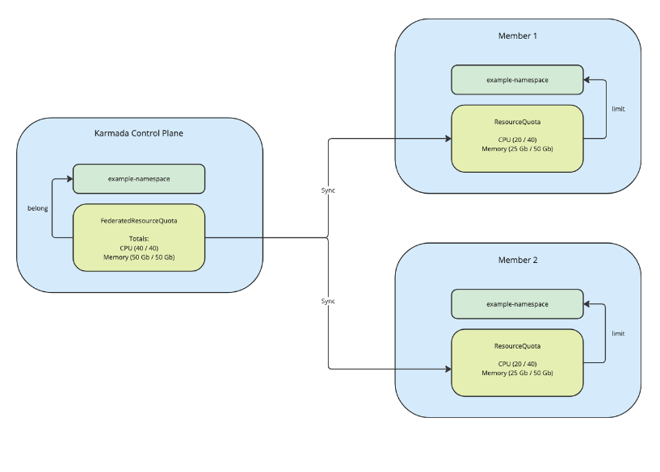
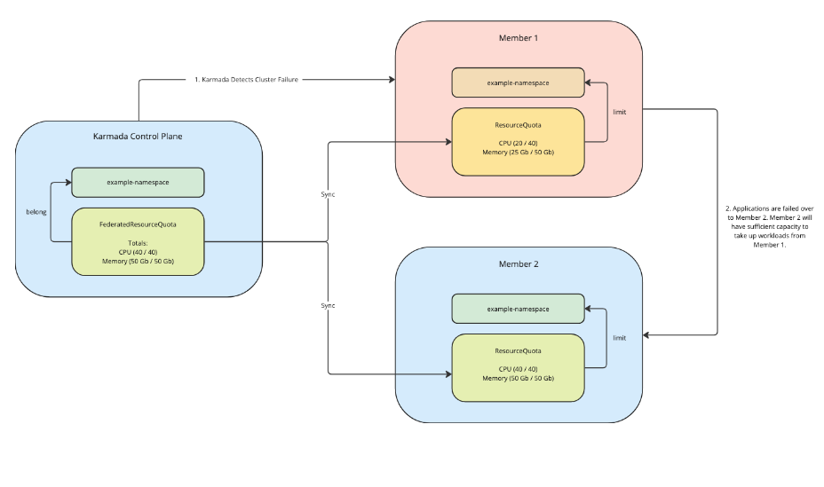

# Enhance FederatedResourceQuota to enforce Resource Limits on Karmada Control Plane

## Summary

This proposal aims to enhance the existing FederatedResourceQuota API to impose namespaced resource limits directly on the Karmada control-plane level. With the feature, it will be easier for users of application and cluster failover to ensure that fallback clusters have enough resources to house all the user's workflows. Ideally, this is a feature that can be configured and toggled, which would provider users with more control over enforcing their namespaces resources.

## Motivation

The desire for this feature comes from the use of application and cluster failover. With these features toggled applications are expected to migrate between clusters, and it is up to us as platform owners to make sure each cluster has sufficient resources to be able to host those applications. We believe controlling resource limits on a Karmada level will simplify this resource quota management.

The existing FederatedResourceQuota only provides Karmada administrators with the ability to manage ResourceQuotas via static assignment on member clusters. This saves administrators some time by not requiring a PropagationPolicy for their ResourceQuotas.

However, this feature does not work entirely with application and cluster failover. Since static assignment of resource quotas requires that users subdivide their quota between clusters, each member cluster’s resource quota will be less than the total quota allocated to the user. This means during failover, the other member cluster will not have sufficient resources to host failed-over applications.

### User Story

As a data platform owner, we host many different tenants across different namespaces. One of the biggest benefits of using Karmada to manage our user's Flink applications is the automated failover feature. But in order for failover to succeed, we need to carefully plan our cluster federation and Karmada setup to ensure:
1. Fallback clusters have sufficient resources to host all necessary applications.
2. Users have imposed resource limits, so they cannot schedule applications that go over their namespaces resource limits.

Given these requirements, let's assume we have a Karmada control-plane setup with application and cluster failover enabled. In order to impose namespaced resource limits, we use a FederatedResourceQuota with 40 CPU and 50 GB Memory. Since static-assignment is being used, each cluster gets a ResourceQuota of 20 CPU and 25 GB Memory.

Eventually, all clusters are full and no more resources can be scheduled.



However, let's now assume there was a cluster failure which triggers a cluster failover. In this case, since the ResourceQuotas are statically assigned, the fallback cluster will not be able to schedule any additional workloads. Jobs will be unable to failover, and will have to wait until the original cluster comes back up. This is not acceptable.



Could we support dynamic assignment of FederatedResourceQuota? Potentially yes, but there are some drawbacks with that approach:
1. Each time an application failovers, the FederatedResourceQuota will need to check that the feasible clusters have enough quota, and if not, rebalance the resource quotas before scheduling work. This adds complexity to the scheduling step, and would increase E2E failover latency.
2. Additionally, in bad cases, applications could be failing over frequently which would result in frequent ResourceQuota updates, leading to a lot of churn on the Karmada control-plane and member clusters.

Instead, we would like to introduce an API that can enforce resource limits directly on the Karmada control-plane and allow users to configure their cluster federation to be ready for failovers.

### Goals
 - Enhance FederatedResourceQuota API to support enforcing namespaces resource limits on the Karmada control-plane level by using Overall
 - Make this feature configurable and toggleable

### Non-Goals
 - Support of dynamic resource quota allocation is outside the scope of this proposal.

## Proposal

1. FederatedResourceQuota API should also enforce namespaced overall resource limits.
    - FederatedResourceQuota Status will be updated whenever resources are applied against the relevant namespace
    - We consider including a resource selector scope for the quota
2. A custom controller will be responsible for updating the overall resource usage
3. A validation webhook (or admission controller) will block users from applying or updating resources that will go above total resource allowances

## API Changes

### FederatedResourceQuota API

```go
// FederatedResourceQuotaSpec defines the desired hard limits to enforce on the Karmada namespace.
type FederatedResourceQuotaSpec struct {
	// Overall is the set of desired hard limits for each named resource.
	// If Overall is set, the FederatedResourceQuota will impose limits directly on the Karmada control-plane
	// +required
	Overall corev1.ResourceList `json:"overall"`
}
```

### ResourceBinding Change

The ResourceBindingSpec will include a FederatedResourceQuota reference, which can be updated one of two ways:

1. If there is a FederatedResourceQuota in the namespace, add it to the created binding spec by default
2. If there is no FederatedResourceQuota, leave empty.
3. If the FederatedResourceQuota has a scope, determine if the resource matches the scope, and then add the pointer in the binding if needed.

```go
// ResourceBindingSpec represents the expectation of ResourceBinding.
type ResourceBindingSpec struct {
    ***

    //  FederatedResourceQuota represents the name of the quota that will be used for this resource
	// +optional
	 FederatedResourceQuota string `json:"federatedResourceQuota,omitempty"`

    ***
}
```

## Design Details

### Controller Change

**Reconciliation**: Controller will reconcile whenever a resource binding is created, updated, or deleted. Controller will only reconcile if the resource in question has a pointer to a ResourceQuotaEnforcer.

**Reconcile Logic**:  When reconciling, the controller will fetch the list of ResourceBindings by namespace and add up their resource requirements. The existing implementation grabs all RBs by namespace, however this could probably be improved by only calculating the delta of the applied resource, rather than calculating the entire resource footprint of the namespace.

In order to calculate delta efficiently, we'd need to introduce a ResourceBinding cache maintained by the controller.

**Internal RB Cache**

The cache would populate by fetching all ResourceBindings during initialization. Cache would then be maintained during the controller's reconcile loops. In the case of a pod crash or restart, the cache would need to be repopulated. But having the cache will prevent the controller from needing to fetch all ResourceBindings during all reconciles.

During reconcile, cache updates would occur:
1. If the reconciled ResourceBinding is not present in the cache.
2. The reconciled ResourceBinding has a spec change and should be updated in the cache.

Resource usage delta would

### Scheduler Change

Note: Since the controller is listening to RBs, the ResourceQuotaEnforcer will be calculated after the resource binding has been created or updated.

If a user bulk-applies a bunch of resources at once, it could be possible for the user to go above the quota’s limits. In this case, we should also check that the quota is honored before deciding to schedule the resource to a member cluster.

### Admission Webhook

As part of this change, we will introduce a new validating webhook:

1. The new validating webhook will watch all types of resources, at least all native workloads (Deployments) and supported CRDs (FlinkDeployments). The webhook will use Karmada's `ResourceInterpreter#GetReplicas` to calculate the predicted delta resource usage for the quota. If the applied resource goes above the limit, then the webhook will deny the request.
