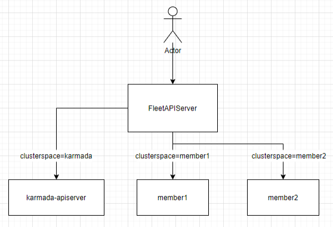
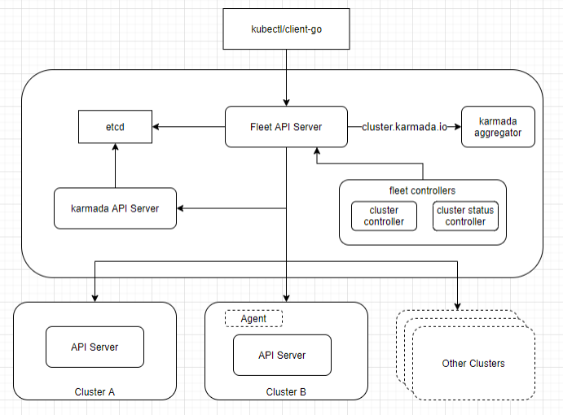

# FleetAPIServer -- provide a unified view of resources across multiple clusters

## Summary

In order to distinguish between users' usage scenarios, we introduce the concept of federation. When users do not enable federation, they only use FleetAPIServer to provide a unified view of multi-cluster resource; when users enable federation, Karmada will be deployed to increase the capabilities provided by Karmada.

FleetAPIServer meeting the management needs of both non-federated and federated scenarios, making it convenient for users to manage multiple clusters in a unified manner.

## Motivation

Karmada uses kube-apiserver as the API access entry point, which can provide users with a smooth transition from single-cluster to multi-cluster experience. However, there are still some confusion and inconvenience for users in the actual usage process.

When users use Karmada for resource operations, operation and maintenance, or secondary development, they need to switch kubeconfig context. Different contexts correspond to different targets, such as:

- Use this server address to query Karmada control plane resources: https://172.18.0.2:5443
- Use this server address to query member1 cluster resources: https://172.18.0.2:5443/apis/cluster.karmada.io/v1alpha1/clusters/member1/proxy
- Use this server address to query member2 cluster resources: https://172.18.0.2:5443/apis/cluster.karmada.io/v1alpha1/clusters/member2/proxy

For some users, switching the above context requires awareness of cluster information. For existing businesses, certain modification are needed. For developers and operation personal, learning new knowledge is required.

In order to accommodate these users with historical burdens, Karmada needs to take compatibility with Kubernetes single-cluster operation experience as a starting point and further provide smooth migration best practices from single-cluster architecture to multi-cluster architecture.

### Goals

- Add FleetAPIServer to provide users with a unified view of multi-cluster resources.
- The FleetAPIServer component is pluggable, and not using this component will not affect users' normal use of Karmada functions.

### Non-Goals

- Do not consider performance issues for now.
- Do not consider the issue of extensive support for different version member cluster APIs at the moment.

## Proposal

From the user's perspective, it looks like this:

Users can directly access FleetAPIServer to search for or operate on all clusters, including resources on Karmada. They can also specify the clusterspace parameter to search for or operate on resources in a specific cluster.

The architecture diagram of FleetAPIServer is given below.

FleetAPIServer serves as the access entry point, and users can directly access it using `kubectl` or `client-go`. In order to store relevant information such as cluster authentication credentials, RBAC resources, and Secret resources, FleetAPIServer needs to connect with a storage system. It can share the same etcd with `karmada-apiserver` but set different etcd storage prefixes for each other. Additionally, in order to register `Cluster` resources, FleetAPIServer needs to connect with the `karmada-aggregator` component; and for maintaining the health status of `Cluster`, the `fleet-controllers` component needs to be deployed which includes `cluster-controller` and `cluster-status-controller`.

FleetAPIServer provides two types of APIs, namely the API that is compatible with the single-cluster experience of Kubernetes and the API centered around a multi-cluster architecture. In the implementation o this solution, the goal is achieved by accessing `karmada-apiserver` and APIServer of different member clusters to build API capabilities.

One thing to note is that FleetAPIServer does not have the ability to propagate resources.

### User Stories (Optional)

To be supplemented.

#### Story 1

As an operations personnel, I deployed a `Deployment` in Karmada. However, one instance is not running properly. I need to view the logs of the pod or execute the `exec` command to enter the pod container and diagnose by executing command. During this process, there is no need to modify kubeconfig authentication information.

#### Story 2

As an administrator, I need to view the deployed Pod resources in the current Karmada environment. If there are conflicts in resource names, there should be a way to distinguish conflicting resource.

#### Story 3

As an ordinary user, I need to view or modify Kubernetes resources in a specified cluster by specifying the cluster name. 

### Notes/Constraints/Caveats (Optional)

1. Deploying the FleetAPIServer component will increase users' deployment and operation costs. We can consider merging the FleetAPIServer and karmada-apiserver components after considering user acceptance.

### Risks and Mitigations

## Design Details

### API Design

#### API compatible with Kubernetes single cluster experience -- Kubernetes vanilla API

**Design principles**

1. With the aim of providing a smooth transition process from a single-cluster architecture to a multi-cluster architecture, taking into consideration users with significant historical burdens, it is designed to be compatible with the operational experience of Kubernetes.
2. The implicit specification and usage of the concept "cluster".
3. User requests input, including Verb, URL, parameters consistent with single cluster input.
4. When federation is not enabled, a consistent processing is applied to all resources: the requested objects are resources in all clusters, antd the names of the resources returned from user requests need to be anonymized. The return format is `xx.clusterspace.yy`, where `xx` is the original name of the resource, `clusterspace` is a fixed term, and `yy` is the name of the cluster where the resource resides.
5. When federated is enabled, adopt a consistent processing strategy for all resources: the requested object is the resource in all clusters (including Karmada), and the returned resource name needs to be anonymized according to the same rules. For resources on Karmada, the suffix can be ignored and the original resource name can be directly returned. Users can consider it as `xx.clusterspace.karmada`.
6. When users make requests, they are allowed to use resource names in the format of `xx.clusterspace.yy` for their requests. During the processing, this format will be parsed to obtain the cluster name and then perform operations on resources in the target cluster. If this format is not satisfied, the target cluster will be considered as Karmada. The path for searching resource name is: URL -> query parameters -> body. Once found, it will be returned.
7. For List requests, if the API to which the requested resource object belongs it not enabled on the target cluster, ignore the results on that cluster and continue processing resources in other clusters.
8. The resourceVersion returned from user request needs to be processed: since ObjectList objects need to be obtained from multiple clusters, the resourceVersion needs to be aggregated when returning (aggregation method: concatenate the single-cluster resourceVersion with the cluster name to form a string-formatted version. Multiple string-formatted versions are then combined into a map and serialized to form the final returned version). The order of clusters should remain fixed. TODO: provide a concrete example to help developers understand that this mechanism can work properly.

**API Example Analysis**

Taking Deployment (namespace-scoped resource type) operations as an example:

| Operation        | Request URL                                                  | Federation Enable | Operate Meaning                                                                                                                |
|------------------|--------------------------------------------------------------|-------------------|--------------------------------------------------------------------------------------------------------------------------------|
| get              | GET /apis/apps/v1/namespaces/{namespace}/deployments/name    | Yes               | read the specified Deployment in cluster `yy` with input parameter name that meets the format `xx.clusterspace.yy`             |
| get              | GET /apis/apps/v1/namespaces/{namespace}/deployments/name    | No                | read the specified Deployment in cluster `yy` with input parameter name that meets the format `xx.clusterspace.yy`             |
| list             | GET /apis/apps/v1/namespaces/{namespace}/deployments         | Yes               | list or watch objects of kind Deployment in all clusters (including Karmada)                                                   |
| list             | GET /apis/apps/v1/namespaces/{namespace}/deployments         | No                | list or watch objects of kind Deployment in all clusters                                                                       |
| list             | GET /apis/apps/v1/deployments                                | Yes               | list or watch objects of kind Deployment in all clusters (including Karmada)                                                   |
| list             | GET /apis/apps/v1/deployments                                | No                | list or watch objects of kind Deployment in all clusters                                                                       |
| create           | POST /apis/apps/v1/namespaces/{namespace}/deployments        | Yes               | create a Deployment in cluster `yy` with input parameter name that meets the format `xx.clusterspace.yy`                       |
| create           | POST /apis/apps/v1/namespaces/{namespace}/deployments        | No                | create a Deployment in cluster `yy` with input parameter name that meets the format `xx.clusterspace.yy`                       |
| update           | PUT /apis/apps/v1/namespaces/{namespace}/deployments/name    | Yes               | replace the specified Deployment in cluster `yy` with input parameter name that meets the format `xx.clusterspace.yy`          |
| update           | PUT /apis/apps/v1/namespaces/{namespace}/deployments/name    | No                | replace the specified Deployment in cluster `yy` with input parameter name that meets the format `xx.clusterspace.yy`          |
| patch            | PATCH /apis/apps/v1/namespaces/{namespace}/deployments/name  | Yes               | partially update the specified Deployment in cluster `yy` with input parameter name that meets the format `xx.clusterspace.yy` |
| patch            | PATCH /apis/apps/v1/namespaces/{namespace}/deployments/name  | No                | partially update the specified Deployment in cluster `yy` with input parameter name that meets the format `xx.clusterspace.yy` |
| delete           | DELETE /apis/apps/v1/namespaces/{namespace}/deployments/name | Yes               | delete a Deployment in cluster `yy` with input parameter name that meets the format `xx.clusterspace.yy`                       |
| delete           | DELETE /apis/apps/v1/namespaces/{namespace}/deployments/name | No                | delete a Deployment in cluster `yy` with input parameter name that meets the format `xx.clusterspace.yy`                       |
| deletecollection | DELETE /apis/apps/v1/namespaces/{namespace}/deployments      | Yes               | not support                                                                                                                    |
| deletecollection | DELETE /apis/apps/v1/namespaces/{namespace}/deployments      | No                | not support                                                                                                                    |

Taking ClusterRole (cluster-scoped resource type) operations as an example:

| Operation        | Request URL                                                 | Federation Enable | Operate Meaning                                                                                                                 |
|------------------|-------------------------------------------------------------|-------------------|---------------------------------------------------------------------------------------------------------------------------------|
| get              | GET /apis/rbac.authorization.k8s.io/v1/clusterroles/name    | Yes               | read the specified ClusterRole in cluster `yy` with input parameter name that meets the format `xx.clusterspace.yy`             |
| get              | GET /apis/rbac.authorization.k8s.io/v1/clusterroles/name    | No                | read the specified ClusterRole in cluster `yy` with input parameter name that meets the format `xx.clusterspace.yy`             |
| list             | GET /apis/rbac.authorization.k8s.io/v1/clusterroles         | Yes               | list or watch objects of kind ClusterRole in all clusters (including Karmada)                                                   |
| list             | GET /apis/rbac.authorization.k8s.io/v1/clusterroles         | No                | list or watch objects of kind ClusterRole in all clusters                                                                       |
| create           | POST /apis/rbac.authorization.k8s.io/v1/clusterroles        | Yes               | create a ClusterRole in cluster `yy` with input parameter name that meets the format `xx.clusterspace.yy`                       |
| create           | POST /apis/rbac.authorization.k8s.io/v1/clusterroles        | No                | create a ClusterRole in cluster `yy` with input parameter name that meets the format `xx.clusterspace.yy`                       |
| update           | PUT /apis/rbac.authorization.k8s.io/v1/clusterroles/name    | Yes               | replace the specified ClusterRole in cluster `yy` with input parameter name that meets the format `xx.clusterspace.yy`          |
| update           | PUT /apis/rbac.authorization.k8s.io/v1/clusterroles/name    | No                | replace the specified ClusterRole in cluster `yy` with input parameter name that meets the format `xx.clusterspace.yy`          |
| patch            | PATCH /apis/rbac.authorization.k8s.io/v1/clusterroles/name  | Yes               | partially update the specified ClusterRole in cluster `yy` with input parameter name that meets the format `xx.clusterspace.yy` |
| patch            | PATCH /apis/rbac.authorization.k8s.io/v1/clusterroles/name  | No                | partially update the specified ClusterRole in cluster `yy` with input parameter name that meets the format `xx.clusterspace.yy` |
| delete           | DELETE /apis/rbac.authorization.k8s.io/v1/clusterroles/name | Yes               | delete a ClusterRole in cluster `yy` with input parameter name that meets the format `xx.clusterspace.yy`                       |
| delete           | DELETE /apis/rbac.authorization.k8s.io/v1/clusterroles/name | No                | delete a ClusterRole in cluster `yy` with input parameter name that meets the format `xx.clusterspace.yy`                       |
| deletecollection | DELETE /apis/rbac.authorization.k8s.io/v1/clusterroles      | Yes               | not support                                                                                                                     |
| deletecollection | DELETE /apis/rbac.authorization.k8s.io/v1/clusterroles      | No                | not support                                                                                                                     |

#### API centered around multi-cluster architecture -- Karmada Fleet API

**Design principles**

API designed with multi-cluster as the native form, explicitly highlighting the contextual concept of "cluster" in the API.

1. Users can intuitively see the target cluster being interacted with during the API invocation process.
2. Users can interact with the specified target cluster by explicitly specifying "cluster".
3. Support for users to specify cluster, optional values include: `karmada`, `all`, or specific cluster names. In user input requests, use the keyword `clusterspace` as a placeholder, similar to namespaces.
4. When using the `all` query to retrieve resources from all clusters, the resource names in the returned results should follow the format of `xx.clusterspace.yy`, where `xx` is the original name of the resource, `clusterspace` is a fixed term, and `yy` is the name of the cluster where the resource resides.
5. When users make requests, they are allowed to use resource names in the format of `xx.clusterspace.yy` for their request. If the parsed cluster name conflicts with the specified clusterspaces, an error will be handled. The resource name lookup path is as follows: URL -> query parameters -> body. Once found, it will be returned.
6. For List requests, if the API to which the requestd resource object belongs is not enabled on the target cluster, ignore the results on that cluster and continue processing resources in other clusters.
7. The resourceVersion returned from user request needs to be processed: since ObjectList objects need to be obtained from multiple clusters, the resourceVersion needs to be aggregated when returning (aggregation method: concatenate the single-cluster resourceVersion with the cluster name to form a string-formatted version. Multiple string-formatted versions are then combined into a map and serialized to form the final returned version). The order of clusters should remain fixed.

From the above third design principle, it can be seen that we need to add some reserved names for cluster names, which are not allowed for users to use, in order to represent member clusters.

- `karmada`, used to represent the control plane of Karmada.
- `all`, used to represent all clusters, including karmada control plane.

**API Example Analysis**

Taking Deployment (namespace-scoped resource type) operations as an example:

| Operation        | Request URL                                                                               | clusterspace value          | Operate Meaning                                                                                                                |
|------------------|-------------------------------------------------------------------------------------------|-----------------------------|--------------------------------------------------------------------------------------------------------------------------------|
| get              | GET /apis/apps/v1/namespaces/{namespace}/clusterspaces/{clusterspace}/deployments/name    | foo (specific cluster name) | read the specified Deployment in cluster `foo`                                                                                 |
| get              | GET /apis/apps/v1/namespaces/{namespace}/clusterspaces/{clusterspace}/deployments/name    | karmada                     | read the specified Deployment in Karmada control plane                                                                         |
| get              | GET /apis/apps/v1/namespaces/{namespace}/clusterspaces/{clusterspace}/deployments/name    | all                         | read the specified Deployment in cluster `foo` with input parameter name that meets the format `xx.clusterspace.yy`            |
| list             | GET /apis/apps/v1/namespaces/{namespace}/clusterspaces/{clusterspace}/deployments         | foo (specific cluster name) | list or watch objects of kind Deployment in cluster `foo`                                                                      |
| list             | GET /apis/apps/v1/namespaces/{namespace}/clusterspaces/{clusterspace}/deployments         | karmada                     | list or watch objects of kind Deployment in Karmada control plane                                                              |
| list             | GET /apis/apps/v1/namespaces/{namespace}/clusterspaces/{clusterspace}/deployments         | all                         | list or watch objects of kind Deployment in all clusters                                                                       |
| list             | GET /apis/apps/v1/clusterspaces/{clusterspace}/deployments                                | foo (specific cluster name) | list or watch objects of kind Deployment in cluster `foo`                                                                      |
| list             | GET /apis/apps/v1/clusterspaces/{clusterspace}/deployments                                | karmada                     | list or watch objects of kind Deployment in Karmada control plane                                                              |
| list             | GET /apis/apps/v1/clusterspaces/{clusterspace}/deployments                                | all                         | list or watch objects of kind Deployment in all clusters                                                                       |
| create           | POST /apis/apps/v1/namespaces/{namespace}/clusterspaces/{clusterspace}/deployments        | foo (specific cluster name) | create a Deployment in cluster `foo`                                                                                           |
| create           | POST /apis/apps/v1/namespaces/{namespace}/clusterspaces/{clusterspace}/deployments        | karmada                     | create a Deployment in Karmada control plane                                                                                   |
| create           | POST /apis/apps/v1/namespaces/{namespace}/clusterspaces/{clusterspace}/deployments        | all                         | create a Deployment in cluster `yy`, where the metadata.name in body is formatted as `xx.clusterspace.yy`                      |
| update           | PUT /apis/apps/v1/namespaces/{namespace}/clusterspaces/{clusterspace}/deployments/name    | foo (specific cluster name) | replace the specified Deployment in cluster `foo`                                                                              |
| update           | PUT /apis/apps/v1/namespaces/{namespace}/clusterspaces/{clusterspace}/deployments/name    | karmada                     | replace the specified Deployment in Karmada control plane                                                                      |
| update           | PUT /apis/apps/v1/namespaces/{namespace}/clusterspaces/{clusterspace}/deployments/name    | all                         | replace the specified Deployment in cluster `yy` with input parameter name that meets the format `xx.clusterspace.yy`          |
| patch            | PATCH /apis/apps/v1/namespaces/{namespace}/clusterspaces/{clusterspace}/deployments/name  | foo (specific cluster name) | partially update the specified Deployment in cluster `foo`                                                                     |
| patch            | PATCH /apis/apps/v1/namespaces/{namespace}/clusterspaces/{clusterspace}/deployments/name  | karmada                     | partially update the specified Deployment in Karmada control plane                                                             |
| patch            | PATCH /apis/apps/v1/namespaces/{namespace}/clusterspaces/{clusterspace}/deployments/name  | all                         | partially update the specified Deployment in cluster `yy` with input parameter name that meets the format `xx.clusterspace.yy` |
| delete           | DELETE /apis/apps/v1/namespaces/{namespace}/clusterspaces/{clusterspace}/deployments/name | foo (specific cluster name) | delete a Deployment in cluster `foo`                                                                                           |
| delete           | DELETE /apis/apps/v1/namespaces/{namespace}/clusterspaces/{clusterspace}/deployments/name | karmada                     | delete a Deployment in Karmada control plane                                                                                   |
| delete           | DELETE /apis/apps/v1/namespaces/{namespace}/clusterspaces/{clusterspace}/deployments/name | all                         | delete a Deployment in cluster `yy` with input parameter name that meets the format `xx.clusterspace.yy`                       |
| deletecollection | DELETE /apis/apps/v1/namespaces/{namespace}/clusterspaces/{clusterspace}/deployments      | foo (specific cluster name) | delete collection of Deployment in cluster `foo`                                                                               |
| deletecollection | DELETE /apis/apps/v1/namespaces/{namespace}/clusterspaces/{clusterspace}/deployments      | karmada                     | delete collection of Deployment in Karmada control plane                                                                       |
| deletecollection | DELETE /apis/apps/v1/namespaces/{namespace}/clusterspaces/{clusterspace}/deployments      | all                         | not support                                                                                                                    |

Taking ClusterRole (cluster-scoped resource type) operations as an example:

| Operation        | Request URL                                                 | clusterspace value          | Operate Meaning                                                                                                                 |
|------------------|-------------------------------------------------------------|-----------------------------|---------------------------------------------------------------------------------------------------------------------------------|
| get              | GET /apis/rbac.authorization.k8s.io/v1/clusterroles/name    | foo (specific cluster name) | read the specified ClusterRole in cluster `foo`                                                                                 |
| get              | GET /apis/rbac.authorization.k8s.io/v1/clusterroles/name    | karmada                     | read the specified ClusterRole in Karmada control plane                                                                         |
| get              | GET /apis/rbac.authorization.k8s.io/v1/clusterroles/name    | all                         | read the specified ClusterRole in cluster `yy` with input parameter name that meets the format `xx.clusterspace.yy`             |
| list             | GET /apis/rbac.authorization.k8s.io/v1/clusterroles         | foo (specific cluster name) | list or watch objects of kind ClusterRole in cluster `foo`                                                                      |
| list             | GET /apis/rbac.authorization.k8s.io/v1/clusterroles         | karmada                     | list or watch objects of kind ClusterRole in Karmada control plane                                                              |
| list             | GET /apis/rbac.authorization.k8s.io/v1/clusterroles         | all                         | list or watch objects of kind ClusterRole in all clusters (including Karmada control plane)                                     |
| create           | POST /apis/rbac.authorization.k8s.io/v1/clusterroles        | foo (specific cluster name) | create a ClusterRole in cluster `foo`                                                                                           |
| create           | POST /apis/rbac.authorization.k8s.io/v1/clusterroles        | karmada                     | create a ClusterRole in Karmada control plane                                                                                   |
| create           | POST /apis/rbac.authorization.k8s.io/v1/clusterroles        | all                         | create a ClusterRole in cluster `yy`, where the metadata.name in body is formatted as `xx.clusterspace.yy`                      |
| update           | PUT /apis/rbac.authorization.k8s.io/v1/clusterroles/name    | foo (specific cluster name) | replace the specified ClusterRole in cluster `foo`                                                                              |
| update           | PUT /apis/rbac.authorization.k8s.io/v1/clusterroles/name    | karmada                     | replace the specified ClusterRole in Karmada control plane                                                                      |
| update           | PUT /apis/rbac.authorization.k8s.io/v1/clusterroles/name    | all                         | replace the specified ClusterRole in cluster `yy` with input parameter name that meets the format `xx.clusterspace.yy`          |
| patch            | PATCH /apis/rbac.authorization.k8s.io/v1/clusterroles/name  | foo (specific cluster name) | partially update the specified ClusterRole in cluster `foo`                                                                     |
| patch            | PATCH /apis/rbac.authorization.k8s.io/v1/clusterroles/name  | karmada                     | partially update the specified ClusterRole in Karmada control plane                                                             |
| patch            | PATCH /apis/rbac.authorization.k8s.io/v1/clusterroles/name  | all                         | partially update the specified ClusterRole in cluster `yy` with input parameter name that meets the format `xx.clusterspace.yy` |
| delete           | DELETE /apis/rbac.authorization.k8s.io/v1/clusterroles/name | foo (specific cluster name) | delete a ClusterRole in cluster `foo`                                                                                           |
| delete           | DELETE /apis/rbac.authorization.k8s.io/v1/clusterroles/name | karmada                     | delete a ClusterRole in Karmada control plane                                                                                   |
| delete           | DELETE /apis/rbac.authorization.k8s.io/v1/clusterroles/name | all                         | delete a ClusterRole in cluster `yy` with input parameter name that meets the format `xx.clusterspace.yy`                       |
| deletecollection | DELETE /apis/rbac.authorization.k8s.io/v1/clusterroles      | foo (specific cluster name) | delete collection of ClusterRole in cluster `foo`                                                                               |
| deletecollection | DELETE /apis/rbac.authorization.k8s.io/v1/clusterroles      | karmada                     | delete collection of ClusterRole in Karmada control plane                                                                       |
| deletecollection | DELETE /apis/rbac.authorization.k8s.io/v1/clusterroles      | all                         | not support                                                                                                                     |

### Implementation plan

To be supplemented.

### Test Plan

- `kubectl` command. TODO: analyze the support level of each kubectl command output (Not all subcommands of `kubectl` are necessarily supported).
- Kubernetes API full test
- `client-go` repository function test

## Alternatives

Provide global resource query functionality in the `karmada-aggregator` component to partially solve the problem of proposal handling. This processing logic is in [#4253](https://github.com/karmada-io/karmada/pull/4254)

