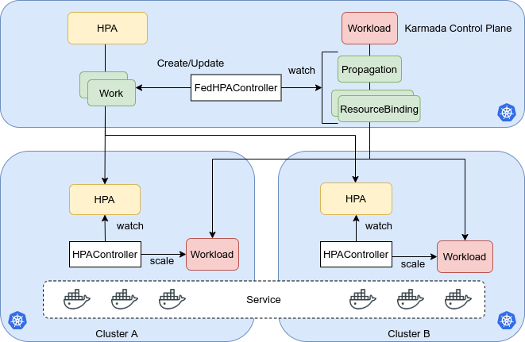

# Federated HPA
## Summary
HPA is a widely used approach to improve the stability of apps dealing with burst of request and resource utility. We can run our apps on multiple clusters as easy as a single cluster with Karmada, but Karmada lacks the HPA support now. 
This proposal introduces a new component FederatedHPA to Karmada and enables Karmada to autoscale workloads across clusters. It also tries to minimize the differences of the user experience between HPA on a single cluster.

## Motivation

<!--
This section is for explicitly listing the motivation, goals, and non-goals of
this KEP.  Describe why the change is important and the benefits to users.
-->

### Goals
1. Bring HPA from single cluster to multiple clusters.
1. Compatible with the HPA related resources in the single cluster.
1. Tolerate the disaster of member cluster or karmada control plane.
1. It is better to integrate well with the scenarios such as workloads shifting and cloud bursting.
1. It is better to support both Kubernetes HPA and customized HPA.

### Non-Goals
1. Deal the workloads with different subset of services.
## Proposal

<!--
This is where we get down to the specifics of what the proposal actually is.
This should have enough detail that reviewers can understand exactly what
you're proposing, but should not include things like API designs or
implementation. What is the desired outcome and how do we measure success?.
The "Design Details" section below is for the real
nitty-gritty.
-->

### User Stories (Optional)

<!--
Detail the things that people will be able to do if this KEP is implemented.
Include as much detail as possible so that people can understand the "how" of
the system. The goal here is to make this feel real for users without getting
bogged down.
-->

#### Story 1
As a platform developer using Kubernetes, I want to use Karmada to run apps on multiclusters, but my CD ecosystem is built based on a single cluster and the original HPA is heavily used. So I want to migrate the HPA resources to multiclusters without much effort. It is better to be compatible with the schema of HPA used in a single cluster. 

#### Story 2
As an application developer, I create an HPA CR for the application running on Karmada with FederatedHPA enabled.
```
target cpu util 30%
min replica 3
max replica 100
```
Suddenly, one of the member clusters which my application running on stops working and can't scale up new pods. Unfortunately, a request burst is coming into the application. The CPU util of pods becomes higher than 30%. It will need 100 Pods totally to take the request burst. I hope the Karmada FederatedHPA can scale up new pods in other healthy clusters.

#### Story 3
As an administrator of the Karmada&Kubernetes platform, I receive an alert that the Karmada control plane stops working and any requests to the Karmada control plane are failed. There are many applications running on the platform heavily depend on the HPA to handle the unpredictable burst of requests. The chance of RCA occurred becomes really high if the system can't tolerate the failure of federation control plane. So I hope the Karmada FederatedHPA can scale in the member clusters even if the Karmada control plane is down.

### Notes/Constraints/Caveats (Optional)
1. The workloads/pods in different member clusters selected by the same HPA CR/resource share the load of the application equally. For example, 10 pods of the application are spread into two member clusters with distribution `cluster1: 3 pods, cluster2: 7 pods`, so the 3 pods in cluster1 take 3/10 of total requests and 7 pods in cluster2 take 7/10 of total requests. Scenarios don't meet the restriction are not considered in this proposal.

<!--
What are the caveats to the proposal?
What are some important details that didn't come across above?
Go in to as much detail as necessary here.
This might be a good place to talk about core concepts and how they relate.
-->

### Risks and Mitigations

<!--
What are the risks of this proposal, and how do we mitigate? 

How will security be reviewed, and by whom?

How will UX be reviewed, and by whom?

Consider including folks who also work outside the SIG or subproject.
-->

## Design Details
### Architecture


There are no new CRDs or resources introduced in this design. All the core functions are implemented in the `FederatedHPAController`.
1. The Kubernetes HPA components are still used in the member cluster and can work standalone.
1. The FederatedHPAController is responsible for the following purposes:
   1. Watch the HPA resource and `PropagationPolicy/ResourceBinding` corresponding to the `Workload`, to learn which clusters the HPA resource should be propagated to and at what weight the workloads should be spread between clusters.
   1. Create `Work` corresponding to HPA resource to spread the HPA to clusters. Distribute `min/max` fields of the HPA resources between member clusters based on the weight learned.
   1. Redistribute 'some' fields of the HPA resources after `PropagationPolicy/ResourceBinding` corresponding to `Workload` is changed.
1. There will be `ResourceInterpreterWebhook`s provided for different types of `Workload`. They are responsible for retaining the `replicas` in the member clusters and aggregate statuses.

### How FederatedHPAController learn the propagation information corresponding to the Workload
When a new HPA resource created or changed, the `FederatedHPAController` should know the propagation and weight information of the corresponding `Workload`. How does the `FederatedHPAController` know it? The `FederatedHPAController` will easily find the corresponding `Workload` based on the field `ScaleTargetRef` and then will find the `PropagationPolicy` resource based on the matching of `ResourceSelectors`. 

For the weight information, because the karmada scheduler already plays the role to schedule the replicas, the `FederatedHPAController` can simply reuse the scheduling result to learn the weight. The `HPAController` in the member cluster scale the `Workload` in the member cluster directly, it will conflict between the karmada scheduler. We can retain `replicas` in the member cluster by using feature [resource interpreter webhook](https://github.com/karmada-io/karmada/tree/master/docs/proposals/resource-interpreter-webhook).

### How to deal with the `spec.replicas` of the Workload in the control plane
In the original Kubernetes HPA and Workload(Deployment, for example), HPA scale the workload through the `scale` subresource of Workload. Then, the field `replicas` will be modified to the desired number. But in this design, HPAController in the member cluster work standalone and don't scale workloads through control plane so that the actual number of pods in the member clusters don't match the `spec.replicas` of Workload in the control plane. This mismatch would cause incident when `spec.replicas` in control plane is much smaller than in member clusters and user delete the HPA resource. To solve this problem, `FederatedHPAController` can collect the sum of `spec.replicas` values from member clusters and set it to the `scale` subresource of Workload in the control plane.

Even the `spec.replicas` of Workload in the control plane matches the actual total replicas in the member clusters, every time the `spec.replicas` of Workload in the control plane is modified, the replicas distribution in the `Work` re-calculated by Karmada scheduler most probably don't match the actual distribution in the member clusters. The mismatch also would cause incident mentioned above. To solve this problem, we can split it into two sub-problems
* How to gracefully shift workload in member clusters when desired distribution calculated by the karmada scheduler and actual distribution among member clusters differ substantially. This may be caused by modification of the `PropagationPolicy` or the remove of HPA resources controlled by the FederatedHPAController. Without the graceful shifting progress, the service may get out of capacity. In the future, features such as `Federated Pod Disruption Budget` may are needed to solve the problem here.
* How to control the difference between the actual distribution in member clusters and the desired state the karmada scheduler calculated even the FederatedHPA is enabled. But this problem will not be too critical if the first problem is solved.

It is better to solve the first sub-problem in another proposal. So we will leave this problem until the first one is solved.

### How to deal with the situation that `spec.replicas` is `1`
The workload can be spread into multiple member clusters when the `spec.replicas` in the control plane is greater than `1`. The disaster of one member cluster and control plane can be tolerated because the workload can be scaled in other member clusters. But if the `spec.replicas` is `1`, the workload and HPA resource would only be spread into one member cluster. If the member cluster and control plane are out of service in the same time, the workload can't be scaled.

### How to integrate with and migrate from existing HPA resources
For some scenarios, people may want a friendly mechanism to control what HPA resources can be controlled by `FederatedHPAController`
1. There are already many HPA resources in the control plane managed by `PropagationPolicy` and `OverridePolicy` before the Karmada support FederatedHPA natively. For some risk concerns, the administrator of the platform wants to migrate these HPA resources to be managed by the FederatedHPAController step by step. 
1. There are already many HPA resources in the control plane managed by `PropagationPolicy` and `OverridePolicy` before the Karmada support FederatedHPA natively. But in the same Karmada control plane, some users want to use the native FederatedHPA but others want to remain the old ways. The FederatedHPA should not conflict with the HPA resources managed by the old ways.

To meet the requirements of above scenarios mentioned, a label `federatedhpa.karmada.io/enabled=true/false` for HPA resources will be introduced.

### How user stories are addressed
#### Story1
Suppose platform administrator create a `ClusterPropagationPolicy` as a global default propagation for the `Workload` resources inside namespace `apps` in advance. According to the `default` `ClusterPropagationPolicy`, the weight between `clustera` and `clusterb` should be `4:1`.
   <details>

<summary>unfold me to see the yaml</summary>

```
apiVersion: policy.karmada.io/v1alpha1
kind: ClusterPropagationPolicy
metadata:
  name: default
spec:
  placement:
    clusterAffinity:
      clusterNames:
      - clustera
      - clusterb
    replicaScheduling:
      replicaDivisionPreference: Weighted
      replicaSchedulingType: Divided
      weightPreference:
        staticWeightList:
        - targetCluster:
            clusterNames:
            - clustera
          weight: 4
        - targetCluster:
            clusterNames:
            - clusterb
          weight: 1
  resourceSelectors:
  - apiVersion: workload.example.io/v1alpha1
    kind: Workload
```
</details>

In the term of user story 1, suppose a user create a `Workload` and an `HPA` in the `apps` namespace

<details>

<summary>unfold me to see the yaml</summary>

```
apiVersion: workload.example.io/v1alpha1
kind: Workload
metadata:
  name: nginx
  namespace: apps
  labels:
    app: nginx
spec:
  replicas: 5
  paused: false
  template:
    metadata:
      labels:
        app: nginx
    spec:
      containers:
      - image: nginx
        name: nginx
------------------
apiVersion: autoscaling/v2
kind: HorizontalPodAutoscaler
metadata:
  name: nginx
  namespace: apps
spec:
  scaleTargetRef:
    apiVersion: workload.example.io/v1alpha1
    kind: Workload
    name: nginx
  minReplicas: 2
  maxReplicas: 10
  metrics:
  - type: Resource
    resource:
      name: cpu
      target:
        type: Utilization
        averageUtilization: 50
```

</details>

Then, `ClusterResourceBinding` resources will be created and scheduled by the Karmada scheduler

<details>

<summary>unfold me to see the yaml</summary>

```
apiVersion: work.karmada.io/v1alpha2
kind: ClusterResourceBinding
metadata:
  name: xxx
spec:
  resource:
    apiVersion: workload.example.io/v1alpha1
    kind: Workload
    name: nginx
  ...
  clusters:
  - name: clustera
    replicas: 4
  - name: clusterb
    replicas: 1
```

</details>

The `FederatedHPAController` continuously watches the events of HPA and Karmada relevant resources(`ClusterPropagationPolicy/PropagationPolicy` or `ClusterResourceBinding/ResourceBinding`) to learn
* Which clusters the HPA resources should be propagated to
* What weight the workload should be spread to clusters. The weight will be used to spread the `min/max` of HPA to clusters

Then, `FederatedHPAController` create/update `Work` resources for HPA resource. Finally, the HPA resource will be spread to `clustera` and `clusterb`. The `min/max` of HPA resource in `clustera` and `clusterb` will be `1/8` and `1/2`.

### High Availability
### Integration
### Test Plan

<!--
**Note:** *Not required until targeted at a release.*

Consider the following in developing a test plan for this enhancement:
- Will there be e2e and integration tests, in addition to unit tests?
- How will it be tested in isolation vs with other components?

No need to outline all the test cases, just the general strategy. Anything
that would count as tricky in the implementation, and anything particularly
challenging to test, should be called out.

-->

## Alternatives

<!--
What other approaches did you consider, and why did you rule them out? These do
not need to be as detailed as the proposal, but should include enough
information to express the idea and why it was not acceptable.
-->

<!--
Note: This is a simplified version of kubernetes enhancement proposal template.
https://github.com/kubernetes/enhancements/tree/3317d4cb548c396a430d1c1ac6625226018adf6a/keps/NNNN-kep-template
-->
