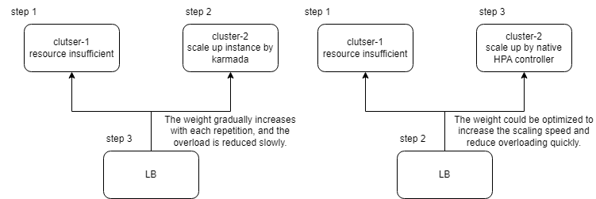
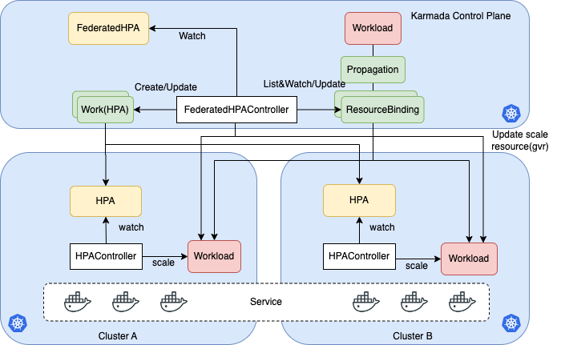
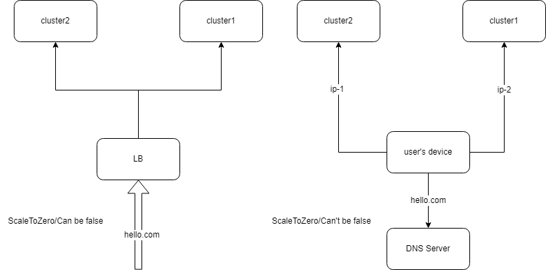

# Federated HPA
## Summary

<!--
This section is incredibly important for producing high-quality, user-focused
documentation such as release notes or a development roadmap. 

A good summary is probably at least a paragraph in length.
-->

Horizontal Pod Autoscaling (HPA) is a popular method for stabilizing applications by adjusting the number of pods based on different metrics. However, in single cluster, the scaling fail recovery couldn't be handled. Also, in the era of multi-clusters, single cluster HPA may not meet the growing requirements, including **scaling across clusters, unified HPA configuration management, scaling fail recovery, and limiting resource thresholds across clusters**.

To address these issues, this proposal introduced FederatedHPA to Karmada. This solution minimizes user experience discrepancies between HPA in a single cluster and multi-cluster environments. With FederatedHPA, users can easily scale their applications across multiple clusters and improve the overall efficiency of their Kubernetes clusters.

## Motivation

<!--
This section is for explicitly listing the motivation, goals, and non-goals of
this KEP.  Describe why the change is important and the benefits to users.
-->

In the era of multi-cloud and multi-cluster, there is currently a lack of an efficient and versatile HPA solution that can be compatible with multiple scenarios. This limits the release of multi-cloud and multi-cluster capabilities, including **fully utilize multi-cluster resources, achieve mutual scaling fail recovery and cost-effectiveness scaling across clusters**.

By introducing FederatedHPA to Karmada, users can enable various scenarios with rich policies. For instance, workloads in the high priority clusters may require scaling before workloads in low priority clusters. FederatedHPA provides greater flexibility and allows for more precise control over workload scaling across multiple clusters.  

Also, large-scale applications are becoming increasingly prevalent in multi-cluster. As a result, scaling performance is crucial for efficiently calculating metrics for much pods(such as 1 million) which singal cluster HPA couldn't handle. FederatedHPA offers a solution to this challenge.

### Goals

<!--
List the specific goals of the KEP. What is it trying to achieve? How will we
know that this has succeeded?
-->

1. Define FederatedHPA API to implement unified configuration management for member clusters HPA.
1. Allow for fine-grained control over the scaling of workloads across multiple clusters.
1. Support both Kubernetes HPA(CPU/Memory) and customized HPA(customized metrics).
1. Tolerate the disaster of member clusters or Karmada control plane.
1. Minimize control plane load when scaling workloads across clusters, and maximize the utilization of member clusters' scaling capabilities. 

### Non-Goals

<!--
What is out of scope for this KEP? Listing non-goals helps to focus discussion
and make progress.
-->

## Proposal

<!--
This is where we get down to the specifics of what the proposal is.
This should have enough detail that reviewers can understand exactly what
you're proposing, but should not include things like API designs or
implementation. What is the desired outcome and how do we measure success?
The "Design Details" section below is for the real
nitty-gritty.
-->

### User Stories(Optional)

<!--
Detail the things that people will be able to do if this KEP is implemented.
Include as much detail as possible so that people can understand the "how" of
the system. The goal here is to make this feel real for users without getting
bogged down.
-->

#### Story 1
As a user, I have HPA in each cluster for one application. Since it's quite complex and redundant to manage them separately, I expect to be able to config and manage the HPA resource in a unified manner.

#### Story 2
As a user, I deploy my application in multiple clusters. Since the application's load may change with the incoming requests, I expect to be able to scale up or down the workloads across clusters with rich policies to achieve different goals, such as:
* If I have two clusters, A and B, with A having more resources and B having fewer, then I hope to be able to configure more instances to be scaled up in cluster A to improve overall resource utilization across multiple clusters.
* I have services deployed in both local clusters and cloud clusters. As the service load increases, I hope to prioritize scaling up the service deployed in the local clusters. When the resources of the local cluster are insufficient, I hope to scale up the workloads deployed in the clusters. As the service load decreases, I hope to prioritize scaling down the service deployed in the cluster to reduce cloud costs. 

#### Story 3
As a user, I deploy my service with HPA in a single cluster. Since this cluster may scaling fail becuase of single cluster limitation, such as resource limitations and cluster failures, which will cause the service unavailable, so I expect to improve the scaling stability of the service with scaling across clusters.

#### Story 4
As a user, I deploy my application with HPA in multiple clusters. Since the unlimited scaling up of the application may lead to unexpected cloud costs and resource congestion that may cause service disruptions for other applications, so I expect to set the maximum number of instances for multi-cluster applications.

### Notes/Constraints/Caveats (Optional)

<!--
What are the caveats to the proposal?
What are some important details that didn't come across above?
Go into as much detail as necessary here.
This might be a good place to talk about core concepts and how they relate.
-->

1. The workloads/pods in different member clusters selected by the same HPA CR/resource share the load of the application equally. For example, 10 pods of the application are spread into two member clusters with distribution `cluster1: 3 pods, cluster2: 7 pods`, so the 3 pods in cluster1 take 3/10 of total requests and 7 pods in cluster2 take 7/10 of total requests. Scenarios that don't meet the restriction are not considered in this proposal.
1. If the system doesn't meet the first point's requirement, some clusters' services may be overloaded, while some clusters' services may be underloaded.    
1. Karmada FederatedHPA provides full capabilities to scale instances over multiple clusters by controlling the min/max and scale sub-resources. However, with different architectures, scaling may be implemented in other ways, such as using traffic routing to implement scaling based on cluster priority. In this case, Karmada FederatedHPA is only responsible for propagating HPA. (Trip.com Group Limited)  
  

### Risks and Mitigations

<!--
What are the risks of this proposal, and how do we mitigate them? 

How will security be reviewed, and by whom?

How will UX be reviewed, and by whom?

Consider including folks who also work outside the SIG or subproject.
-->

If there is already an HPA resource in Karmada, users will need to delete the existing HPA resource and apply the new FederatedHPA API.

## Design Details

In order to implement FederatedHPA, we will introduce the design details as  follows:
* Architecture: Provide an overview of the FederatedHPA architecture.
* Initial HPA assignment:
  * Content: How to assign the minReplicas/maxReplicas of HPA to member clusters with different PropagationPolicy configuration.
  * Benefit: Fully utilize the scaling capabilities of member clusters, minimize the load on the Karmada control plane, and support greater scalability of application. 
* Autoscaling across clusters:
  * Content: How to scale workloads across clusters with different PropagationPolicy configuration.
  * Benefit: By fully utilizing the resources of various member clusters, we can improve overall resource utilization and overcome resource limitations in individual clusters.
* Optimization of HPA in member clusters:
  * Content: How to optimize HPA in member clusters with different PropagationPolicy configuration.
  * Benefit: Allow for a reduction in scaling assist operations of the Karmada control plane and maximizes the scaling capabilities of member clusters.
* Scaling from/to zero:
  * Content: How to scale workloads from/to zero with different PropagationPolicy configuration.
  * Benefit: Reduces waste of resources.
* HPA failover:
  * Content: How to handle HPA failover with different PropagationPolicy configuration, to improve the scaling stability of applications.
  * Benefit: Ensure uninterrupted service.

### Architecture


From the above architecture, FederatedHPA controller should be responsible for the following things:
* FederatedHPA controller will get the assignment policy from workloads' RB.
* Based on the PropagationPolicy configuration, assign the minReplicas/maxReplicas of HPA to member clusters by creating works.
* When HPA initial assignment, the controller should update the workload's ResourceBinding based on the assignment results.
* If the cluster's K8s version under 1.23, HPA resource version will be `autoscaling/v2beta2`, if not, the version will be `autoscaling/v2`. (`autoscaling/v2beta2` is supported after 1.11, `autoscaling/v2` is supported after 1.22)

FederatedHPA has its own characteristics, such as cross-cluster scaling execution delay. To make Federated HPA more flexible and easy to extend, we have introduced the Federated HPA API, which enables the implementation of scaling with a wide range of scenarios.
```go
type FederatedHPA struct {
    metav1.TypeMeta
    metav1.ObjectMeta

    // Spec defines the desired behavior of federated HPA.
    Spec FederatedHPASpec `json:"spec,omitempty"`

    // Status of the current information about the federated HPA.
    // +optional
    Status FederatedHPAStatus `json:"status,omitempty"`
}

type FederatedHPASpec struct {
    autoscalingv2.HorizontalPodAutoscalerSpec `json:",inline"`

    // ClusterHPAPreference is the reference to the cluster HPA
    // +optional
    ClusterHPAPreference *ClusterHPAPreference `json:"clusterHPAPreference,omitempty"`

    // AutoscaleMultiClusterDelay is the delay for executing autoscaling action in other clusters once
    // the current cluster could not scale the workload. It is used to avoid the situation that cluster-autoscaler is used.
    // +optional
    AutoscaleMultiClusterDelay *int32 `json:"autoscaleMultiClusterDelay,omitempty"`

    // ScaleAssist indicates whether the Karmada control plane helps scale up/down the application across clusters. Default value is true.
    // +optional
    ScaleAssist bool `json:"scaleAssist,omitempty"`

    // ScalingToZero indicates whether the workload can be scaled to zero in member clusters. If ScaleAssist is false, this field will be treated as false. Default value is false.
    // +optional
    ScalingToZero bool `json:"scalingToZero,omitempty"`
}

func ClusterHPAPreference struct {
    // ClusterName is the name of the member cluster
    ClusterName string `json:"clusterName,omitempty"`

    // MinResourceUsage is the max resource usage of the workload
    MaxResourceUsage float64 `json:"maxResourceUsage,omitempty"`
}

type FederatedHPAStatus struct {
    // HPADesired contains the desired status of HPA for each member clusters
	clusterHPADesired *ClusterHPADesired `json:"clusterHPADesired,omitempty"`

    // AggregatedStatus contains the assign results and the status of HPA.
    AggregatedStatus []autoscalingv2.HorizontalPodAutoscalerStatus `json:"aggregatedStatus,omitempty"`
}

type ClusterHPADesired struct {
    // ClusterName is the name of the member cluster
    ClusterName string

    // MinReplicas is the minimum number of replicas of the workload
    MinReplicas int32

    // MaxReplicas is the maximum number of replicas of the workload
    MaxReplicas int32
}
```

### Prerequisites
1. Once the FederatedHPA is applied for the workload, Karmada scheduler should not work for this workload anymore.
1. Once the FederatedHPA is applied for workload, the replicas changes in member clusters should be retained.

### Initialization HPA assignments
When FederatedHPA is applied for the first time or updated, the controller will initialize the HPA assignments to member clusters. The assignments should follow the PropagationPolicy configuration. The following contents describe how to assign the HPA to member clusters with different policies.

#### Duplicated assignment policy
With this policy, FederatedHPA will assign the same minReplicas/maxReplicas(equal to FederatedHPA's maxReplicas/minReplicas) to all member clusters.

So, FederatedHPA controller will create the HPA's works in which the minReplicas/maxReplicas are equal to FederatedHPA's maxReplicas/minReplicas in all member clusters.
And also, FederatedHPA controller will update the ResourceBinding to assign workload to clusters.

Suppose we have the following configuration:
```
# FederatedHPA Configuration
minReplicas: 3
maxReplicas: 10
---
# PropagationPolicy Configuration
ClusterAffinity:
  clusterNames:
    - member1
    - member2
---
# ResourceBinding
clusters:
  - name: member1
    replicas: 11
  - name: member2
    replicas: 11
```

After the assignment, the result will be:
```
# member 1/2/3 HPA
minReplicas: 3
maxReplicas: 10
---
# ResourceBinding
clusters:
  - name: member1
    replicas: 10
  - name: member2
    replicas: 10
```

We can see m is member1/member2's replicas is updated to 10, which is limited by maxReplicas.

#### StaticWeight assignment policy
With this policy, FederatedHPA will assign the minReplicas/maxReplicas to all member clusters based on the static weight configuration.

Suppose we have the following configuration:
```
# FederatedHPA Configuration
minReplicas: 2
maxReplicas: 10
ScaleToZero: {scaletozero_config}
---
# PropagationPolicy Configuration
ClusterAffinity:
  clusterNames:
    - member1
    - member2
    - member3
ClusterAutoscalingPreference:
  - targetCluster:
      clusterNames:
        - member1
    staticWeight: 1
  - targetCluster:
      clusterNames:
        - member2
    staticWeight: 2
  - targetCluster:
      clusterNames:
        - member3
    staticWeight: 3
---
# ResourceBinding
clusters:
  - name: member2
    replicas: 1
  - name: member3
    replicas: 2
```

After the assignment, the result of the HPA assignment will be:
```
#member3 HPA
minReplicas: 1
maxReplicas: 5
---
#member2 HPA
minReplicas: 1
maxReplicas: 4
---
#member1 HPA
minReplicas: 1
maxReplicas: 1
```
So if after calculation, the minReplicas is less than 1 but maxReplicas is bigger or equal to 1,  minReplicas should be 1.

With different `ScaleToZero` configuration, `ResourceBinding` updating will be different, the configuration should depends on your multi-cluster architecture:  


If `ScaleToZero` is true, after the assignment, the ResourceBinding will be:
```
# ResourceBinding
clusters:
  - name: member1
    replicas: 0
  - name: member2
    replicas: 1
  - name: member3
    replicas: 2
```

If `ScaleToZero` is false, after the assignment, the result will be:
```
# ResourceBinding
clusters:
  - name: member1
    replicas: 1
  - name: member2
    replicas: 1
  - name: member3
    replicas: 2
```

#### DynamicWeight assignment policy
With this policy, FederatedHPA will assign the minReplicas/maxReplicas to all member clusters based on the dynamic weight configuration. The dynamic factor only can be availableReplicas.

The initial assignment behavior is similar to the StaticWeight assignment policy. The only difference is that the dynamic weight is calculated based on the availableReplicas of member clusters.

Suppose we have the following configuration:
```
# FederatedHPA Configuration
minReplicas: 8
maxReplicas: 24
ScaleToZero: {scaletozero_config}
---
# PropagationPolicy Configuration
ClusterAffinity:
  clusterNames:
    - member1
    - member2
    - member3
dynamicWeight: AvailableReplicas
---
# Cluster availableReplicas
member1: 1
member2: 5
member3: 2
```

After the assignment, the result of the HPA assignment will be:
```
#member 1
minReplicas: 1
maxReplicas: 3
---
#member 2
minReplicas: 5
maxReplicas: 15
---
#member 3
minReplicas: 2
maxReplicas: 6
```

The resource binding will be updated after the assignment, same with `StaticWeight assignment policy`.

#### Aggregated assignment policy
With this policy, FederatedHPA will assign the minReplicas/maxReplicas to all member clusters based on the aggregated status of member clusters.

Suppose we have the following configuration:
```
# FederatedHPA Configuration
minReplicas: 8
maxReplicas: 24
ScaleToZero: {scaletozero_config}
---
# PropagationPolicy Configuration
ClusterAffinity:
  clusterNames:
    - member1
    - member2
    - member3
replicaDivisionPreference: Aggregated
---
# Cluster availableReplicas
member1: 8
member2: 2
member3: 2
```

So after the assignment, the result of the HPA assignment will be:
```
#member 1
minReplicas: 8
maxReplicas: 18 #8+10, after first assignment cycle, 10 replicas is left.
---
#member 2
minReplicas: 1
maxReplicas: 2
---
#member 3
minReplicas: 1
maxReplicas: 2
```

The resource binding will be updated after the assignment, same with `StaticWeight assignment policy`.


#### Prioritized assignment policy
With this policy, FederatedHPA will assign the minReplicas/maxReplicas to member clusters based on the priority configuration.  

PS: This policy will be implemented in the future, and users has some scenarios which needs this policy, such as scaling application in local IDC clusters and cloud clusters. So it's necessary to give a  description about this.

Suppose we have the following configuration:
```
#FederatedHPA Configuration
minReplicas: 8
maxReplicas: 24
ScaleToZero: {scaletozero_config}
---
# PropagationPolicy Configuration
ClusterAffinity:
  clusterNames:
    - member1
    - member2
member1's priority is 1
member2's priority is 2
---
#Cluster availableReplicas
member1: 20
member2: 1
---
#ResourceBinding
clusters:
  - name: member1
    replicas: 15
```

If `ScaleToZero` is true, the result of the HPA assignment will be:
```
#member 1
minReplicas: 8
maxReplicas: 23
#member 2
minReplicas: 1
maxReplicas: 1
---
#ResourceBinding
clusters:
  - name: member1
    replicas: 15
  - name: member2
    replicas: 0
``` 

If `ScaleToZero` is false, the result of the HPA assignment will be:
```
#member 1
minReplicas: 8
maxReplicas: 23
---
#member 2
minReplicas: 1
maxReplicas: 1
---
#ResourceBinding
clusters:
  - name: member1
    replicas: 15
  - name: member2
    replicas: 1
```

### Autoscaling across clusters
With this design architecture, the behavior of scaling across cluster containers has two parts: Scaling Up/Scaling down.
And also, to make the FederatedHPA controller scaling work(no conflicts), FederatedHPA controller only can scale up the workload in member clusters.

For Duplicated/StaticWeight/DynamicWeight/Aggregated policies:
* FederatedHPA controller should not do anything when scaling down, let the HPA controller works in the member clusters.
* FederatedHPA controller should not do anything when scaling up, the reason is: ***When scaling up one cluster, all other clusters are scaled up simultaneously, which leads to the distribution of additional resource requests to the clusters that have optimal scaling. As a result, any pending pods in a scaled cluster due to insufficient resources are resolved over time through the allocation of additional resources from the other scaled clusters.***

Note: This operation exists only when `ScaleAssit` is true.

#### Prioritized assignment policy
##### Scaling up
Once the clusters with highest priority haven't got resources(pending pods), Karmada FederatedHPA controller should update the HPA in the cluster with second highest priority.

Suppose we have the following configuration:
```
#member 1
minReplicas: 8
maxReplicas: 23
currentReadyPods: 10
currentPendingPods: 6
priority: 2
---
#member 2
minReplicas: 1
maxReplicas: 1
currentReadyPods: 1(ScaleToZero=false)/0(ScaleToZero=true)
priority: 1
```
So, FederatedHPA controller should update the HPA to the following configuration:
```
#member 1
minReplicas: 8
maxReplicas: 10
currentReadyPods: 10
priority: 2
---
#member 2
minReplicas: 1
maxReplicas: 14
currentReadyPods: 1 #No matter what configuration, it should updated to 1.
priority: 1
```

If this is triggered by pending pods, it should execute the operation after `AutoscaleMultiClusterDelay`.

##### Scaling down
In general, if one cluster is scaling down, all the member clusters are scaling down the same workload. FederatedHPA controller should update the high-priority cluster's scale resource with the same replicas, but let the low priority cluster's HPA controller scale the replicas down first.

For example, there is the following cluster's status:
```
targetUtilization: 50%
---
cluster 1:
  current replicas: 4
  maxReplicas: 4
  current Utilization: 25
  priority: 3
  minReplicas: 1
---
cluster 2:
  current replicas: 9
  maxReplicas: 9
  current Utilization: 25
  currentAvailableReplicas: 3
  priority: 2
  minReplicas: 1
---
cluster 3:
  current replicas: 4
  maxReplicas: 1
  current Utilization: 25
  currentAvailableReplicas: 1
  priority: 1
  minReplicas: 1
```

So the steps will be:
* FederatedHPA controller should update cluster-2/cluster-3's scale resource with 4/9 replicas, and cluster-3's HPA controller will scale the replicas to 2.
* After cluster-3's replicas are equal to 1, FederatedHPA controller will only update cluster-1's scale resource, and let cluster-2's HPA controller works normally.
* After cluster-3's replicas are equal to 1, set maxReplicas as 1 in cluster 3 and set maxReplicas as 7 in cluster 1.

### Optimization of HPA in member clusters
The resource state of member clusters is changed with time, so we should optimize the HPA minReplicas/maxReplicas, to implement:
* Maximum the scaling ability of member clusters: If the HPA minReplicas/maxReplicas is not suitable for member clusters' state, the scaling operation may failed because of the limitation of maxReplicas.
* Better to tolerate Karmada control plane disaster: If Karmada control plane is down, the member clusters' HPA controller could scale the workload better and the resource will have a bigger utilization.

PS: This only works for Aggregated/DynamicWeight/Prioritized policy.

#### Period optimization
So the key optimization way is:
1. Update all the member clusters' maxReplicas to the current workload replicas.
1. Sum all clusters (maxReplicas - current replicas).
1. Reassign the sum to all member cluster's maxReplicas based on the policy.

For example, the StaticWeight policy is used:
```
#cluster 1
staticWeight: 2
current replica: 6
maxReplicas: 7
---
#cluster 2
staticWeight: 1
current replica: 6
maxReplicas: 8
---
#cluster 3
staticWeight: 1
current replica: 6
maxReplicas: 7
```

The sum is (7-6)+(8-6)+(7-6)=4, so the new HPA of clusters should be:
```
#cluster 1
staticWeight: 2
current replica: 6
maxReplicas: 8
---
#cluster 2
staticWeight: 1
current replica: 6
maxReplicas: 7
---
#cluster 3
staticWeight: 1
current replica: 6
maxReplicas: 7
```
The purpose of using `Sum(Max Replicas - Current Replicas)` is to avoid overloading.

About minReplicas, the optimization condition is: when the workload replicas are zero, It will reassign this cluster HPA to all existing clusters(including itself).

#### Trigger optimization
When there are clusters that could not scale the workloads up(pending), FederatedHPA controller should reassign (maxReplicas - not pending replicas) to other clusters' HPA maxReplicas, and also change the HPA maxReplicas to the current replicas.

### Scaling from/to zero
This behavior only exists when `ScaleToZero` is true.

#### Scaling to zero
After initial assignments and scaling operation, the replicas in the member cluster are all equal to HPA minReplicas, but the sum of minReplicas is larger than FederatedHPA/minReplicas and the utilization is smaller than the target. For this scenario, FederatedHPA controller should scale some clusters' replicas to 0.

So the key point is how to select the target clusters:
* Duplicated policy: FederatedHPA controller shouldn't do anything.
* Aggregated policy: Select the one with the smallest replicas.
* StaticWeight policy: Select the one with the smallest static weight.
* DynamicWeight policy: Select the one with the smallest dynamic weight.
* Prioritized policy: Select the one with the smallest priority.

#### Scaling from zero
After step `Scaling to zero`, when meeting request burst, FederatedHPA controller should scale up the clusters from zero replicas.

So the key point is how to select the target clusters:
* Duplicated policy: FederatedHPA controller shouldn't do anything.
* Aggregated policy: Select all the clusters with zero replicas.
* StaticWeight policy: Select all the clusters with zero replicas.
* DynamicWeighted policy: Select all the clusters with zero replicas.
* Prioritized policy: Select the one with the highest priority but replicas is 0.


### HPA Failover
If one member cluster fails(or taint), Karmada FederatedHPA controller should reassign the HPA of the failed cluster to other clusters based on the policy.
The logic should be the same with [workload failover](https://karmada.io/docs/next/userguide/failover/failover-analysis/).


### High Availability
The scaling operation is highly available across clusters due to the scaling operation in different layers, including member clusters and Karmada control plane. If member clusters can scale workloads independently, the Karmada control plane will not assist in scaling workloads across multiple clusters. However, if member clusters are unable to scale workloads (due to pending pods or other reasons), the Karmada control plane will help scale them in other member clusters.

In case of a Karmada control plane outage, the HPA controller (K8s native) should continue working in the member clusters but lose its ability to scale workloads across other clusters.

## Development Plan
This feature is quite huge, so we will implement it in four stages:
1. Implement the API definition and initial HPA assignment to member clusters with duplicated and static weighted policy.
1. Implement initial HPA assignment for dynamic weighted policy, aggregated policy, and prioritized policy.
1. Implement autoscaling across clusters with priority policy with scaling up/down.
1. Implement the optimization of HPA in member clusters after assigning different policies.
1. Implement scaling to/from zero with different policies in member clusters.

## Test Plan

1. All current testing should be passed, no break change would be involved by this feature.
1. Add new E2E test cases to cover the new feature.
   1. Initial HPA assignment to member clusters with different policies.
   1. Scaling across clusters with priority policy with scaling up/down.
   1. Optimize the HPA in member clusters after assigning different policies.
   1. Scaling to/from zero with different policies in member clusters.


## Alternatives

One alternative to Karmada's decentralized HPA is centralized HPA, which has a clear and easy-to-understand API. However, it does have some limitations:
- It cannot scale the application when the Karmada control plane goes down.
- All metrics are collected by the Karmada control plane and cached in related components, limiting the upper bound of cluster size and consuming significant bandwidth.