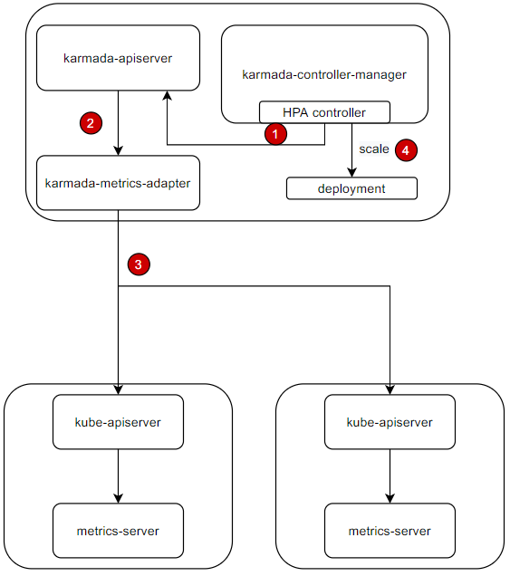
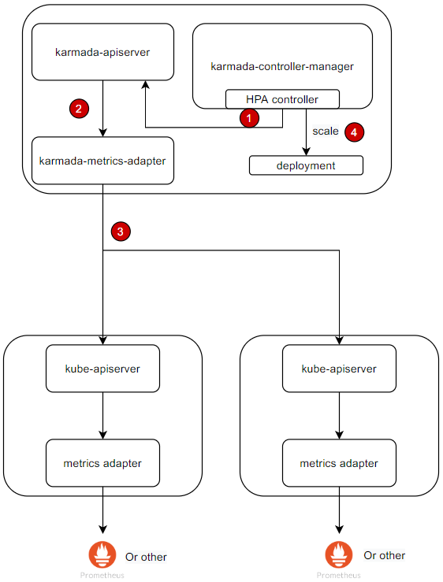
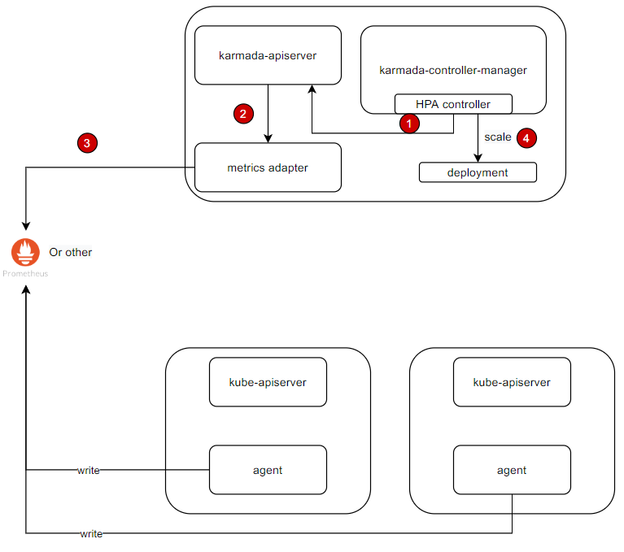

# FederatedHPA
## Summary

<!--
This section is incredibly important for producing high-quality, user-focused
documentation such as release notes or a development roadmap. 

A good summary is probably at least a paragraph in length.
-->

Horizontal Pod Autoscaling (HPA) is a popular method for stabilizing applications by adjusting the number of pods based on different metrics. However, in single cluster, the scaling fail recovery couldn't be handled. Also, in the era of multi-clusters, single cluster HPA may not meet the growing requirements, including scaling across clusters, unified HPA configuration management, high availability of scaling function, and limiting resource/costs thresholds in multiple clusters.

To address these issues, this proposal introduced FederatedHPA to Karmada. This solution could scale applications across multiple clusters and improve the overall scaling threshold, stability and usage of their Kubernetes clusters.

## Motivation

<!--
This section is for explicitly listing the motivation, goals, and non-goals of
this KEP.  Describe why the change is important and the benefits to users.
-->

In the current era of single clusters, Horizontal Pod Autoscaling (HPA) is commonly used to dynamically scale workload replicas to handle incoming requests and enhance resource utilization. Therefore, in the era of multi-clusters, HPA should still work and be capable of scaling the workloads in different member clusters, to resolve resource limitations for a single cluster and improve scaling fail recovery capabilities.  

By introducing FederatedHPA to Karmada, users can enable various scenarios with rich policies in PropagationPolicy. For instance, the scaled up workloads may be scheduled to the clusters with more resources. FederatedHPA provides greater flexibility over workload scaling across multiple clusters.

### Goals

<!--
List the specific goals of the KEP. What is it trying to achieve? How will we
know that this has succeeded?
-->

1. Manage the HPA resource in a unified manner across clusters. 
2. Scaling workloads across multiple clusters with FederatedHPA and rich policies in PropagationPolicy.
3. Support both Kubernetes HPA(CPU/Memory) and customized HPA(customized metrics).
4. Propose the implementation ideas for involved components, including `karmada-controller-manager` and `karmada-metrics-adapter`.

### Non-Goals

<!--
What is out of scope for this KEP? Listing non-goals helps to focus discussion
and make progress.
-->

1. The FederatedHPA is solely focused on scaling replicas, while the scheduling of these replicas to a specific cluster is determined by the schedule component. In other words, PropagationPolicy will be used to schedule the workloads to the clusters, such as schedule the workloads to high priority cluster first.

## Proposal

<!--
This is where we get down to the specifics of what the proposal is.
This should have enough detail that reviewers can understand exactly what
you're proposing, but should not include things like API designs or
implementation. What is the desired outcome and how do we measure success?
The "Design Details" section below is for the real
nitty-gritty.
-->

### User Stories(Optional)

<!--
Detail the things that people will be able to do if this KEP is implemented.
Include as much detail as possible so that people can understand the "how" of
the system. The goal here is to make this feel real for users without getting
bogged down.
-->

#### Story 1
As a user, I have HPA in each cluster for one application. Since it's quite complex and redundant to manage them separately, I expect to be able to config and manage the HPA resource in a unified manner.

#### Story 2
As a user, I deploy my application in multiple clusters. Since the application's load may change with the incoming requests, I expect to be able to scale up or down the workloads across clusters with rich policies to achieve different goals, such as:
* If I have two clusters, A and B, with A having more resources and B having fewer, then I hope to be able to configure more instances to be scaled up in cluster A to improve overall resource utilization across multiple clusters.

#### Story 3
As a user, I deploy my service with HPA in a single cluster. Since this cluster may scale fail because of single cluster limitation, such as resource limitations, which will cause the service unavailable if requests too many, so I expect to improve the scaling stability of the service with scaling across clusters.

#### Story 4
As a user, I deploy my application with HPA in multiple clusters. Since the unlimited scaling up of the application may lead to unexpected cloud costs and resource congestion that may cause service disruptions for other applications, so I expect to set the maximum number of instances for multi-cluster applications.

### Notes/Constraints/Caveats (Optional)

<!--
What are the caveats to the proposal?
What are some important details that didn't come across above?
Go into as much detail as necessary here.
This might be a good place to talk about core concepts and how they relate.
-->

1. The workloads/pods in different member clusters selected by the same HPA CR/resource share the load of the application equally. For example, 10 pods of the application are spread into two member clusters with distribution `cluster1: 3 pods, cluster2: 7 pods`, so the 3 pods in cluster1 take 3/10 of total requests and 7 pods in cluster2 take 7/10 of total requests. Scenarios that don't meet the restriction are not considered in this proposal.
2. If the system does not meet the first requirement, some clusters' services may become overloaded while others remain underloaded.      

### Risks and Mitigations

<!--
What are the risks of this proposal, and how do we mitigate them? 

How will security be reviewed, and by whom?

How will UX be reviewed, and by whom?

Consider including folks who also work outside the SIG or subproject.
-->

1. The HPA used in a single cluster can be seamlessly migrated to multiple clusters' FederatedHPA.

## Design Details
### Architecture
For different scenarios, the architecture may be different:  

#### HPA with CPU/Memory metrics
  
The steps are described as follows:
1. HPA controller query metrics via metrics API `metrics.k8s.io` with label selector periodically.
2. `karmada-apiserver` get the metrics API query, and it will route to `karmada-metrics-adapter` via API service registration.
3. `karmada-metrics-adapter` always list&watch the member clusters' pods, when the requests come, it could query the metrics from the target clusters(where the pod exists). After the metrics are collected, it will aggregate them and return it.
4. HPA controller will calculate the desired replicas based on metrics and scale the workload directly.


**HPA with custom metrics**:  
  
The steps are described as follows:
1. HPA controller query metrics via metrics API `custom.metrics.k8s.io` with label selector periodically.
2. `karmada-apiserver` get the metrics API query, and it will route to `karmada-metrics-adapter` via API service registration.
3. `karmada-metrics-adapter` always list&watch the member clusters' pods, when the requests come, it could query the metrics from the target clusters(where the pod exists). After the metrics are collected, it will aggregate them and return it.
4. HPA controller will calculate the desired replicas based on metrics and scale the workload directly.


**HPA with multi-cluster metrics store**:  
  
1. HPA controller query metrics via metrics API `metrics.k8s.io` or `custom.metrics.k8s.io` with label selector periodically.
2. `karmada-apiserver` get the metrics API query, and it will route to `metrics-adapter` via API service registration.
3. `metrics-adapter` query the metrics from the managed metrics store and return it.
4. HPA controller will calculate the desired replicas based on metrics and scale the workload directly.

Note:  
1. How to find the target clusters?  
   `karmada-metrics-adapter` uses different informer to build the lister cache for each member cluster. When the request comes, it could find out the target clusters by querying the resource from all the clusters' lister cache, so if there are the matched resource, the related clusters is the one of the target clusters.  

From the above architecture, we can get following information:
* FederatedHPA controller is located in `karmada-controller-manager` component, which will query metrics from `karmada-apiserver` with metrics API and scale the deployments.
* `karmada-metrics-adapter` is responsible for query metrics from member clusters and do aggregation.
* FederatedHPA only responsible for scaling instances but doesn't care where the instances will be scheduled.

For better user experience and easy to extend the API in the future, we defined the API as follows:
```go
// FederatedHPA is a centralized HPA aggregator that can aggregate the metrics in multiple clusters.
// When the system load increases, it will query the metrics from multiple clusters and scales up the replicas.
// When the system load decreases, it will query the metrics from multiple clusters and scales down the replicas.
// After the replicas are scaled up/down, karmada-scheduler will schedule the replicas based on the policy.
type FederatedHPA struct {
	metav1.TypeMeta
	metav1.ObjectMeta

	// Spec is the specification of the FederatedHPA.
	// +required
	Spec FederatedHPASpec `json:"spec"`

	// Status is the current status of the FederatedHPA.
	// +optional
	Status autoscalingv2.HorizontalPodAutoscalerStatus `json:"status"`
}

// FederatedHPASpec describes the desired functionality of the FederatedHPA.
type FederatedHPASpec struct {
	// ScaleTargetRef points to the target resource to scale, and is used to
	// the pods for which metrics should be collected, as well as to actually
	// change the replica count.
	// +required
	ScaleTargetRef autoscalingv2.CrossVersionObjectReference `json:"scaleTargetRef"`

	// minReplicas is the lower limit for the number of replicas to which the autoscaler
	// can scale down.  It defaults to 1 pod.  minReplicas is allowed to be 0 if the
	// alpha feature gate HPAScaleToZero is enabled and at least one Object or External
	// metric is configured.  Scaling is active as long as at least one metric value is
	// available.
	// +optional
	MinReplicas *int32 `json:"minReplicas,omitempty" protobuf:"varint,2,opt,name=minReplicas"`

	// maxReplicas is the upper limit for the number of replicas to which the autoscaler can scale up.
	// It cannot be less that minReplicas.
	MaxReplicas int32 `json:"maxReplicas" protobuf:"varint,3,opt,name=maxReplicas"`

	// Metrics contains the specifications for which to use to calculate the
	// desired replica count (the maximum replica count across all metrics will
	// be used). The desired replica count is calculated multiplying the
	// ratio between the target value and the current value by the current
	// number of pods. Ergo, metrics used must decrease as the pod count is
	// increased, and vice-versa. See the individual metric source types for
	// more information about how each type of metric must respond.
	// If not set, the default metric will be set to 80% average CPU utilization.
	// +optional
	Metrics []autoscalingv2.MetricSpec `json:"metrics,omitempty"`

	// Behavior configures the scaling behavior of the target
	// in both Up and Down directions (scaleUp and scaleDown fields respectively).
	// If not set, the default HPAScalingRules for scale up and scale down are used.
	// +optional
	Behavior *autoscalingv2.HorizontalPodAutoscalerBehavior `json:"behavior,omitempty"`
}
```

### Components change

#### karmada-controller-manager  
In order to make HPA scaling work, HPA controller should be implemented in `karmada-controller-manager`, and the logic will follow the original implementation in `kube-controller-manager`. But the formula to calculate the desired replicas is different.  
* In original implementation, the desired replicas is: `desiredReplicas = ceil[currentReadyReplicas * ( currentMetricValue / desiredMetricValue )]`, `currentReadyReplicas` is all ready pods in a single clusters. 
* In Karmada, the desired replicas of the template in Karmada control plane is: `desiredReplicas = ceil[currentReadyReplicas * ( currentMetricValue / desiredMetricValue )]`, and the `currentReadyReplicas` is `currentReadyReplicas = readyPodsNumberInAllMemberClusters  * (templateReplicas / sumPodsNumber)`.  
  If we use the following configuration(Duplicated):
  ```yaml
  #Deployment yaml
  apiVersion: apps/v1
  kind: Deployment
  metadata:
    name: nginx
    labels:
      app: nginx
  spec:
    replicas: 2
    selector:
      matchLabels:
        app: nginx
    template:
      metadata:
        labels:
          app: nginx
      spec:
        containers:
          - image: nginx
            name: nginx
  ---
  #PropagationPolicy yaml
  apiVersion: policy.karmada.io/v1alpha1
  kind: PropagationPolicy
  metadata:
    name: nginx-propagation
  spec:
    resourceSelectors:
      - apiVersion: apps/v1
        kind: Deployment
        name: nginx
    placement:
      clusterAffinity:
        clusterNames:
          - member1
          - member2
      replicaScheduling:
        replicaSchedulingType: Duplicated
  ---
  #FederatedHPA yaml
  apiVersion: autoscaling.karmada.io/v1alpha1
  kind: FederatedHPA
  metadata:
    name: nginx
  spec:
    scaleTargetRef:
      apiVersion: apps/v1
      kind: Deployment
      name: nginx
    minReplicas: 1
    maxReplicas: 10
    metrics:
      - type: Resource
        resource:
          name: cpu
          target:
            type: Utilization
            averageUtilization: 10
   ```
  With this configuration, cluster member1/member2 will both have 2 replicas. If the current utilization is 20%, so the desired replicas will be: (4 *(2/4)) * (20%/10%) = 4. So the nginx-deployment replicas in Karmada control plane will be scaled to 4.  And there will be 4 replicas in both cluster member1/member2.

  If we use the following configuration(Divided):
  ```yaml
  #Deployment yaml
  apiVersion: apps/v1
  kind: Deployment
  metadata:
    name: nginx
    labels:
      app: nginx
  spec:
    replicas: 2
    selector:
      matchLabels:
        app: nginx
    template:
      metadata:
        labels:
          app: nginx
      spec:
        containers:
          - image: nginx
            name: nginx
  ---
  #PropagationPolicy yaml
  apiVersion: policy.karmada.io/v1alpha1
  kind: PropagationPolicy
  metadata:
    name: nginx-propagation
  spec:
    resourceSelectors:
      - apiVersion: apps/v1
        kind: Deployment
        name: nginx
    placement:
      clusterAffinity:
        clusterNames:
          - member1
          - member2
      replicaScheduling:
        replicaSchedulingType: Divided
        weightPreference:
          staticWeightList:
            - targetCluster:
                clusterNames:
                  - member1
              weight: 1
            - targetCluster:
                clusterNames:
                  - member2
              weight: 1
  ---
  #FederatedHPA yaml
  apiVersion: autoscaling.karmada.io/v1alpha1
  kind: FederatedHPA
  metadata:
    name: nginx
  spec:
    scaleTargetRef:
      apiVersion: apps/v1
      kind: Deployment
      name: nginx
    minReplicas: 1
    maxReplicas: 10
    metrics:
      - type: Resource
        resource:
          name: cpu
          target:
            type: Utilization
            averageUtilization: 10
  ```
  With this configuration, cluster member1/member2 will both have 1 replicas. If the current utilization is 20%, so the desired replicas will be: (2 *(2/2)) * (20%/10%) = 4. So the nginx-deployment replicas in Karmada control plane will be scaled to 4. And 2 replicas will be scheduled to member1, and another 2 replicas will be scheduled to member2.  

Also， the following edge case should be considered:
* If one cluster loses connection with Karmada control plane,  the HPA controller will ignore the pod in this cluster.
For example， there are 2 member clusters, A(lose connection) and B. There are 10 pods in cluster A, 30 pods in cluster B. So the target replicas will be: `(30 pods average utilization / target utilization) * 30`.


#### karmada-metrics-adapter
To query metrics from member clusters, Karmada introduces a new component called `karmada-metrics-adapter` which is responsible for the following tasks:  
* Registering the metrics API service including metrics.k8s.io, custom.metrics.k8s.io, and external.metrics.k8s.io.
* When a query is received from apiserver, the `karmada-metrics-adapter` will query the member clusters and perform aggregation.

Note: For pull mode clusters, users need to provide a method to connect the network between the Karmada control plane and the member cluster, so that `karmada-metrics-adapter` can access this member cluster, such as via [ANP](https://karmada.io/docs/next/userguide/clustermanager/working-with-anp/).

### Story Solution
I have two clusters, A and B, A has 100 available pods and B has 50 available pods. What I expect is:
1. Set the min/max replicas for the sum of the pods in cluster A and B. - (meets story 1/4)
2. When cluster B goes down, the scaled replicas in B will be migrated to A and the new scaled replicas will be scheduled to A. - (meets story 3)
3. When the replicas are scaled up, 2/3 of the replicas will be scheduled to A, 1/3 of the replicas will be scheduled to B. - (meets story 2)

So the following example configuration could meet the requirements:
```yaml
apiVersion: autoscaling.karmada.io/v1alpha1
kind: FederatedHPA
metadata:
  name: nginx-hpa
spec:
  scaleTargetRef:
    apiVersion: apps/v1
    kind: Deployment
    name: nginx
  minReplicas: 1
  maxReplicas: 60
  metrics:
  - type: Resource
    resource:
      name: cpu
      target:
        type: Utilization
        averageUtilization: 50
---
apiVersion: policy.karmada.io/v1alpha1
kind: PropagationPolicy
metadata:
  name: nginx-propagation
spec:
  resourceSelectors:
    - apiVersion: apps/v1
      kind: Deployment
      name: nginx
  placement:
    clusterAffinity:
      clusterNames:
        - A
        - B
    replicaScheduling:
      replicaDivisionPreference: Weighted
      replicaSchedulingType: Divided
      weightPreference:
        dynamicWeight: AvailableReplicas
---
apiVersion: apps/v1
kind: Deployment
metadata:
  name: nginx
...
```
* With this configuration, the pods' number of nginx deployment in clusters will be limited between 1 and 60.
* When the Karmada HPA controller scales up the nginx deployment, let's say to 15 pods, `karmada-scheduler` will schedule 10 of those pods to cluster A and 5 of them to cluster B.
* When the Karmada HPA controller scales down the nginx deployment, for instance by reducing 15 pods, `karmada-scheduler` will scale down 10 pods in cluster A and 5 pods in cluster B.
* When cluster A goes down, the replicas will be migrated to cluster B by `karmada-scheduler`.

### High Availability
To maintain high availability for FederatedHPA, the Karmada control plane should be deployed in a highly available manner, such as across multiple zones. If the Karmada control plane fully goes down, workloads can no longer be scaled.

## Development Plan
This feature is should be implement in three stages:
1. Implement HPA controller in `karmada-controller-manager` to scale the workloads based on CPU/Memory metrics.
2. Implement `karmada-metrics-adapter` to query metrics from member clusters and perform aggregation.
3. Implement scaling the workload based on custom metrics and external metrics.
4. Complete documentation for the 3 deployment modes.

## Test Plan
1. All current testing should be passed, no break change would be involved by this feature.
2. Add new E2E test cases to cover the new feature.
   1. Scaling across clusters with different PropagationPolicy, including scaling up/down.
   2. Scaling across clusters with different metrics.
   3. Scaling across clusters with different architecture.

## Alternatives  
As per the above content, it is evident that this implementation follows a centralized HPA approach. The alternative will be a decentralized HPA, and it will be described in another proposal.
**The function difference is:**  
|                            | Decentralized HPA         |  Centralized HPA   |
| -------------------------- | ------------------------- | -------------------- |
| Karmada control plane load | Low<sup>[1]</sup>         | High<sup>[2]</sup>               |
| Bandwidth requirement      | Low<sup>[3]</sup>         | High<sup>[4]</sup>               |
| Scaling Accuracy           | Low<sup>[5]</sup>         | High<sup>[6]</sup>               |
| Scaling strategy           | Prioritized<sup>[7]</sup> | Follow Policy<sup>[8]</sup> |

* [1] The process of replicas calculation is down by member clusters, so the load of Karmada control plane is relative low.
* [2] The process of replicas calculation is down by Karmada control plane, so the load of Karmada control plane is relative high.
* [3] Karmada control plane doesn't need to query metrics from member clusters, so the bandwidth requirement is relative low.
* [4] Karmada control plane needs to query metrics from member clusters, so the bandwidth requirement is high.
* [5] The scaling operation is down by member clusters, and the member cluster cannot see the resources of other clusters, and scaling will be relative rough.
* [6] The scaled replicas scheduling based on the real-time state of member clusters, so the scaling will be very precise and accurate.
* [7] The API definition of Decentralized HPA only provides priority scaling policy.
* [8] The scaling strategy will follows the PropagationPolicy, duplicated, staticWeighted, dynamicWeighted and aggregated.

**The dependency difference is:**
|                                                                 | Decentralized HPA |  Centralized HPA   |
| --------------------------------------------------------------- | ----------------- | ----------------- |
| HPA controller is enabled in member clusters                    | Yes<sup>[1]</sup> | No<sup>[2]</sup>  |
| `karmada-metrics-adapter` is installed in Karmada control plane | No<sup>[3]</sup>  | Yes<sup>[4]</sup> |
* [1] Decentralized HPA will propagate HPA resource to member clusters and the scaling operation is executed by member clusters, so HPA controller should be enabled in member clusters.
* [2] Centralized HPA will scale the deployment and the replicas will be scheduled to member clusters, so HPA controller doesn't need to be enabled in member clusters.
* [3] The HPA controller of member clusters will query metrics in member clusters, and the metrics aggregation is not needed, so `karmada-metrics-adapter` doesn't need to be installed.
* [4] Karmada control plane will query metrics from all member clusters, the aggregation is needed, so `karmada-metrics-adapter` needs to be installed.

**The recommendation:**  
The first point is resources' limitation:
* If the bandwidth is limited and the application has a large scale, you have to choose decentralized HPA.
* If the bandwidth is enough big, you can use centralized HPA or decentralized HPA.

The second point is scaling strategy's limitation:
* If you want to scale the workload in a prioritized order, you have to choose decentralized HPA.
* If you want to scale the workload with the policy defined in PropagationPolicy, you have to choose centralized HPA.
