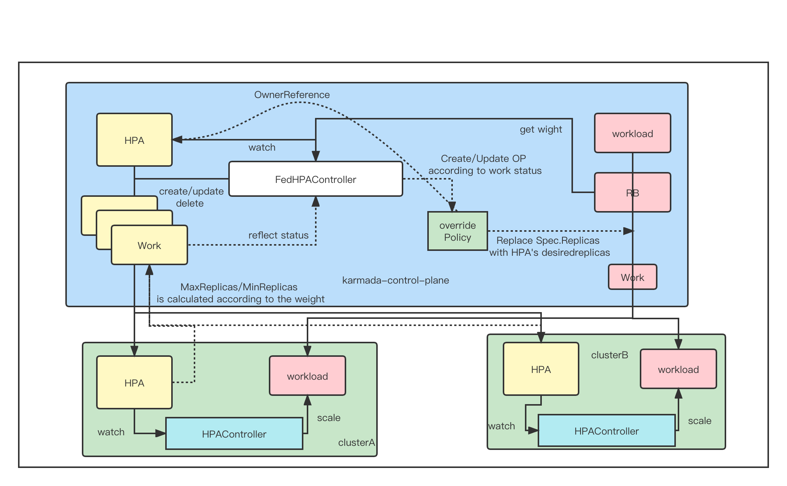

# Federated HPA
## Summary

HPA is a widely used approach to improve the stability of apps dealing with burst of request and resource utility. We can run our apps on multiple clusters as easy as a single cluster with Karmada, but Karmada lacks the HPA support now.
This proposal introduces a new component FederatedHPA to Karmada and enables Karmada to autoscale workloads across clusters. It also tries to minimize the differences of the user experience between HPA on a single cluster.


## Motivation

If the user uses karmada, then the HPA function of k8s is completely useless to the user, and the HPA function is a very commonly used function, as a user cannot accept this reality

### Goals

1. Bring HPA from single cluster to multiple clusters.
1. Compatible with the HPA related resources in the single cluster.
1. Tolerate the disaster of member cluster or karmada control plane.
1. It is better to integrate well with the scenarios such as workloads shifting and cloud burst.
1. It is better to support both Kubernetes HPA and customized HPA.

### Non-Goals


## Proposal

<!--
This is where we get down to the specifics of what the proposal actually is.
This should have enough detail that reviewers can understand exactly what
you're proposing, but should not include things like API designs or
implementation. What is the desired outcome and how do we measure success?.
The "Design Details" section below is for the real
nitty-gritty.
-->

### User Stories (Optional)
#### Story 1
For a platform developer using Kubernetes, now I want to use Karmada to run apps on multiclusters. But the CD ecosystem is built based on the single cluster and the original HPA is heavilly used. So I want to migrate the HPA resources to multiclusters without too much efforts. It is better to be compatible with the schema of HPA used in single cluster.

#### Story 2
For an application developer, I create a HPA CR for the application running on Karmada with FederatedHPA enabled.
```
target cpu util 30%
min replica 3
max replica 100
```
Suddenly, one of the member clusters which my application running on stops working and can't scale up new pods. Unfortunately, a request burst is coming into the application. The CPU util of pods becomes higher than 30%. It will need 100 Pods totally to take the request burst. I hope the Karmada FederatedHPA can scale up new pods in other healthy clusters.

#### Story 3
As an administrator of the Karmada&Kubernetes platform, I receive an alert that the Karmada control plane stops working and any requests to the Karmada control plane are failed. There are many applications running on the platform heavilly depend on the HPA to handle the unpredictable burst of requests. The chance of RCA occurred becomes really high if the system can't tolerate the failure of federation control plane. So I hope the Karmada FederatedHPA can scale in the member clusters even if the Karmada control plane is down.

###
### Notes/Constraints/Caveats (Optional)


### Risks and Mitigations


## Design Details
### Architecture



```text
1. federated-hpa contrller 根据一个 hpa，创建 一个 带有 federatedhpa.karmada.io 标签的 work，work 会在 member 集群创建一个 hpa，同时收集hpa 的状态
2. federated-hpa contrller 一直 watch 带有federatedhpa.karmada.io 标签的 work. 然后根据work status的 ManifestStatuses 中的 hpa conditions 去判断，判断条件如下
   2.1 如果 conditions中有 有类型 为 "AbleToScale"，且status为 True, 且 Reason 为  "SucceededRescale", "ScaleDownStabilized", "ScaleUpStabilized", "ReadyForNewScale", 那么就根据 status.desiredReplicas 来扩容/缩容 (扩容/缩容方案 后面有描述)
   2.2 其他情况不做任何处理 ( 意味着不会创建 op )
3. federated-hpa contrller 根据 hpa 中的 ScaleTargetRef 来查找 扩容/缩容 的对象的 RB (因为RB.TargetCluster 的 Replicas 自带权重信息)

4. hpa 中 MinReplicas，MaxReplicas 的分配
   4.1 因为 RB.TargetCluster 的Replicas 自带权重信息
   4.2 如果 MaxReplicas 大于 RB 的cluster数量，则 MaxReplicas 按照 权重 进行分配，
   4.3 如果 MaxReplicas 小于等于 RB 的cluster数量，则RB的每一个cluster 都分配 1
   4.4 如果 MinReplicas 等于小于 RB 中的cluster个数 ，则RB的每一个 cluster 都分配 1
   4.5 如果 MinReplicas 大于 RB 中的cluster个数，则按照权重分配


5. 扩容/缩容对象三种方案
   方案一  直接修改(或者通过 scale 子资源) 扩容/缩容对象的 spec.Replicas，重新触发调度。                 问题： karmada调度器并不知道把这个扩容/缩容应用到哪一个成员集群，且与 调度器尽量将workload调度到资源更加多的集群的目标相违背. 
   方案二  直接修改 work 对象的Manifests中的 spec.Replicas 字段                                     问题： 会被 RB 重新修正           
   方案三  创建一个 OP ，使用 op 的 replace 来修改 workload 的 spec.Replicas                        问题： 系统中会多一个 op ，且 karmada 中的 workload 的 spec.Replicas 不会像单集群一样会在扩容时增加，缩容时减小（ karmada 会 aggregate workload 的 Status ）
   
   
   综上 方案三(本提案的核心原理) 兼容性最高
   

6. 兼容现有hpa
   6.1 federated-hpa contrller 只处理 带有 federatedhpa.karmada.io/enabled=true 标签的 hpa

7. 污点
   7.1 如果 子集群 在 federated-hpa contrller 调度完成，再增加了 NoExecute 污点,那么 karmada 会将集群上的 workload 驱除，与之对应的work，也会被删除,而由 federated-hpa contrller 创建的 work 不受调度器管控，而不会被删除.


8. 扩容/缩容流程
   8.1 如果 member 成员集群的 HPA 检查到 需要扩容/缩容时，会将 workload 的副本数填充到 HPA.Spec.Status.DesiredReplicas 中
   8.2 karmada work 会实时收集 hpa 的status ，然后将状态保持到 work status的 ManifestStatuses
   8.3 federated-hpa contrller 观察到 work的 status 发生了变化，读取其中的ManifestStatuses
   8.4 federated-hpa contrller 根据 ManifestStatuses中的 DesiredReplicas 计算需要扩容/缩容的大小
   8.5 federated-hpa contrller 根据 计算出的 扩容/缩容的大小 创建一个使用 replace 方法 的 OP去修改 workload 1⃣以达到 扩容/缩容 的目的
   8.6 member集群原生的 HPA controller 检查 workload 副本数满足预期，停止扩容/缩容


9. HPA 版本支持
   9.1 目前能支持 v2beta1, v2beta2, v2 版本， 不支持 v1, 因为 v1 中都没有 Conditions 字段

10. CRD 支持
   10. 对于 CRD 资源不能直接修改 spec.Replicas 字段，因为有可能没有这个字段。
       所以对于 CRD 资源，我们应该读取 CRD 定义中 subresources.scale.specReplicasPath 得到 可以扩容/缩容的字段.

11. OP 的删除机制
   11.1 当用户主动在控制面修改 workload 的副本数时，发现成员集群的副本数并不会增加。原因是 federated-hpa contrller 创件得 OP 是 使用replace 方法
        只要这个 OP 存在，无论用户如何修改副本数，成员集群的副本数都不会增加。因此需要引入一个OP的删除机制 
   11.2 federated-hpa contrller 创建 OP 时， OwnerReference 设置为 HPA. 这样删除 hpa,OP 被自动删除
 
遗留问题：

12. 触发 ScalingLimited  
   12.1 如果member集群触发了 ScalingLimited ， 用户设置了MaxReplicas 100 个， 
       但是因为权重，只给 member 集群 设置 了 10 MaxReplicas， 此时这个集群负载较高，很快将扩容到 10个，而其他集群也还没有达到 MaxReplicas 限制，
       此时用户如何处理？ 
       
   12.2 是否需要一个配置项，提供配置 MinReplicas，MaxReplicas 的分配方式？  是基于权重权重算法，还是基于其他算法 （提供类似 pp 中的不同调度类型） ？
   
   12.3 karmada 支持对同个资源应用多个 OP ，那么 federated-hpa contrller 创建的 OP 和 用户创建的 OP 是否有优先级顺序？
   
   12.4 当 OP 选中的那个 workload 的 spec.Replicas 字段发生变化时。 删除 OP 。即当 federated-hpa contrller 创建 OP 成功后，
        federated-hpa contrller 会创建一个 informer 来 watch 这个 workload ，如果 workload 的 spec.Replicas 字段发生变化，则立刻删除 OP
        删除 OP 后，会触发building contrller重新调协，然后将 workload 重新分发到 member 集群，
        然后 member 集群的HPA,观察到变化，修改自身的status，进而触发  federated-hpa contrller 调协.
```
### Test Plan


## Alternatives
