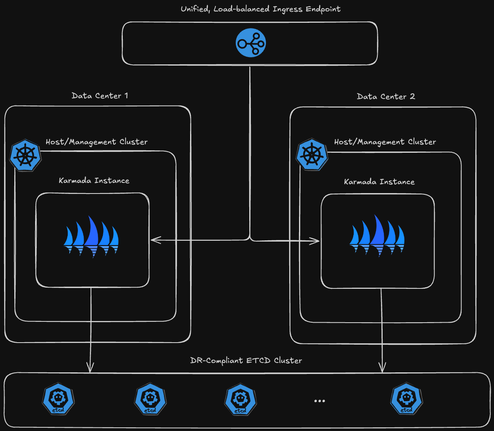

# Support Custom CA Certificate for Karmada Control Plane

## Summary

This proposal aims to extend the Karmada operator with support for custom CA certificates in managed Karmada control planes. By allowing users to provide their own CA certificate,
this feature enables multi-data center redundancy for critical Karmada deployments and aligns with organizational policies around disaster recovery (DR). This capability
is especially important for cases where a managed Karmada control plane is stretched across multiple management clusters that span multiple data centers and shares an underlying etcd instance, requiring the control plane instances to have a unified CA.

## Motivation

In high-availability scenarios where Karmada control planes power mission-critical workloads, ensuring that each managed control plane adheres to strict organizational policies around availability
and disaster recovery is essential. Deploying control planes across multiple management clusters that span multiple data centers provides redundancy and resilience in the event of a data center outage. 
However, when multiple control plane instances must access a shared etcd instance and present a unified API endpoint, using a common CA certificate across instances is necessary as the same CA should be used to verify client certificates. 
By enabling users to specify a custom CA certificate, this feature ensures that control planes spanning data centers function as a cohesive unit while meeting security and availability standards.

### Architecture Overview


### Goals

- Allow users to specify a custom CA certificate which is used to sign the Karmada API Server certificate and for verifying client certificates.
- Ensure that control plane instances deployed across multiple management clusters that span multiple data centers use the same CA, enabling secure and seamless cross-data center communication.
- Enable operators to align Karmada control plane PKI with organizational policies for high availability and security.

### Non-Goals

- Change the default behavior of the Karmada operator when no custom CA is provided.
- Alter the process of how control planes are connected to etcd.
- Address custom CA requirements for other concerns such as PKI for an in-cluster ETCD instance or front proxy communications.

## Proposal

The proposal introduces a new optional field, `CustomCertificate`, in the `KarmadaSpec`, where users can specify a custom CA certificate for the Karmada control plane. 

### API Changes

```go
// KarmadaSpec is the specification of the desired behavior of the Karmada.
type KarmadaSpec struct {
   // CustomCertificate specifies the configuration to customize the certificates
   // for Karmada components or control the certificate generation process, such as
   // the algorithm, validity period, etc.
   // Currently, it only supports customizing the CA certificate for limited components.
   // +optional
   CustomCertificate *CustomCertificate `json:"customCertificate,omitempty"`
}

// CustomCertificate holds the configuration for generating the certificate.
type CustomCertificate struct {
   // APIServerCACert references a Kubernetes secret containing the CA certificate
   // for component karmada-apiserver.
   // The secret must contain the following data keys:
   // - tls.crt: The TLS certificate.
   // - tls.key: The TLS private key.
   // If specified, this CA will be used to issue client certificates for
   // all components that access the APIServer as clients.
   // +optional
   APIServerCACert *LocalSecretReference `json:"apiServerCACert,omitempty"`
}
```
### User Stories

#### Story 1
As a cloud infrastructure architect, I want to deploy a highly available managed Karmada control plane across multiple management clusters that span multiple data centers to meet disaster recovery requirements. 
By deploying the managed control plane instances using this architecture and configuring them to use the same CA certificate and underlying etcd instance, I can ensure the stretched instance can be securely accessed via a unified, 
load-balanced API endpoint. This setup provides resilience in case of data center outages, adhering to DR requirements and minimizing the risk of service disruption.


### Risks and Mitigations

1. *Incorrect Secret Format*: If the provided CA certificate secret does not follow the required format, the control plane setup may fail.

    - *Mitigation*: The operator will validate the format of the provided secret, ensuring it adheres to the expected format, and return detailed error messages if the configuration is incorrect.

2. *Backward Compatibility*: Introducing a custom CA feature might impact users who do not need or configure this option.

    - *Mitigation*: This feature is fully optional; if no CA is provided, the operator will default to generating one as it currently does, maintaining backward compatibility.

## Design Details

The `CustomCertificate` field in `KarmadaSpec` will allow users to specify the reference to a Kubernetes secret containing a custom CA certificate. During the reconciliation process, the Karmada operator will:

- Check if `CustomCertificate.APIServerCACert` is set.
- If specified:
  - Retrieve the CA certificate and private key from the referenced secret.
  - Use these to generate certificates for the Karmada API server and client components.
- If not specified:
  - Automatically generate certificates as per the operator's default behavior.

This feature requires minimal changes to the reconciliation process and does not impact existing installations that do not specify a custom CA.