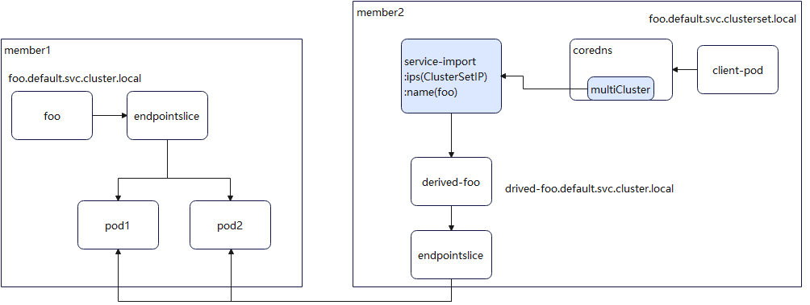

# Remove "derived-" prefix of MCS 

## Summary

As mentioned in [issue-2384](https://github.com/karmada-io/karmada/issues/2384), currently Karmada uses ServiceExport, ServiceImport and other CR to form mcs-controller and manage multi-cluster services. But in the cluster where the service is not located, we need to use a different IP or a service name with a "derived-" prefix to access. We hope to reduce this difference so that different clusters can use the same domain name to access service.

## Motivation

Currently, in different cluster members of Karmada, if you need to access the service across clusters, you need to use different ip or domain names with a "derived-" prefix to access. This will increase the complexity of the user's use. We hope that users can use the same domain name to achieve cross-cluster access.

### Goals

* Keep the original access method. Avoid the need to make modifications to the customer's system after the upgrade.
* Added the use of a unified domain name for cross-cluster access. The domain name is the access domain name of the cluster where the service resides.

### Non-Goals

none

## Proposal

### User Stories

According to the current Karmada's  [mcs configuration](https://karmada.io/docs/userguide/service/multi-cluster-service) , if a service in member1, the user needs to access the service in member1, needs to use the domain name: "serve.default.svc.cluster.local", and the domain name in member2 will be: "derived-serve.default.svc.cluster.local". As a result, when customers use the service, they need to add the prefix "derived-" to access the domain name of the service. This brings additional inconvenience. So I hope to be able to:

1. Provide a unified access method across clusters.

2. The original access method remains unchanged. So that existing business can also work normally.

### Notes/Constraints/Caveats (Optional)

1. The `coreDNS` version must be v1.9.3 or above, and the matching k8s version is at v1.21.0 or above, otherwise the multicluster feature is not supported.

### Risks and Mitigations


## Design Details

### API change

none

### Components change

Here is give the implementation plan:`ServiceImport ` + karmada.

#### 1) Use ServiceImport to generate rr records

This solution is mainly realized by combining the `multicluster` plug-in of `corends`. It is divided into two parts: `coreDNS` transformation and `karmada`. For the `coreDNS`, here is two implementation plan.

##### (1) coreDNS+multicluster

This solution is mainly realized by the `multicluster` plug-in of `corends`.

###### **Principle Description**

In order to adapt to mcs, `coreDNS` launched the [`multicluster`](https://github.com/coredns/multicluster) plug-in. After the plug-in completes the configuration and deployment, it will parse `ServiceImport`. The main content of the analysis is the `name`, `namespace` and `ips`, and an rr record is generated accordingly. Then client pod can cross-cluster access services.

The workflow of the `multicluster` plugin is as follows:



The diagram is explained below:

* Here give a service named `foo` in `member1`. We should use the full domain name: `foo.default.svc.cluster.local` to access this service. But we cannot use the same domain name in `member2`.

* `Karmada` exports the service through `ServiceExport` and imports it into `member2` through `ServiceImport`. At this time, the shadow service `derived-foo` will appear in `member2`. User in `member2` can access to the `foo` service in `member1` by using `derived-foo.default.svc.cluster.local`.

* After the `coreDNS` installed with `multicluster` found the `ServiceImport` had been created, it will analyze `name`, `namespace`, and `ips` fields of the `ServiceImport` and generate the rr records. In this example, the `ips` in `ServiceImport` can be the `clusterIP` of `derived-foo`.

* When the client accesses the service across clusters (the suffix may be different from the local access), `coreDNS` can access it according to the corresponding rr record.

###### Compilation-instructions

According to the documentation on the official website [multicluster plugin](https://github.com/coredns/multicluster). Download `coreDNS`, the corresponding version of k8s 1.26 is v1.9.3 (the latest v1.10.1 is also available):

```shell
git clone https://github.com/coredns/coredns
cd coredns
git checkout v1.9.3
```

* Add multicluster plugin

Open the `plugin.cfg` file and add `multicluster` in it as follow:

```shell
...
kubernetes:kubernetes
multicluster: github.com/coredns/multicluster
...
```

* Execute compilation

```shell
make
```

After the compilation is successful, the corresponding binary will be generated in the root directory.

Mirror making and installation or upgrading please refer to [coreDNS github website](https://github.com/coredns/coredns).

###### Configuration-instructions

The suffix `clusterset.local` is used as an example to illustrate

* Configure coredns permissions in member2

```shell
kubectl edit clusterrole system:coredns
```

Add the following to the end

```yaml
...
- apiGroups:
   - multicluster.x-k8s.io
   resources:
   - serviceimports
   verbs:
   - list
   - watch
```

* Configure multicluster zone rules

Add `multicluster` processing rules to corefile in `coredns`

```shell
kubectl edit configmap coredns -n kube-system
```


```yaml
  ....
    Corefile: |
     .:53 {
         errors
         health {
            lameduck 5s
         }
         ready
         multicluster clusterset.local # Add this line.
         kubernetes cluster.local in-addr.arpa ip6.arpa {
            pods insecure
            fallthrough in-addr.arpa ip6.arpa
            ttl 30
         }
         prometheus:9153
         forward ./etc/resolv.conf {
            max_concurrent 1000
         }
         cache 30
         the loop
         reload
         load balance
     }
...
```

* Configure dns search item "clusterset.local"

**Configure node /etc/resolv.conf file**

Edit the `/etc/resolv.conf` file and add the "clusterset.local" entry to give priority to local services when using the domain name `foo.default.svc`. It is worth reminding that the remote service is only accessed when the local service does not exist, not unavailable. 

```shell
root@btg:/# cat /etc/resolv.conf
search default.svc.cluster.local svc.cluster.local cluster.local clusterset.local
...
```

This configuration method needs to configure the `/etc/resolv.conf` file on the client node. If you don't want to change the node's `resolv.conf` file, you can also use the following method.

**Configure pod's dnsConfig in yaml**

That is, add the configuration item searches of dnsConfig in yaml, and set the value to `clusterset.local`, as shown below:

```yaml
...
       dnsPolicy: ClusterFirst
       dnsConfig:
         searches:
           - clusterset.local
...
```

###### Access method

Since the search function of dns is used, the `foo` service  access method is:

1. `foo.default.svc` access. This method gives priority to local access, and if the local service with the same name is inexistence, it will access the remote cluster service.

2. `foo.default.svc.clusterset.local` full domain name access. The request will go directly to the remote server for processing.

###### Advantages and disadvantages

shortcoming:

1. Using `foo.default.svc` access cannot achieve load balancing. The remote service will only be accessed when the local service is inexistence. Therefore, if you need to achieve local and remote access load balancing, you need to cooperate with other solutions.

2. To use `foo.default.svc`, you need to modify the dns configuration. If you use the `resolv.conf `method, you need to modify the `resolv.conf` file of each possible nodes. If you use the dnsConfig method, you need to modify the yaml or api of the delivered pod.

3. The `multicluster` plug-in cannot be loaded dynamically. Customers need to recompile `coredns` and modify the `coredns` configuration of member clusters.

4. The original access method will be changed. This solution uses different suffixes to distinguish single-cluster Service and multi-cluster Service. Therefore, the access  domain name `foo.default.svc.cluster.local` will become `foo.default.svc.clusterset.local`. Customers need to modify the code to adapt.

advantage:

1. The impact is controllable. No new components will be added. The way `coredns` adds `multicluster` is to comply with the official proposal of `coredns`, and the code is open.

2. The amount of modification is small. It can be done by using the existing code and scheme of `multicluster`.

##### (2) Additional dns server

Similar to submariner's [SERVICE DISCOVERY](https://submariner.io/getting-started/architecture/service-discovery/). It is necessary to develop an extended dns resolver, and install the corresponding plug-in in `coreDNS` to transfer the domain name with the specified suffix (such as `clusterset.local`) to this additional dns resolver. Therefore, the domain name can be resolved by dns.

The workflow of the additional dns server as follows:


The advantages and disadvantages of this method are as follows:

advantage:

1. Load balancing can be achieved. Since the extended dns resolver is customized, customers can achieve load balancing here.

2. Access in the original way can be realized. Rules for local services and remote services can be determined in custom plug-ins. Therefore, the original access method can be maintained, in this case is  `foo.default.svc.cluster.local`.

3. No other configuration of dns is required. Since there is a custom dns resolver, there is no need to configure dns search. Therefore, there is no configuration of dns search in solution one.

shortcoming:

1. The `coreDNS` component needs to be modified. It is also necessary to recompile `coreDNS` in order to install the corresponding plug-ins, and also need to modify the corresponding `coreDNS` configuration.

2. New components need to be deployed in member clusters. This solution requires a dns extension resolver to be installed.

### 2) Karmada adaptation

What needs to be done in the `karmada` part is to fill in the `ips` field of the `ServiceImport` which imported to the member cluster on the existing basis and correspond to the `clusterIP` of `derived-foo`. Its flow diagram is as follows:


As shown in the figure above, we still take the `foo` service as an example. After configuring `coreDNS`, we add the logic to obtain the `derived-foo` service in the cluster members in the ServiceImport-controller of the control plane.

1. Wait for cluster member config the `derived-foo` service's `clusterIP` .

2. The controller of the control plane obtains the value, and fills the value into the work corresponding to the `ServiceImport` of the control plane.

3. According to the synchronization principle of `Karmada`, the `ServiceImport` object in the member cluster will be filled with the `clusterIP` value of `derived-foo`.

That is, the effect of `ServiceImport` after completion needs to be:

```yaml
apiVersion: multicluster.x-k8s.io/v1alpha1
kind: ServiceImport
metadata:
   name: foo
   namespace: default
spec:
   type: ClusterSetIP
   ports:
   - name: "http"
     port: 80
     protocol: TCP
   ips:
   - "10.10.0.5" # clusterIP for cross-cluster access
```

### 3) Suggested operation

The recommended configuration instructions for the `coreDNS`+`multicluster` plug-in solution are given below.

#### Environment preparation:

A normal Karmada cluster, and can perform existing mcs operations.

The following uses the cluster member2 where the client resides as an example to access the `foo`service using the suffix `clusterset.local`. This solution needs to be configured as follows:

#### coredns compile

Refer to subsection [`Compilation-Instructions`](#Compilation-Instructions).

#### coredns configuration

Refer to subsection [`Configuration-instructions`](#Configuration-instructions).

#### Client pod configuration

Taking yaml as an example, you need to add the configuration item searches of dnsConfig in yaml, and set the value to `clusterset.local`. A simple and complete example is as follows:

```yaml
apiVersion: apps/v1
kind: Deployment
metadata:
   name: dns-test
spec:
   replicas: 2
   selector:
     matchLabels:
       app: dns-test
   template:
     metadata:
       labels:
         app: dns-test
     spec:
       containers:
       - name: dns-test
         image: ubuntu:18.04
         command:
         - "/bin/bash"
         - "-c"
         args: [ "while true; do sleep 3; cat /etc/resolv.conf; done" ]
       dnsPolicy: ClusterFirst
       dnsConfig:
         searches:
           -clusterset.local
         options:
           - name: timeout
             value: "2
```

### Test Plan

- All current testing should be passed, no break change would be involved by this feature.

## Alternatives

Here are another two ways I know:

First, using the same service name, not service with`derived-`  prefix on other cluster. More details see  **[bivas](https://github.com/bivas)** 's pr  [proposal for native service discovery](https://github.com/karmada-io/karmada/pull/3694)

Second, install and using [submariner](https://submariner.io/) .
