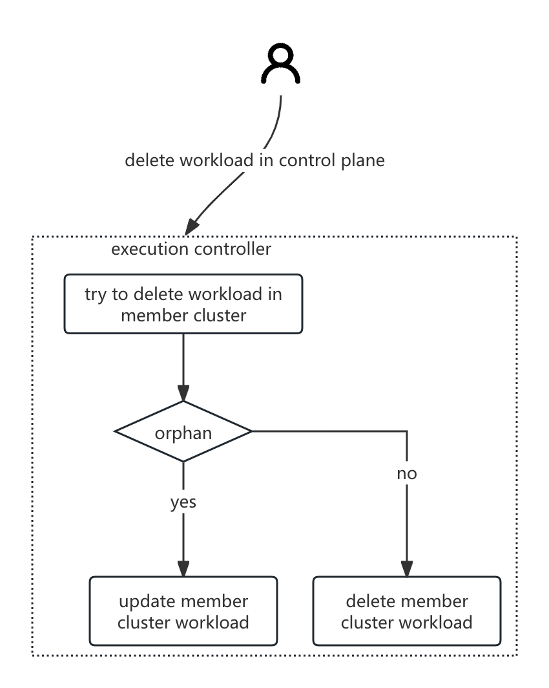

# Migration Rollback Protection

## Summary

Provide a deletion strategy for federated resources, allowing users to choose whether to synchronously delete the workloads in member clusters when deleting workloads at the federation level.

This setting is particularly useful during workload migration scenarios to ensure that rollback can occur quickly without affecting the workloads running on the member clusters.

## Motivation

The current behavior of the Karmada system is that when a user deletes resources from the Karmada control plane, the distributed resources in the member clusters are also deleted synchronously. However, in certain scenarios, such as workload migration scenarios, users may wish to retain the workloads in the member clusters.

### Goals

- Provide the capability to retain resources in member clusters when deleting control plane resources, while at the same time, clean up labels/annotations and other information attached to member cluster resources by the Karmada system.

### Non-Goals

- Define different resource deletion strategies for different member clusters.
- Provide the capability to retain resources in member clusters for Karmada federated resources, such as cronfederatedhpa, federatedhpa, federatedresourcequota, etc.
- Other deletion strategies, such as retaining work objects in the Karmada control plane.
- Cascading deletion control of resources in member clusters.

## Proposal

### User Stories (Optional)

#### Story 1

As an administrator, I hope that during the process of migrating workloads to Karmada, if any unexpected situations arise, such as the cloud platform being unable to publish the application or the Pod encountering unexpected issues, it is necessary to use the rollback mechanism provided by Karmada to immediately revert to the state before the migration in order to quickly stop the loss.

### Notes/Constraints/Caveats (Optional)

- For resources that are not distributed through PropagationPolicy, such as namespace, it is not possible to specify a deletion policy. Unless the controller for automatic resource propagation is disabled, and users are required to propagate resources through PP (PropagationPolicy) / CPP (ClusterPropagationPolicy).
- In one policy vs multi resource scene, we can't execute delete policy just by per resource.

### Risks and Mitigations

## Design Details

### Extend the fields of PropagationPolicy/ClusterPropagationPolicy

By extending the `PropagationPolicy/ClusterPropagationPolicy` API, a new bool field `PreserveResourcesOnDeletion` is introduced. The field will be transparently transmitted to `ResourceBinding/ClusterResourceBinding` and the work object. Finally, the execution controller determines the deletion strategy based on the value of the work field.

#### API changes

PropagationPolicy/ClusterPropagationPolicy
```go
type PropagationSpec struct {
    ...

    // PreserveResourcesOnDeletion controls whether resources should be preserved on the
    // member clusters when the resource template is deleted.
    // If set to true, resources will be preserved on the member clusters.
    // Default is false, which means resources will be deleted along with the resource template.
    //
    // This setting is particularly useful during workload migration scenarios to ensure
    // that rollback can occur quickly without affecting the workloads running on the
    // member clusters.
    //
    // Additionally, this setting applies uniformly across all member clusters and will not
    // selectively control preservation on only some clusters.
    //
    // Note: This setting does not apply to the deletion of the policy itself.
    // When the policy is deleted, the resource templates and their corresponding
    // propagated resources in member clusters will remain unchanged unless explicitly deleted.
    //
    // +optional
    PreserveResourcesOnDeletion *bool `json:"preserveResourcesOnDeletion,omitempty"`
}
```

ResourceBinding/ClusterResourceBinding
```go
type ResourceBindingSpec struct {
    ...

    // PreserveResourcesOnDeletion controls whether resources should be preserved on the
    // member clusters when the binding object is deleted.
    // If set to true, resources will be preserved on the member clusters.
    // Default is false, which means resources will be deleted along with the binding object.
    // This setting applies to all Work objects created under this binding object.
    // +optional
    PreserveResourcesOnDeletion *bool `json:"preserveResourcesOnDeletion,omitempty"`
}
```

Work
```go
// WorkSpec defines the desired state of Work.
type WorkSpec struct {
    ...

    // PreserveResourcesOnDeletion controls whether resources should be preserved on the
    // member cluster when the Work object is deleted.
    // If set to true, resources will be preserved on the member cluster.
    // Default is false, which means resources will be deleted along with the Work object.
    // +optional
    PreserveResourcesOnDeletion *bool `json:"preserveResourcesOnDeletion,omitempty"`
}
```

#### Controller logic changes

The `detector` needs to pass the `PreserveResourcesOnDeletion` from PropagationPolicy/ClusterPropagationPolicy to ResourceBinding/ClusterResourceBinding.

The `binding-controller` needs to pass the `PreserveResourcesOnDeletion` from ResourceBinding to Work.

The `cluster-resource-binding-controller` needs to pass the `PreserveResourcesOnDeletion` from ClusterResourceBinding to Work.

The `execution-controller` needs to perform resource deletion based on the `PreserveResourcesOnDeletion` field in Work.

#### User usage example

Set the cascade deletion policy to orphan:

```yaml
apiVersion: policy.karmada.io/v1alpha1
kind: PropagationPolicy
metadata:
  name: nginx-propagation
spec:
  resourceSelectors:
    - apiVersion: apps/v1
      kind: Deployment
      name: nginx
  preserveResourcesOnDeletion: true
```

#### Q&A:

1. The resource deletion policy of dependent resources and main resources does not force binding.

Since dependent resources may be shared by multiple resource templates, in this case it is difficult to decide which deletion strategy should be used for the dependent resources; it is not forced to be bound to the main resource, and is left to the user to decide, with greater flexibility and scalability.

2. Whether the workload of the member cluster only clears the `karmada.io/managed` label is enough?

Logically, after the label `karmada.io/managed` is cleared, the relationship with karmada is broken.

### Test Plan

TODO

## Alternatives

### Extended by Annotation

#### API changes

A new Annotation is added for users to include on resource templates in the Karmada control plane, with the key value: `resourcetemplate.karmada.io/cascadedeletion`. To increase extensibility, the value is of the string enumeration type, and currently supported types include:
- orphan: Retain resources in member clusters and clean up labels/annotations and other information attached to member cluster resources by the Karmada system.

When users do not specify this annotation, the system's current behavior is to synchronously delete resources in member clusters.

#### Controller logic changes

The `resourcetemplate.karmada.io/cascadedeletion` annotation added by users to the resource template will be propagated to `work.spec.workload.manifests`. When the resource template is deleted, the `execution-controller` will execute the logic for deleting the work object. It can parse the value of the `resourcetemplate.karmada.io/cascadedeletion` annotation from `work.spec.workload.manifests` and perform the following judgment logic:
- If the target annotation does not exist, synchronously delete the resources in the member clusters.
- If the target annotation value is `orphan`, retain the resources in the member clusters and clean up the labels/annotations and other information attached to the member cluster resources by the Karmada system.



#### User usage example

Set the cascade deletion policy to orphan

```yaml
apiVersion: apps/v1
kind: Deployment
metadata:
  annotations:
    propagationpolicy.karmada.io/name: foo
    propagationpolicy.karmada.io/namespace: default
    resourcetemplate.karmada.io/cascadedeletion: orphan
    ...
```

In this approach, there is also a branch idea of adding a `CascadeDeletion` field in the Work API, so there is no need to parse `work.spec.workload.manifests`.

Work
```go
// WorkSpec defines the desired state of Work.
type WorkSpec struct {
    ...

    // CascadeDeletion Declare the cascade deletion strategy. The default value is null, which is equivalent to background.
    // +optional
    CascadeDeletion *CascadeDeletionPolicy `json:"cascadeDeletion,omitempty"`
}
```

The `binding-controller` needs to set the `CascadeDeletion` field in the Work object according the resource annotation.

The `cluster-resource-binding-controller` needs to set the `CascadeDeletion` field in the Work object according the resource annotation.

The `execution-controller` needs to perform resource deletion based on the `CascadeDeletion` field in Work.

> Note: For namespace resources, the `namespace-sync-controller` in the Karmada system automatically propagates each new namespace created by users to member clusters, and the system achieves this functionality by directly generating work objects. For the scheme of adding new API fields in the work, the `namespace-sync-controller` needs to be responsible for processing that field.

#### Advantages & Disadvantages

Disadvantages:
- Using annotations as an API is somewhat informal.

### Extended by adding a new CRD

A new CRD resource is added, through which users define the CR (Custom Resource) of this CRD to describe the resource deletion strategy for the target resource.

#### API changes

```go
type CascadeDeletionPolicy struct {
    metav1.TypeMeta   `json:",inline"`
    metav1.ObjectMeta `json:"metadata,omitempty"`

    // Spec represents the desired cascadeDeletion Behavior.
    Spec CascadeDeletionSpec `json:"spec"`

    // Status represents the status of cascadeDeletion.
    // +optional
    Status CascadeDeletionStatus `json:"status,omitempty"`
}

type CascadeDeletionSpec struct {
    // CascadeDeletion Declare the cascade deletion strategy. The default value is null, which is equivalent to background.
    // +optional
    CascadeDeletion *CascadeDeletionPolicy `json:"cascadeDeletion,omitempty"`
    // ResourceSelectors used to select resources.
    // Nil or empty selector is not allowed and doesn't mean match all kinds
    // of resources for security concerns that sensitive resources(like Secret)
    // might be accidentally propagated.
    // +required
    // +kubebuilder:validation:MinItems=1
    ResourceSelectors []ResourceSelector `json:"resourceSelectors"`
}

// ResourceSelector the resources will be selected.
type ResourceSelector struct {
    // APIVersion represents the API version of the target resources.
    // +required
    APIVersion string `json:"apiVersion"`

    // Kind represents the Kind of the target resources.
    // +required
    Kind string `json:"kind"`

    // Namespace of the target resource.
    // Default is empty, which means inherit from the parent object scope.
    // +optional
    Namespace string `json:"namespace,omitempty"`

    // Name of the target resource.
    // Default is empty, which means selecting all resources.
    // +optional
    Name string `json:"name,omitempty"`

    // A label query over a set of resources.
    // If name is not empty, labelSelector will be ignored.
    // +optional
    LabelSelector *metav1.LabelSelector `json:"labelSelector,omitempty"`
}

type CascadeDeletionStatus struct {
    ...
}
```

Work
```go
// WorkSpec defines the desired state of Work.
    type WorkSpec struct {
    // CascadeDeletion Declare the cascade deletion strategy. The default value is null, which is equivalent to background.
    // +optional
    CascadeDeletion *CascadeDeletionPolicy `json:"cascadeDeletion,omitempty"`

    ...
}
```

#### Controller logic changes

The `binding-controller`/`cluster-resource-binding-controller` checks for the existence of a `CascadeDeletionPolicy` associated with the target resource when creating or updating the Work object. If found, the deletion policy is synchronized into the Work object.

The `execution-controller` carries out resource deletion based on the `CascadeDeletion` field in the Work object.

#### User usage example

Set the cascade deletion policy to orphan:

```yaml
apiVersion: policy.karmada.io/v1alpha1
kind: CascadeDeletionPolicy
metadata:
  name: foo
spec:
  cascadeDeletion: orphan
  resourceSelectors:
    - apiVersion: apps/v1
      kind: Deployment
      name: foo
      namespace: default
```

#### Advantages & Disadvantages

Disadvantages:
- It increases the learning cost for users and results in an increased number of resources in the Karmada control plane.