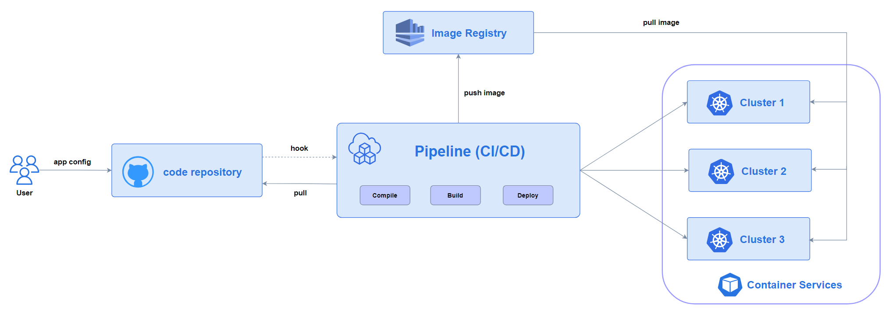

# Proposal of seamless cluster migration

## Summary

- When users migrate a single cluster to multiple clusters, there is a common troublesome problem: how to handle the resources that already exist in the original cluster? In Most scenario, users hope that `Karmada` can maintain the previous running state of existing resources during the process of taking over the original cluster. We refer to this migration method as seamless migration.

- Karmada currently provides two means to migrate resources from existing clusters to `Karmada`，and it is so powerful to meet most scenarios.

- This proposal aims to further optimizing of seamless migration by extending the `Karmada` custom resource API, to meet more scenarios, and to ensure that users are completely unaware during the migration process.

## Motivation

### Scenarios analysis

#### Background 

Typically, the multi cluster deployment process based on CI/CD pipeline for users is shown in the following figure.



However, as the number of clusters increases, lacking management, users hope to migrate to [Karmada](https://karmada.io/docs/) for multi cluster management.

So here comes the problem:  **can the pods that already exist not be affected during the process of migration, which means the relevant container not be restarted?**

#### Current method (for developers)

**Karmada currently provides two means to migrate resources from existing clusters to `Karmada`，and it is so powerful to meet most scenarios.**

**Method one：By command line tool**

Call command like `karmadactl promote deployment xxx -C yyy`, details refer to [karmadactl promote](https://karmada.io/docs/administrator/migration/promote-legacy-workload).


**Method two：By automated configuration**

Manually write the `PropagationPolicy` and `ResourceTemplate` configurations, then add `work.karmada.io/conflict-resolution: overwrite` to the annotation of `ResourceTemplate`, lastly call the API interface of `karmada-apiserver` to apply the configuration.

> the annotation is to indicate if there is a naming conflict resource in member clusters, it will be forced taken over by overwriting the configuration.


These methods both require collaborative intervention from two roles (`User` and `Operator`), if they are all developers, both methods are effective.

So, we define the above two method as "methods for developers".

#### Optimized method (for platform administrators/SREs)

In some particular scenario, what if the `User` and the `Operator` are two independent role：

* The `User` only known kubernetes native resource, he doesn't perceive Karmada and doesn't want to modify the original YAML config.

* Migration is solely the responsibility of the `Operator`, he can only manage Karmada API like `PropagationPolicy`, and completely unaware of the original resources defined by the `User`.

To meet these scenarios, I want to introduce a optimized method：


We define this method as "methods for platform administrators/SREs".

### Goals

Explore how to enable `Karmada`  to achieve seamless cluster migration in a more perfect and universal way, to meet more complex user scenarios and achieve complete user insensitivity?

In detail, we are proposed to extend the API semantics of Karmada custom resources to support declaring how to take over a existing resource when there is a conflict in the member cluster.

## Proposal

1、For custom resources such as `PropagationPolicy` and `ResourceBinding`, add a field called `conflictResolution`. 
The operator can use this field in the `PropagationPolicy` to declare how potential conflict should be handled when a resource that is being propagated already exists in the target cluster.

2、The field `conflictResolution` has the following values:

   * `Overwrite` : means that resolve the conflict by overwriting the resource with the propagating resource template.
   * `Abort`: means that do not resolve the conflict and stop propagating to avoid unexpected overwrites (default value).

It defaults to "Abort" aims to avoid unexpected overwrites. The "Overwrite" might be useful when migrating legacy cluster resources to Karmada,
in which case conflict is predictable and can be instructed to Karmada take over the resource by overwriting.

> Points worth supplementing：for native resources such as `ResourceTemplate`, preserve the `work.karmada.io/conflict-resolution: overwrite` annotation method. 
> Users can add `conflict-resolution` annotations for specific resources in the `ResourceTemplate` to override the `conflictResolution` configuration of the `PropagationPolicy`.

  
### User Stories (Optional)

#### Story 1

For the scenario of [Optimized method](#optimized-method)

The existing method unable to cope with this scenario.

If my proposal implemented, operator can resolve it by writing a `PropagationPolicy` like this:

```yaml
 apiVersion: policy.karmada.io/v1alpha1
 kind: PropagationPolicy
 metadata:
   name: deployments-pp
 spec:
   conflictResolution: Overwrite   ## Add a new field to indicate that when there is a naming conflict resource in the member cluster, it will be taken over by overwriting it
   placement:
     clusterAffinity:
       clusterNames:
       - member1
   priority: 0
   resourceSelectors:
   - apiVersion: apps/v1
     kind: Deployment
   schedulerName: default-scheduler
```

Summary：the pain spot in this scenario is that the operator can only manage the `PropagationPolicy`, however, in my method, he just right only need to add a filed `conflictResolution` to `PropagationPolicy`.

#### Story 2

Suppose there are a thousand `Deployments` need to be forcibly taken over when conflicting.

The existing method can resolve the problem by promote each resource one by one, feasible but inefficient.

If my proposal implemented, operator can resolve it by writing a same `PropagationPolicy` in [Story 1](#Story-1)

Summary：user can use `resourceSelectors` in `PropagationPolicy` to apply the `conflictResolution` configuration to a batch of `Deployments`.

#### Story 3

Assuming that there are many deployments in the original single cluster, users hope that most of the deployments will be directly taken over by `Karmada`, but some special deployments ignore taking over when there are naming conflicts with resources in the member cluster. 

Users only need to add `conflict resolution` annotations in the `ResourceTemplate` for individual special `Deployments` based on the ` PropagationPolicy ` of [Story 1](#Story-1), for example:

```yaml
 apiVersion: apps/v1
 kind: Deployment
 metadata:
   name: nginx-deployment
   annotations:
     work.karmada.io/conflict-resolution: abort   ## Preserve the semantics of the original annotation and display the indication to ignore takeover when there are naming conflicts for resources in the member cluster
 spec:
   selector:
     matchLabels:
       app: nginx
   replicas: 2
   template:
     metadata:
       labels:
         app: nginx
     spec:
       containers:
       - name: nginx
         image: nginx:latest
```

#### Story 4

Similarly, if multiple `Deployment` is defined in one `PropagationPolicy` , and users hope `Karmada` ignoring takeover the conflict `Deployment` by default, but forcing takeover individual specificed conflict `Deployment` :

A feasible practice is to declare `conflictResolution: Abort` in the `PropagationPolicy` (or leave it blank), and annotate `work.karmada.io/conflict-resolution: overwrite` in the `ResourceTemplate`.

### Notes/Constraints/Caveats (Optional)

If the `conflictResolution` field of the `PropagationPolicy` and the `conflict-resolution` annotation of the `ResourceTemplate` are specified in the same time, constraints below should be followed：

1、Priority effectiveness： `conflict-resolution` annotation in `ResourceTemplate`  **>** `conflictResolution` field in `PropagationPolicy`

2、Results corresponding to different pair values：

| PP \ RT            | not set / null | abort | overwrite |
| ------------------ | -------------- | ----- | --------- |
| **not set / null** | abort          | abort | overwrite |
| **Abort**          | abort          | abort | overwrite |
| **Overwrite**      | overwrite      | abort | overwrite |

> PP refer to PropagationPolicy ，RT refer to ResourceTemplate
> 
> The above rules also apply to `ClusterPropagationPolicy``

### Risks and Mitigations

none

## Design Details

### API Modify

1、define a enum type with two value for `conflictResolution` field

```go
// ConflictResolution describes how to resolve the conflict during the process
// of propagation especially the resource already in a member cluster.
type ConflictResolution string

const (
     // ConflictOverwrite means that resolve the conflict by overwriting the
     // resource with the propagating resource template.
     ConflictOverwrite ConflictResolution = "Overwrite"

     // ConflictAbort means that do not resolve the conflict and stop propagating.
     ConflictAbort ConflictResolution = "Abort"
)
```

2、add `string` field `conflictResolution` to `PropagationSpec`

```go 
 // PropagationSpec represents the desired behavior of PropagationPolicy.
 type PropagationSpec struct {
     // ConflictResolution declares how potential conflict should be handled when
     // a resource that is being propagated already exists in the target cluster.
     //
     // It defaults to "Abort" which means stop propagating to avoid unexpected
     // overwrites. The "Overwrite" might be useful when migrating legacy cluster
     // resources to Karmada, in which case conflict is predictable and can be
     // instructed to Karmada take over the resource by overwriting.
     //
     // +kubebuilder:default="Abort"
     // +kubebuilder:validation:Enum=Abort;Overwrite
     // +optional
     ConflictResolution ConflictResolution `json:"conflictResolution,omitempty"`
     ...
 }
```

3、add `string` field `conflictResolution` to `ResourceBinding`/`ClusterResourceBinding`

```go 
 // ResourceBindingSpec represents the expectation of ResourceBinding.
 type ResourceBindingSpec struct {
     // ConflictResolution declares how potential conflict should be handled when
     // a resource that is being propagated already exists in the target cluster.
     //
     // It defaults to "Abort" which means stop propagating to avoid unexpected
     // overwrites. The "Overwrite" might be useful when migrating legacy cluster
     // resources to Karmada, in which case conflict is predictable and can be
     // instructed to Karmada take over the resource by overwriting.
     //
     // +kubebuilder:default="Abort"
     // +kubebuilder:validation:Enum=Abort;Overwrite
     // +optional
     ConflictResolution policyv1alpha1.ConflictResolution `json:"conflictResolution,omitempty"`
     ...
 }
```

### Process Logic

1、**ResourceDetector：**

Change: Assign the `conflictResolution` value of `PropagationPolicy` to `ResourceBinding`/`ClusterResourceBinding`

2、**ResourceBinding Controller：**

Change: Update the value of the `conflict-resolution` annotation in `workload` based on the `conflictResolution` field and the original `conflict-resolution` annotation in `workload`

3、**Execution Controller：**

> Previous：determine whether the `work.karmada.io/conflict-resolution` annotation is included in the `workload` of `Work`. 
> Only with this annotation and a value of  `overwrite` will the `workload` be synchronized to member clusters

no changes

### Test Plan

Add e2e test cases:

1）Create a host cluster and member clusters, install `Karmada` in the host cluster, and joins the member clusters.

2）Creating a `Deployment` in a member cluster.

3）Create a `PropagationPolicy` and `ResourceTemplate` in the host cluster, and verify whether the takeover results of `Deployments` that
already exist in the member cluster match the expected values for the `conflictResolution` and other fields mentioned above.

## Alternatives

### Abandon old annotation method

**Q：Should the method of `conflict-resolution` annotation in ResourceTemplate be abandoned ?**

A：The method of directly using annotation in ResourceTemplate will have fewer usage scenarios since users might have a higher probability of using new API, 
but I prefer to reserve this old annotation method, for the reason of:

* compatible
* Prevent individual special situations against `conflictResolution` value of `PropagationPolicy`, give user more flexibility to define configuration.

### Less API modify

**Q:  Whether is needed to modify the api of `ResourceBinding`?** 

A：Honestly, there is no need to modify the api of `ResourceBinding` from the implementation perspective (`conflictResolution` can be declared through annotations either). 
No such api modify even makes code more clean, but two reasons are under my consideration:

1）We not only want to just meet the scenario in above stories, but also solemnly recommend the ability and practice of seamless migration to users. 
Adding this field to CRDs including `ResourceBinding` can more clearly demonstrate this ability to users than adding annotations.

2）Adding annotations is just a **compatible** way for individual exceptions, even if we remove it, it's still justifiable. Assuming it doesn't exist, 
we still need to modify the api of `ResourceBinding`. I mean, the annotation is just a addons, our desgin shouldn't overdependence on it.

3）More convenient for code implementation
