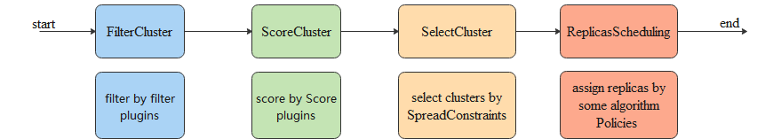
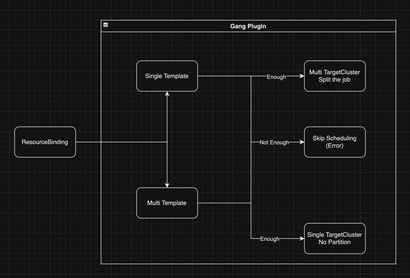

# Multi-Template Partitioning & Scheduler Extensibility

## Background

<!--
我们目前正在 Karmada 的基础上，实现多集群环境下的 AI 计算任务调度。

大部分挑战已经得到妥善解决。例如，为了管理任务队列，我们利用 Mutating Webhook 暂停新建的 ResourceBinding。
随后，我们的自定义 Controller 会根据队列需求逐一激活这些 ResourceBinding，并交由 Karmada Scheduler 处理。
同时，我们也在 Karmada 社区持续推动任务优先级的发展。

我们在多集群环境下调度 AI 计算任务时遇到了一些棘手的问题。这些任务主要分为单模板和多模板两种类型，各需不同的调度策略来实现 gang 调度。
例如，一个常见的问题是每个任务都设有最小可用 Pod 数量（MinAvailable），这一数量标识了任务运行所需的最低 Pod 数，并不总是与 Spec.replica 相等，
因此允许的Pod数量范围应为[Spec.MinAvailable, Spec.Replica]。此外，多模板任务如果拆分到不同集群将变得复杂，
我们希望这类任务能够只被调度到单一集群，避免跨集群拆分。
为解决这些问题，我们正探索引入新的调度策略，并希望增强 Karmada Scheduler 的灵活性，允许在 AssignReplica 阶段注册自定义插件。

同时我认为这是对 Karmada 有益的，它可以丰富 Karmada 支持的场景，以及提高 Karmada 的灵活性。当用户有自己的调度策略时，以目前的情况来看，
用户必须通过修改 Karmada 的核心 API，这是非常复杂的一种方式。而通过扩展点来实现则较为简单，它是一种 Out of Tree 的方式。
-->

**We are currently building on Karmada to implement AI computing task scheduling in a multi-cluster environment.**

Most challenges have already been addressed. For instance, to manage the task queue, we utilize a Mutating Webhook to
pause newly created ResourceBindings. Subsequently, our custom Controller activates these ResourceBindings one by one
according to the queue demands and hands them over to the Karmada Scheduler. We also continue to promote the development
of [task priority](https://github.com/karmada-io/karmada/pull/4993) within the Karmada community.

**We are facing some difficult issues when scheduling AI computing tasks in a multi-cluster environment.** These tasks
are primarily divided into single-template and multi-template types, each requiring different scheduling strategies for
gang scheduling. A common issue is that each task has a minimum available Pod number (MinAvailable), which indicates the
lowest number of Pods needed to run the task and does not always equal Spec.replica. Therefore, the permissible range of
Pod numbers should be [Spec.MinAvailable, Spec.Replica]. Moreover, multi-template tasks become complex if split across
different clusters, and we prefer these tasks to be scheduled only to a single cluster to avoid cross-cluster splitting.
To address these issues, we are exploring new scheduling strategies and aiming to enhance the flexibility of
Karmada Scheduler by allowing the registration of custom plugins during the AssignReplica phase.

**I believe this is beneficial for Karmada** as it can enrich the scenarios supported by Karmada and improve its flexibility.
Currently, if users have their own scheduling strategies, they must modify Karmada's core API, which is a very complex method.
Implementing through extension points is simpler, representing an Out of Tree approach.

Relevant contents:
- https://github.com/karmada-io/karmada/issues/3318
- https://github.com/karmada-io/karmada/issues/3318#issuecomment-1682519228
- https://docs.google.com/document/d/1l6zO4xf879KdW_WPS7aMED0SUmnk487_XDsC12TtuTQ/edit?disco=AAAAv4FJT8E

## Summary

<!--
当前的 Karmada Scheduler 支持在 FilterCluster 和 ScoreCluster 阶段注册插件，但在 SelectCluster 和
ReplicaScheduling (AssignReplicas) 阶段则不支持。我们希望能在 ReplicaScheduling (AssignReplicas) 阶段支持注册自定义插件，以提升 Karmada 的灵活性。

我们将提供一种方案，使得在 ReplicaScheduling (AssignReplicas) 阶段能够支持注册自定义插件。同时包括新的在PropagationPolicy中选择
插件/策略的方式，以及插件的管理策略。
-->

The current Karmada Scheduler supports plugin registration during the **FilterCluster** and **ScoreCluster** stages, but not during the **SelectCluster** and  
**ReplicaScheduling (AssignReplicas)** stages. We aim to enable custom plugin registration during the **ReplicaScheduling (AssignReplicas)** stage to enhance Karmada's flexibility.



We will provide a solution that allows for the registration of custom plugins during the **ReplicaScheduling (AssignReplicas)** stage.
This includes methods for handling multiple results from multiple plugins and strategies for plugin management.

### Goals

- Support custom plugins in the `AssignReplicas` stage.
- Allow users to add custom strategies and select custom strategies in the PropagationPolicy.
- Properly manage custom plugins contributed by users to the community.
- Provide design ideas for multi-template splitting.

## Proposal

### User Story

#### Story 1: Precise Cluster Scheduling for AI Tasks

<!--
作为一个用户，我希望能够将 Karmada 作为一个 AI 任务的管理平台，它需要将**单个 AI 大数据任务**下发到**某一个 Worker Cluster**，
同时它应当能够**支持 gang 调度**，避免集群资源不足时仍然下发任务导致资源浪费。

在运行 AI 大数据任务时，由于地域、设备、集群大小等限制，我们常常需要为**每个任务选择合适的 Worker Cluster** 来完成它。
在多集群上，**Karmada 无疑是最好的选择**，但是目前 Scheduler 拓展性的不足导致我们无法做到 gang 调度来精确的选择作业集群。
特别是在 AI 作业中，例如需要大量并行处理和数据密集型的任务，当前的调度策略没有足够考虑到 AI 作业对硬件（如GPU）的特定需求，
以及这些作业对即时资源配置的敏感性。如果 Karmada 能够对上述能力进行完善，能够拥有多集群情况下更多场景所需的能力。
-->

As a user, I hope to use Karmada as a management platform for AI tasks.
It needs to deploy **single AI big data tasks** to **a specific Worker Cluster**,
while also **supporting gang scheduling**
to avoid wasting resources by issuing tasks when there's insufficient cluster capacity.

When running AI big data tasks, due to constraints like region, equipment,
and cluster size, we often need to **select an appropriate Worker Cluster for each task**.
Among multiple clusters, **Karmada is undoubtedly the best choice**;
however, the current lack of scalability in the Scheduler prevents precise cluster selection through gang scheduling.
Especially in AI operations, such as tasks requiring extensive parallel processing and data-intensive tasks,
the current scheduling strategies have not sufficiently considered the specific hardware needs
(such as GPUs) of AI tasks,
nor the sensitivity of these tasks to immediate resource configuration.
If Karmada could enhance its capabilities in the aforementioned areas,
it would possess the ability to handle more scenarios across multiple clusters.

#### Story 2：Multi-Cluster Scheduling for Large-Scale AI Data Tasks

<!--
作为一个用户，我希望将 Karmada 作为一个大型的 AI 大数据任务的调度平台，它应当能够做到将大型的**多模板任务**拆分到多个 Worker Cluster中。

在任务调度中，有相当大比例的任务是多模板任务（TensorFlowJob，MPIJob，PyTorchJob等等），在一些情况下单个 Worker Cluster
资源不足以完成任务，我希望可以通过 Karmada 将多模板任务较为精确的拆分到多个集群中并行处理，尤其是在碎片较多的场景下。

除了需要将任务拆分，很有可能会有更复杂的策略需求，如 Master 和 Worker 希望按比例调度到不同的 Worker Cluster 中，或是优先调度 Master 等。
-->

As a user, I want to use Karmada as a scheduling platform for large-scale AI big data tasks,
capable of splitting **large multi-template tasks** across multiple Worker Clusters.

In task scheduling, a significant proportion of tasks are multi-template tasks
(such as TensorFlowJob, MPIJob, PyTorchJob, etc.).
In some cases, when a single Worker Cluster does not have enough resources to complete the task,
I hope to use Karmada to accurately split multi-template tasks into several clusters for parallel processing,
especially in scenarios with many fragments.

In addition to needing to split tasks, there is likely a need for more complex strategy requirements,
such as scheduling *Masters* and *Workers* proportionally to different **Worker Clusters**,
or giving priority to scheduling the *Master*.

## Design Details

### Scheduler Extensibility

#### Making AssignReplicas Logic the Default Plugin Content

<!--
我们可以将目前 AssignReplicas 的逻辑作为 Default AssignReplicas 插件的逻辑，从而兼容 Karmada Scheduler 目前所支持的所有策略。
用户可以通过借鉴 Default 插件或是在 Default 插件的基础之上开发自己的自定义插件来实现不同的调度策略。
-->


We can adopt the current `AssignReplicas` logic as the logic for the **Default AssignReplicas plugin**,
thereby supporting all strategies currently supported by the Karmada Scheduler.  
Users can develop their own custom plugins based on the Default plugin or by referencing it,
to implement different scheduling strategies.

#### Register Custom Scheduling Policies to Scheduler Framework

<!--
我们在目前 Scheduler 的基础上设计了一种支持 Plugin 注册自定义策略的方式，当 Scheduler Framework Init 时，将所有 Plugin 支持的自定义
策略注册到 Scheduler 内。Scheduler Cache 中应缓存每个 Custom Strategy 对应的 Plugin。
-->

We have designed a method to support plugin registration of custom strategies based on the current Scheduler.
When the Scheduler Framework initializes,
it registers all the custom strategies supported by the plugins into the Scheduler.  
The Scheduler Cache should cache the plugin corresponding to each Custom Strategy.

##### AssignReplica Plugin Interface

<!--
我们可以在目前的 Plugin Interface 基础上，新增 AssignReplicaPlugin，在 Framework 初始化时可以通过 Strategies() 来得到该插件所支持的
自定义策略名称，如果 PropagationPolicy 需要使用的 Custom Strategy 属于该插件，则调用该插件的 AssignReplica 作为返回。
-->

We can add an `AssignReplicaPlugin` based on the current Plugin Interface.
During the initialization of the Framework,
it is possible to obtain the names of the custom strategies supported by this plugin through `Strategies()`.  
If the `Custom Strategy` required by the `PropagationPolicy` belongs to this plugin,
then the plugin's `AssignReplica` method will be invoked as the response.

```go
// Plugin is the parent type for all the scheduling framework plugins.
type Plugin interface {
    Name() string
}

// FilterPlugin is an interface for filter plugins. These filters are used to filter out clusters
// that are not fit for the resource.
type FilterPlugin interface {
    Plugin
    // Filter is called by the scheduling framework.
    Filter(ctx context.Context, bindingSpec *workv1alpha2.ResourceBindingSpec, bindingStatus *workv1alpha2.ResourceBindingStatus, cluster *clusterv1alpha1.Cluster) *Result
}

// 🌟 New 🌟
type AssignReplicaPlugin interface {
    Plugin
    Strategies() []string
    AssignReplica(ctx context.Context, customStrategyName string, clusters []*clusterv1alpha1.Cluster, spec *workv1alpha2.ResourceBindingSpec,
        status *workv1alpha2.ResourceBindingStatus) ([]workv1alpha2.TargetCluster, error)
}
```

#### Select Custom Scheduling Policies

<!--
我们需要允许一些资源自由的选择它需要的调度策略，而不是仅仅局限于 Karmada 默认提供的策略，但是目前 PropagationPolicy 的
ReplicaSchedulingStrategy 并不支持自由输入一些内容，只能写入如 Enum=Duplicated;Divided 的固定值。

要实现这个能力，我们可以在 PropagationPolicy 中允许用户选择自定义策略，如此 Scheduler 就可以知道要选择用哪一个 AssignReplica 插件的调度结果。
-->

We need to allow some resources the freedom to choose their desired scheduling strategies,
rather than being limited to the strategies by default provided by Karmada.
However,
the `ReplicaSchedulingStrategy` in the current `PropagationPolicy` does not support free input
and can only accept fixed values like `Enum=Duplicated;Divided`.

To implement this capability, we can allow users to select custom strategies in `PropagationPolicy`.
This way, the Scheduler will know which `AssignReplica` plugin's scheduling results to choose.

```go
type ReplicaSchedulingStrategy struct {
    // ReplicaSchedulingType determines how the replicas is scheduled when karmada propagating
    // a resource. Valid options are Duplicated and Divided.
    // "Duplicated" duplicates the same replicas to each candidate member cluster from resource.
    // "Divided" divides replicas into parts according to number of valid candidate member
    // clusters, and exact replicas for each cluster are determined by ReplicaDivisionPreference.
    // +kubebuilder:validation:Enum=Duplicated;Divided
    // +kubebuilder:default=Divided
    // +optional
    ReplicaSchedulingType ReplicaSchedulingType `json:"replicaSchedulingType,omitempty"`

    // ReplicaDivisionPreference determines how the replicas is divided
    // when ReplicaSchedulingType is "Divided". Valid options are Aggregated and Weighted.
    // "Aggregated" divides replicas into clusters as few as possible,
    // while respecting clusters' resource availabilities during the division.
    // "Weighted" divides replicas by weight according to WeightPreference.
    // +kubebuilder:validation:Enum=Aggregated;Weighted
    // +optional
    ReplicaDivisionPreference ReplicaDivisionPreference `json:"replicaDivisionPreference,omitempty"`

    // WeightPreference describes weight for each cluster or for each group of cluster
    // If ReplicaDivisionPreference is set to "Weighted", and WeightPreference is not set, scheduler will weight all clusters the same.
    // +optional
    WeightPreference *ClusterPreferences `json:"weightPreference,omitempty"`
	
    // 🌟 New 🌟
    // +optional
	CustomSchedulingStrategy string `json:"customSchedulingStrategy,omitempty"`
}
```

<!--
CustomSchedulingStrategy 字段允许用户直接配置自定义策略的名称，此字段为可选，如果设置为 `default` 则与未设置同义。
它通过 PropagationPolicy 告诉调度器在调度过程中如何选择 AssignReplica 阶段的插件和该插件对应的策略，我们认为单个插件是有可能对应多个自定义策略的。
比如在我们预想的 `gang` 插件中，它应当支持 `gang-divided` 和 `gang-no-divided` 两个策略。

在这里要注意的是，当用户配置 CustomReplicaSchedulingOptions 后，可能会导致调度器忽略用户配置的其他调度设置（如ReplicaSchedulingType）。
是否使用这些参数将会由自定义插件来决定。比如 A 插件它基于 Divided Aggregated 策略实现了一些其他的能力，那么它就需要使用用户配置的其他内容，
再比如 B 插件它实现了一个完全不同之前的调度策略，那么用户配置的内容很有可能是毫无意义的。
-->

The `CustomSchedulingStrategy` field allows users to directly configure the name of a custom strategy.
This field is optional; if set to `default`, it is synonymous with being unset.  
It informs the scheduler via the `PropagationPolicy`
on how to select the `AssignReplica` plugin and its corresponding strategy during the scheduling process.
We believe that a single plugin could correspond to multiple custom strategies.  
For example, in our envisioned `gang` plugin, it should support both `gang-divided` and `gang-no-divided` strategies.

It is important to note that when users configure `CustomReplicaSchedulingOptions`,
it may lead the scheduler to ignore other scheduling settings configured by the users, such as `ReplicaSchedulingType`.  
Whether to use these parameters will be determined by the custom plugin.
For instance, Plugin A,
which is based on the Divided Aggregated strategy,
may need to use other user-configured content to implement additional capabilities.  
Conversely, Plugin B,
which implements a completely different scheduling strategy, might find the user-configured content irrelevant.

##### New PropagationPolicy Example

<!--
在该例子中, 用户通过设置 customSchedulingStrategy 来启用自定义的 gang 调度插件,
通过它来实现自定义的 gang 调度能力, 如多模板任务的调度限制以及碎片化的容量处理, 当资源过于碎片化导致无法开始任务时插件将返回无可用调度结果.
-->

In this example, the user enables a custom gang scheduling plugin by setting **CustomReplicaSchedulingOptions**.
This plugin facilitates custom gang scheduling capabilities,
such as scheduling restrictions for multi-template tasks and handling fragmented capacities.
When resources are too fragmented to start a task, the plugin will return **no available scheduling results**.

```yaml
apiVersion: policy.karmada.io/v1alpha1
kind: PropagationPolicy
metadata:
  name: mindspore-gpu-task
spec:
  resourceSelectors:
    - apiVersion: batch.volcano.sh/v1alpha1
      kind: Job
      name: mindspore-gpu
  placement:
    replicaScheduling:
      customSchedulingStrategy: gang-divided
```

<!--
对于没有这类需求的用户，他们无需设置该字段，仍然与从前的用法保持一致，或是可以设置为default。
-->

For users who do not have such requirements, they do not need to set this field and can continue to use it as before,
or they can set it to “default.”

```yaml
apiVersion: policy.karmada.io/v1alpha1
kind: PropagationPolicy
metadata:
  name: nginx-propagation
spec:
  resourceSelectors:
    - apiVersion: apps/v1
      kind: Deployment
      name: nginx
  placement:
    replicaScheduling:
      replicaSchedulingType: Divided
      replicaDivisionPreference: Aggregated
      customSchedulingStrategy: default
```

#### Select the Result When AssignReplica

<!--
Karmada Scheduler 的 AssignReplica 处理阶段有多个插件是可能的，我们需要有一种方法来选择用户希望的结果。
AssignReplica阶段的返回是 TargetCluster，也就是调度结果，同时在这个阶段中会根据用户配置的 ReplicaScheduling 来选择策略。
在有多个 AssignReplica 插件的情况下，我们无法简单的像 FilterCluster 和 ScoreCluster 一样将结果取交集。
因为 AssignReplica 的返回值实际上是各自独立的，无法合并为一个结果，在这里我们可以将选择插件结果的能力交给用户，由用户在
PropagationPolicy 中指定要调用 AssignReplica 的哪个插件。

此部分可以和 [Custom Scheduling Policies](#custom-scheduling-policies) 结合来理解。
-->

**Karmada Scheduler's `AssignReplica` Phase:**

The `AssignReplica` processing stage in the Karmada Scheduler can involve multiple plugins,
and it's necessary to have a method for selecting the desired outcome as per user preference.
The result of the `AssignReplica` phase is the `TargetCluster`, which is essentially the scheduling outcome.
Additionally, during this phase, the strategy is chosen based on the user-configured `ReplicaScheduling`.

Unlike the `FilterCluster` and `ScoreCluster` phases where results can be intersected,
having multiple `AssignReplica` plugins complicates matters
since the return values are independently distinct and cannot be merged into a single result.
In this scenario,
we empower the user to choose which `AssignReplica` plugin to invoke by specifying it in the `PropagationPolicy`.

This section can be better understood in conjunction with [Custom Scheduling Policies](#custom-scheduling-policies).

#### Maintain/Manage Plugins

<!--
我们可以将 Karmada Scheduler 的插件进行类似 Kubernetes scheduler-plugins 的方式进行管理。
Scheduler 的插件将全部放在该 Repo 中，Karmada 和社区用户可以将他们自己编写的插件以及文档放在该 Repo 中。
在 Karmada 发版的时候，只构建包括社区维护的默认插件。如果用户需要，他可以自己编写插件后放入到该 Repo 或是自己的 Repo 中，
然后重新构建 Karmada Scheduler 来包括需要的插件。
-->

We can manage plugins for the **Karmada Scheduler** in a similar manner to the **Kubernetes scheduler-plugins**.  
All scheduler plugins will be stored in this repository, allowing both **Karmada** and community users to host their own plugins and documentation.  
During Karmada releases, only the default plugins maintained by the community will be built. If users wish,
they can write their own plugins, add them to this repository or their own,  
and then rebuild the Karmada Scheduler to include the necessary plugins.

### Multi-Template Partitioning

#### Support Multi-Template on ResourceInterpreterCustomization

<!--
我们需要在 ResourceInterpreterCustomization 中支持多模板的一些能力，这样用户就可以通过配置 CRD 的对应自定义方法来实现多模板拆分。
在这里我以 replicaResource 和 replicaRevision 举例，他们在 ResourceInterpreterCustomization 中代表 GetReplicas 和 UpdateReplica。
目前这两个方法入参和出参都是针对单模板资源来设计的，如果我们需要支持多模板资源，它们需要被更新。
-->

We need to support multi-template capabilities in ResourceInterpreterCustomization,
allowing users to implement multi-template splitting through configuring the corresponding custom methods in the CRD.
Here, I use `replicaResource` and `replicaRevision` as examples,
which represent `GetReplicas` and `UpdateReplica` in ResourceInterpreterCustomization.
Currently, both the input and output of these methods are designed for single-template resources.
If we need to support multi-template resources, they need to be updated.

```lua
function GetReplicas(obj)
  replica = obj.spec.tasks[1].replicas
  requirement = kube.accuratePodRequirements(obj.spec.tasks[1].template)
  return replica, requirement
end

function ReviseReplica(obj, desiredReplica)
  obj.spec.tasks[1].replicas = desiredReplica
  return obj
end
```

<!--
如上所示，可以看出在 GetReplicas 时只能返回单个模板的 Replica 数量，以及它对应的所需资源 requirement。
同时，ReviseReplica 也相同，desiredReplica 我们只能传入一个 int，如果是多模板的资源则无法灵活处理。

我们在此给出提出一种可行的思路，允许 Custom Interpreter 模块可以支持多模板，我们可以基于上文提到的两个单模板 Func，实现类似的多模板版本。
短期内我们无法将原有的 GetReplicas 和 ReviseReplica 弃用，这将导致大量用户在更新时出现破坏性兼容问题。

新方法的思路较为清晰，GetReplicas 的返回值修改为结构体数组，它需要返回每个模板的 TemplateName, Replica, Requirement。ReviseReplica
则是将入参修改为结构体数组，我们需要传入每个 Template 对应的 Replica 数量，从而修改资源中所有模板的 Replica。

-->

```lua
function MultiGetReplicas(obj)
  local results = {}
  for i, task in ipairs(obj.spec.tasks) do
    local name = task.name
    local replica = task.replicas
    local requirement = kube.accuratePodRequirements(task.template)
    table.insert(results, {name = name, replica = replica, requirement = requirement})
  end
  return results
end

function MultiReviseReplica(obj, desiredReplicas)
  for _, update in ipairs(updates) do
    for i, task in ipairs(obj.spec.tasks) do
      if task.name == update.templateName then
        task.replicas = update.replica
      end
    end
  end
  return obj
end
```

##### Lua Example

###### MultiGetReplicas

```lua
-- Fake CRD
local crdObject = {
  spec = {
    tasks = {
      { name = "task1", replicas = 3, template = "template1" },
      { name = "task2", replicas = 2, template = "template2" }
    }
  }
}

local replicasInfo = MultiGetReplicas(crdObject)

-- Returned infos
for _, info in ipairs(replicasInfo) do
  print("Task Name:", info.name)
  print("Replicas:", info.replica)
  print("Requirements:", info.requirement)
end
```

###### MultiReviseReplica

```lua
-- Fake Updates param
local updates = {
  { templateName = "task1", replica = 5 },
  { templateName = "task2", replica = 4 }
}

local updatedObject = MultiReviseReplica(crdObject, updates)
```

##### 优先级区分

<!--
当上述内容被实现后，Custom Interpreter 中将会同时提供 GetReplicas 和 MultiGetReplicas 方法，我们可以优先取 MultiGetReplicas 的结果，
当用户未配置 MultiGetReplicas 时则使用 GetReplicas 所提供的结果。
-->

##### 兼容性以及用户迁移

<!--
通过上述方式我们可以保证新版本的兼容性，现有用户将不会受到影响，但是我们仍然需要通过版本周期的方式逐步让用户从 GetReplicas 迁移到
MultiGetReplicas。用户的迁移实际上是比较简单的，以下是迁移的修改例子。通过 Webhook 方式的 Custom Interpreter 同理。

注意，以下的例子是单模板资源(Deployment)的迁移，多模板资源没有迁移需求。
-->

###### GetReplicas -> MultiGetReplicas

```lua
function GetReplicas(obj)
  replica = obj.spec.replicas
  requirement = kube.accuratePodRequirements(obj.spec.template)
  return replica, requirement
end

function MultiGetReplicas(obj)
  local results = {}
  name = obj.spec.template.name
  replica = obj.spec.replicas
  requirement = kube.accuratePodRequirements(obj.spec.template)
  
  table.insert(results, {name = name, replica = replica, requirement = requirement})
  
  return results
end
```

##### ReviseReplica -> MultiReviseReplica

#### Update ResourceBinding API Definition

<!--
在从 Lua 层面支持多模板后，我们仍然需要修改 ResourceBinding 的 API 来支持，在 ResourceBinding 的 API 中，设计之初只考虑到了单模板资源需要的内容，
所以这些改动并不轻松，但如果能够实现这些能力将会提高Karmada的适用范围。

在这里我认为有至少 3 个 API 需要被更新，他们短时间内不会被删除而是需要被标为废弃从而避免破坏性更新。
-->

After supporting multiple templates at the Lua level,
we still need to modify the ResourceBinding API to accommodate these changes.
Initially, the design of the ResourceBinding API only considered the needs of single-template resources,
making these modifications not straightforward.
However, implementing these capabilities would **expand the applicability of Karmada**.

Here, I believe that at least three APIs need to be updated.
**They will not be removed in the short term but should be marked as deprecated to avoid breaking changes.**

##### ResourceBindingSpec.ReplicaRequirements

<!--
在目前的 ResourceBindingSpec 中，ReplicaRequirements 用来表示单个 Replica 需要的资源，对于多模板资源这样是不适用的。

Replicas 代表目标资源需要的 Replica 数量，该字段在多模板的情况下不够准确，
多模板情况下我们可以将所有模板需要的 Replica 累加，但是这将在 AssignReplica 阶段时带来麻烦，
由于每个模板的 Requirement 不同，Scheduler 将无法精确的根据每个模板需要的 Replica 数量来拆分目标资源。

针对以上两点，我们可以将这两个字段合并为一个字段来表示多模板情况下每个 Template 所需要的 Requirement 和 Replica。
-->

In the current `ResourceBindingSpec`, `ReplicaRequirements`
is used to represent the resources needed for a single replica.
This is not suitable for multi-template resources.

`Replicas` represents the number of replicas needed for the target resource.
This field is not accurate in multi-template scenarios. In cases of multiple templates,
we can sum up the replicas required by all templates, but this approach creates complications
during the `AssignReplica` stage. Since each template has different requirements,
the Scheduler will not be able to accurately distribute the target resources based on
the number of replicas required by each template.

To address these issues,
we can combine these two fields into a one
to represent the requirements and the number of replicas needed for each template in multi-template situations.

```go
type ResourceBindingSpec struct {
    // Replicas represents the replica number of the referencing resource.
    // +optional
    Replicas int32 `json:"replicas,omitempty"`
	
    // ReplicaRequirements represents the requirements required by each replica.
    // +optional
    ReplicaRequirements *ReplicaRequirements `json:"replicaRequirements,omitempty"`
	
    // 🌟 New 🌟
    // TemplatesRequirements represents the all templates required replica and requirements.
    TemplatesRequirements []TemplateRequirement `json:"templateRequirement,omitempty"`
}

// 🌟 New 🌟
type TemplateRequirement struct {
    // Template Name, eg. master/worker
    Name string `json:"name,omitempty"`

    // Template required replica count.
    Replicas int32 `json:"replicas,omitempty"`

    // Template requirements.
    Requirements *ReplicaRequirements `json:"requirements,omitempty"`
}
```

<!--
同时，原本的 Replicas 无需弃用/修改，仅需简单判断即可兼容。
-->

Additionally, the original ‘Replicas’ field does not need to be deprecated or modified;
we can simply make a conditional check during usage to ensure compatibility.

##### ResourceBindingSpec.Clusters

<!--
在目前的 ResourceBindingSpec 中，Clusters 代表负载被调度的结果，同时也包含他应该被拆分多少 Replica 到哪个集群，
但是在多模板的情况下目前能够表示的内容是不足的，我们需要修改 Clusters 字段对应的结构，让他能够支持多模板任务的拆分。

将 Replicas 字段更新为 ReplicaList，从而能够表示每个 Cluster 应该拆分某个 Template 的 Replica 数量。
-->

In the current ResourceBindingSpec, the 'Clusters'
field represents the result of load scheduling and also includes how many replicas should be allocated to which cluster.
However, in multi-template scenarios, the content that can be currently represented is insufficient.
We need to modify the structure corresponding to the Clusters field to support the partitioning of multi-template tasks.

The 'Replicas' field should be updated to 'ReplicaList'
to represent the number of replicas of a certain template that should be allocated to each cluster.

```go
type ResourceBindingSpec struct {
    // Clusters represents target member clusters where the resource to be deployed.
    // +optional
    Clusters []TargetCluster `json:"clusters,omitempty"`
}

// TargetCluster represents the identifier of a member cluster.
type TargetCluster struct {
    // Name of target cluster.
    Name string `json:"name"`
	
    // Replicas in target cluster.
    // +optional 
    //+deprecated
    Replicas int32 `json:"replicas,omitempty"`

    // 🌟 New 🌟
    // Replicas list in the target clusters.
    // +optional
    ReplicaList []TemplateReplica `json:"replicaList,omitempty"`
}

// 🌟 New 🌟
type TemplateReplica struct {
    // Name of the template.
    TemplateName `json:"name",omitempty`

    // Replica num of the template.
    Replicas int32 `json:"replicas,omitempty"`
}
```

## Alternatives

<!--
Q: 能否通过 ResourceInterpreterCustomization 的 replicaResource 来实现该能力，直接将 Job 的 Spec.MinAvailable 值作为 Spec.Replica 返回？

A: 我们已经考虑过这种方案，但发现它行不通。如果按此方式操作，我们就会失去动态调整 Pod 数量的能力，因为 Karmada Scheduler只会认为这个 Job 需要
Spec.MinAvailable 个 Pod，这并非我们所期望的结果。我们希望它能够表示为一个区间。
-->

**Q**: Is it possible to use `replicaResource` from `ResourceInterpreterCustomization` to implement the capability by
directly returning the `Spec.MinAvailable` value of a Job as `Spec.Replica`?

**A**: We have considered this approach, but it turned out to be impractical. If we proceed in this manner,
we would lose the ability to dynamically adjust the number of Pods, as the Karmada Scheduler would only recognize that
the Job requires `Spec.MinAvailable` Pods, which is not the desired outcome. We are looking for a representation that allows for a range.

<!--
Q: 在 AssignReplicas 阶段，gang 插件的设计可能是怎样的?

A: 我们目前的设想是将单模板任务和多模板任务的处理方式分开，由于多模板任务的拆分较为复杂，我们目前不希望去拆分多模板任务，
在单个集群资源足够的情况下 gang 插件才能够允许该任务下发，否则挂起该任务，直到容量足够。
对于单模板任务，我们会在 gang 插件中拆分它，并且支持 Spec.MinAvailable 和 Spec.Replica 形式的区间 Replica 数量调度能力。
-->

Q: What might the design of the gang plugin look like during the AssignReplicas stage?

A: Our current plan is to separate the handling of single-template tasks and multi-template tasks.
Due to the complexity of splitting multi-template tasks, we currently do not wish to split them.
The gang plugin will allow the task to be dispatched only if a single cluster resource is sufficient;
otherwise, the task will be suspended until there is enough capacity.
For single-template tasks,
we will split them within the gang plugin and support scheduling capabilities for interval replica quantities in the form of Spec.MinAvailable and Spec.Replica.


