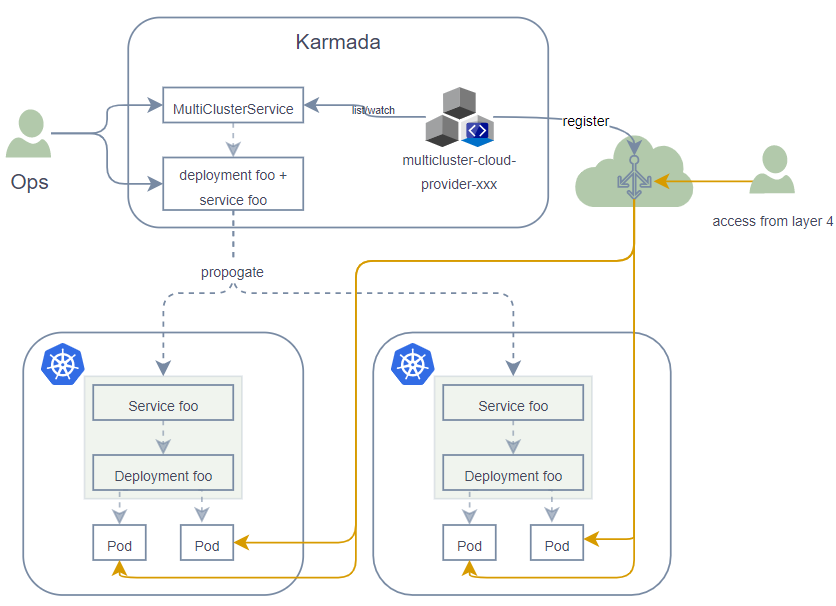
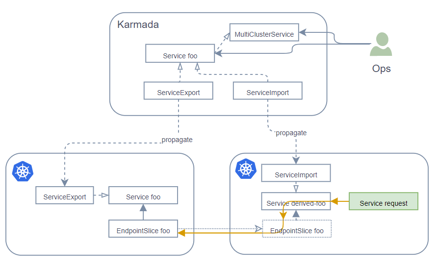

# Propose the MultiClusterService API to expose and discover multi-cluster services

## Summary

We have implemented the [MCS](https://karmada.io/docs/next/userguide/service/multi-cluster-service/) feature based on the [mcs-api](https://github.com/kubernetes-sigs/mcs-api) proposed by the Kubernetes community [sig-multicluster](https://github.com/kubernetes/community/tree/master/sig-multicluster) to solve the problem of service discovery between multiple clusters. However, MCS does not solve the problem of multi-cluster service exposure. The current proposal proposes a new `MultiClusterService` API for exposing multi-cluster services on OSI Layer 4. The MultiClusterService forwards external traffic to the backend of the member cluster service managed by Karmada, breaking through the boundary restriction of a single service and implementing a unified ingress of traffic from multiple clusters.

## Motivation

MultiClusterService allows users to easily manage services and applications in multiple Kubernetes clusters, helping users quickly and simply implement load balancing and Layer 4 network traffic routing among multi Kubernetes clusters.

In addition, users need to create multiple resources when using the MCS feature, which is not user-friendly. It is hoped that the creation of MultiClusterService resources can unify user behavior.

### Goals

- Define the MultiClusterService API to support the exposure of multi-cluster services.
- Integrates the multi-cluster service discovery atomic capability implemented based on mcs-api and provides users with more abstract ant simple resource definitions through MultiClusterService API.
- Propose the shared interfaces for different cloud providers to implement the provider-specific functionality, so multi-cluster services can be integrated with the cloud provider's LB service.

### Non-Goals

- Implementation of the interconnection with the LoadBalancer service by a specific cloud provider.
- Provide measures for handling when the karmada control-plane goes down.

## Proposal

### User Stories (Optional)

#### Story 1

As end users, to ensure HA and improve cluster fault tolerance, users need to deploy the same service in different clusters in multiple regions and expose the service to the LB service of the cloud provider. In this way, during access, requests can be evenly distributed to backend instances in different clusters.

#### Story 2

As end users, when using the MCS feature to discovery service between clusters, they need to create multiple resources: ServiceExport, ServiceImport, PropagationPolicy, which is complex. If unified API is provided, the usage threshold is lowered.

### Notes/Constraints/Caveats (Optional)

When exposing multi-cluster services to cloud provider LB services, users can route request loads to the backend of multi-cluster services by accessing the LB service. The prerequisite is that the LB service and the backend network of multi-cluster services are connected.

### Risks and Mitigations

## Design Details

### General Idea

1. Provides MultiClusterService API, users can define MultiClusterService resource to expose service on the Karmada control-plane.
2. The type field in the MultiClusterService API to provide the corresponding type value so that the current atomic capabilities can be integrated and an overall **inter-clusters service discovery** solution can be provided through the MultiClusterService API.

### MultiClusterService API

```go
// MultiClusterService is a named abstraction of multi-cluster software service.
// The name field of MultiClusterService is the same as that of Service name.
// Services with the same name in different clusters are regarded as the same
// service and are associated with the same MultiClusterService.
// MultiClusterService can control the exposure of services to outside multiple
// clusters, and also enable service discovery between clusters.
type MultiClusterService struct {
	metav1.TypeMeta   `json:",inline"`
	metav1.ObjectMeta `json:"metadata,omitempty"`

	// Spec is the desired state of the MultiClusterService.
	Spec MultiClusterServiceSpec `json:"spec"`

	// Status is the current state of the MultiClusterService.
	// +optional
	Status corev1.ServiceStatus `json:"status,omitempty"`
}

// MultiClusterServiceSpec is the desired state of the MultiClusterService.
type MultiClusterServiceSpec struct {
	// Types specifies how to expose the service referencing by this
	// MultiClusterService.
	// +required
	Types []ExposureType `json:"types"`

	// Ports is the list of ports that are exposed by this MultiClusterService.
	// No specified port will be filtered out during the service
	// exposure and discovery process.
	// All ports in the referencing service will be exposed by default.
	// +optional
	Ports []ExposurePort `json:"ports,omitempty"`

	// Range specifies the ranges where the referencing service should
	// be exposed.
	// Only valid and optional in case of Types contains CrossCluster.
	// If not set and Types contains CrossCluster, all clusters will
	// be selected, that means the referencing service will be exposed
	// across all registered clusters.
	// +optional
	Range ExposureRange `json:"range,omitempty"`
}

// ExposureType describes how to expose the service.
type ExposureType string

const (
	// ExposureTypeCrossCluster means a service will be accessible across clusters.
	ExposureTypeCrossCluster ExposureType = "CrossCluster"

	// ExposureTypeLoadBalancer means a service will be exposed via an external
	// load balancer.
	ExposureTypeLoadBalancer ExposureType = "LoadBalancer"
)

// ExposurePort describes which port will be exposed.
type ExposurePort struct {
	// Name is the name of the port that needs to be exposed within the service.
	// The port name must be the same as that defined in the service.
	// +optional
	Name string `json:"name,omitempty"`

	// Port specifies the exposed service port.
	// +optional
	Port int32 `json:"port,omitempty"`
}

// ExposureRange describes a list of clusters where the service is exposed.
// Now supports selecting cluster by name, leave the room for extend more methods
// such as using label selector.
type ExposureRange struct {
	// ClusterNames is the list of clusters to be selected.
	// +optional
	ClusterNames []string `json:"clusterNames,omitempty"`
}
```

### Shared interfaces for MultiClusterService

```go
// MCSLoadBalancer is an abstract, pluggable interface for MultiClusterService load balancers.
type MCSLoadBalancer interface {
	// GetMCSLoadBalancer return whether the specified load balancer exists, and if so, what its status is.
	GetMCSLoadBalancer(ctx context.Context, mcs *providernetworkingv1alpha1.MultiClusterService) (status *corev1.LoadBalancerStatus, exist bool, err error)
	// EnsureMCSLoadBalancer creates a new load balancer.
	EnsureMCSLoadBalancer(ctx context.Context, mcs *providernetworkingv1alpha1.MultiClusterService) (status *corev1.LoadBalancerStatus, err error)
	// UpdateMCSLoadBalancer updates the specified load balancer.
	UpdateMCSLoadBalancer(ctx context.Context, mcs *providernetworkingv1alpha1.MultiClusterService) (status *corev1.LoadBalancerStatus, err error)
	// EnsureMCSLoadBalancerDeleted deletes the specified load balancer if it exists.
	EnsureMCSLoadBalancerDeleted(ctx context.Context, mcs *providernetworkingv1alpha1.MultiClusterService) error
}
```

### Service exposure

1. Create Deployments and Services and propagate them to member clusters.
2. Create the multiClusterService resource.
3. Register the pod IP address with the LB instance using multicluster-cloud-provider-xxx.
4. The user accesses the LB instance through Layer 4.

```yaml
apiVersion: networking.karmada.io/v1alpha1
kind: MultiClusterService
metadata:
  name: foo
spec:
   ports:
   - port: 80
   types:
   - LoadBalance
```



### Cross-clusters service discovery

1. Create Deployments and Services and propagate them to member clusters.
2. Create the multiClusterService resource.
3. The controller list/watch to the multiClusterService resource, generates ServiceExport and propagate it to the source clusters, and generates ServiceImport and propagate it to the destination clusters. Then the current `MCS` function will start work.
4. Services in the destination clusters access multi-cluster services.

```yaml
apiVersion: networking.karmada.io/v1alpha1
kind: MultiClusterService
metadata:
  name: foo
spec:
  types:
  - CrossCluster
  range:
    clusterNames:
    - member2
```



### More details design for MultiClusterService resource

#### What's the behavior when updating the MultiClusterService?

It will determine the changes of `.spec.types` value and process them based on the latest value, while cleaning up any reduced types (if there are any).

#### What's the behavior when deleting the MultiClusterService?

It will clean up the previous impacts.

#### What's the behavior when the referencing service does not exist?

MultiClusterService resource fails to be created.

#### What's the behavior when some import cluster does not exist?

It will generate an warning event and ignore non-exist cluster.

#### What's the behavior when some import cluster disappears(like unregistered from Karmada)?

Clean up the impact caused by this cluster.

### Restriction Statement

1. The LB instance should be able to directly access the POD network in the Karmada member clusters.

### Implementation

- `karmada` repo:
  - Add MultiClusterService API.
  - The MultiClusterService controller of the CrossCluster type is placed in karmada-controller-manager.
- `multicluster-cloud-provider` repo:
  - Add shared interface for MultiClusterService and add/update related controller.

### MultiClusterService resource validation

- `.name`: It need to be equal with the service name.
- `.spec.ports.name`: It must be the same as that defined in the service.
- `.spec.ports.port`: It should be a reasonable port value
- `.spec.types`: It can not be empty.
- `.spec.range.clusterNames`: The cluster name must be a qualified string.

### Test Plan

- Added the UT to overwrite the new code.
- Add E2E coverage for the scenario where the MCS type is CrossCluster.

## Alternatives
