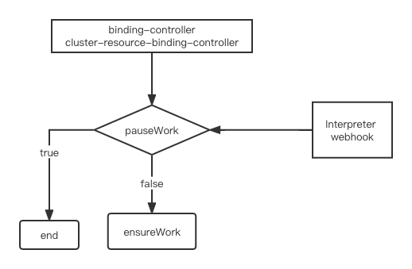

# Pause ensure work

## Summary
Karmada should provide an ability to allow user to decide whether sync resource (as known as `resource template`) to member cluster or not; 
eg: When the resource  paused field(such as label `work.karmada.io/paused`)  is true, we hope that resource's not be updated member cluster until it becomes false

## Motivation
When users add/replace/delete OverridePolicy/PropagationPolicy/Resource dynamically,workload resource will be synced to member cluster immediately; However,
Users don't want to do that, before all modifications are done, resource should not be synced, until Users think this is needed  

### Goals

- Provide a solution to pause ensure work objects

### Non-Goals


## Proposal

### User Stories (Optional)

<!--
Detail the things that people will be able to do if this KEP is implemented.
Include as much detail as possible so that people can understand the "how" of
the system. The goal here is to make this feel real for users without getting
bogged down.
-->

#### Story 1
Imagine that we have 2 member clusters
- Condition:
    - The version of cluster A is v1.18.1
    - The version of cluster B is v1.10.1
- Result:
    - If resource propagate to cluster A and B, the overrideRules should add content like following, which decided by cluster's version;These contents are added by users themselves through custom controllers or APIs
```
apiVersion: policy.karmada.io/v1alpha1
kind: ClusterOverridePolicy
metadata:
  name: foo
spec:
  resourceSelectors:
    - apiVersion: apps/v1
      kind: Deployment
  overrideRules:
    - targetCluster:
        clusterNames:
          - A
      overriders:
        plaintext:
          - path: "/spec/template/spec/securityContext/sysctls"
            operator: add
            value:
            - name: net.core.somaxconn
              value: "65535"
    - targetCluster:
        clusterNames:
          - B
      overriders:
        plaintext:
          - path: "/spec/template/metadata/annotations"
            operator: add
            value:
              "security.alpha.kubernetes.io/unsafe-sysctls: net.core.somaxconn=65535"

```

#### Story 2
The workload has an annotation called partition, which is used for gray release. The values of different clusters are different, and will change dynamically according to the total gray value, but before each modification is completed, it is not expected that resources will be synchronized to member cluster;
Imagine that we have 2 member clusters A and B
- Condition:
  - The total replicas is 8, and current canary partition is 4
- Result:
  - A have canary partition is 1, B have canary partition is 3
```
apiVersion: policy.karmada.io/v1alpha1
kind: ClusterOverridePolicy
metadata:
  name: foo
spec:
  resourceSelectors:
    - apiVersion: apps/v1
      kind: Deployment
  overrideRules:
    - targetCluster:
        clusterNames:
          - A
      overriders:
        plaintext:
          - path: "/metadata/annotations/partition"
            operator: replace
            value: 1
    - targetCluster:
        clusterNames:
          - B
      overriders:
        plaintext:
          - path: "/metadata/annotations/partition"
            operator: replace
            value: 3
```
### Notes/Constraints/Caveats (Optional)

### Risks and Mitigations

## Design Details



### API Change
Add a new field in `ResourceInterpreterResponse` to represent whether pause ensure work object
```
// ResourceInterpreterResponse describes an interpreter response.
type ResourceInterpreterResponse struct {
	// UID is an identifier for the individual request/response.
	// This must be copied over from the corresponding ResourceInterpreterRequest.
	// +required
	UID types.UID `json:"uid"`

	// Successful indicates whether the request be processed successfully.
	// +required
	Successful bool `json:"successful"`

	// Status contains extra details information about why the request not successful.
	// This filed is not consulted in any way if "Successful" is "true".
	// +optional
	Status *RequestStatus `json:"status,omitempty"`

	// The patch body. We only support "JSONPatch" currently which implements RFC 6902.
	// +optional
	Patch []byte `json:"patch,omitempty"`

	// The type of Patch. We only allow "JSONPatch" currently.
	// +optional
	PatchType *PatchType `json:"patchType,omitempty" protobuf:"bytes,5,opt,name=patchType"`

	// ReplicaRequirements represents the requirements required by each replica.
	// Required if InterpreterOperation is InterpreterOperationInterpretReplica.
	// +optional
	ReplicaRequirements *workv1alpha2.ReplicaRequirements `json:"replicaRequirements,omitempty"`

	// Replicas represents the number of desired pods. This is a pointer to distinguish between explicit
	// zero and not specified.
	// Required if InterpreterOperation is InterpreterOperationInterpretReplica.
	// +optional
	Replicas *int32 `json:"replicas,omitempty"`

	// Dependencies represents the reference of dependencies object.
	// Required if InterpreterOperation is InterpreterOperationInterpretDependency.
	// +optional
	Dependencies []DependentObjectReference `json:"dependencies,omitempty"`

	// RawStatus represents the referencing object's status.
	// +optional
	RawStatus *runtime.RawExtension `json:"rawStatus,omitempty"`

	// Healthy represents the referencing object's healthy status.
	// +optional
	Healthy *bool `json:"healthy,omitempty"`
	
	// PauseEnsureWork represents whether pause ensure work object.
	// +optional
	PauseEnsureWork *bool `json:"healthy,omitempty"`
}
```

### Test Plan

## Alternatives
