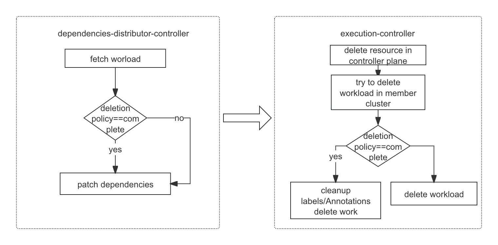

---
title: Prevent removal managed resources
authors:
- "@CharlesQQ"
reviewers:
- "@RainbowMango"
- "@XiShanYongYe-Chang"
- "@chaunceyjiang"
approvers:

creation-date: 2024-06-27

# prevent removal managed resource

## Summary

A deletion mechanism and its API is provided to prevent cascade resource in member cluster deleted by control plane.

## Motivation

All resources reconciled by the execution controller have a finalizer `karmada.io/execution-controller` added to work object's metedata.
This finalizer will prevent deletion of work object until the execution controller has a chance to perform pre-deletion cleanup.

However, in some cases, user want to delete resource in control plane but resource in member cluster kept, like `kubectl delete sts xxx --cascade=orphan`, sts is deleted but pods not.
Karmada have different types of resources, different resource might have different prevent removal process.

1. resource template: clean up the labels/annotations from the resource in member clusters and delete work object.
2. dependent resource: clean up the labels/annotations from the dependent resource in member clusters,such as configmap/secret,  and then delete work object.
3. resource which directly generate work object such as namespace/cronfederatedhpa/federaredhpa/federatedresourcequota execute the same strategy as resource template.

### Goals
- Provides API to prevent delete cascade resource.
- Provides command line to use feature like `karmadactl orphaningdeletion complete/disable <resource type> <name>`

### Non-Goals/Future Work
- Other delete policy, like retain work object.

## Proposal
### User stories

#### Story 1

As an administrator, I want a rollback mechanism during workload migration to Karmada, so that I can revert to the pre-migration state in case of any unexpected situation.

## Design Details

### API changes
- Add Annotation `resourcetemplate.karmada.io/deletionpolicy=complete` for resourcetemplate or other resource which create work object directly.
- The value of `karmada.io/deletionpolicy` should be enum type for scalability
    - complete: cleanup the labels/annotation from the resource on member clusters and delete work object.

### Dependencies resource deletion policy follow the main resource
- dependencies-distributor-controller patch dependencies resource deletion policy, to set deletion policy same as the main resource.
- user delete dependencies resource
- execution-controller try to delete workload in member cluster, according to deletion policy decide delete workload or just cleanup labels/annotation then delete work object.

### Add karmadactl orphaning-deletion flag
- `karmadactl deletionpolicy complete <resource type> <name>` add annotation `karmada.io/deletionpolicy=complete`
- `karmadactl deletionpolicy disable  <resource type> <name>` remove annotation `karmada.io/deletionpolicy`

