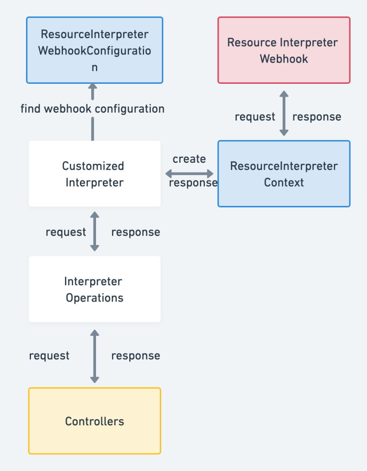
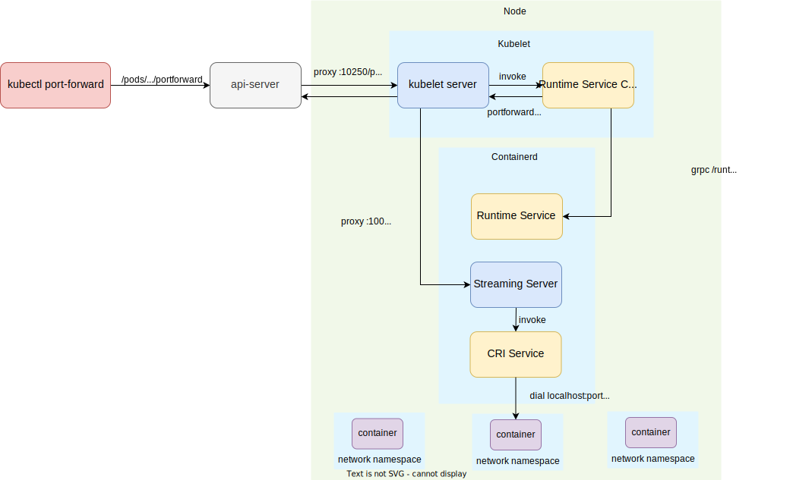
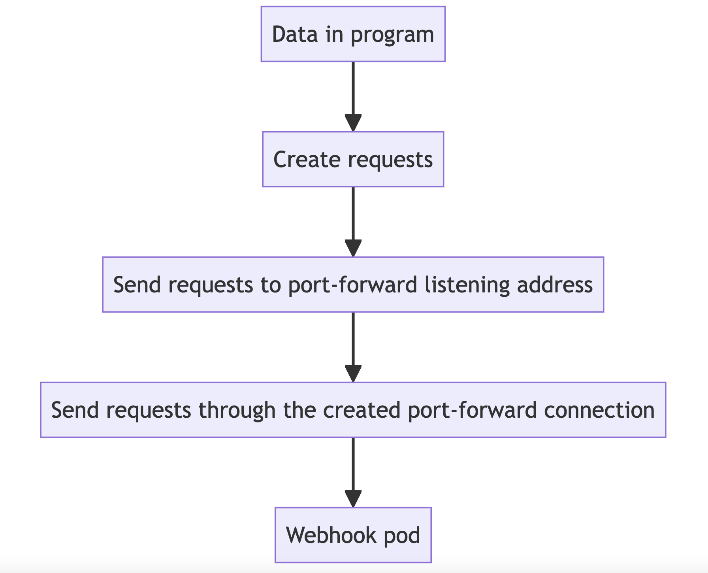
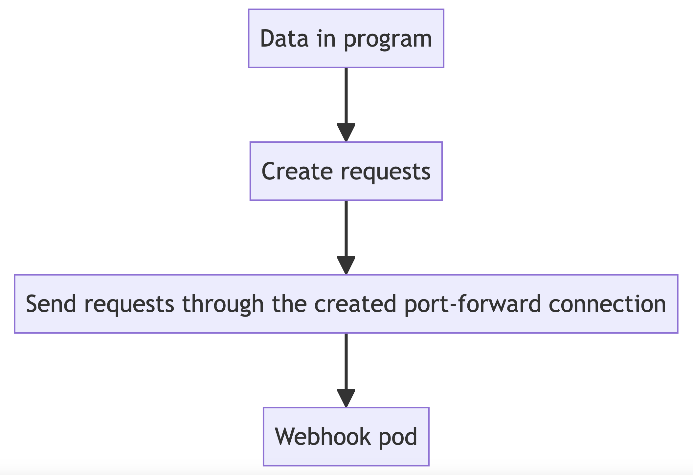

# Promote Dependencies Automatically

## Summary

One resource could only be okay when the dependencies are ready, such as Deployment depending on Configmap. So, If we want to promote the resource and deploy it into multiple clusters, we need to promote the resource and all the dependencies, it would be great if this process could be done automatically.

Therefore, we need to provide an automatic promotion mechanism for dependent resources in karmadactl. When you promote a resource, it is necessary to automatically promote all the resources on which that resource depends. For example, promote the Secret that Deployment depends on.

Typically, users don't create Pods directly. Instead, users create them using workload resources such as Deployment, StatefulSet, or Job. Take Deployment as an example. As shown in the following figure, the dependent resources of Deployment include ConfigMaps, Secrets, PVC, and Services.

And, in addition to the native resources in kubernetes, the resources on which the user's CRD/CR resources depend need to support automatic promotion.



## Motivation

Currently, `karmadactl promote` only supports promotion of resources one by one. When promoting workload resources through Karmada, users need to manually promote their dependent resources. Maintaining the dependent resources of the target cluster becomes a heavy burden.

### Goals

Provide a strategy to automatically promote the dependent resources of a target workload when promoting the target workload resources to be managed by Karmada.

### Non-Goals

Support enabling and disabling this feature, with the default setting as disabled.

## Proposal

This proposal introduces a strategy to `karmadactl`, whereby when users promote resources, all the resources that the promoted resource depends on will also be automatically promoted to be managed by Karmada.

### Function overview

1. Support automatic promotion of dependent resources for native Kubernetes resources.
2. Support automatic promotion of dependent resources for CR(Custom Resource).

### User Stories (Optional)

#### Story 1

Suppose there is a member cluster where a workload (such as Deployment or custom resource) is deployed, but it is not managed by Karmada. This resource references ConfigMaps and Secrets.

- Action：
  - The user uses the `karmadactl promote` command to promote this resource and let Karmada take over the management of this workload.
- Result：
  - The ConfigMaps and Secrets that the resource depends on will also be promoted to be managed by Karmada.

## Design Details

### Architecture


From the above architecture diagram, the workflow for promoting the resource and its dependent resources is as follows:
1. Retrieve the ObjInfo(Object Information) of the workload to be promoted from the member cluster.
2. Determine whether to enable the functionality of automatically promoting all dependent resources based on the value of `dependencies`, which is an input command parameter default set to be `false` and its abbreviation is `-d`. 
   1. If `dependencies` is set to `false`, only create the corresponding Resource Template, ClusterPropagationPolicy/PropagationPolicy, and Karmada will generate the respective ResourceBinding in the Karmada control plane for the workload.
   2. If `dependencies` is set to `true`, use the interpret framework to analyze the dependencies of the corresponding workload. Create the Resource Templates, enable [propagateDeps](https://karmada.io/zh/docs/userguide/scheduling/propagate-dependencies/) in the original resources' policy, then Karmada will generate ResourceBindings for the dependencies in the Karmada control plane.

**Note:**
If the workload to be promoted is a CR(Custom Resource), we need to first promote its CRD (Custom Resource Definition).

### Interpret Workload Dependencies

To achieve the automatic promotion of dependent resources, the key challenge is to determine how to obtain the dependent resources of the resource to be promoted. Therefore, we need to be able to parse the dependencies of a resource. Currently, the interpret framework in Karmada supports the following methods for parsing dependent resources:

1. Default built-in interpretation
   1. Native Kubernetes Resource Interpretation:
      1. Perform dependency parsing using the structure of native Kubernetes resources.
   2. Third-Party Resource Interpretation:
      1. Pre-configure Lua scripts for commonly used CR(Custom Resource) to enable dependency parsing using Lua configurations.
2. Custom Interpretation
   1. Lua Configuration-based Interpretation:
      1. Configure resource interpretation rules for dependency parsing by specifying Lua scripts in the [ResourceInterpreterCustomization](https://github.com/karmada-io/karmada/blob/84b971a501ba82c53a5ad455c2fe84d842cd7d4e/pkg/apis/config/v1alpha1/resourceinterpretercustomization_types.go#L17) resource.
   2. Webhook-based Interpretation:
      1. Users can design Resource Interpreter Webhooks for specific custom resources to handle Interpreter Operations requests and perform dependency parsing. The process involves receiving these request operations and processing them accordingly.
         The specific process is as follows:



***Note:*** 
Using the webhook-based interpretation method may pose difficulties when making requests to the webhook interpret service within the cluster. In such cases, we need to request the target url and perform port forwarding to invoke the service within the cluster.

### Conflict and Failure Resolution

#### Conflict Resolution

When promoting a resource, if the resource to be promoted or its dependent resources have already been promoted to the Karmada control plane, the promotion operation will abort the promotion of the resource or its dependent resources. The user needs to manually promote the resource or its dependent resources to the Karmada control plane one by one.

#### Failure Resolution

When promoting a resource, if its dependent resources fail to be promoted to the Karmada control plane(validation failed, execution failed or others), the promotion operation will fail and will not promote any dependent resources to the Karmada control plane, which means will revert all changes made by this command.

### Example

Assuming we deploy a workload CR named `myapp` and its referenced ConfigMap called `my-config` in the member cluster member1.

```yaml
apiVersion: apps/v1
kind: Workload
metadata:
  name: myapp
  labels:
    app: myapp
spec:
  replicas: 1
  selector:
    matchLabels:
      app: myapp
  template:
    metadata:
      labels:
        app: myapp
    spec:
      containers:
        - image: nginx
          name: nginx
          volumeMounts:
            - name: configmap
              mountPath: "/configmap"
      volumes:
        - name: configmap
          configMap:
            name: my-config
---
apiVersion: v1
kind: ConfigMap
metadata:
  name: my-config
data:
  nginx.properties: |
    proxy-connect-timeout: "10s"
    proxy-read-timeout: "10s"
    client-max-body-size: "2m"
```
After executing the `karmadactl promote workload myapp -c member1 -d=true` command, we can see the Resource Binding and Work object corresponding to the workload `myapp` and ConfigMap `my-config` has been generated in the Karmada control plane. This indicates that both `myapp` and its dependent resource `my-config` have been successfully promoted to the Karmada control plane.

When deleting `myapp` from the Karmada control plane, `myapp` in the member cluster member1 will also be deleted.

### TODO: Port forward the request to webhook interpret service in the cluster

Generally, external access to applications (Pods) running in Kubernetes can be achieved through three modes: NodePorts, LoadBalancer, and Ingress. Additionally, the `kubectl` subcommand `port-forward` can be used to forward ports and map local ports to specific Pod ports, allowing access to Pod services within the Kubernetes cluster.

The principle of `kubectl port-forward` is illustrated in the following diagram (Kubernetes v1.24.0):



First, `port-forward` initiates an `spdy` protocol request to the address of the Pod subresource `portforward`: `/api/v1/namespaces/{namespace}/pods/{pod}/portforward`. At this point, kubectl starts listening on a local port and establishes a connection to the API server using the URL of the pod subresource `portforward`.

When a connection is made to the local port, `kubectl` continuously copies data between the client and the API server's port-forward endpoint.

Upon receiving the request for accessing the Pod subresource `portforward`, the API server obtains the URL of the kubelet server on the node where the pod resides, based on the pod and node information. It then proxies the request for accessing the pod's `portforward` to the kubelet server.

After receiving the request, the kubelet server first utilizes the `RuntimeServiceClient` to send a gRPC request to the container runtime interface (`/runtime.v1alpha2.RuntimeService/PortForward`). This is done to obtain the URL of the streaming server in the container runtime responsible for handling the port-forward request. Once the URL for the port-forward streaming is obtained, the kubelet server proxies the request to that URL.

The CRI service starts a streaming server that responds to stream requests for `/exec`, `/attach`, and `/portforward`. On Linux, within the network namespace of the pod, a connection to the target port is established using the `localhost` address. Data is then copied between this connection, facilitating the transfer of data.

For the specific implementation of using port-forward to forward requests from `karmadactl` to the webhook interpret Pod service, we need to utilize the spdy protocol to forward the request to the URL of the portforward subresource of the corresponding Pod. This enables us to access the webhook interpret service within the cluster.

We will implement the webhook requests based on the logic of `port-forward`, but not the native port-forward implementation. Here are the differences between native approach and our approach:

#### Native Approach

In the native approach, data is generated within a program. The program creates requests, which are first sent to the port-forward listening address. From there, the requests are forwarded through the port-forward connection to reach the pod.

#### Our Approach

In this approach, data is also generated within a program. The program then creates requests, which are sent to the webhook pod through a port-forward connection.


### Test Plan

#### UT

Testing coverage for new methods.

#### E2E

| Test Case                                                 | Case Description                                                                                                                |
|-----------------------------------------------------------|---------------------------------------------------------------------------------------------------------------------------------|
| Promote dependencies of native resource automatically     | Test if dependencies of native resource automatically promote to karmada.                                                       |
| Promote dependencies of thirdparty resource automatically | Test if dependencies of thirdparty resource automatically promote to karmada.                                                   |
| Promote dependencies of custom resource automatically     | Test if dependencies of custom resource automatically promote to karmada(use lua configuration way and webhook interpret way).  |


## Alternatives
