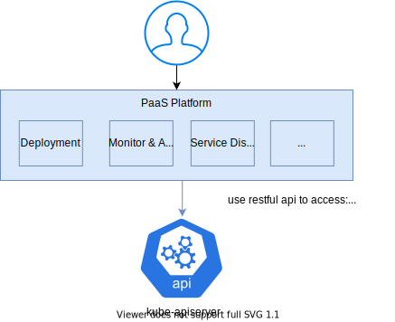

# Resource Aggregation Proxy

# Summary



Before using Karmada, there is only one kubernetes cluster per IDC. The deployment system, monitor & alarm system, service discovery and various other systems access raw kubernetes resources directly, including workload, configmap, secret, pod, node.


We can't access pod and node information from Karmada API server. So after introducing Karmada, the PaaS components can no longer access pod and node resources. This will break the PaaS components. 


In order to solve the problem, we can either:

1. **Modify all the PaaS components.** Force all of them understand Karmada's logic, and find the pod node in the appropriate cluster by themselves.
2. **Provide a Resource Aggregation Proxy.** All PaaS components just ask the proxy to give them the pod node information. The proxy will find the right clusters to get data, merge data, then return it to the client.


Apparently, using the proxy will greatly simplify external components' access to kubernetes clusters, and hide multiple cluster's implementation details from them. That's what we propose.


Try these:

- **[Aggregated Kubernetes API Endpoint](https://github.com/karmada-io/karmada/blob/master/docs/userguide/aggregated-api-endpoint.md)** This component is built for Unified authentication. The restful api client still needs to enumerate all the member clusters to get the right information.
- **[Caching](https://github.com/karmada-io/karmada/tree/master/docs/proposals/caching) (aka karmada-search)** This component can only get/list, not watch or update data. 

# Motivation

We want to add a resource aggregation proxy feature to `karmada search`.  It will provide native kubernetes API for components outside kubernetes. When the client requests operations (including reads & writes), the proxy will figure out the correct downstream kubernetes API servers (including Karmada API server and member clusters), request all the selected servers, and merge the responses into one before responding to the client. External components can treat Karmada-managed kubernetes clusters as one single cluster.

## Goals

Allow kubernetes API clients (kubectl, client-go, and other clients that use kubernetes APIs) to read/write the following resources:

- All resources in controller panel, such as deployments, jobs. Supporting all the request behaviors like `karmada-apiserver`.
- Pods/nodes/events/endpointslices in member clusters. Supporting all the request behaviors but `create`.
- Customer resources in member clusters，are [limited supported](#notesconstraintscaveats).

## Non-Goals


# Proposal

## User Stories

### Story 1: Service Discovery

Not everyone uses kubernetes Services for service discovery. We use a private service discovery architecture to accommodate both containerized and traditional applications deployed on physical machines. 


Its main workflow can be summarized as follows:

1. Service discovery controller list and watch pods from clusters.
2. When pod ip changed, controller will update the corresponding application's routing metadata.
3. Then controller will mark the processed pod by patch a custom annotation to this pod.

The controller ignores pods with this annotation to avoid redundant routing metadata change. Workload redeployment or other operations that cause pods to be deleted/replaced will automatically remove the added annotation, and make the pods eligible for the next steps of processing. 


We need Karmada to provide following functionality:

1. list/watch/patch pod

### Story 2: Show Pod Logs

The PaaS platform provides a UI to access pod logs. It looks like the kubernetes dashboard:

1. Find a pod in the web UI
2. Click "log" button
3. Check out the logs.


We need Karmada to provide following functionality:

1. list all pods
2. access pod logs

## Notes/Constraints/Caveats

- `fieldSelectors` and `table print`(used for kubectl get) are not supported for CRs. Usually, these are [hard coded](https://github.com/kubernetes/kubernetes/blob/release-1.24/pkg/registry/core/pod/strategy.go#L306-L325).

# Design Details

## Architecture

We add two modules in karmada search component:

- `Router` determines how to direct request from client: to cache, to cluster directly, to karmada apiserver, or to search module.

- `Cache` start lists/watch resource from member clusters, and stores data locally, for accelerating member cluster resource accessing.


## Define the Scope of Resources to be Proxied

Resources defined in [`ResourceRegistry`](https://github.com/karmada-io/karmada/tree/master/docs/proposals/caching#new-search-apigroup) will be proxied in member clusters. 

## Request Routing

Clients call kubernetes native APIs with search group prefix in url: `/apis/search.karmada.io/v1alpha1/proxying`

`Router` module removes the prefix from the URL and routes the request by resource type:

2. If requested resource is defined in ResourceRegistry:
   1. Read operation, like get/list/watch: Read data from cache, merge the results, and then return them.
   2. Write operation, like update/patch/delete: Find the right member cluster by query cache, then send request to corresponding member cluster API server.
3. Others: Redirect the request to Karmada api-server.

### Example

#### List pods

Client send request with `/apis/search.karmada.io/v1alpha1/proxying/api/v1/namespaces/default/pods`. 

Router will return the pod list from cache.

#### Update pod

Client send request with  `PUT /apis/search.karmada.io/v1alpha1/proxying/api/v1/namespaces/default/pods/foo`.

Router queries foo pod from cache, finding it in cluster1, then redirects `PUT /api/v1/namespaces/default/pods/foo` to cluster1.

#### Log pod

Client send request with  `GET /apis/search.karmada.io/v1alpha1/proxying/api/v1/namespaces/default/pods/foo/log?container=bar`.

Router queries foo pod from cache, finding it in cluster1, then redirects `GET /api/v1/namespaces/default/pods/foo/log?container=bar` to cluster1.

## Caching resource from clusters

A [`Cacher`](https://github.com/kubernetes/kubernetes/blob/340555476a4926e10c9ffac8b283cd77ca088c5d/staging/src/k8s.io/apiserver/pkg/storage/cacher/cacher.go#L226-L296) is used for caching one type resource from one member cluster. Cachers list & watch resource from member clusters and store it in memory. When client request a query request (get, list or watch) for one resource, `MUX` fetch it from multiple cachers and merge the result response to client.


### How to Merge Result

Below describes the merge strategy according to requests: 

- Get request: return first result.
- List request: concat the `items` in list object.
- Watch request: return resource event one by one.

### Global Resource Version

`resourceVersion` is useful in `list&watch` mechanism. Every cluster maintains independent version (indeed it's the modified index in etcd). To build a global resource version, we merge all clusters' ResourceVersion into one JSON struct, `base64.RawURLEncoding` it, and get the final string.

```
base64.RawURLEncoding({"cluster1":"1234","cluster2":"5678"}) = "eyJjbHVzdGVyMSI6IjEyMzQiLCJjbHVzdGVyMiI6IjU2NzgifQ"
```

### Example

There are two member clusters: cluster1 and cluster2.

|                 | cluster1         | cluster2         |
|-----------------|------------------|------------------|
| resourceVersion | 1234             | 5678             |
| pods            | nginx-1, nginx-2 | nginx-3, nginx-4 |

> `resourceVersion` is the latest version in cluster. When list resource from cluster, apiserver will response with resourceVersion. e.g. 
>
> ```yaml
> kind: PodList,
> apiVersion: v1,
> metadata:
> resourceVersion: 1234,
> items: [...]
> ```

**List Pod**

Response:

```yaml
apiVersion: v1
kind: List
metadata:
  # eyJjbHVzdGVyMSI6IjEyMzQiLCJjbHVzdGVyMiI6IjU2NzgifQ is result of 
  # base64.RawURLEncoding("{"cluster1":"1234","cluster2":"5678"}")
  resourceVersion: eyJjbHVzdGVyMSI6IjEyMzQiLCJjbHVzdGVyMiI6IjU2NzgifQ
items:
- apiVersion: v1
  kind: Pod
  metadata:
    name: nginx-1
  ...
- apiVersion: v1
  kind: Pod
  metadata:
    name: nginx-2
  ...
- apiVersion: v1
  kind: Pod
  metadata:
    name: nginx-3
  ...
- apiVersion: v1
  kind: Pod
  metadata:
    name: nginx-4
  ...
```

**Get Pod**

Response:

```yaml
apiVersion: v1
kind: Pod
metadata:
  name: nginx-2
  namespace: default
  resourceVersion: eyJjbHVzdGVyMSI6IjEyMzQiLCJjbHVzdGVyMiI6IjU2NzgifQ
  ...
```

**Watch Pod**

Response:

```yaml
type: UPDATED
object:
  apiVersion: v1
  kind: Pod
  metadata:
    name: nginx-2
    namespace: default
    # nginx-2 is updated and resourceVersion is updated to 1235
    # eyJjbHVzdGVyMSI6IjEyMzUiLCJjbHVzdGVyMiI6IjU2NzgifQ is result of 
    # base64.RawURLEncoding("{"cluster1":"1235","cluster2":"5678"}")
    resourceVersion: eyJjbHVzdGVyMSI6IjEyMzUiLCJjbHVzdGVyMiI6IjU2NzgifQ
  ...
```

## Resource name conflicting across clusters

If there are two or more resources with same name in member clusters, then client request with the name, proxy don't know which resource to request.

Users shall guarantee there is no name conflicting across clusters by their strategies, e.g. overrides the deployment name in different clusters. Or They shall guarantee no named request will be called to these resources. 

## Authorization

`Karmada-apiserver` determines whether a request is allowed or denied, just like [kubernetes](https://kubernetes.io/docs/reference/access-authn-authz/authorization/).  

### What can it do?

- Limit requests access by verb, apiGroup, resource

### What can't it do?

- Deny accessing pods in some clusters. It just like kubernetes can't deny accessing pods in some nodes.

# Test Plan

<!--
**Note:** *Not required until targeted at a release.*

Consider the following in developing a test plan for this enhancement:
- Will there be e2e and integration tests, in addition to unit tests?
- How will it be tested in isolation vs with other components?

No need to outline all test cases, just the general strategy. Anything
that would count as tricky in the implementation, and anything particularly
challenging to test, should be called out.

-->

# Alternatives

## Placement for proxy

There are two places to put proxy.

(1) Put it before API server. This requires proxy itself to Authenticate.


(2) Put it behind API server as Aggregated API server. Let API server and proxy Authenticate cooperatively.


### Comparison

|                                            | before API server                                            | behind API server                                            |
| ------------------------------------------ | ------------------------------------------------------------ | ------------------------------------------------------------ |
| url can be the same as kubernetes api server | ⭐️ ✔                                                          | ✘                                                            |
| supported Authentication strategies        | X509 Client Certs                                            | ⭐️ All k8s supported Authentication strategies: X509 Client Certs, Static Token, Bootstrap Token, Service Account Token, OpenID Connect Token, Webhook Token Authentication, Authenticating Proxy |
| performance                                | ⭐️ Higher. Much shorter api request path: client => proxy => kube-apiserver | Lower. Longer api request path: client => kube-apiserver => proxy => kube-apiserver |
| development complexity                     | High. In order to support all kubernetes Authentication strategies, we need to include kubernetes Authentication module's code, and update proxy when kubernetes updates. | ⭐️ Low. Only need to write an aggregated API server.          |

### Conclusion

Some users may need to use Authentication strategies other than X509 Client Certs, but implement it in proxy itself will be too complex. So we consider putting the proxy behind API server a better option. 

## Cacher V.S. Informer

Both [k8s.io/apiserver/pkg/storage/cacher.Cacher](https://github.com/kubernetes/kubernetes/blob/340555476a4926e10c9ffac8b283cd77ca088c5d/staging/src/k8s.io/apiserver/pkg/storage/cacher/cacher.go#L226-L296) and [k8s.io/client-go/informers.GenericInformer](https://github.com/kubernetes/client-go/blob/a890e7bc14d5062a2a7eb96a5286239383d5cac8/informers/generic.go#L72-L74) provide resource cache and event. 

### Comparison

|                                       | Cacher                                                       | Informer                                                |
| ------------------------------------- | ------------------------------------------------------------ | ------------------------------------------------------- |
| how to sync from datasource           | List/Watch                                                   | List/Watch                                              |
| Get/List with resourceVersion         | ✔[support semantics of resourceVersion](https://kubernetes.io/docs/reference/using-api/api-concepts/#semantics-for-get-and-list) | ✘always from cache, equivalent to `resourceVersion="0"` |
| List with resourceVersionMatch        | ✔supported                                                   | ✘not supported                                          |
| List with labelSelector               | ✔supported                                                   | ✔supported                                              |
| List with filedSelector               | ✔supported                                                   | ✘not supported                                          |
| watch/ watch with allowWatchBookmarks | ✔supported                                                   | ✘not supported                                          |

### Conclusion

`Cacher` is naturally designed for k8s API, and more matching than informer.
