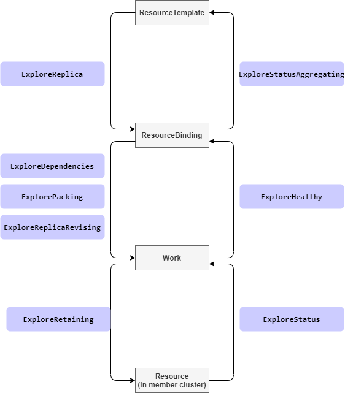

# Resource Exploring Webhook

## Summary

In the progress of a resource(as known as `resource template`) propagating to cluster, Karmada take actions according to
the resource definition. For example, at the phase of building `ResourceBinding`, the `karmada-controller` will parse 
the `replicas` from resource templates like `deployments` but do nothing for resources that don't have `replicas`. 

For the Kubernetes native resources, Karmada knows how to parse them. But for custom resource type, as lack of the 
knowledge of the structure, Karmada treat the custom resource type as a general resource.

This proposal aims to provide a solution for users to teach Karmada to learn their custom resources.

## Motivation

Nowadays, lots of people or projects extend Kubernetes by `Custom Resource Defination`. In order to propagate the 
custom resources, Karmada has to learn the structure of the custom resource.

### Goals

- Provide a solution to support custom resources by teaching Karmada the resource structure.

### Non-Goals

## Proposal

### User Stories

#### As a user, I want to propagate my custom resource(workload type with replicas) to leverage the Karmada replica scheduling capabilities.

I have a custom resource which extremely similar with `deployments`, it has a `replica` field as well, I want to `divide`
the replicas to multiple clusters by declaring a `ReplicaScheduling` rule.

> In this scenario, as lack of knowledge of the custom resource, Karmada can't grab it's `replica`.

#### As a user, I want to customize the retain method for my CRD resources.

I have a custom resource which reconciling by a controller running in member clusters. The controllers would make changes
to the resource(such as update status), I wish Karmada could retain the changes make by my controller.

> In this sceanrio, as lack of knowledge of the custom resource, Karmada might can't retain the custom resource correctly.
> Thus, the resource might be changed back and forth by Karmada and it's controller.

### Notes/Constraints/Caveats (Optional)

### Risks and Mitigations

## Design Details

Inspire of the [Kubernetes Admission webhook][1], we propose a webhook called `ResourceExploringWebhook` which contains:
- A configuration API `ResourceExploringWebhookConfiguration` to declare the enabled webhooks.
- A review API `ExploreReview` to declare the request and response between Karmada and webhooks.

In the `ResourceExploringWebhookConfiguration` API, the `OperationType` represents the request that Karmada might call
the webhooks in the whole propagating process.



### New ResourceExploringWebhookConfiguration API

We propose a new CR in `config.karmada.io` group.

```golang
type ResourceExploringWebhookConfiguration struct {
	metav1.TypeMeta   `json:",inline"`
	metav1.ObjectMeta `json:"metadata,omitempty"`
	// Webhooks is a list of webhooks and the affected resources and operations.
	// +required
	Webhooks []ResourceExploringWebhook `json:"webhooks"`
}

// ResourceExploringWebhook describes the webhook as well as the resources and operations it applies to.
type ResourceExploringWebhook struct {
	// Name is the full-qualified name of the webhook.
	// +required
	Name string `json:"name"`

	// ClientConfig defines how to communicate with the hook.
	// +required
	ClientConfig admissionregistrationv1.WebhookClientConfig `json:"clientConfig"`

	// Rules describes what operations on what resources the webhook cares about.
	// The webhook cares about an operation if it matches any Rule.
	// +optional
	Rules []RuleWithOperations `json:"rules,omitempty"`

	// FailurePolicy defines how unrecognized errors from the webhook are handled,
	// allowed values are Ignore or Fail. Defaults to Fail.
	// +optional
	FailurePolicy *admissionregistrationv1.FailurePolicyType `json:"failurePolicy,omitempty"`

	// TimeoutSeconds specifies the timeout for this webhook. After the timeout passes,
	// the webhook call will be ignored or the API call will fail based on the
	// failure policy.
	// The timeout value must be between 1 and 30 seconds.
	// Default to 10 seconds.
	// +optional
	TimeoutSeconds *int32 `json:"timeoutSeconds,omitempty"`

	// ExploreReviewVersions is an ordered list of preferred `ExploreReview`
	// versions the Webhook expects. Karmada will try to use first version in
	// the list which it supports. If none of the versions specified in this list
	// supported by Karmada, validation will fail for this object.
	// If a persisted webhook configuration specifies allowed versions and does not
	// include any versions known to the Karmada, calls to the webhook will fail
	// and be subject to the failure policy.
	ExploreReviewVersions []string `json:"exploreReviewVersions"`
}

// RuleWithOperations is a tuple of Operations and Resources. It is recommended to make
// sure that all the tuple expansions are valid.
type RuleWithOperations struct {
	// Operations is the operations the hook cares about.
	// If '*' is present, the length of the slice must be one.
	// +required
	Operations []OperationType `json:"operations"`

	// Rule is embedded, it describes other criteria of the rule, like
	// APIGroups, APIVersions, Resources, etc.
	admissionregistrationv1.Rule `json:",inline"`
}

// OperationType specifies an operation for a request.
type OperationType string

const (
	// ExploreReplica indicates that karmada want to figure out the replica declaration of a specific object.
	// Only necessary for those resource types that have replica declaration, like Deployment or similar custom resources.
	ExploreReplica OperationType = "ExploreReplica"

	// ExploreStatus indicates that karmada want to figure out how to get the status.
	// Only necessary for those resource types that define their status in a special path(not '.status').
	ExploreStatus OperationType = "ExploreStatus"

	// ExplorePacking indicates that karmada want to figure out how to package resource template to Work.
	ExplorePacking OperationType = "ExplorePacking"

	// ExploreReplicaRevising indicates that karmada request webhook to modify the replica.
	ExploreReplicaRevising OperationType = "ExploreReplicaRevising"

	// ExploreRetaining indicates that karmada request webhook to retain the desired resource template.
	// Only necessary for those resources which specification will be updated by their controllers running in member cluster.
	ExploreRetaining OperationType = "ExploreRetaining"

	// ExploreStatusAggregating indicates that karmada want to figure out how to aggregate status to resource template.
	// Only necessary for those resource types that want to aggregate status to resource template.
	ExploreStatusAggregating OperationType = "ExploreStatusAggregating"

	// ExploreHealthy indicates that karmada want to figure out the healthy status of a specific object.
	// Only necessary for those resource types that have and want to reflect their healthy status.
	ExploreHealthy OperationType = "ExploreHealthy"

	// ExploreDependencies indicates that karmada want to figure out the dependencies of a specific object.
	// Only necessary for those resource types that have dependencies resources and expect the dependencies be propagated
	// together, like Deployment depends on ConfigMap/Secret.
	ExploreDependencies OperationType = "ExploreDependencies"
)
```

### New ExploreReview API

```golang

// ExploreReview describes an explore review request and response.
type ExploreReview struct {
	metav1.TypeMeta `json:",inline"`
	// Request describes the attributes for the explore request.
	// +optional
	Request *ExploreRequest `json:"request,omitempty"`
	
    // Response describes the attributes for the explore response.
    // +optional
    Response *ExploreResponse `json:"response,omitempty"`
}

// ExploreRequest describes the explore.Attributes for the explore request.
type ExploreRequest struct {
	// UID is an identifier for the individual request/response.
	// The UID is meant to track the round trip (request/response) between the karmada and the WebHook, not the user request.
	// It is suitable for correlating log entries between the webhook and karmada, for either auditing or debugging.
	// +required
	UID types.UID `json:"uid"`

	// Kind is the fully-qualified type of object being submitted (for example, v1.Pod or autoscaling.v1.Scale)
	// +required
	Kind metav1.GroupVersionKind `json:"kind"`

	// Name is the name of the object as presented in the request.
	// +required
	Name string `json:"name"`

	// Namespace is the namespace associated with the request (if any).
	// +optional
	Namespace string `json:"namespace,omitempty"`

	// Operation is the operation being performed.
	// +required
	Operation OperationType `json:"operation"`

	// Object is the object from the incoming request.
	// +optional
	Object runtime.RawExtension `json:"object,omitempty"`

	// DesiredReplicas represents the desired pods number which webhook should revise with.
	// It'll be set only if OperationType is ExploreReplicaRevising.
	// +optional
	DesiredReplicas *int32 `json:"replicas,omitempty"`

	// AggregatedStatus represents status list of the resource running in each member cluster.
	// +optional
	AggregatedStatus []AggregatedStatusItem `json:"aggregatedStatus,omitempty"`
}

// AggregatedStatusItem represents status of the resource running in a member cluster.
type AggregatedStatusItem struct {
	// ClusterName represents the member cluster name which the resource deployed on.
	// +required
	ClusterName string `json:"clusterName"`

	// Status reflects running status of current manifest.
	// +kubebuilder:pruning:PreserveUnknownFields
	// +optional
	Status *runtime.RawExtension `json:"status,omitempty"`
	// Applied represents if the resource referencing by ResourceBinding or ClusterResourceBinding
	// is successfully applied on the cluster.
	// +optional
	Applied bool `json:"applied,omitempty"`

	// AppliedMessage is a human readable message indicating details about the applied status.
	// This is usually holds the error message in case of apply failed.
	// +optional
	AppliedMessage string `json:"appliedMessage,omitempty"`
}

// ExploreResponse describes an explore response.
type ExploreResponse struct {
	// UID is an identifier for the individual request/response.
	// This must be copied over from the corresponding ExploreRequest.
	// +required
	UID types.UID `json:"uid"`

	// The patch body. We only support "JSONPatch" currently which implements RFC 6902.
	// +optional
	Patch []byte `json:"patch,omitempty"`

	// The type of Patch. We only allow "JSONPatch" currently.
	// +optional
	PatchType *PatchType `json:"patchType,omitempty" protobuf:"bytes,5,opt,name=patchType"`

	// ReplicaRequirements represents the requirements required by each replica.
	// Required if OperationType is ExploreReplica.
	// +optional
	ReplicaRequirements *ReplicaRequirements `json:"replicaRequirements,omitempty"`

	// Replicas represents the number of desired pods. This is a pointer to distinguish between explicit
	// zero and not specified.
	// Required if OperationType is ExploreReplica.
	// +optional
	Replicas *int32 `json:"replicas,omitempty"`

	// Dependencies represents the reference of dependencies object.
	// Required if OperationType is ExploreDependencies.
	// +optional
	Dependencies []DependentObjectReference `json:"dependencies,omitempty"`

	// Status represents the referencing object's status.
	// +optional
	Status *runtime.RawExtension `json:"status,omitempty"`

	// Healthy represents the referencing object's healthy status.
	// +optional
	Healthy *bool `json:"healthy,omitempty"`
}

// PatchType is the type of patch being used to represent the mutated object
type PatchType string

const (
	PatchTypeJSONPatch PatchType = "JSONPatch"
)

// ReplicaRequirements represents the requirements required by each replica.
type ReplicaRequirements struct {
	// NodeClaim represents the node claim HardNodeAffinity, NodeSelector and Tolerations required by each replica.
	// +optional
	NodeClaim *NodeClaim `json:"nodeClaim,omitempty"`

	// ResourceRequest represents the resources required by each replica.
	// +optional
	ResourceRequest corev1.ResourceList `json:"resourceRequest,omitempty"`
}

// NodeClaim represents the node claim HardNodeAffinity, NodeSelector and Tolerations required by each replica.
type NodeClaim struct {
	// A node selector represents the union of the results of one or more label queries over a set of
	// nodes; that is, it represents the OR of the selectors represented by the node selector terms.
	// Note that only PodSpec.Affinity.NodeAffinity.RequiredDuringSchedulingIgnoredDuringExecution
	// is included here because it has a hard limit on pod scheduling.
	// +optional
	HardNodeAffinity *corev1.NodeSelector `json:"hardNodeAffinity,omitempty"`
	// NodeSelector is a selector which must be true for the pod to fit on a node.
	// Selector which must match a node's labels for the pod to be scheduled on that node.
	// +optional
	NodeSelector map[string]string `json:"nodeSelector,omitempty"`
	// If specified, the pod's tolerations.
	// +optional
	Tolerations []corev1.Toleration `json:"tolerations,omitempty"`
}

// DependentObjectReference contains enough information to locate the referenced object inside current cluster.
type DependentObjectReference struct {
	// APIVersion represents the API version of the referent.
	// +required
	APIVersion string `json:"apiVersion"`

	// Kind represents the Kind of the referent.
	// +required
	Kind string `json:"kind"`

	// Namespace represents the namespace for the referent.
	// For non-namespace scoped resources(e.g. 'ClusterRole')，do not need specify Namespace,
	// and for namespace scoped resources, Namespace is required.
	// If Namespace is not specified, means the resource is non-namespace scoped.
	// +optional
	Namespace string `json:"namespace,omitempty"`

	// Name represents the name of the referent.
	// +required
	Name string `json:"name"`
}
```

### Example
#### Configuration
The example below show two webhooks configuration.
The `foo.example.com` webhook serves for `foos` under `foo.example.com` group and implemented `ExploreRetaining` and 
`ExploreHealthy` operations.
The `bar.example.com` webhook serves for `bars` under `bar.example.com` group and implemented `ExploreDependencies` and 
`ExploreHealthy` operations.

```yaml
apiVersion: config.karmada.io/v1alpha1
kind: ResourceExploringWebhookConfiguration
metadata:
  name: example
webhooks:
  - name: foo.example.com
    rules:
      - operations: ["ExploreRetaining", "ExploreHealthy"]
        apiGroups: ["foo.example.com"]
        apiVersions: ["*"]
        resources: ["foos"]
        scope: "Namespaced"
    clientConfig:
      url: https://xxx:443/explore-foo
      caBundle: {{caBundle}}
    failurePolicy: Fail
    exploreReviewVersions: ["v1alpha1"]
    timeoutSeconds: 3
  - name: bar.example.com
    rules:
      - operations: ["ExploreDependencies", "ExploreHealthy"]
        apiGroups: ["bar.example.com"]
        apiVersions: ["*"]
        resources: ["bars"]
        scope: "Cluster"
    clientConfig:
      url: https://xxx:443/explore-bar
      caBundle: {{caBundle}}
    failurePolicy: Fail
    exploreReviewVersions: ["v1alpha1"]
    timeoutSeconds: 3
```
#### Request and Response
Take `ExploreHealthy` for example, Karmada will send the request like:
```yaml
apiVersion: config.karmada.io/v1alpha1
kind: ExploreReview
request:
  - uid: xxx
  - Kind:
    - group: foo.example.com
      version: v1alpha1
      Kind: Foo
  - name: foo
  - namespace: default
  - operation: ExploreHealthy
  - object: <raw data of the object>
```

And the response like:
```yaml
apiVersion: config.karmada.io/v1alpha1
kind: ExploreReview
response:
  - uid: xxx(same uid in the request)
  - healthy: true
```

### Test Plan

- Propose E2E test cases according the operations described above.

## Alternatives

The proposal [Configurable Local Value Retention][2] described a solution to retain custom resource, but the 
configuration would be a little complex to users.


[1]: https://kubernetes.io/docs/reference/access-authn-authz/extensible-admission-controllers/
[2]: https://github.com/karmada-io/karmada/tree/master/docs/proposals/configurable-local-value-retention