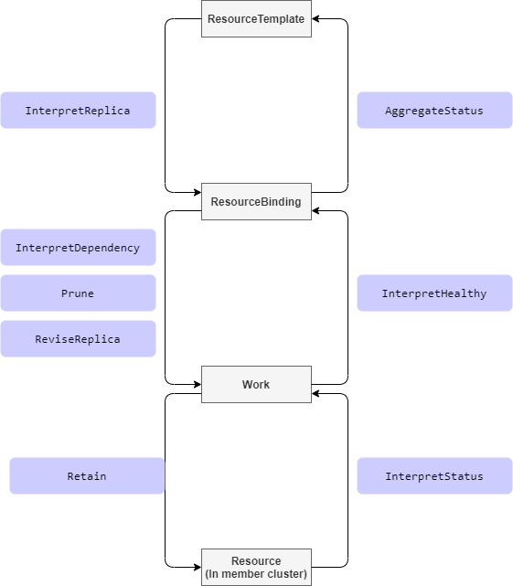

# Resource Interpreter Webhook

## Summary

In the progress of a resource(as known as `resource template`) propagating to cluster, Karmada take actions according to
the resource definition. For example, at the phase of building `ResourceBinding`, the `karmada-controller` will parse 
the `replicas` from resource templates like `deployments` but do nothing for resources that don't have `replicas`. 

For the Kubernetes native resources, Karmada knows how to parse them. But for custom resource type, as lack of the 
knowledge of the structure, Karmada treat the custom resource type as a general resource.

This proposal aims to provide a solution for users to teach Karmada to learn their custom resources.

## Motivation

Nowadays, lots of people or projects extend Kubernetes by `Custom Resource Definition`. In order to propagate the 
custom resources, Karmada has to learn the structure of the custom resource.

### Goals

- Provide a solution to support custom resources by teaching Karmada the resource structure.

### Non-Goals

## Proposal

### User Stories

#### As a user, I want to propagate my custom resource(workload type with replicas) to leverage the Karmada replica scheduling capabilities.

I have a custom resource which extremely similar with `deployments`, it has a `replica` field as well, I want to `divide`
the replicas to multiple clusters by declaring a `ReplicaScheduling` rule.

> Without this framework, as lack of knowledge of the custom resource, Karmada can't grab it's `replica`.

#### As a user, I want to customize the retain method for my CRD resources.

I have a custom resource which reconciling by a controller running in member clusters. The controllers would make changes
to the resource(such as update some fields in .spec), I wish Karmada could retain the changes made by my controller.

> Without this framework, as lack of knowledge of the custom resource, Karmada might can't retain the custom resource correctly.
> Thus, the resource might be changed back and forth by Karmada and it's controller.

### Notes/Constraints/Caveats (Optional)

### Risks and Mitigations

## Design Details

Inspire of the [Kubernetes Admission webhook][1], we propose a webhook called `ResourceInterpreterWebhook` which contains:
- A configuration API `ResourceInterpreterWebhookConfiguration` to declare the enabled webhooks.
- A message API `ResourceInterpreterContext` to declare the request and response between Karmada and webhooks.

In the `ResourceInterpreterWebhookConfiguration` API, the `InterpreterOperation` represents the request that Karmada 
might call the webhooks in the whole propagating process.



### New ResourceInterpreterWebhookConfiguration API

We propose a new CR in `config.karmada.io` group.

```golang
// ResourceInterpreterWebhookConfiguration describes the configuration of webhooks which take the responsibility to
// tell karmada the details of the resource object, especially for custom resources.
type ResourceInterpreterWebhookConfiguration struct {
	metav1.TypeMeta   `json:",inline"`
	metav1.ObjectMeta `json:"metadata,omitempty"`

	// Webhooks is a list of webhooks and the affected resources and operations.
	// +required
	Webhooks []ResourceInterpreterWebhook `json:"webhooks"`
}

// ResourceInterpreterWebhook describes the webhook as well as the resources and operations it applies to.
type ResourceInterpreterWebhook struct {
	// Name is the full-qualified name of the webhook.
	// +required
	Name string `json:"name"`

	// ClientConfig defines how to communicate with the hook.
	// +required
	ClientConfig admissionregistrationv1.WebhookClientConfig `json:"clientConfig"`

	// Rules describes what operations on what resources the webhook cares about.
	// The webhook cares about an operation if it matches any Rule.
	// +optional
	Rules []RuleWithOperations `json:"rules,omitempty"`

	// TimeoutSeconds specifies the timeout for this webhook. After the timeout passes,
	// the webhook call will be ignored or the API call will fail based on the
	// failure policy.
	// The timeout value must be between 1 and 30 seconds.
	// Default to 10 seconds.
	// +optional
	TimeoutSeconds *int32 `json:"timeoutSeconds,omitempty"`

	// InterpreterContextVersions is an ordered list of preferred `ResourceInterpreterContext`
	// versions the Webhook expects. Karmada will try to use first version in
	// the list which it supports. If none of the versions specified in this list
	// supported by Karmada, validation will fail for this object.
	// If a persisted webhook configuration specifies allowed versions and does not
	// include any versions known to the Karmada, calls to the webhook will fail
	// and be subject to the failure policy.
	InterpreterContextVersions []string `json:"interpreterContextVersions"`
}

// RuleWithOperations is a tuple of Operations and Resources. It is recommended to make
// sure that all the tuple expansions are valid.
type RuleWithOperations struct {
	// Operations is the operations the hook cares about.
	// If '*' is present, the length of the slice must be one.
	// +required
	Operations []InterpreterOperation `json:"operations"`

	// Rule is embedded, it describes other criteria of the rule, like
	// APIGroups, APIVersions, Kinds, etc.
	Rule `json:",inline"`
}

// InterpreterOperation specifies an operation for a request.
type InterpreterOperation string

const (
	// InterpreterOperationAll indicates math all InterpreterOperation.
	InterpreterOperationAll InterpreterOperation = "*"

	// InterpreterOperationInterpretReplica indicates that karmada want to figure out the replica declaration of a specific object.
	// Only necessary for those resource types that have replica declaration, like Deployment or similar custom resources.
	InterpreterOperationInterpretReplica InterpreterOperation = "InterpretReplica"

	// InterpreterOperationReviseReplica indicates that karmada request webhook to modify the replica.
	InterpreterOperationReviseReplica InterpreterOperation = "ReviseReplica"

	// InterpreterOperationInterpretStatus indicates that karmada want to figure out how to get the status.
	// Only necessary for those resource types that define their status in a special path(not '.status').
	InterpreterOperationInterpretStatus InterpreterOperation = "InterpretStatus"

	// InterpreterOperationPrune indicates that karmada want to figure out how to package resource template to Work.
	InterpreterOperationPrune InterpreterOperation = "Prune"

	// InterpreterOperationRetain indicates that karmada request webhook to retain the desired resource template.
	// Only necessary for those resources which specification will be updated by their controllers running in member cluster.
	InterpreterOperationRetain InterpreterOperation = "Retain"

	// InterpreterOperationAggregateStatus indicates that karmada want to figure out how to aggregate status to resource template.
	// Only necessary for those resource types that want to aggregate status to resource template.
	InterpreterOperationAggregateStatus InterpreterOperation = "AggregateStatus"

	// InterpreterOperationInterpretHealth indicates that karmada want to figure out the health status of a specific object.
	// Only necessary for those resource types that have and want to reflect their health status.
	InterpreterOperationInterpretHealth InterpreterOperation = "InterpretHealth"

	// InterpreterOperationInterpretDependency indicates that karmada want to figure out the dependencies of a specific object.
	// Only necessary for those resource types that have dependencies resources and expect the dependencies be propagated
	// together, like Deployment depends on ConfigMap/Secret.
	InterpreterOperationInterpretDependency InterpreterOperation = "InterpretDependency"
)

// Rule is a tuple of APIGroups, APIVersion, and Kinds.
type Rule struct {
	// APIGroups is the API groups the resources belong to. '*' is all groups.
	// If '*' is present, the length of the slice must be one.
	// For example:
	//  ["apps", "batch", "example.io"] means matches 3 groups.
	//  ["*"] means matches all group
	//
	// Note: The group could be empty, e.g the 'core' group of kubernetes, in that case use [""].
	// +required
	APIGroups []string `json:"apiGroups"`

	// APIVersions is the API versions the resources belong to. '*' is all versions.
	// If '*' is present, the length of the slice must be one.
	// For example:
	//  ["v1alpha1", "v1beta1"] means matches 2 versions.
	//  ["*"] means matches all versions.
	// +required
	APIVersions []string `json:"apiVersions"`

	// Kinds is a list of resources this rule applies to.
	// If '*' is present, the length of the slice must be one.
	// For example:
	//  ["Deployment", "Pod"] means matches Deployment and Pod.
	//  ["*"] means apply to all resources.
	// +required
	Kinds []string `json:"kinds"`
}
```

### New ResourceInterpreterContext API

```golang
// ResourceInterpreterContext describes an interpreter context request and response.
type ResourceInterpreterContext struct {
	metav1.TypeMeta `json:",inline"`

	// Request describes the attributes for the interpreter request.
	// +optional
	Request *ResourceInterpreterRequest `json:"request,omitempty"`

	// Response describes the attributes for the interpreter response.
	// +optional
	Response *ResourceInterpreterResponse `json:"response,omitempty"`
}

// ResourceInterpreterRequest describes the interpreter.Attributes for the interpreter request.
type ResourceInterpreterRequest struct {
	// UID is an identifier for the individual request/response.
	// The UID is meant to track the round trip (request/response) between the karmada and the WebHook, not the user request.
	// It is suitable for correlating log entries between the webhook and karmada, for either auditing or debugging.
	// +required
	UID types.UID `json:"uid"`

	// Kind is the fully-qualified type of object being submitted (for example, v1.Pod or autoscaling.v1.Scale)
	// +required
	Kind metav1.GroupVersionKind `json:"kind"`

	// Name is the name of the object as presented in the request.
	// +required
	Name string `json:"name"`

	// Namespace is the namespace associated with the request (if any).
	// +optional
	Namespace string `json:"namespace,omitempty"`

	// Operation is the operation being performed.
	// +required
	Operation InterpreterOperation `json:"operation"`

	// Object is the object from the incoming request.
	// +optional
	Object runtime.RawExtension `json:"object,omitempty"`

	// ObservedObject is the object observed from the kube-apiserver of member clusters.
	// Not nil only when InterpreterOperation is InterpreterOperationRetain.
	// +optional
	ObservedObject *runtime.RawExtension `json:"observedObject,omitempty"`

	// DesiredReplicas represents the desired pods number which webhook should revise with.
	// It'll be set only if InterpreterOperation is InterpreterOperationReviseReplica.
	// +optional
	DesiredReplicas *int32 `json:"replicas,omitempty"`

	// AggregatedStatus represents status list of the resource running in each member cluster.
	// +optional
	AggregatedStatus []workv1alpha1.AggregatedStatusItem `json:"aggregatedStatus,omitempty"`
}

// ResourceInterpreterResponse describes an interpreter response.
type ResourceInterpreterResponse struct {
	// UID is an identifier for the individual request/response.
	// This must be copied over from the corresponding ResourceInterpreterRequest.
	// +required
	UID types.UID `json:"uid"`

	// Successful indicates whether the request be processed successfully.
	// +required
	Successful bool `json:"successful"`

	// Status contains extra details information about why the request not successful.
	// This filed is not consulted in any way if "Successful" is "true".
	// +optional
	Status *RequestStatus `json:"status,omitempty"`

	// The patch body. We only support "JSONPatch" currently which implements RFC 6902.
	// +optional
	Patch []byte `json:"patch,omitempty"`

	// The type of Patch. We only allow "JSONPatch" currently.
	// +optional
	PatchType *PatchType `json:"patchType,omitempty" protobuf:"bytes,5,opt,name=patchType"`

	// ReplicaRequirements represents the requirements required by each replica.
	// Required if InterpreterOperation is InterpreterOperationInterpretReplica.
	// +optional
	ReplicaRequirements *workv1alpha2.ReplicaRequirements `json:"replicaRequirements,omitempty"`

	// Replicas represents the number of desired pods. This is a pointer to distinguish between explicit
	// zero and not specified.
	// Required if InterpreterOperation is InterpreterOperationInterpretReplica.
	// +optional
	Replicas *int32 `json:"replicas,omitempty"`

	// Dependencies represents the reference of dependencies object.
	// Required if InterpreterOperation is InterpreterOperationInterpretDependency.
	// +optional
	Dependencies []DependentObjectReference `json:"dependencies,omitempty"`

	// RawStatus represents the referencing object's status.
	// +optional
	RawStatus *runtime.RawExtension `json:"rawStatus,omitempty"`

	// Healthy represents the referencing object's healthy status.
	// +optional
	Healthy *bool `json:"healthy,omitempty"`
}

// RequestStatus holds the status of a request.
type RequestStatus struct {
	// Message is human-readable description of the status of this operation.
	// +optional
	Message string `json:"message,omitempty"`

	// Code is the HTTP return code of this status.
	// +optional
	Code int32 `json:"code,omitempty"`
}

// PatchType is the type of patch being used to represent the mutated object
type PatchType string

const (
	// PatchTypeJSONPatch represents the JSONType.
	PatchTypeJSONPatch PatchType = "JSONPatch"
)

// DependentObjectReference contains enough information to locate the referenced object inside current cluster.
type DependentObjectReference struct {
	// APIVersion represents the API version of the referent.
	// +required
	APIVersion string `json:"apiVersion"`

	// Kind represents the Kind of the referent.
	// +required
	Kind string `json:"kind"`

	// Namespace represents the namespace for the referent.
	// For non-namespace scoped resources(e.g. 'ClusterRole')，do not need specify Namespace,
	// and for namespace scoped resources, Namespace is required.
	// If Namespace is not specified, means the resource is non-namespace scoped.
	// +optional
	Namespace string `json:"namespace,omitempty"`

	// Name represents the name of the referent.
	// +required
	Name string `json:"name"`
}
```

### Example
#### Configuration
The example below show two webhooks configuration.
The `foo.example.com` webhook serves for `foos` under `foo.example.com` group and implemented `Retain` and 
`InterpretHealth` operations.
The `bar.example.com` webhook serves for `bars` under `bar.example.com` group and implemented `InterpretDependency` and 
`InterpretHealth` operations.

```yaml
apiVersion: config.karmada.io/v1alpha1
kind: ResourceInterpreterWebhookConfiguration
metadata:
  name: example
webhooks:
  - name: foo.example.com
    rules:
      - operations: ["Retain", "InterpretHealth"]
        apiGroups: ["foo.example.com"]
        apiVersions: ["*"]
        kinds: ["Foo"]
        scope: "Namespaced"
    clientConfig:
      url: https://xxx:443/explore-foo
      caBundle: {{caBundle}}
    exploreReviewVersions: ["v1alpha1"]
    timeoutSeconds: 3
  - name: bar.example.com
    rules:
      - operations: ["InterpretDependency", "InterpretHealth"]
        apiGroups: ["bar.example.com"]
        apiVersions: ["*"]
        kinds: ["Bar"]
        scope: "Cluster"
    clientConfig:
      url: https://xxx:443/explore-bar
      caBundle: {{caBundle}}
    exploreReviewVersions: ["v1alpha1"]
    timeoutSeconds: 3
```
#### Request and Response
Take `InterpretHealth` for example, Karmada will send the request like:
```yaml
apiVersion: config.karmada.io/v1alpha1
kind: ResourceInterpreterContext
request:
  - uid: xxx
  - Kind:
    - group: foo.example.com
      version: v1alpha1
      Kind: Foo
  - name: foo
  - namespace: default
  - operation: InterpretHealth
  - object: <raw data of the object>
```

And the response like:
```yaml
apiVersion: config.karmada.io/v1alpha1
kind: ResourceInterpreterContext
response:
  - uid: xxx(same uid in the request)
  - healthy: true
```

### Test Plan

- Propose E2E test cases according the operations described above.

## Alternatives

The proposal [Configurable Local Value Retention][2] described a solution to retain custom resource, but the 
configuration would be a little complex to users.


[1]: https://kubernetes.io/docs/reference/access-authn-authz/extensible-admission-controllers/
[2]: https://github.com/karmada-io/karmada/tree/master/docs/proposals/configurable-local-value-retention
