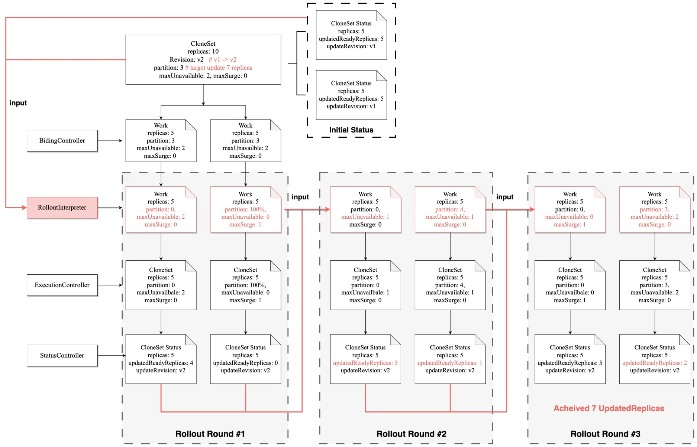
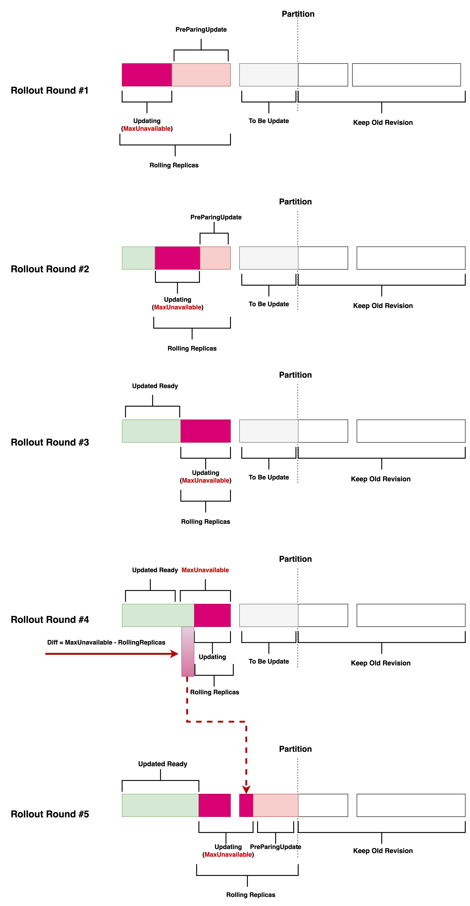

# Rollout Interpreter Mechanism for Workload

<!--
This is the title of your KEP. Keep it short, simple, and descriptive. A good
title can help communicate what the KEP is and should be considered as part of
any review.
-->

## Summary

<!--
This section is incredibly important for producing high-quality, user-focused
documentation such as release notes or a development roadmap. 

A good summary is probably at least a paragraph in length.
-->

A Stable, Reliable, Predictable rollout mechanism is the cornerstone of releases and changes in production environment.

## Motivation

<!--
This section is for explicitly listing the motivation, goals, and non-goals of
this KEP.  Describe why the change is important and the benefits to users.
-->

Karmada's current workload synchronization mechanism is basic, causing major of workloads to lose their native semantic of some fileds(e.g., `maxUnavailble`/`partition`) about rollout. This crude synchronization mechanism renders the rollout process of workloads in Karmada unpredictable and unsafe, thereby significantly hindering the practical implementation of Karmada's comprehensive solution in real-world production environments.
For example, under the current workload synchronization mechanism, if a federated workload with `maxUnavailable: 5` is spread across 10 clusters, it might inadvertently make 50 Pods unavailable instead of the intended 5, threatening deployment stability.
These issues pose barriers to Karmada's enterprise adoption, as they undermine the precise control needed for reliable, compliant deployment in production environments. Refining synchronization to handle complex deployment mechanism is essential for Karmada's wider acceptance.

### Goals

<!--
List the specific goals of the KEP. What is it trying to achieve? How will we
know that this has succeeded?
-->

- Provide a mechanism that ensures the Rollout-related semantics such as `MaxUnavailable`, `MaxSurge`, and `Partition` for the majority of workload types.
- Provide implementations of this mechanism for frequently used workloads such as Deployment and CloneSet.

### Non-Goals

<!--
What is out of scope for this KEP? Listing non-goals helps to focus discussion
and make progress.
-->

- Provide federated support for Rollout Strategies like Argo-Rollout, Flagger, and Kruise-Rollout.

## Proposal

<!--
This is where we get down to the specifics of what the proposal actually is.
This should have enough detail that reviewers can understand exactly what
you're proposing, but should not include things like API designs or
implementation. What is the desired outcome and how do we measure success?.
The "Design Details" section below is for the real
nitty-gritty.
-->

### User Stories 

<!--
Detail the things that people will be able to do if this KEP is implemented.
Include as much detail as possible so that people can understand the "how" of
the system. The goal here is to make this feel real for users without getting
bogged down.
-->

#### Story #1: Deployment Rolling Update with 2 maxUnavailable and 1 maxSurge

```yaml
apiVersion: apps/v1
kind: Deployment
metadata:
  name: demo
spec:
  replicas: 10
  strategy:
    rollingUpdate:
      maxUnavailable: 2
      maxSurge: 1
  template:
    metadata:
      labels:
        app: demo
    spec:
      containers:
        - name: main
          image: nginx:v2 # upgrade rollout-demo from V1 -> V2
  selector:
    matchLabels:
      app: demo
---
apiVersion: karmada.io/v1alpha2
kind: ResourceBinding
metadata:
  name: demo-deployment
spec:
  clusters: # scheduled to 2 clusters
    - name: cluster-1
      replicas: 4
    - name: cluster-2
      replicas: 6
```

We expect that the Deployment Rolling Update with 2 maxUnavailable and 1 maxSurge will be scheduled to 2 clusters, and the rollout process will be consistent with the semantics in a single-cluster setting.
During rolling processing, the number of available pods is not less than 8, and the number of Pods will not exceed 11.

#### Story #2: Batch Release with Partition
```yaml
apiVersion: apps.kruise.io/v1alpha1
kind: CloneSet
metadata:
  name: demo
spec:
  replicas: 10
  updateStrategy:
    partition: 4
    maxUnavailable: 2
  template:
    metadata:
      labels:
        app: demo
    spec:
      containers:
        - name: main
          image: nginx:v2 # upgrade rollout-demo from V1 -> V2
  selector:
    matchLabels:
      app: demo
---
apiVersion: karmada.io/v1alpha2
kind: ResourceBinding
metadata:
  name: demo-cloneset
spec:
  clusters: # scheduled to 2 clusters
    - name: cluster-1
      replicas: 3
    - name: cluster-2
      replicas: 7
```


We expect that the CloneSet cloud be paused when the number of Pods with the new image reaches 4, and the rollout process will be consistent with the semantics in a single-cluster setting. 
During rolling processing, the number of available pods is not less than 8.

### Risks and Mitigations

<!--
What are the risks of this proposal, and how do we mitigate? 

How will security be reviewed, and by whom?

How will UX be reviewed, and by whom?

Consider including folks who also work outside the SIG or subproject.
-->

- May further lengthen the release time for karmada workloads.

## Architecture
The primary approach involves using feedback from the StatusController on single-cluster workload statuses to derive the next rollout configurations. This ensures that throughout the Rollout process, rollout configurations such as `Partition`, `MaxUnavailable`, and `MaxSurge` maintain their original native meanings, and that the federated Rollout behavior aligns with single-cluster  practices.



- The `RolloutInterpreter` should be invoked prior to the `binding-controller` creating or updating the workloads in etcd.
  - **Input**: The `RolloutInterpreter` takes as input the `ResourceTemplate` in Karmada, detailing the federated workload's target configuration, and the Works from target clusters, collecting the real-time status of member workloads.  
  - **Output**: The `output` of `RolloutInterpreter` is the calculated `RollingStrategy`(e.g., `Partition`, `MaxUnavailable`) according to current status for each member workload, which help us to keep the rollout behavior consistent with single-cluster practices.

- The rollout is **a dynamic process of continuous reconciliation based on real-time status**, ensuring that the fundamental intent and rules established by the `RollingStrategy`, including parameters such as `partition` and `maxUnavailable`, remain consistent throughout the operation. So in our diagram, we illustrate the rollout process as consisting of **multiple rounds**  effectively communicate its iterative and staged character.

**An example for rollout alignment:**


## Changes required

<!--
This section should contain enough information that the specifics of your
change are understandable. This may include API specs (though not always
required) or even code snippets. If there's any ambiguity about HOW your
proposal will be implemented, this is the place to discuss them.
-->

### Code Changes required
- New Methods in Resource Interpreter

```golang
package resourceinterpreter

import "k8s.io/apimachinery/pkg/runtime/schema"

type RollingStrategy struct {
  // Paused = true indicates that the workload rolling update is paused.
  Paused *bool `json:"paused,omitempty"`

  // Partition is the desired number or percent of Pods in old revisions.
  // For example:
  // - Replicas=5 and Partition=2 means that the controller will keep 2
  //   Pods in old revisions and 3 Pods in new revisions.
  //
  // Refer to https://openkruise.io/docs/user-manuals/cloneset#partition
  Partition *intstr.IntOrString `json:"partition,omitempty" json:"partition,omitempty"`

  // MaxUnavailable is an optional field that specifies the maximum number of
  // Pods that can be unavailable during the update process.
  // Refer to https://kubernetes.io/docs/concepts/workloads/controllers/deployment/#max-unavailable
  MaxUnavailable *intstr.IntOrString `json:"maxUnavailable,omitempty" json:"maxUnavailable,omitempty"`

  // MaxSurge is an optional field that specifies the maximum number of Pods
  // that can be created over the desired number of Pods.
  // Refer to https://kubernetes.io/docs/concepts/workloads/controllers/deployment/#max-surge
  MaxSurge *intstr.IntOrString `json:"maxSurge,omitempty" json:"maxSurge,omitempty"`
}

type UnifiedRollingStatus struct {
  // Generation is a sequence number representing a specific generation of the desired state. Set by the system and monotonically increasing, per-resource. May be compared, such as for RAW and WAW consistency.
  // Refer to https://github.com/kubernetes/community/blob/master/contributors/devel/sig-architecture/api-conventions.md#metadata
  Generation *int64 `json:"generation,omitempty"`

  // ObservedGeneration represent the most recent generation observed by the daemon set controller.
  ObservedGeneration *int64 `json:"observedGeneration,omitempty"`

  // ResourceTemplateGeneration represent the generation of the resource template of karmada resource.
  ResourceTemplateGeneration *int64 `json:"resourceTemplateGeneration,omitempty"`

  // Replicas is the number of Pods created by the controller.
  Replicas *int32 `json:"replicas,omitempty"`

  // ReadyReplicas is the number of Pods created by the controller that have a Ready Condition.
  ReadyReplicas *int32 `json:"readyReplicas,omitempty"`

  // AvailableReplicas is the number of Pods created by the controller that have a Ready Condition for at least minReadySeconds.
  AvailableReplicas *int32 `json:"availableReplicas,omitempty"`

  // UpdatedReplicas is the number of Pods created by the controller from the ReplicaSet version indicated by updateRevision.
  UpdatedReplicas *int32 `json:"updatedReplicas,omitempty"`

  // UpdatedReadyReplicas is the number of Pods created by the controller from the ReplicaSet version indicated by updateRevision and have a Ready Condition.
  UpdatedReadyReplicas *int32 `json:"updatedReadyReplicas,omitempty"`
}

type ResourceInterpreter interface {
	// CalculateTemplateHash return template hash for this object. For example, 'pod-template-hash' for Deployment/StatefulSet.
    CalculateTemplateHash(object *unstructured.Unstructured) (string, error)
  
	// GetRollingStrategy returns the rolling strategy of the object.
	GetRollingStrategy(object *unstructured.Unstructured) (rollingStrategy *configv1alpha1.RollingStrategy, err error)

	// ReviseRollingStrategy revises the rolling strategy of the given object.
	ReviseRollingStrategy(object *unstructured.Unstructured, rollingStrategy *configv1alpha1.RollingStrategy) (revisedObject *unstructured.Unstructured, err error)

	// InterpretRollingStatus interprets the raw status of the object as unified rolling status.
	InterpretRollingStatus(groupVersionKind schema.GroupVersionKind, rawStatus *runtime.RawExtension) (status *configv1alpha1.UnifiedRollingStatus, err error)
)
}
```

- New Interpreter for Rollout

```golang
package rolloutinterpreter

import "github.com/karmada-io/karmada/pkg/resourceinterpreter"

type RolloutInterpreter interface {
  AlignRollingStrategy(resourceTemplate *unstructured.Unstructured, workloads map[string]*unstructured.Unstructured, clusters []workv1alpha2.TargetCluster, works map[string]*workv1alpha1.Work) (map[string]*unstructured.Unstructured, error)
}

type statelessRolloutInterperter struct {
	resourceInterpreter resourceinterpreter.ResourceInterpreter
}

func (uri *statelessRolloutInterperter) ReviseRolloutConfigurations(resourceTemplate *unstructured.Unstructured, workloads *map[string]*unstructured.Unstructured, works map[string]*workv1alpha1.Work) (map[string]*unstructured.Unstructured, error) {
	targetRollingStrategy, err := uri.resourceInterpreter.GetRollingStrategy(resourceTemplate)
	//... ...
    
    memberWorkloadStatus, err := func() (map[string]resourceinterpreter.UnifiedRollingStatus, error) {
		workloadStatuses := make(map[string]resourceinterpreter.UnifiedRollingStatus, len(works))
		for _, work := range works {
		    workloadStatuses[work.Name], err  = uri.resourceInterpreter.InterpretRollingStatus(workloadGVK, workload.Status.Raw)
            //... ...
	    }
		return workloadStatuses, nil
	}()
    
    memberRollingStrategy, err := func() (map[string]resourceinterpreter.RollingStrategy, error) {
		rollingStrategy := make(map[string]resourceinterpreter.RollingStrategy, len(works))
		/*
		   1. calculate partition for each workload if has partition interperter
		   2. calculate maxUnavailble for each workload if has maxUnavailable interperter
		   3. calculate maxSurge for each workload if has maxSurge interperter
		*/
        // ... ...
		return rollingStrategy, nil 
	}()
	
    //... ...
	modifiedWorkloads := make(map[string]*unstructured.Unstructured, len(workloads))
    for name, workload := range workloads {
		modifiedWorkloads[name], err = uri.resourceInterpreter.ReviseRollingStrategy(workload, &memberRollingStrategy[name])
		// ... ...
    }
	return modifiedWorkloads, nil
}
```

- Binding Controller invoke the rollout interpreter before creating/updating to etcd
```golang
package binding

// ensureWork ensure Work to be created or updated.
func ensureWork(
	c client.Client, resourceInterpreter resourceinterpreter.ResourceInterpreter, resourceTemplate *unstructured.Unstructured,
	overrideManager overridemanager.OverrideManager, binding metav1.Object, scope apiextensionsv1.ResourceScope,
) error {
	.... ....

	// revise replicas for each target cluster
	workloads := map[string]*unstructured.Unstructured{}
	for _, cluster := range targetClusters {
		clone := resourceTemplate.DeepCopy()
		if needReviseReplicas(replicas, placement) {
			clone, err = resourceInterperter.ReviseReplicas()
			... ...
		}
		workloads[cluster.Name] = clone
	}

	// revise rollout configurations for each target workload
	// to align the rollout behavior with single-cluster practices
	if needReviseRolloutConfigurations(workload) {
		works, err := listWorksByClusters(targetClusters)
		... ...

		workloads, err = resourceInterperter.AlignRollingStrategy(resourceTemplate, workloads, targetClusters, works)
		... ...
	}

	// override and apply
	for _, cluster := range targetClusters {
		workload := workloads[cluster.Name]
		cops, ops, err := overrideManager.ApplyOverridePolicies(workload, cluster.Name)
		... ...

		err = CreateOrUpdateWork(c, workMeta, workload)
	}
	return nil
}
```

### Test Plan

<!--
**Note:** *Not required until targeted at a release.*

Consider the following in developing a test plan for this enhancement:
- Will there be e2e and integration tests, in addition to unit tests?
- How will it be tested in isolation vs with other components?

No need to outline all test cases, just the general strategy. Anything
that would count as tricky in the implementation, and anything particularly
challenging to test, should be called out.

-->

Implement two case in `User Stories` section in `e2e` to verify the rollout behavior of Deployment and CloneSet in a federated environment.