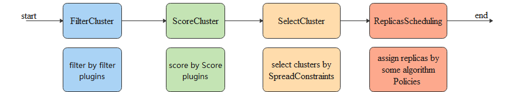

# Scheduler support plugin when AssignReplicas

## Background

<!--
我们目前正在将 Karmada 和 Volcano 相结合, 以此实现在多集群中调度计算任务, 目前我们大部分的问题都已经得到解决了.
比如任务的队列能力, 我们通过 Mutating Webhook, 来暂停新创建的 ResourceBinding, 然后通过我们自定义的 Controller 来将 ResourceBinding
按队列的要求进行逐个激活后交给 Karmada Scheduler.
任务的[优先级](https://github.com/karmada-io/karmada/pull/4993)能力我们也在 Karmada 社区中持续推进.

目前看来 Karmada 更多的聚焦在微服务的调度上, 而我们更针对的则是 AI 负载的调度.

Gang 调度我们任务必须要基于 Karmada Scheduler 来实现, 但是这就需要新增一种 AssignReplicas 策略, 目前 Karmada Scheduler
并没有开放 AssignReplicas 的拓展点, 所以我们希望让 Scheduler 支持在 AssignReplicas 阶段 能够有拓展点的呢能力.

同时这对 Karmada Scheduler 是有收益的, 如果用户需要增加自己的策略, 它不需要去修改 Karmada 的 API 或是 Scheduler,
他只需要通过拓展点来实现自己需要的调度逻辑即可, 相当于是一种 Out of Tree 的方式.
-->

We are currently integrating `Karmada` with `Volcano` to **schedule computational tasks across multiple clusters**.
Most of our issues have been resolved, such as task **queuing capabilities**.
We use a `Mutating Webhook` to pause newly created `ResourceBinding`
and then activate them one by one according to the queue requirements using our custom Controller,
handing them over to the `Karmada Scheduler`.

We are also continuously advancing the [priority capability](https://github.com/karmada-io/karmada/pull/4993) in the `Karmada community`.

It seems that `Karmada` focuses more on scheduling for microservices, while our focus is more on scheduling **AI workloads**.

For `Gang` scheduling, we must implement it based on the `Karmada Scheduler`, which requires a new `AssignReplicas` strategy.
Currently, the `Karmada Scheduler` does not offer an extension point for `AssignReplicas`.
Therefore, we hope the `Scheduler` can support an extension point at the `AssignReplicas` stage.

This would also benefit the `Karmada Scheduler`.
If users need to add their own strategies, they wouldn’t have to modify `Karmada API` or `Karmada Scheduler`.
They could simply implement their scheduling logic through the extension point, providing an **Out of Tree** approach.

Relevant content:
- https://github.com/karmada-io/karmada/issues/3318
- https://github.com/karmada-io/karmada/issues/3318#issuecomment-1682519228
- https://docs.google.com/document/d/1l6zO4xf879KdW_WPS7aMED0SUmnk487_XDsC12TtuTQ/edit?disco=AAAAv4FJT8E

## Summary

<!--
目前 Karmada scheduler 支持在 FilterCluster 和 ScoreCluster 阶段添加自定义插件,
但是在 SelectCluster 和 ReplicaScheduling(AssignReplicas) 阶段是不支持的,
我希望可以在 AssignReplicas 支持自定义插件的能力, 让用户有更多自己能够自定义的地方.

这里提供了一种 AssignReplicas 阶段增加自定义插件能力的设计方案, 尤其是对于多个插件不同结果(TargetCluster)的处理方式.
-->

Currently, the `Karmada scheduler` supports adding [custom plugins](https://karmada.io/docs/next/developers/customize-karmada-scheduler/)
during the `FilterCluster` and `ScoreCluster` stages,
but it does not support custom plugins during the `SelectCluster` and `ReplicaScheduling(AssignReplicas)` stages.
I hope to enable the capability for custom plugins in the
[AssignReplicas](https://github.com/Vacant2333/karmada/blob/0372cabba6f2e26346319aad8b8600de5acff832/pkg/scheduler/core/common.go#L42)
stage, allowing users more flexibility to customize.

We provide a design proposal for adding custom plugin capabilities during the `AssignReplicas` stage,
especially in terms of handling different results (TargetCluster) from multiple plugins.

### Goals

<!--
- 在 AssignReplicas 阶段支持自定义插件
- 在多个插件返回不同结果(TargetCluster)时可以合理处理
-->

- Support custom plugins in the `AssignReplicas` stage.
- Handle multiple plugins returning different results (TargetCluster) appropriately.

## Proposal

### User Story

#### Story 1: Support Gang scheduling

<!--
作为一个用户, 我希望 Karmada scheduler 能够配合 Volcano 支持 Gang 调度的一些特性.

目前的 Karmada Scheduler 的 AssignReplicas 阶段是不支持 MinAvailable 的.
在 Volcano 中, Job 包含一个特殊的字段 MinAvailable, 它代表该 Job 运行所需最小的 Replica 数量,
在它和Replica之和不一致的情况下, Job 允许的 Replica 数量就成为了一个区间 [MinAvailable, Sum of Job Replicas]
但是在 Karmada scheduler 的 AssignReplicas 逻辑中, 如果无法达到目标要求的 Replica 数量, 则会拒绝调度.
我们希望通过添加一个插件(gang), 当任务满足 MinAvailable 时返回一个合适的调度结果(TargetCluster).

同时, 对于一些多模版的任务可能会有额外的要求, 如 MapReduce 任务必须有 Master 被启动, 否则 Worker 会陷入无人领导的情况.
我们希望也可以通过 Karmada Scheduler 的拓展点来更好的支持这类任务.
-->

As a user, I would like the Karmada scheduler to support some features of Gang scheduling in collaboration with Volcano.

Currently, the `AssignReplicas` phase in `Karmada Scheduler` does not support `MinAvailable`.
In [Volcano](https://volcano.sh/en/), a `Job` contains a special field,
[MinAvailable](https://volcano.sh/en/docs/v1-9-0/vcjob/#minavailable), which represents the minimum number of Replicas required for
the `Job` to run. If this number does not match the sum of the `Job Replicas`, the allowed number of Replicas for
the `Job` becomes a range [MinAvailable, Sum of Job Replicas]. However, in the `AssignReplicas` logic of the `Karmada scheduler`,
if the target number of Replicas cannot be met,
[scheduling is rejected](https://github.com/Vacant2333/karmada/blob/0372cabba6f2e26346319aad8b8600de5acff832/pkg/scheduler/core/division_algorithm.go#L77).
We hope to add a plugin (gang) that returns an
appropriate scheduling result (TargetCluster) when the task meets the `MinAvailable` requirement.

Additionally, some **multi-template tasks** may have extra requirements.
For example, in [MapReduce/MPI](https://volcano.sh/en/docs/v1-9-0/mpi_on_volcano/) tasks,
a `Master` must be started; otherwise, the `Workers` will be left without leadership.
We hope to better support such tasks through the extension points of the `Karmada Scheduler`.

## Design Details

### Make AssignReplicas the default plugin logic

<!--
我们可以将目前的逻辑包装为 default AssignReplicas 插件的逻辑, 从而兼容 Karmada scheduler 之前的能力.
-->

We can encapsulate the current logic as the `default AssignReplicas plugin` logic, thereby maintaining compatibility
with the previous capabilities of the `Karmada scheduler`.

https://github.com/Vacant2333/karmada/blob/0372cabba6f2e26346319aad8b8600de5acff832/pkg/scheduler/core/common.go#L42

### Select the appropriate result(TargetCluster)

<!--
在面对多个插件返回不同结果的情况下, 选择合适的结果可以按照以下步骤进行:

1.验证结果的可用性: 逐个运行每个插件, 直到拿到一个返回的结果是 TargetReplicas 而不是 Error, 即提供足够的副本来满足资源需求.
只要有一个插件返回的结果能提供有效的 TargetReplicas, 即可认为该结果是可用的, 而不局限于 Replicas(必须达到的Replica数量) 的要求.

2.处理不足副本的情况: 如果所有插件都没有返回 TargetReplicas, 而是返回 Error 如资源不足, 那我们的此次调度将以返回 Error 结束.

3.优先级和顺序: 在多个插件都能返回 TargetReplicas 的情况下, 需要依据用户的偏好或预先设定的插件优先级来选择结果.
通常, 会按照用户指定的插件顺序, 逐一检查插件的返回值, 并在找到第一个满足要求的结果后立即返回。

我们可以参考之前提出优化 Scheduler 的文档:
https://docs.google.com/document/d/1l6zO4xf879KdW_WPS7aMED0SUmnk487_XDsC12TtuTQ/edit#heading=h.hxb7baf2u139
-->

When facing **multiple plugins returning different results**,
the appropriate result can be selected by following these steps:

1. Validate the result’s availability: Run each plugin one by one until a result that provides sufficient replicas to meet the resource `requirements (TargetReplicas)` is returned, rather than an `Error`. As long as one plugin returns a result with effective `TargetReplicas`, the result is considered available, without being restricted by the required Replicas (the minimum number of replicas).
2. Handling insufficient replicas: If none of the plugins return `TargetReplicas` and instead return `Errors` such as insufficient resources, then the scheduling will end with an `Error`.
3. Priority and order: If multiple plugins return `TargetReplicas`, the results should be selected based on user preferences or preset plugin priorities. Typically, the plugins’ return values are checked in the order specified by the user, and the first result that meets the requirements is immediately returned.

We can refer to the previously proposed document on **optimizing the Scheduler**:
https://docs.google.com/document/d/1l6zO4xf879KdW_WPS7aMED0SUmnk487_XDsC12TtuTQ/edit#heading=h.hxb7baf2u139

### How to Maintain/Manage Plugins

<!--
我们可以将 Karmada Scheduler 的插件进行类似 Kubernetes scheduler-plugins 的方式进行管理,
Scheduler 的插件将全部放在该仓库中, Karmada 和社区用户可以将他们自己编写的插件以及文档放在该仓库中,
在 Karmada 发版的时候只构建包括社区维护的默认插件, 如果用户需要, 它可以自己编写插件后放入到该仓库或是自己的仓库中,
然后重新构建 Karmada Scheduler 来包括需要的插件.
-->

My idea is to manage the plugins for `Karmada Scheduler` in a similar way to how `Kubernetes scheduler-plugins` are managed.
All scheduler plugins will be placed in this repository.
`Karmada` and `community users` can add their own plugins and documentation to this repository.
When `Karmada` releases a new version, only the default plugins maintained by the community will be built.
If users need additional functionality,
they can develop their own plugins and add them to this repository or their own repositories,
and then rebuild the `Karmada Scheduler` to achieve the desired extensibility.

Ref:
- https://github.com/kubernetes-sigs/scheduler-plugins
- https://github.com/kubernetes-sigs/scheduler-plugins/blob/master/cmd/scheduler/main.go

### Test Plan

TODO
