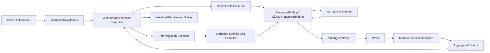
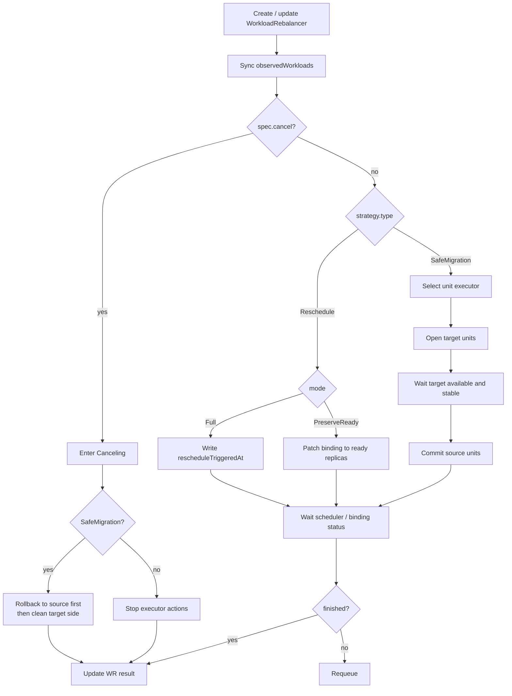
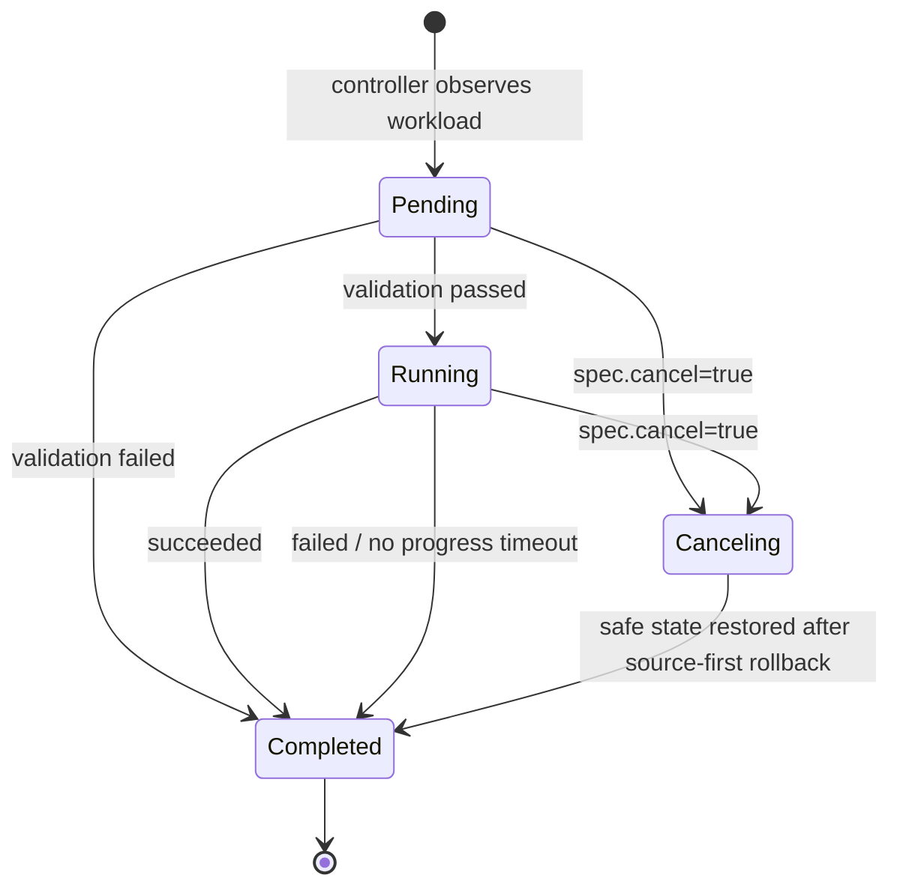

# Extend WorkloadRebalancer with Strategy-based Rebalancing

## Summary

In a multi-cluster environment, workload distribution may gradually drift away from the desired state as clusters recover
from failures, capacity changes, new clusters are added, workloads scale out, or member cluster utilization changes. Karmada
needs a set of composable rescheduling primitives that users or operation systems can invoke in different rebalancing
scenarios.

This proposal extends `WorkloadRebalancer` from a single "trigger Fresh scheduling" API into a strategy-based rebalancing
execution framework. This proposal uses `Deployment` as the main example and defines several explicitly invokable
primitives: full rescheduling, preserving ready replicas while rescheduling only the unavailable part, and a
source-preserving safe migration framework.

This proposal does not design automatic rebalancing decisions or cluster waterline algorithms. In this proposal,
`WorkloadRebalancer` is only an execution-layer primitive: it receives an already selected workload and strategy, performs
the corresponding rescheduling action, and records status.

## Background

Rescheduling is a broader problem. Typical scenarios include:

- After a cluster recovers, users may want workloads to move back from temporary failover clusters.
- Some member clusters may have insufficient resources or long-running pending replicas. Users may want to move only the
  part that cannot run, without disturbing replicas that are already ready.
- Some member clusters may stay highly utilized while other member clusters still have spare capacity. Users may want to
  move selected workloads from high-waterline clusters to low-waterline clusters to improve resource distribution and future
  scale-out capacity.
- After a new cluster is added or an existing cluster is expanded, users may want workloads to use the new capacity.
- During planned maintenance, cluster scale-in, or cross-cluster migration, users may want to bring up the target side
  before reducing the source side.

Karmada already supports active workload rebalance through `WorkloadRebalancer`. The existing behavior is close to a
"Fresh schedule" command: the controller updates `ResourceBinding` or `ClusterResourceBinding`, and then the scheduler
recomputes the assignment without preserving the previous distribution.

This is a useful primitive, but production rescheduling often needs more than one execution behavior:

- Some workloads only need to move unavailable replicas, while ready replicas should stay in their current member clusters.
- Some workloads need source-preserving migration, where source replicas keep serving until target replicas are available.
- Different workload types may need different safety checks, but they should still reuse the same rebalance API, status,
  TTL, retry, and cancellation model.

This proposal keeps `WorkloadRebalancer` as the user-facing entry point and adds a strategy layer under it.

Therefore, the goal of this proposal is not to complete a full automatic rescheduling system, but to first provide the
missing execution-layer primitives.

## Motivation

The existing `WorkloadRebalancer` can trigger Fresh scheduling by updating `ResourceBinding.spec.rescheduleTriggeredAt`.
This is useful when users want Karmada to discard the old distribution and compute a new one.

Beyond failure recovery, rescheduling is also an important way to improve multi-cluster resource efficiency. When some
workloads stay in high-waterline member clusters while other eligible clusters still have spare capacity, the federation may
see pending replicas, imbalanced utilization, and blocked scale-out. Therefore, Karmada needs reusable rescheduling
primitives that users or higher-level systems can use to improve workload distribution across member clusters.

However, not every rebalance should immediately discard the old distribution. For example, a propagated `Deployment` may
already have ready replicas in `member1`, and only the unavailable replicas need to be rescheduled to other clusters. In
another case, users may want to move replicas from `member1` to `member2`, while `member1` must continue serving until the
target replicas become available.

### Goals

- Add an explicit strategy field to `WorkloadRebalancer`.
- Keep the existing Fresh scheduling behavior as a strategy mode.
- Add a `PreserveReady` mode for `Deployment`: keep ready replicas in their current member clusters and reschedule only the
  unavailable part.
- Define a safe migration strategy framework so source replicas can be preserved until target replicas become available.
- Keep the common controller simple and allow new workload-specific rescheduling strategies to be added through executors.

### Non-Goals

- Do not design automatic rescheduling decisions or cluster waterline algorithms.
- Do not define application-specific readiness, traffic switching, or data loading semantics.

## Proposal

Add `spec.strategy` to `WorkloadRebalancer`. The strategy describes how a selected workload should be rebalanced. This
proposal defines two strategy families:

| Strategy | Purpose |
| --- | --- |
| `Reschedule` | Re-enter Karmada scheduling. It can either recompute the whole assignment or preserve ready replicas and reschedule only the unavailable part. |
| `SafeMigration` | Move replicas from one member cluster to another while preserving source replicas until the target side is available. |

This proposal intentionally only defines these atomic execution capabilities. It does not define workload selection, target
cluster selection, or execution frequency control. Users or platforms can build scenario-specific rescheduling systems on
top of these primitives later.

### User Stories

#### Story 1: Full rebalance after cluster recovery

A `Deployment` was moved away from `member1` during failover. After `member1` recovers, an administrator wants Karmada to
recompute placement and use all eligible clusters again.

The user creates a `WorkloadRebalancer` with `strategy.type=Reschedule` and `mode=Full`. This mode keeps the current
`WorkloadRebalancer` behavior.

#### Story 2: Preserve ready replicas and reschedule unavailable replicas

A `Deployment` has 10 replicas distributed across two clusters. `member1` is assigned 6 replicas but only 4 are ready.
`member2` is assigned 4 replicas and all are ready. The user wants to keep these 8 ready replicas and only reschedule the
2 unavailable replicas.

Example:

```yaml
apiVersion: apps.karmada.io/v1alpha1
kind: WorkloadRebalancer
metadata:
  name: demo-deployment-preserve-ready
spec:
  workloads:
    - apiVersion: apps/v1
      kind: Deployment
      namespace: default
      name: nginx
  strategy:
    type: Reschedule
    args:
      mode: PreserveReady
```

For a 10-replica `Deployment`:

| Cluster | Current assigned replicas | Ready | `PreserveReady` action |
| --- | ---: | ---: | --- |
| member1 | 6 | 4 | Keep 4 ready replicas and release 2 unavailable replicas. |
| member2 | 4 | 4 | Keep 4 ready replicas. |

The executor updates the binding so existing ready replicas keep their assignments. The scheduler then places the released
replicas according to the current placement and cluster state.

#### Story 3: Safely migrate from one member cluster to another

A `Deployment` is currently distributed across multiple member clusters:

| Cluster | Assigned replicas |
| --- | ---: |
| member1 | 5 |
| member2 | 3 |
| member3 | 2 |

The user wants to move the replicas on `member1` to `member4`, while keeping `member2` and `member3` unchanged. The user
creates a `SafeMigration` from `member1` to `member4`. The target side is brought up first, and the source side is reduced
only after the target side becomes available.

This strategy framework can express it as:

```yaml
strategy:
  type: SafeMigration
  args:
    from: member1
    to: member4
    stableWindow: 60s
    maxInFlightUnits: 1
    noProgressTimeout: 1h
```

For `Deployment`, `from` and `to` represent one source member cluster and one target member cluster. Other clusters in the
same binding are not affected by this `WorkloadRebalancer`.

## Design Details

### Overall Architecture

`WorkloadRebalancer` remains the rescheduling command submitted by a user or higher-level system. The controller does not
decide which workload should be moved or where it should be moved. It only executes the primitive action declared by
`spec.strategy`.



Key boundaries:

- `User / Automation`: decides whether to create a `WorkloadRebalancer`.
- `WorkloadRebalancer Controller`: owns task lifecycle, status, retry, cancellation, TTL, and executor dispatch.
- `Executor`: performs strategy-specific actions, such as patching bindings, waiting for target readiness, and judging
  progress.
- `Workload-specific Unit Executor`: splits `SafeMigration` into independently movable units and defines target-ready,
  source-commit, and cancel semantics for that workload type. Different workloads may use different migration granularity,
  such as replica batches, shards, partitions, or workload-owned subresources.
- `karmada-scheduler`: still only computes scheduling results from bindings and placement. It does not run long-running
  migration transactions.

### API Changes

Add the following fields to `WorkloadRebalancerSpec`:

| Field | Strategy | Meaning |
| --- | --- | --- |
| `spec.cancel` | Common | Requests cancellation for an ongoing rebalance. |
| `spec.ttlSecondsAfterFinished` | Common | Automatically cleans up only when all workloads finish successfully; failed, canceled, or no-progress-timeout objects are kept for troubleshooting. |
| `strategy.type` | Common | Required. Strategy name. Valid values are `Reschedule` and `SafeMigration`. |
| `strategy.args` | Common | Strategy parameters decoded and validated by the selected executor. |
| `strategy.args.mode` | `Reschedule` | Rescheduling mode. Valid values are `Full` and `PreserveReady`; default is `PreserveReady` when unspecified, and `Full` must be specified explicitly. |
| `strategy.args.from` | `SafeMigration` | Source member cluster for source-preserving migration. |
| `strategy.args.to` | `SafeMigration` | Target member cluster for source-preserving migration. |
| `strategy.args.stableWindow` | `SafeMigration` | Continuous stable time required after the target side satisfies readiness gates. It uses duration strings such as `60s`, `3m`, or `2h`. |
| `strategy.args.maxInFlightUnits` | `SafeMigration` | Maximum number of migration units that can be progressed at the same time for one workload. For `Deployment`, this can represent concurrently migrated replica batches; for other workloads, the corresponding executor defines the unit. |
| `strategy.args.noProgressTimeout` | Common | Applies to `Reschedule/PreserveReady` and `SafeMigration`. If no observable progress happens for this duration, the workload finishes with `NoProgressTimeout`. |

API changes:

```go
type WorkloadRebalancerSpec struct {
    // Workloads specifies workloads to rebalance.
    Workloads []ObjectReference `json:"workloads"`

    // Cancel requests cancellation for running workloads.
    Cancel bool `json:"cancel,omitempty"`

    // Strategy describes how the selected workloads should be rebalanced.
    // It must be specified for the strategy-based rebalance semantics proposed here.
    Strategy RebalanceStrategy `json:"strategy"`

    // TTLSecondsAfterFinished limits successful finished WorkloadRebalancers.
    // Failed, canceled, or no-progress-timeout objects should be kept for troubleshooting.
    TTLSecondsAfterFinished *int32 `json:"ttlSecondsAfterFinished,omitempty"`
}

type RebalanceStrategy struct {
    // Type selects the executor.
    // Valid values: Reschedule, SafeMigration.
    Type RebalanceStrategyType `json:"type"`

    // Args is decoded and validated by the selected executor.
    Args runtime.RawExtension `json:"args,omitempty"`
}
```

Example:

```yaml
apiVersion: apps.karmada.io/v1alpha1
kind: WorkloadRebalancer
metadata:
  name: demo-deployment-migration
spec:
  workloads:
    - apiVersion: apps/v1
      kind: Deployment
      namespace: default
      name: nginx
  cancel: false
  ttlSecondsAfterFinished: 3600
  strategy:
    type: SafeMigration
    args:
      from: member-a
      to: member-b
      stableWindow: 3m
      maxInFlightUnits: 1
      noProgressTimeout: 1h
```

`Full` mode keeps the current `WorkloadRebalancer` behavior: update `ResourceBinding` or `ClusterResourceBinding`
`spec.rescheduleTriggeredAt`, and then let the scheduler perform Fresh scheduling.

`PreserveReady` mode reads ready replicas from binding aggregated status, sets each cluster's assigned replicas to its ready
replica count, and lets the scheduler place the remaining replicas. If ready information cannot be observed, the workload
fails with an explicit reason instead of falling back to full rescheduling.

`SafeMigration` is source-preserving migration. For `Deployment`, a migration unit can be a replica batch moving from
`from` to `to`. The executor first opens the target side for a unit, waits until the target unit stays available for
`stableWindow`, and then commits the corresponding source unit. Concurrency is controlled by `maxInFlightUnits`, and
stuck progress is detected by `noProgressTimeout`.

`SafeMigration` has the following constraints:

| Constraint | Description |
| --- | --- |
| `from` / `to` must be determined before the WR controller executes. | Missing `from` or `to` is treated as `InvalidStrategyArgs`. |
| `from` / `to` cannot be changed after entering `Running`. | This avoids target drift during execution, which would make source/target object state hard to recover. |
| Workload spec cannot be changed during migration. | This avoids changes to the unit list, replica count, placement, or readiness semantics while the executor is deciding which units have migrated or need rollback. |

### Controller Framework

The `WorkloadRebalancer` controller dispatches each observed workload to the corresponding executor based on
`spec.strategy.type`.

```text
WorkloadRebalancer
        |
        v
WorkloadRebalancer controller
        |
        +--> Reschedule executor
        |       +--> Full
        |       +--> PreserveReady
        |
        +--> SafeMigration executor
                +--> workload-specific unit executor
```

The controller owns common lifecycle handling: workload lookup, status updates, retry, cancellation, timeout, and TTL after
finished. Executors own strategy-specific binding changes and progress judgment.

The main controller logic is:

```go
type StrategyExecutor interface {
    // Reconcile advances one observed workload according to the selected strategy.
    Reconcile(ctx context.Context, req StrategyRequest) (StrategyResult, error)
}

type StrategyRequest struct {
    Rebalancer *WorkloadRebalancer
    Observed   ObservedWorkload
    Now        time.Time
}

type StrategyResult struct {
    Observed     ObservedWorkload
    RequeueAfter time.Duration
}

func (c *Controller) reconcile(ctx context.Context, name string) error {
    wr := c.getWorkloadRebalancer(ctx, name)

    // Ensure status.observedWorkloads matches spec.workloads.
    observed := c.syncObservedWorkloads(wr.Spec.Workloads, wr.Status.ObservedWorkloads)

    executor := c.executors[wr.Spec.Strategy.Type]
    if executor == nil {
        return c.markAllFailed(wr, observed, "UnsupportedStrategy")
    }

    var nextRequeue time.Duration
    for i := range observed {
        if observed[i].Result != "" {
            continue
        }

        result, err := executor.Reconcile(ctx, StrategyRequest{
            Rebalancer: wr,
            Observed:   observed[i],
            Now:        c.clock.Now(),
        })
        if err != nil {
            return err
        }

        observed[i] = result.Observed
        nextRequeue = minNonZero(nextRequeue, result.RequeueAfter)
    }

    c.patchStatus(ctx, wr, observed)

    if allObservedWorkloadsFinished(observed) {
        c.markFinishTime(ctx, wr)
        return nil
    }
    return c.requeueAfter(name, nextRequeue)
}
```

This main flow only handles common task state. It does not understand workload-specific semantics. How `PreserveReady`
calculates ready deltas and how `SafeMigration` judges target availability are implemented by the corresponding executors.

`SafeMigration` also needs a workload-specific unit executor. Safe migration is not a single patch action; it is a
long-running transaction that opens target units, waits for readiness, and commits source units one by one. Different
workloads may use different migration granularity. For `Deployment`, a unit can be a replica batch; for custom workloads, a
unit can be a shard, partition, or subresource owned by that workload.

The common controller does not need to understand these business units. It only requires the unit executor to answer four
questions reliably:

| Question | Purpose |
| --- | --- |
| What units belong to this migration? | Used to calculate `totalUnits` and avoid losing progress after controller restart. |
| Which units have been committed? | Used to calculate `completedUnits`. |
| Which units are waiting for readiness on the target side? | Used to enforce `maxInFlightUnits` and evaluate `stableWindow`. |
| How should cancellation restore a safe state? | Used to enter `Canceling` after `spec.cancel=true` and eventually finish. |

The suggested internal interface is below. It is an executor-internal contract and is not part of the `WorkloadRebalancer`
API:

```go
type SafeMigrationExecutor struct {
    UnitExecutors []SafeMigrationUnitExecutor
}

type SafeMigrationUnitExecutor interface {
    // Match returns whether this executor can handle the workload under current args.
    // The SafeMigration executor must ensure exactly one unit executor matches.
    Match(ctx context.Context, req StrategyRequest) (bool, error)

    // ListUnits reconstructs units from real Karmada/member objects on every reconcile.
    // It must not depend on in-memory state.
    ListUnits(ctx context.Context, req StrategyRequest) ([]MigrationUnit, error)

    // EnsureTarget opens or keeps the target side for one unit.
    EnsureTarget(ctx context.Context, req StrategyRequest, unit MigrationUnit) error

    // CommitSource closes or reduces the source side after target ready and stable.
    CommitSource(ctx context.Context, req StrategyRequest, unit MigrationUnit) error

    // Cancel restores the workload to a safe state after spec.cancel=true.
    // It returns true when cancellation has fully converged.
    Cancel(ctx context.Context, req StrategyRequest) (bool, error)
}

type MigrationUnit struct {
    // ID is stable across reconciliations and is used to identify the same unit after controller restart.
    ID     string

    // Ref is a human-readable reference for events and troubleshooting.
    Ref    string

    // Source and Target describe desired and observed states on both sides.
    Source MigrationUnitState
    Target MigrationUnitState

    // Reason explains why this unit cannot progress or has failed.
    Reason string
}

type MigrationUnitState struct {
    // DesiredOpen means the executor expects this side to serve or hold the unit.
    DesiredOpen bool

    // ObservedOpen means the side is actually observed to hold the unit.
    ObservedOpen bool

    // Ready means the unit satisfies the workload-specific readiness gate on this side.
    Ready bool

    // ReadySince records when Ready became continuously true for stableWindow.
    ReadySince *metav1.Time
}
```

`MigrationUnit` is not fully persisted in status. On every reconcile, the executor reconstructs unit state from real objects
and then writes aggregate progress:

```text
totalUnits = len(units)
completedUnits = count(unit.Source.ObservedOpen == false &&
                       unit.Target.ObservedOpen == true &&
                       unit.Target.Ready == true)
inFlightUnits = count(unit not completed &&
                      (unit.Target.DesiredOpen || unit.Target.ObservedOpen))
notStartedUnits = units - completedUnits - inFlightUnits
```

Here, `notStartedUnits` only means units whose migration has not started. It is not the Kubernetes Pod `Pending` phase. The
relationship between these values is:

- `totalUnits`: all units in this migration plan.
- `completedUnits`: units that have been committed. The source side no longer holds them, and the target side holds them and
  is ready.
- `inFlightUnits`: units that are being migrated. The target side has been opened or is being opened, but source commit has
  not finished.
- `notStartedUnits`: units whose target side has not been opened yet. They can be progressed only when `maxInFlightUnits`
  has free slots.

This avoids relying on in-memory state after controller restart and avoids creating two sources of truth between `phase` and
the actual object state.

### Execution Flow

Overall execution flow:



#### `Reschedule/Full`

1. Locate the `ResourceBinding` or `ClusterResourceBinding` for the referenced workload.
2. Write `spec.rescheduleTriggeredAt`.
3. Wait for the scheduler to complete and update binding status.
4. Mark the observed workload `Successful` or `Failed`.

The progress of `Full` only means whether the rescheduling action has completed. It does not mean the workload is ready:

```text
totalUnits = 1
completedUnits = 0  // rescheduleTriggeredAt has been written, but the scheduler has not finished this schedule.
completedUnits = 1  // binding.status.lastScheduledTime >= binding.spec.rescheduleTriggeredAt
```

#### `Reschedule/PreserveReady`

1. Locate the binding for the referenced workload.
2. Read current assigned replicas from `spec.clusters`.
3. Read ready replicas from aggregated status.
4. Set each cluster's assigned replicas to that cluster's ready replicas.
5. Let the scheduler place the released unavailable replicas.
6. Mark `Successful` after the unavailable part is scheduled and becomes ready.

If ready replicas cannot be observed, this mode fails closed and does not fall back to `Full`.

The progress of `PreserveReady` comes from ready delta recovery:

```text
desiredReplicas = workload desired replicas
readyBefore = sum(ready replicas from binding aggregated status before patch)
readyNow = sum(ready replicas from current binding aggregated status)

totalUnits = desiredReplicas - readyBefore
completedUnits = min(totalUnits, max(0, readyNow - readyBefore))
```

Therefore, `PreserveReady` can show how many released unavailable replicas have become ready again. It does not track
individual Pods; it only relies on workload ready replicas in binding aggregated status.

#### `SafeMigration`

1. Validate `from`, `to`, and the referenced binding.
2. Select exactly one matching workload-specific unit executor.
3. The unit executor reconstructs the unit list from real objects and computes `totalUnits`, `completedUnits`, and
   `inFlightUnits`.
4. Within `maxInFlightUnits`, select units from `notStartedUnits` and open their target side.
5. Wait for the target-side units to become available and satisfy `stableWindow`.
6. Commit source-side cleanup or scale-down for stable units, then reconstruct unit state again and update progress.
7. After all units are committed and the binding, Work objects, and aggregated status converge, mark the workload
   `Successful`.

If the target side does not become available, the source side is not reduced.

### Status

`status` continues to use the existing `observedWorkloads` array. Each workload shows its own phase, result, reason, and
progress.

| Field | Meaning |
| --- | --- |
| `status.observedGeneration` | The generation processed by the controller. |
| `status.finishTime` | Time when all observed workloads entered a terminal state. |
| `status.observedWorkloads[].workload` | The workload represented by this status entry. |
| `status.observedWorkloads[].phase` | Current execution phase. Valid values are `Pending`, `Running`, `Canceling`, and `Completed`. |
| `status.observedWorkloads[].result` | Filled only when `phase=Completed`. Valid values are `Successful` and `Failed`. |
| `status.observedWorkloads[].reason` | Failure or cancellation reason. |
| `status.observedWorkloads[].progress.totalUnits` | Total execution units. Unit meaning is strategy-defined: for `SafeMigration`, it can be replica batches or workload-specific units; for `Reschedule/PreserveReady`, it is the pending/unready replica delta that needs to be rescheduled and become ready; for `Reschedule/Full`, it is `1` scheduler rescheduling action. |
| `status.observedWorkloads[].progress.completedUnits` | Completed execution units, in the same unit as `totalUnits`. |
| `status.observedWorkloads[].progress.lastProgressTime` | Last time when observable progress happened. `noProgressTimeout` is calculated from this timestamp, and the controller can continue this judgment after restart. |

Example 1: `SafeMigration` is running.

```yaml
status:
  observedGeneration: 2
  observedWorkloads:
    - workload:
        apiVersion: apps/v1
        kind: Deployment
        namespace: default
        name: nginx
      phase: Running
      result: ""
      reason: ""
      progress:
        totalUnits: 10
        completedUnits: 4
        lastProgressTime: "2026-06-17T09:30:00Z"
```

Example 2: `Reschedule/PreserveReady` has completed successfully. Two unavailable replicas were released and became ready
again.

```yaml
status:
  observedGeneration: 1
  finishTime: "2026-06-17T10:00:00Z"
  observedWorkloads:
    - workload:
        apiVersion: apps/v1
        kind: Deployment
        namespace: default
        name: nginx
      phase: Completed
      result: Successful
      reason: ""
      progress:
        totalUnits: 2
        completedUnits: 2
```

Example 3: execution failed.

```yaml
status:
  observedGeneration: 2
  finishTime: "2026-06-17T10:00:00Z"
  observedWorkloads:
    - workload:
        apiVersion: apps/v1
        kind: Deployment
        namespace: default
        name: nginx
      phase: Completed
      result: Failed
      reason: NoProgressTimeout
      progress:
        totalUnits: 10
        completedUnits: 4
        lastProgressTime: "2026-06-17T09:30:00Z"
```

Phase and result semantics:

| Phase | Result | Meaning |
| --- | --- | --- |
| `Pending` | Empty | The workload has been accepted and is being validated or waiting to execute. |
| `Running` | Empty | Execution has started and may have modified RB/CRB/Work/member objects. |
| `Canceling` | Empty | The user has set `spec.cancel=true`, and the controller is restoring modified scheduling objects to a safe state. |
| `Completed` | `Successful` | Execution completed successfully. |
| `Completed` | `Failed` | Execution failed, was canceled, or timed out with no progress. See `reason` for details. |

State machine:



`Completed` is the only terminal phase. Successful execution uses `result=Successful`; validation failure, execution
failure, no progress timeout, and user cancellation use `result=Failed`, with the exact cause represented by `reason`.

## Test Plan

- Unit test that `Reschedule/Full` still updates `rescheduleTriggeredAt`.
- Unit test that `Reschedule/PreserveReady` preserves ready replicas and releases only unavailable replicas.
- Unit test missing binding, missing ready status, and unsupported workload type.
- Unit test invalid args finishing as `Completed/Failed/InvalidStrategyArgs`.
- Unit test no progress timeout finishing as `Completed/Failed/NoProgressTimeout`.
- Integration test `Reschedule/Full`: create a propagated `Deployment`, trigger `Full`, verify that the binding re-enters
  Fresh scheduling, and verify scheduling completion status.
- Integration test `Reschedule/PreserveReady`: create a propagated `Deployment` with unavailable replicas in one member
  cluster, verify that ready replicas are preserved and only the unavailable part is rescheduled.
- Integration test `SafeMigration`: create a `Deployment` distributed across multiple member clusters, migrate from
  `member1` to `member4`, verify that source replicas are not reduced before target replicas are ready and stable, and
  verify that replicas in other member clusters remain unchanged.
- Integration test `SafeMigration` cancel: set `spec.cancel=true` during migration, verify phase enters `Canceling`, and
  after safe state is restored, it becomes `Completed/Failed/CanceledByUser`.

## Risks and Mitigations

| Risk | Mitigation |
| --- | --- |
| Users expect source preservation but accidentally trigger full rescheduling. | New behavior must explicitly specify `strategy.type` and `mode`. |
| Ready status is stale or cannot be observed. | `PreserveReady` fails closed and does not fall back to `Full`. |
| Workload spec changes during `SafeMigration`, making units and readiness judgment ambiguous. | Reject high-risk spec changes after entering `Running`; users must cancel or wait for migration completion. |
| Too much strategy logic makes the controller hard to maintain. | Keep the controller generic and move strategy-specific behavior into executors. |

## Alternatives

- **Add another migration CRD**: rejected because `WorkloadRebalancer` is already the user-facing entry point for workload
  rebalance.
- **Use workload annotations**: rejected because annotations do not provide a clear task lifecycle, per-workload result, TTL
  cleanup, or retry status.
- **Put safe migration into scheduler**: rejected because the scheduler should compute placement, while migration is a
  long-running execution process that depends on workload readiness.
