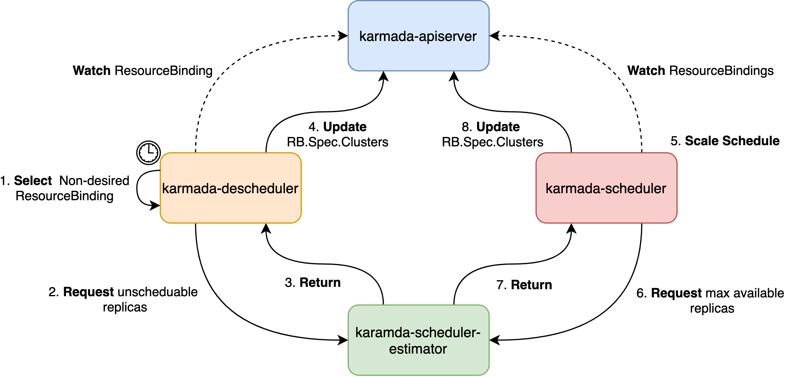

# Descheduler for Karmada

## Summary

Scheduling in Karmada is the process of binding `ResourceBindings` to target clusters and assigning replicas, and is performed by a component of Karmada called karmada-scheduler. However, the scheduler's decisions are influenced by its view of Karmada at that point of time when a new `ResourceBinding` appears for scheduling. As Karmada multi-clusters are very dynamic and their state changes over time, there may be desire to move already running replicas to some other clusters for various reasons:

- Some clusters are under or over utilized.
- New clusters are added to clusters.
- Some nodes of a cluster failed and the cluster do not have enough resource to accommodate their pods.

This KEP proposes a new component, Descheduler, which has a similar behavior with [Descheduler for Kubernetes](https://github.com/kubernetes-sigs/descheduler), based on its policy, finds some replicas that can be moved and evicts them from a cluster. Please note, in current implementation, descheduler does not reschedule evicted replicas but relies on the default karmada-scheduler for that. After evicting part of replicas, karmada-scheduler will start a [ScaleSchedule](https://github.com/karmada-io/karmada/blob/e6efe45d8974028ef30cf5f394126f768def9bd5/pkg/scheduler/scheduler.go#L51).

## Motivation

Now scheduler only selects clusters and assigns replicas based on the current state of Karmada control-plane and member clusters. But as the state changes over time, the scheduling result may not be optimal. Descheduler helps evict some replicas and trigger a [ScaleSchedule](https://github.com/karmada-io/karmada/blob/e6efe45d8974028ef30cf5f394126f768def9bd5/pkg/scheduler/scheduler.go#L51) action of karmada-scheduler.

### Goals

- Provide some strategies to evict replicas of target scheduled clusters, i.e., reduce the number of replica in some target clusters.

### Non-Goals

- Make some adaptation of karmada-scheduler-estimator for estimating the evicting replicas.

## Proposal

This proposal introduces a new component to evicting some replicas of a workload. After scheduling, the relevant `ResourceBinding` would have a scheduling result in `resourcebindings.spec.clusters`. This field is an array, consisting of the target scheduled cluster and its assigned replicas. The only thing the descheduler have to do is detect and evict some replicas that match some strategies, i.e., reduce the number of replica in some target clusters.

### User Stories (Optional)

#### Story 1

Imagine that we have a deployment with `spec.replicas=10`. It has been scheduled towards three clusters:

- member1: `spec.replicas=5`
- member2: `spec.replicas=3`
- member3: `spec.replicas=2`

Now some nodes of member1 failed, leading to 3 replicas eviction after timeout. However, the cluster does not have any more idle resource to accommodate the new pending pods. Descheduler helps detect these pods and evict them, as a result of member1 `spec.replicas=2`. After that, karmada-scheduler will start a scale scheduling.

#### Story 2

Imagine that we have a deployment with `spec.replicas=12`. It has been scheduled towards three clusters:

- member1: `spec.replicas=4`
- member2: `spec.replicas=4`
- member3: `spec.replicas=4`

Now we add a new cluster member4. We may want to reschedule some replicas towards member4 to balance the load. Descheduler helps evict some replicas in member1, member2 and member3.

## Design Details

### Architecture

It is noticed that this design only focus on User Story 1, which means that only unscheduable pods are included for descheduling, usually happening when cluster resources are insufficient. Other strategy is not considered in this proposal because it needs more discussion.

Here is the descheduler workflow. 



- Descheduler: Start and load the strategy file.
- Descheduler: Watch `ResourceBinding` and `Cluster`.
- Descheduler: Establish connections with all [scheduler-estimators](https://github.com/karmada-io/karmada/pull/580).
- Descheduler: Run regularly in a fixed interval.
  - List all `ResourceBindings`.
  - Find the non-desired ones, i.e., whose desired replicas are less than ready replicas, and then request scheduler-estimator to get the replicas that need to be evicted.
  - Get the unscheduable pods number from every cluster scheduler-estimator.
  - Modify scheduling result in `resourcebindings.spec.clusters` for eviction, i.e., subtract unscheduable pods number in the relevant field `resourcebindings.spec.clusters`.
- Scheduler: Watch the `ResourceBinding` and begin to scale scheduling.

### API Change

Add a new field in `propagationpolicy.spec.placement.replicaScheduling` to represent which strategy the workload wants to use. If not specified, the workload should never be rescheduled.

```go

type ReschedulingPolicy string

const (
	// ReschedulingPolicyUnscheduable means rescheduling replicas when unscheduable.
	ReschedulingPolicyUnscheduable ReschedulingPolicy = "OnUnscheduable"
	// ReschedulingPolicyNever means never rescheduling replicas between member clusters.
	ReschedulingPolicyNever      ReschedulingPolicy = "Never"
)

// ReplicaSchedulingStrategy represents the assignment strategy of replicas.
type ReplicaSchedulingStrategy struct {
	// ReplicaSchedulingType determines how the replicas is scheduled when karmada propagating
	// a resource. Valid options are Duplicated and Divided.
	// "Duplicated" duplicates the same replicas to each candidate member cluster from resource.
	// "Divided" divides replicas into parts according to number of valid candidate member
	// clusters, and exact replicas for each cluster are determined by ReplicaDivisionPreference.
	// +kubebuilder:validation:Enum=Duplicated;Divided
	// +optional
	ReplicaSchedulingType ReplicaSchedulingType `json:"replicaSchedulingType,omitempty"`

	// ReplicaDivisionPreference determines how the replicas is divided
	// when ReplicaSchedulingType is "Divided". Valid options are Aggregated and Weighted.
	// "Aggregated" divides replicas into clusters as few as possible,
	// while respecting clusters' resource availabilities during the division.
	// "Weighted" divides replicas by weight according to WeightPreference.
	// +kubebuilder:validation:Enum=Aggregated;Weighted
	// +optional
	ReplicaDivisionPreference ReplicaDivisionPreference `json:"replicaDivisionPreference,omitempty"`

	// WeightPreference describes weight for each cluster or for each group of cluster
	// If ReplicaDivisionPreference is set to "Weighted", and WeightPreference is not set, scheduler will weight all clusters the same.
	// +optional
	WeightPreference *ClusterPreferences `json:"weightPreference,omitempty"`

	// ReschedulingPolicy describes which rescheduling strategies the workload wants to apply.
	// If not specified, the workload should never be rescheduled.
	// +optional
	ReschedulingPolicy ReschedulingPolicy `json:"reschedulingPolicy,omitempty"`
}
```

### Scheduler Estimator

The descheduler has a close relationship with scheduler-estimator. In this case, the scheduler estimator should add a new service interface to estimate the unscheduable replicas that belong to a workload.

The gRPC interface shows below.

```go
// UnschedulableReplicasRequest represents the request that sent by gRPC client to calculate unschedulable replicas.
type UnschedulableReplicasRequest struct {
	// Cluster represents the cluster name.
	// +required
	Cluster string `json:"cluster" protobuf:"bytes,1,opt,name=cluster"`
	// Resource represents the Kubernetes resource to be propagated.
	// +required
	Resource ObjectReference `json:"resource" protobuf:"bytes,2,opt,name=resource"`
	// UnscheduableThreshold represents the threshold period to distinguish whether the replica is unschedulable.
	// +optional
	UnscheduableThreshold time.Duration `json:"unscheduableThreshold,omitempty" protobuf:"varint,3,opt,name=unscheduableThreshold,casttype=time.Duration"`
}

// UnschedulableReplicasResponse represents the response that sent by gRPC server to calculate unscheduable replicas.
type UnschedulableReplicasResponse struct {
	// UnschedulableReplicas represents the unscheduable replicas that the object manages.
	// +required
	UnschedulableReplicas int32 `json:"unschedulableReplicas" protobuf:"varint,1,opt,name=maxReplicas"`
}
```

And the RPC function will be like this:

```proto
rpc UnschedulableReplicas(UnschedulableReplicasRequest) returns (UnschedulableReplicasResponse) {}
```

### Test Plan

- Unit Test covering:
  - Core changes in karmada-scheduler-estimator that consists of estimating the unschedulable replicas of a workload correctly.
  - Core changes in karmada-descheduler that consists of evicting unschedulable replicas when a workload needs reschedule.
- E2E Test covering:
  - Deploy karmada-descheduler.
  - Rescheduling replicas when resources are insufficient.
  
