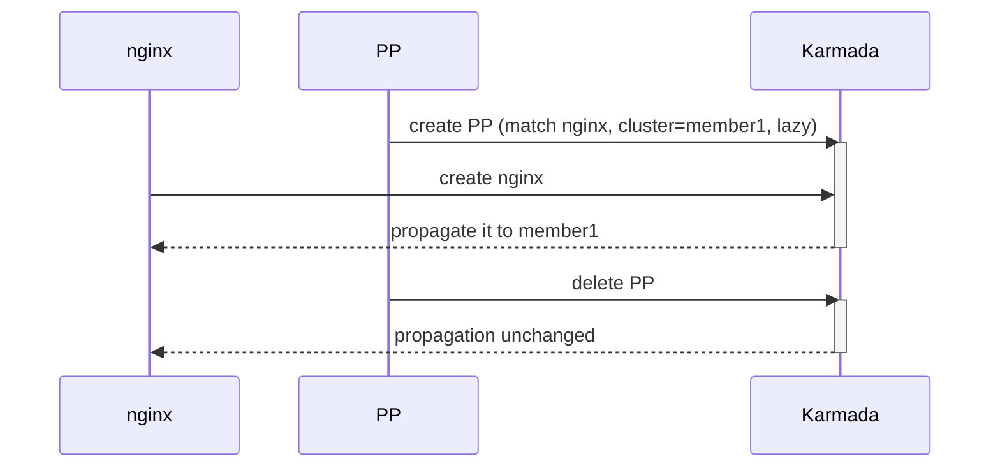
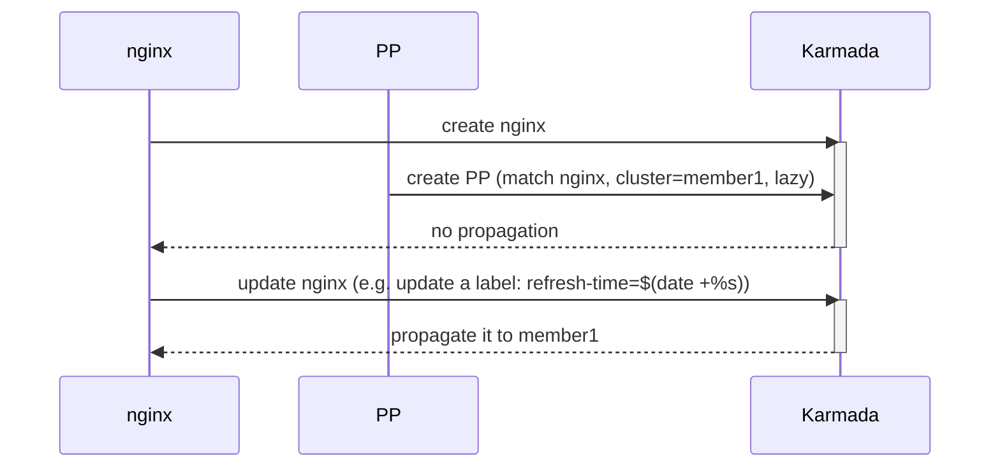
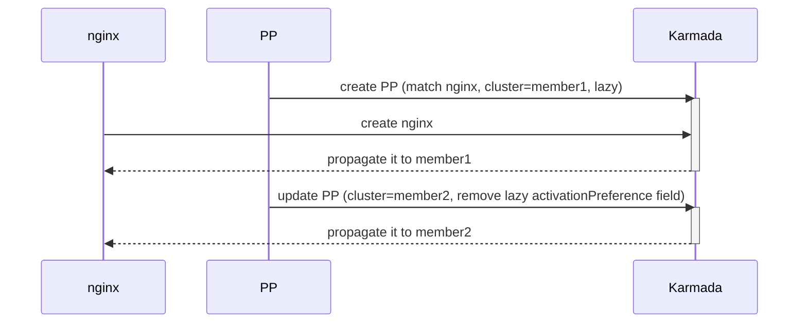
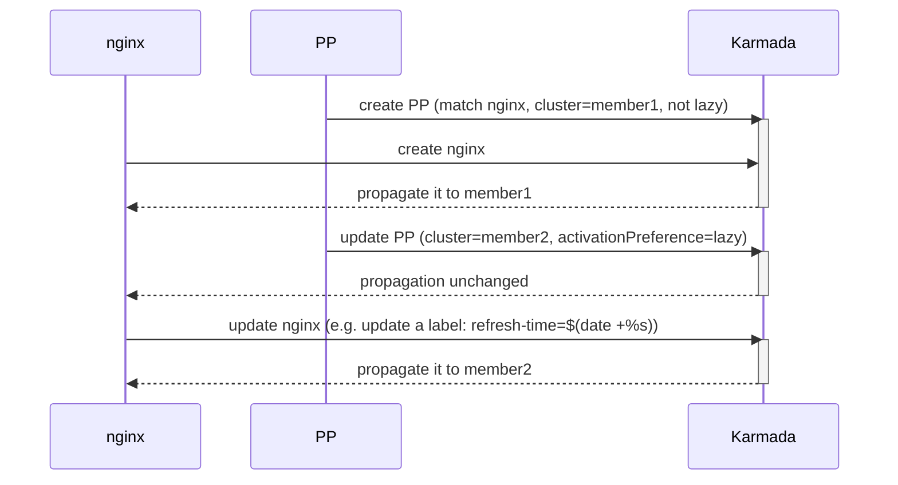
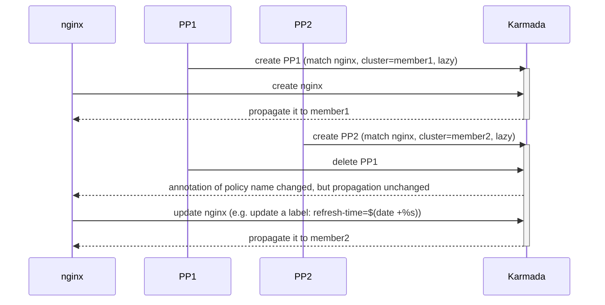
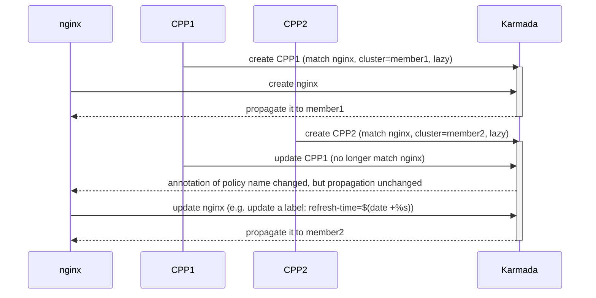
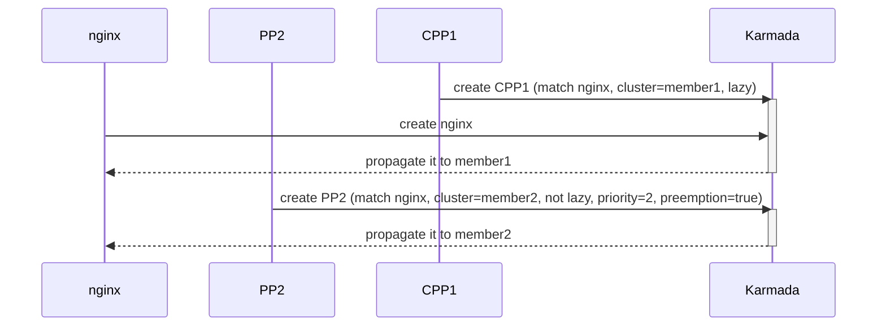
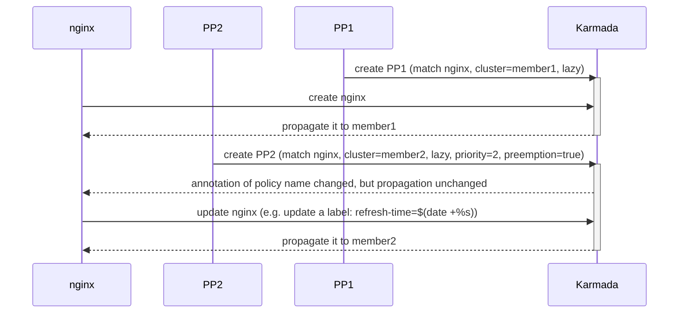
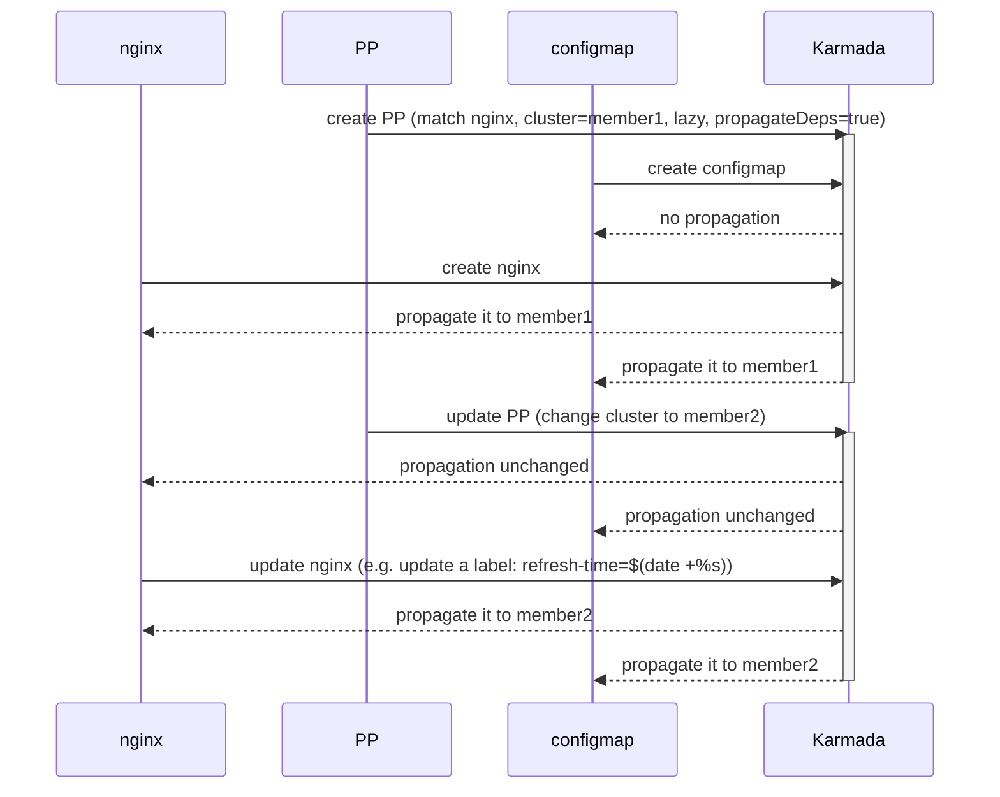
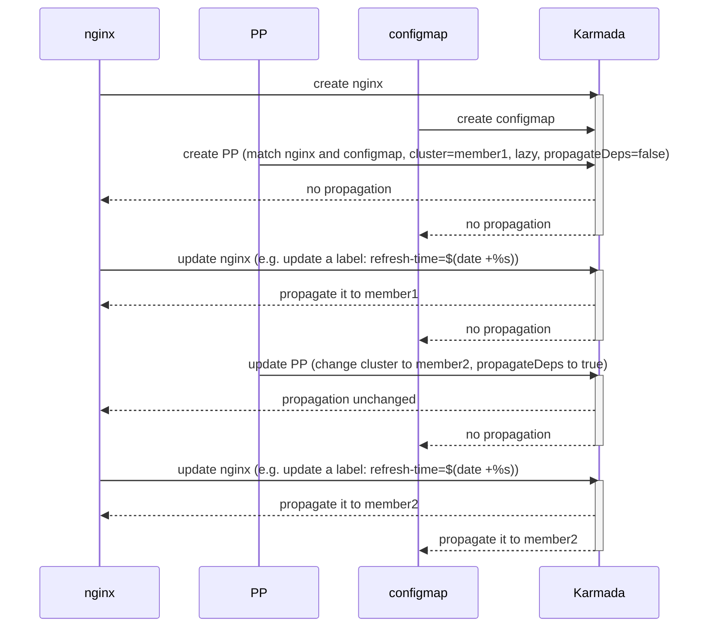

# Introduce a lazy activation preference to Policy

## Background

In the scenario where `Policy` responsibilities are separated from `Resource` responsibilities, 
one role is dedicated to `Policy` management, which is referred to as cluster administrator, 
and the other role is dedicated to `Resource` management, which is referred to as user. 
The cluster administrator would preconfigure some `Policies` for users, then the users apply their own `Resources` and 
propagated them according to the preconfigured `Policy`.

However, the administrator has requests to modify the `Policy` in the future, such as migrating propagation clusters.
As the current `Policy` modification is effective immediately, the modification will affect the propagation status of
a large number of resource templates and have a great impact on the system.

The administrator is worried that the modification will lead to the failure of the business application in the
non-change window, so the administrator hopes that the modification of `Policy` can be delayed until
the business application change window takes effect.

### Goals

The most fundamental criterion is:

* **Policy changes cannot actively cause changes to the propagation status of resource templates.**

Under this criterion, a new delayed effective mechanism is introduced into `Policy`, 
by which the referenced resource template will delay responding to the change of `Policy` until the resource template itself changes.

> changes of resource template refer to any filed is modified except `status`, `metadata.managedFields`, `metadata.resourceVersion`,
> `metadata.generation`, or the label / annotation whose keys are prefixed with `.karmada.io`.

### Applicable scenario

This is an experimental feature that might help in a scenario where:

* A policy manages huge amount of resource templates, changes to a policy typically affect numerous applications simultaneously. 
* Policy responsibilities are separated from resource templates responsibilities.

A minor misconfiguration could lead to widespread failures. 
With this feature, the change can be gradually rolled out through iterative modifications of resource templates.

## Proposal 

### Overview

We are introducing a `ActivationPreference` filed to Policy, indicating how the referencing resource template will be propagated, 
in case of policy changes. 

If empty, the resource template will respond to policy changes immediately, in other words, 
any policy changes will drive the resource template to be propagated immediately as per the current propagation rules.

If the value is `Lazy` means the policy changes will not take effect for now but defer to the resource template changes, 
in other words, the resource template will not be propagated as per the current propagation rules until there is an update on it.

### User Story

If you prefer `Lazy` activation preference in Policy, you can write your Policy as follows.

```yaml
apiVersion: policy.karmada.io/v1alpha1
kind: PropagationPolicy
metadata:
  name: policy-delay
spec:
  activationPreference: Lazy  # new added field
  resourceSelectors:
    - apiVersion: apps/v1
      kind: Deployment
  placement:
    clusterAffinity:
      clusterNames:
        - member1
        - member2
```

### Scheme Rationality

1）There is a snapshot of Policy in ResourceBinding that records the fields related to `Work` propagation, 
and the scheduler actually decides how to propagate `Work` based on the Policy snapshot in ResourceBinding. 
Therefore, `PropagationPolicy` can be understood as a preset policy, and the policy in ResourceBinding can be understood as a real Policy.
When users configure `PropagationPolicy`, they have a reason to decide when the preset configuration will be refreshed to the actual Policy. 
It can be refreshed immediately, delayed until the change of resources, or even delayed to a fixed time in the future. 
As long as there is a corresponding scenario, it is reasonable.

2）When `Lazy` activation preference is introduced, the only difference to our system logical is in the `reconcile` process
of resource template, whether to refresh the binding will depend on this field. If the change of resource template is caused
by `Karmada` itself and the current bound Policy is `Lazy`, it will skip refreshing the binding. It is short, clear and make scenes.

### Notes/Constraints/Caveats

1）Basing on the most fundamental criterion mentioned in [Goals](#goals), there are two special case needs to be noticed.

* If you create a policy first, then when you create a matchable resource, the resource will be propagated at once.
* If you create a resource first, then when you create a matchable policy, the previous resource will not be propagated
  until the resource be updated again.

This behavior is in line with the criterion, but it will bring inconvenience to your operation and maintenance. 
For example, if you write many resources and policies in the same yaml and apply together, some resources may be distributed and some will not.

2）If a user's application implicitly or logically depends on a resource, when the user makes changes to the application, 
the dependent resource also needs to be changed to ensure that the application is distributed as expected.

3）In the lazy activation feature, the modification of a Policy take effect when the referenced resource template changes. 
However, some system plug-ins (such as CronHPA) may also cause resource template changes. 
This type of system plug-in is also configured by the user and cannot be distinguished from the direct operation of the user, 
so it is also regarded as a user behavior, and the changes to the resource template caused by it will also respond to the modification of the policy.

## Design Details

### API change

```go
// PropagationSpec represents the desired behavior of PropagationPolicy.
type PropagationSpec struct {
	...... 
	// ActivationPreference indicates how the referencing resource template will
    // be propagated, in case of policy changes.
    //
    // If empty, the resource template will respond to policy changes
    // immediately, in other words, any policy changes will drive the resource
    // template to be propagated immediately as per the current propagation rules.
    //
    // If the value is 'Lazy' means the policy changes will not take effect for now
    // but defer to the resource template changes, in other words, the resource
    // template will not be propagated as per the current propagation rules until
    // there is an update on it.
    // This is an experimental feature that might help in a scenario where a policy
    // manages huge amount of resource templates, changes to a policy typically
    // affect numerous applications simultaneously. A minor misconfiguration
    // could lead to widespread failures. With this feature, the change can be
    // gradually rolled out through iterative modifications of resource templates.
    //
    // +kubebuilder:validation:Enum=Lazy
    // +optional
    ActivationPreference ActivationPreference `json:"activationPreference,omitempty"`
	......
}

// ActivationPreference indicates how the referencing resource template will be propagated, in case of policy changes.
type ActivationPreference string

const (
    // LazyActivation means the policy changes will not take effect for now but defer to the resource template changes,
    // in other words, the resource template will not be propagated as per the current propagation rules until
    // there is an update on it.
    LazyActivation ActivationPreference = "Lazy"
)
```

### System Behavior Description

The system behavior can be concluded as one-sentence summary: 

* **When a user creates/deletes/modifies a Policy, if the currently active Policy is `Lazy`, it will not take effect immediately.**

In order to clearly distinguish `currently active Policy` (e.g: the resource change from binding one policy to another, 
both have `ActivationPreference` field, which shall prevail), a guideline is introduced：

* **When Policy changes, modifications involving the binding relationship between Policy and resources are always processed immediately. 
  Only changes involving the propagation status of resources can be `Lazy`.**

> That means if you modified fields like `resourceSelector/priority/preemption`, 
> this part would be processed immediately, and thus adjust the relationship between Policy and related resources. 
> If you modified fields like `placement/conflictResolution/failover/propagateDeps`,
> this part may be delayed to synchronize to related ResourceBinding if the activationPreference is set `Lazy`.

Then we discuss the `Lazy` behavior case by case:

* If Policy created first, once the Resource is created, it will be propagated by this Policy immediately.
* If Resource created first, then the Policy is created/modified/deleted, there will be four cases as follows.

#### Case 1: Policy still match

**Scenario:** the resource was originally managed by this Policy and are still managed by this Policy.

**Default behavior:** trigger the resource `reconcile`, and **perform the refresh of the binding**.

**Lazy behavior:** trigger the resource `reconcile`, but **does not perform the refresh of the binding**.

#### Case 2: Policy no longer match or deleted

**Scenario:** the resource was originally managed by this Policy, but now the `resourceSelector` is changed so that 
it no longer matches the resource or this Policy is just deleted.

**Default behavior:** the resource is unbound from this Policy, triggers its `reconcile`, and look for other matchable Policy.
If not found, keep unchanged; otherwise bind to new Policy and **perform the refresh of the binding**.

**Lazy behavior:** the resource is unbound from this Policy, triggers its `reconcile`, and look for new matchable Policy.
If not found, keep unchanged; otherwise bind to new Policy and **not perform the refresh of the binding if new Policy is `Lazy`**.

#### Case 3: Policy preemption

**Scenario:** the resource was originally managed by another policy, but now this policy takes over and manages it.

**Default behavior:** the resource is unbound from the original policy and bound to this policy, triggers its `reconcile`, and **perform the refresh of the binding**.

**Lazy behavior:** the resource is unbound from the original policy and bound to this policy, triggers its `reconcile`, but **does not perform the refresh of the binding**.

#### Case 4: Policy hit

**Scenario:** the resource was not originally bound to any policy, but is now hit and managed by this policy.

**Default behavior:** Policy binds the hit resource, triggers its `reconcile`, and **perform the refresh of the binding**.

**Lazy behavior:** Policy binds the hit resource, triggers its `reconcile`, but **does not perform the refresh of the binding**.

## Test Plan

### Simple Case 1 (Policy created before resource)



### Simple Case 2 (Policy created after resource)



### Simple Case 3 (Lazy to immediate)



### Simple Case 4 (Immediate to lazy)



### Combined Case 1 (Policy deleted)



### Combined Case 2 (Policy no longer match)



### Combined Case 3 (Policy preemption)



### Combined Case 4 (Policy preemption)



### Combined Case 5 (Propagate dependencies)



### Combined Case 6 (Propagate dependencies)


