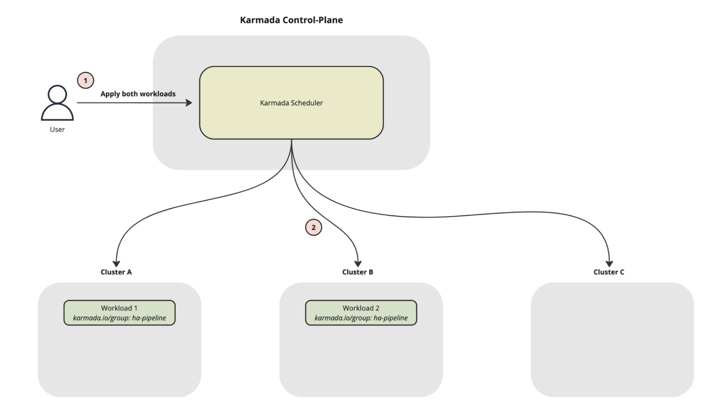

# Karmada Workload Affinity / Anti-Affinity Support

## Summary

In Kubernetes, it is possible to define pod-level anti-affinity which will cause K8s to schedule pods to run on different nodes. This can be useful in cases where users want to ensure high availability. In Karmada, the same sort of behavior would be useful when trying to guarantee that separately deployed but related workloads are scheduled on different clusters.

This proposal describes the problem statement, the desired final behavior, as well as the required api and code-level changes.

## Motivation

Karmada's PropagationPolicy API already provides pretty fine-grained scheduling configurations, allowing users to set different replica scheduling strategies, spread constraints, and define cluster affinity rules. However, in cases in which users may want to ensure related workloads to exist in different clusters, or in cases in which users may want guarantee multiple workloads are scheduled to the same cluster, these settings are not enough.

### Goals

- Extend the Propagation Policy API to support workload affinity and anti-affinity based scheduling rules.
- Provide a way for users who want HA for their data processing pipelines (or other workloads) with anti-affinity.
- Provide a solution for users who need workloads to be colocated and scheduled to the same clusters.

### Non-Goals

- The support of `PreferredDuringScheduling` is deferred from this proposal, as the use-case is not totally defined and this scheduling strategy is more computationally expensive
- Cross-namespace anti-affinity / affinity is not supported. Existing API design inherits namespace from the PropagationPolicy, so affinity terms are limited to within the namespace. This can be added in the future if there are sufficient use-cases.
- Additional topologyKey support is also not included in the API design and we instead rely directly on the clusters when enforcing affinity rules. This can be added to the API in the future if there are use-cases for indexing by other zone/region topologies.

### User Stories

#### Story 1: Anti-Affinity with FlinkDeployments

As a user of Apache Flink, there may be cases where my data pipeline is has a very low tolerance for downtime (e.g. the job cannot stop processing data for more than a couple seconds). In cases like this I cannot rely on Karmada's cluster failover feature alone since by the time Karmada is able to reschedule my application, the downstream consumers will already have gaps in their data. The solution is to run two duplicate processing pipelines for HA purposes, allowing time for Karmada to schedule the impacted application while the other continues processing.

Karmada should support being able to schedule these types of duplicate pipelines, by making sure that the applications are never scheduled to the same cluster (which would break HA gaurantees).

In the picture below, we can see two workloads which represent two duplicate pipelines scheduled for HA purposes. Karmada will make sure that during the scheduling phase, it will not schedule the application to a cluster if a workload with a `karmada.io/group` label and matching key exists:



#### Story 2: Affinity with Distributed Training Workloads

For very large training jobs, a user may start to run into memory and batch size limits where datasets don't fit into a single worker's GPU memory. As a result, the user may want to shard the training data using multiple smaller training jobs.

These jobs would be applied to Karmada, and the Karmada scheduler should be able to handle scheduling these jobs to the same cluster using affinity rules.

#### Story 3: Affinity for Co-located Applications

There may be cases in which users want to schedule workloads to the same cluster to minimize latency by avoiding cross-cluster network hops between services. Some examples of such as case could be:

- A FlinkDeployment with Kafka Consumers (for ultra-low latency requirements)
- A RayService that relies on RedisCluster for caching (colocated prevents cross-cluster network hops)

## Proposal

This proposal extends the PropagationPolicy API to provide support for workload affinity and anti-affinity scheduling rules. Upon scheduling, Karmada will be able to filter feasible clusters based on the workload's affinity and anti-affinity preferences.

This proposal is divided into several steps, see below:

- [ ] `PropagationPolicy` API changes to add `workloadAntiAffinity` and `workloadAffinity` fields
- [ ] `ClusterInfo` and `ClusterSnapshot` enhancements to include affinity metadata
- [ ] Introduce new Karmada Scheduler configurations to define labels for indexing affinity terms (`AntiAffinityLabelKeys`, `AffinityLabelKeys`)
- [ ] Karmada Scheduler changes required to support affinity rules
- [ ] Addition of affinity / anti-affinity filter plugins

## API Changes

In order to support workload affinity / anti-affinity, we will need to make changes to the PropagationPolicy API spec. We will be borrowing the concept of pod affinity and anti-affinity from Kubernetes to create an analogous behavior on a workload level.

`Note:` Since indexing can become very expensive when making scheduling decisions based on anti-affinity / affinity terms, we are suggesting to expose a configuration to the Karmada Scheduler which would limit the set of labels that Karmada must keep track of. For example, if the user would like to enforce anti-affinity using the `karmada.io/group` label then they would define this argument on the scheduler:

```yaml
  containers:
  - command:
    - /bin/karmada-scheduler
    - --kubeconfig=/etc/kubeconfig
    - --metrics-bind-address=$(POD_IP):8080
    - --health-probe-bind-address=$(POD_IP):10351
    - --anti-affinity-label-keys="karmada.io/group" <----- Karmada will ONLY index on this label and ignore all others
```

### PropagationPolicy

```golang
// Placement represents the rule for select clusters.
type Placement struct {

  // WorkloadAntiAffinity represents the inter-workload anti-affinity scheduling policies.
  // +optional
  WorkloadAntiAffinity *WorkloadAntiAffinity `json:"workloadAntiAffinity,omitempty"`

  // WorkloadAffinity represents the inter-workload affinity scheduling policies.
  // +optional
  WorkloadAffinity *WorkloadAffinity `json:"workloadAffinity,omitempty"`
}
```

### WorkloadAntiAffinity

```golang
// WorkloadAntiAffinity represents inter-workload *anti-affinity* scheduling rules.
type WorkloadAntiAffinity struct {
    // Hard requirements (all terms must be satisfied).
    // Karmada will filter out clusters that do not satisfy WorkloadAffinityTerm during workload scheduling time.
    // +optional
    RequiredDuringSchedulingIgnoredDuringExecution []WorkloadAffinityTerm `json:"requiredDuringSchedulingIgnoredDuringExecution,omitempty"`

    // Soft preferences (Karmada will select clusters with a higher total weight).
    // Scheduler *prefers* clusters that satisfy the terms but may choose others.
    // +optional
    // PreferredDuringSchedulingIgnoredDuringExecution []WeightedWorkloadAffinityTerm `json:"preferredDuringSchedulingIgnoredDuringExecution,omitempty"`
}
```

### WorkloadAffinity

```golang
// WorkloadAffinity represents inter-workload *affinity* scheduling rules.
type WorkloadAffinity struct {
    // Hard requirements (all terms must be satisfied).
    // Karmada will filter out clusters that do not satisfy WorkloadAffinityTerm during workload scheduling time.
    // +optional
    RequiredDuringSchedulingIgnoredDuringExecution []WorkloadAffinityTerm `json:"requiredDuringSchedulingIgnoredDuringExecution,omitempty"`

    // Soft preferences (Karmada will select clusters with a higher total weight).
    // Scheduler *prefers* clusters that satisfy the terms but may choose others.
    // +optional
    // PreferredDuringSchedulingIgnoredDuringExecution []WeightedWorkloadAffinityTerm `json:"preferredDuringSchedulingIgnoredDuringExecution,omitempty"`
}
```

### WorkloadAffinityTerm + WeightedWorkloadAffinityTerm

For the WorkloadAffinityTerms, we have some options on how to structure this API depending on how much control we want to give to the user. For both of these API options, the label indexing will be limited to the set of labels that are passed into the Karmada Scheduler via `--anti-affinity-label-keys` or `--affinity-label-keys`.

#### Option 1: Define LabelSelector + MatchLabelKeys

```golang
// WorkloadAffinityTerm selects a set of peer workloads used to evaluate inter-workload affinity / anti-affinity.
//
// Peer Selection:
// - Match `labelSelector`.
// - Additionally, for each key in `matchLabelKeys`, peers must have the same
//   label value as this workload.
//
// Evaluation:
// - For affinity: a candidate cluster is required if a matching peer is found on that cluster.
// - For anti-affinity: a candidate cluster is rejected if a matching peer is found on that cluster.
type WorkloadAffinityTerm struct {

  // A label query over a set of resources, in this case workloads.
  // If it's null, this WorkloadAffinityTerm matches with no workload.
  // +optional
  LabelSelector *metav1.LabelSelector `json:"labelSelector,omitempty"`

  // AND with LabelSelector, but values come from THIS workload’s labels.
  // e.g., ["ha.karmada.io/group"] → match workloads sharing the same group value.
  // +optional
  MatchLabelKeys []string `json:"matchLabelKeys,omitempty"`

  // // Cluster label key defining the co-location domain (e.g., topology.karmada.io/cluster|zone|region).
  // // +required
  // TopologyKey string `json:"topologyKey,omitempty"`
  // By design we have flexibility to add TopologyKey in the future, however we do not want to over-engineer before we get more
  // community feedback on use-cases.
}
```

Benefits:
- Allows for fine-grained control over labels used for selecting affinity peers
- Allows for greater flexibility to add topologyKey or namespaceScope in the future

Drawbacks:
- A bit more complicated for user, may not be intuitive for users to define scheduler configurations AND add the same labels to the AffinityTerm API

#### Option 2: Provide Boolean Switch

```golang
// WorkloadAffinityTerm selects a set of peer workloads used to evaluate inter-workload affinity / anti-affinity.
//
// Peer Selection:
// - Match based on value of the keys defined in --affinity-label-keys configuration
//
// Evaluation:
// - For affinity: a candidate cluster is required if a matching peer is found on that cluster.
// - For anti-affinity: a candidate cluster is rejected if a matching peer is found on that cluster.
type WorkloadAffinityTerm struct {

  // Determines if Karmada scheduler will take affinity terms into account for this workload.
  // Affinity labels are controlled via the --affinity-label-keys configuration defined on the Karmada Scheduler.
  // Affinity and anti-affinity peers are determined based off matching values of the keys specified in the scheduler configuration.
  AffinityEnabled bool `json:"affinityEnabled,omitempty"`

  // // Cluster label key defining the co-location domain (e.g., topology.karmada.io/cluster|zone|region).
  // // +required
  // TopologyKey string `json:"topologyKey,omitempty"`
  // By design we have flexibility to add TopologyKey in the future, however we do not want to over-engineer before we get more
  // community feedback on use-cases.
}
```

Benefits
- Very simple API definition and mental model: "turn on standardized affinity/anti-affinity for these workloads"

Drawbacks
- Less expressiveness in API, user must rely solely on keys defined in the scheduler configuration
- Global coupling: changing flag on scheduler changes semantics for all workloads on cluster

### Example PropagationPolicy

An example of anti-affinity usage in the PropagationPolicy could be:

```yaml
apiVersion: policy.karmada.io/v1alpha1
kind: PropagationPolicy
metadata:
  name: ha-flink-deployment
  namespace: user-namespace
spec:
  resourceSelectors:
  - apiVersion: flink.apache.org/v1beta1
    kind: FlinkDeployment
  placement:
    workloadAntiAffinity:
      requiredDuringSchedulingIgnoredDuringExecution:
        - labelSelector:
            matchLabels:
              app.tier: "prod"
          matchLabelKeys:                # equality on *this* workload’s label values
            - karmada.io/group           # e.g., indexer-job, aggregator-job
```

Where the Karmada scheduler will:

1. Select workloads that have `app.tier: "prod"` label AND have the same value of `karmada.io/group` label as this workload.
2. For those workloads, collect their clusters’ topologyKey values.
3. Since we are using `requiredDuringSchedulingIgnoredDuringExecution`, we have defined `hard` requirements. Karmada will exclude feasible clusters whose topologyKey value is in that set.

## Code Changes

In order to support workload anti-affinity (and workload affinity if needed), we’ll need to make some changes to ClusterInfo and ClusterSnapshot, changes to the scheduler to update snapshots and pick up anti-affinity information, and finally create a filter plugin that will check for workload anti-affinity requirements.

### 1. Changes to ClusterInfo

[ClusterInfo](https://github.com/karmada-io/karmada/blob/master/pkg/scheduler/framework/types.go#L36) currently only includes the Cluster object itself. In order for the ClusterSnapshot to be able to track clusters that have workloads with anti-affinity rules scheduled on them, we will need to expand the ClusterInfo definition with some more metadata:

BindingsWithRequiredAntiAffinity []*ResourceBinding

Since the Placement within PropagationPolicy has been updated, the ResourceBinding spec will have direct access to the related anti-affinity rules.

### 2. Changes to ClusterSnapshot

The [cluster snapshot](https://github.com/karmada-io/karmada/blob/master/pkg/scheduler/cache/snapshot.go#L30) currently only includes a clusterInfoList, which is used by the scheduler when determining the list of feasible clusters. In order for the scheduler to be able to filter out clusters that may not be feasible due to violations in anti-affinity rules, we need to start keeping a list of clusters with anti-affinity workloads.

In order to make updates more efficient, we will need a clusterInfoMap which will have faster clusterInfo retrieval. In Kubernetes, the NodeSnapshot (analogous to our ClusterSnapshot) is implemented using a doubly-linked list, which allows for quick retrievals but also ensures a way to track which nodes have been updated since the last snapshot. We can reuse this idea with our ClusterSnapshot - maintaining a generation for each ClusterInfo, so that when we update we only update until clusterinfo.Generation <= snapshotGeneration.

In addition, we still need to handle how to keep track of cluster additions or updates. We currently have Add/Update/DeleteCluster methods [within the cluster cache](https://github.com/karmada-io/karmada/blob/master/pkg/scheduler/cache/cache.go#L49). But these are unused because we simply rely on the ClusterLister to fetch all clusters during each scheduling cycle, ensuring that they are up to date.

### 3. Changes to Scheduler

The Karmada scheduler currently only includes an [internal cache](https://github.com/karmada-io/karmada/blob/master/pkg/scheduler/core/generic_scheduler.go#L51) and [generates the cluster snapshot](https://github.com/karmada-io/karmada/blob/master/pkg/scheduler/core/generic_scheduler.go#L76) on the fly (using a ClusterLister). To support anti-affinity and to keep the process efficient, we should include the ClusterSnapshot as an attribute of the scheduler object.

When a new scheduler cycle begins, we will update existing ClusterSnapshot with any potential updates that occurred to the clusters.

### 4. Addition of Workload Affinity Filter Plugin

This feature will require the addition of a filter plugin which will filter out clusters that violate the pending workload’s affinity or anti-affinity rules or the rules of one of the workloads currently on the cluster.

For anti-affinity, the filter plugin will check each cluster and determine if the cluster satisfiesWorkloadAntiAffinity by verifying that the cluster matches the topologyKey, and that the pending workload is not conflicting with the anti-affinity counts of any workloads already on the cluster.

We can consider a prefilter step which could compile the antiAffinityCounts before we run the filter plugin.

## Label Indexing

During the scheduling cycle, the filter plugin will need to take a two-step approach:
1. Determine whether scheduling `this` workload to the current cluster will violate its affinity terms
2. Determine whether scheduling `this` workload to the current cluster will violate `other` workloads' affinity terms

Step 1 is relatively straight forward, but as the number of workloads and clusters begins to grow, step 2 starts to become quite computationally expensive. In this section we discuss some strategies for improving the efficiency of our algorithm.

### Option 1. Policy Agnostic (Anti) Affinity Key

A policy-agnostic (anti) affinity-key lets the scheduler reason about inter-workload anti-affinity / affinity across all clusters and all workloads without duplicating indexes per policy.

Instead of building a key from a specific policy or workload term, we use a canonical tuple of attributes that is stable regardless of how a workload was scheduled:

```golang
Anti Affinity Key = (termSelector, namespaceScope, labelkey/value, topologyKey)
```
This key identifies peers that share the same namespace scope and label value within a topology domain.

#### Index Structures

To make this anti-key useful at scale, three complementary data structures are maintained in the scheduler snapshot:

1. Label Postings Index (policy-agnostic)

```golang
Postings[nsScope][labelKey][labelValue] -> set{ResourceBindingIDs}
```

Every binding contributes entries for its labels, meaning this allows peer discovery for any label selector without having to scan all bindings.

2. Topology Map for RB

```golang
 TopologyByRB[bindingID][topologyKey] -> set{topologyValues}
```

This topology map allows us to fetch all topologyValues (clusters) to which the ResourceBinding is currently scheduled to. This prevents us from having to scan all clusters for the identified peers.

3. Owners by Topology

```golang
OwnersByTopo[(topologyKey, topologyValue)] -> []OwnerSummary
OwnerSummary = {selector, nsScope, matchLabelKeys, resolvedValues}
```

This tracks only workloads that own required anti-affinity / affinity terms, which is used to enforce existing-protection checks (step two of the approach described in the beginning of this section).

4. Memoized Forbidden Sets

```golang
Forbidden[antiKey] -> set{topologyValues}
```

Finally, we save the result of the new workload with an anti-affinity term once it is first evaluated. The scheduler builds the forbidden set by intersecting postings for the term’s selector and collecting the topology values of matching workloads from TopologyByRB.

#### Scheduling Flow

1. During beginning cycle of scheduling we build the term’s (anti) affinity key.
2. If Forbidden[key] exists:
      - If candidateCluster.topologyValue ∈ Forbidden[key] → reject.
      - Otherwise continue.
3. We'll maintain a Postings map which maps namespace / label key / label value to a set of matching RB (this determines our peers). Initial build of map would require O(R X L) time.
4. To filter out clusters that would violate our anti-afifnity term, we can check these peers against TopologyByRB to get the clusters they've been scheduled to, and filter those out.
5. For each destination cluster that has NOT been filtered out, we refer to OwnersByTopo, and check which workloads have existing anti-affinity terms for the given cluster topologykey and value. This will require looping through all these owners and determine potential conflicts. O(R X T) where T is avg topology values.
6. Lastly, once we finally find a suitable cluster, we can add the cluster to the value of the forbidden cache using (termselector, labelKey, labelValue, topologyKey)


### Further Notes and Improvements

1. We should keep in mind that the size of the anti-key may start to get very large. We should think of a strategy for creating a smaller key.
2. We need to think about locking mechanism, since multiple workers may be accessing the indeces. For example, workload informers will be updating the index, while scheduler is reading the index.
