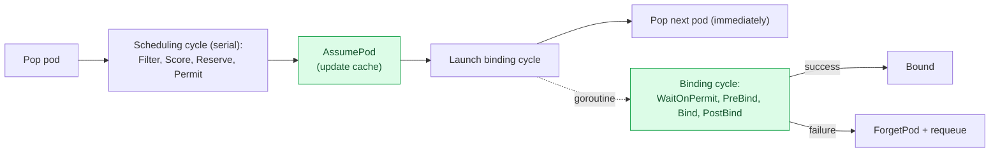
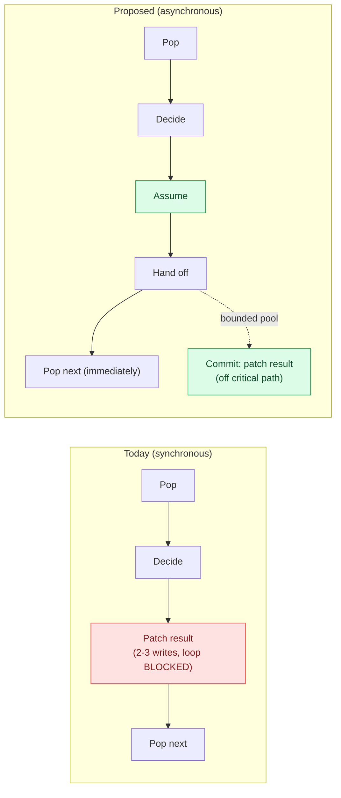
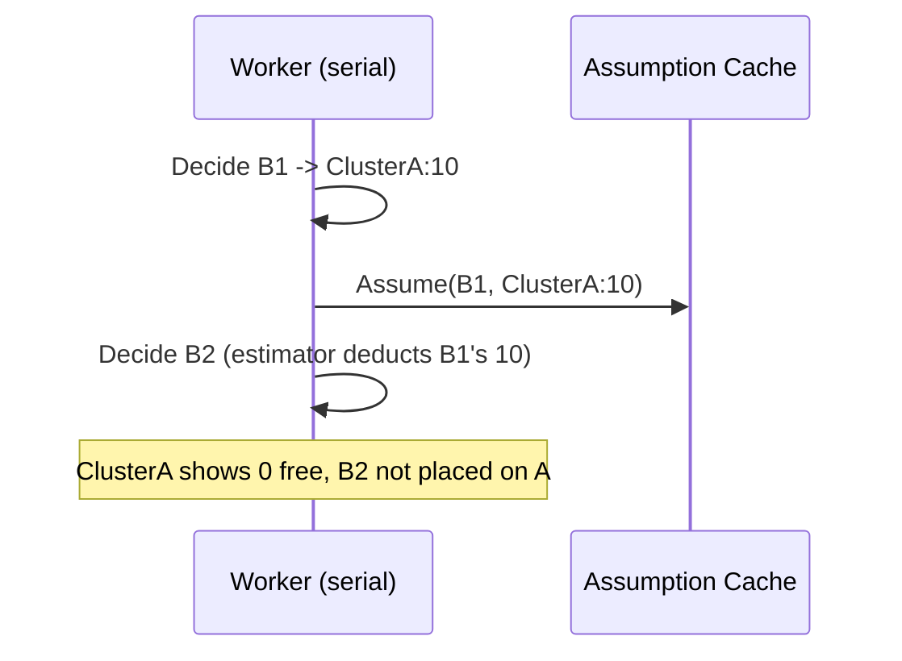

# Asynchronous Binding for the Karmada Scheduler

## Summary

The karmada-scheduler uses a single worker. For each binding it makes a placement decision and then
synchronously writes the result back to karmada-apiserver (`spec.clusters` and status) before
starting the next one. Because the worker blocks on those writes, throughput is bounded by write
latency, not by decision cost. This proposal moves the write-back to a bounded background pool so the
worker can keep deciding while writes drain in parallel. It reuses the existing
[Scheduling Overcommit Protection](../estimator-reservation/README.md) assumption cache to stay
correct, and is alpha, off by default, and gated.

## Motivation

The worker processes the queue one binding at a time, and each
placement issues 2-3 writes that block it. The worker starts a write, waits for it to finish, and
only then moves on, so only one write is ever in flight. Throughput is therefore capped by how long
a write takes, no matter how many requests the API server could actually handle at once.

For example, assuming a write takes about 100 ms and 2 writes per binding (about 200 ms total), the
worker can place at most about 5 bindings/s. Async binding lets the writes for many bindings run at
the same time, up to a configurable pool size. With a pool of 16, up to 16 are in flight at once, so
the ceiling rises roughly in proportion (to about 80 bindings/s) once `--kube-api-qps` is raised to
match. These numbers follow from the assumed 100 ms write and show the shape of the gain, not a
measured result. The real ceiling is whichever is slowest: how fast the worker decides, the pool
size, or the client rate limiter.

The write-back sits on the critical path only to stop the next decision from double-booking capacity
the previous one just consumed. That no longer requires a synchronous write: the Scheduling
Overcommit Protection assumption cache already records a decision's footprint in memory and deducts
it from later decisions.

### Inspiration: kube-scheduler

kube-scheduler splits each pod into a synchronous scheduling cycle and an asynchronous binding cycle
([`schedule_one.go#L99`](https://github.com/kubernetes/kubernetes/blob/release-1.36/pkg/scheduler/schedule_one.go#L99)),
using the same assume/forget pattern this proposal adopts:

Karmada already has the cache half of this pattern; this proposal adds the async-write half.

### Goals

- Take the result write-back off the per-binding critical path to raise throughput.
- Preserve every capacity-correctness guarantee of the current serial loop.
- Ship gated and off by default, leaving the synchronous path unchanged.

### Non-Goals

- Parallelizing the decision phase.
- Async binding for `ClusterResourceBinding` (see [Scope](#scope)).
- Request timeouts on scheduler API calls (a pre-existing, codebase-wide gap).

## Proposal

Split `scheduleNext` for a `ResourceBinding` into two phases:

1. Decide (single worker, serial): run the algorithm, assume the footprint into the cache, and hand
   the result to a bounded pool. The binding stays in-flight (not marked `Done`).
2. Commit (background goroutine): write `spec.clusters` and status, then confirm on success or, on
   failure, roll the assumption back and requeue. Only then is the binding marked `Done`.

Activation requires three gates: `AsyncScheduleBinding` (new), `PriorityBasedScheduling`, and
`SchedulingOvercommitProtection`. `SchedulingOvercommitProtection` is a correctness prerequisite
(without it the assumption is never read; see Risks). `PriorityBasedScheduling` is a scoping
prerequisite: async targets the priority queue (the go-forward scheduling queue) rather than the
older workqueue path. Missing a prerequisite logs a warning and falls back to synchronous binding.

### Scope

Only `ResourceBinding` is covered. The assumption cache is ResourceBinding-scoped, so
`ClusterResourceBinding` has no safety primitive and stays synchronous. CRBs are far fewer than RBs,
so the impact is small; CRB support is a follow-up.

## Design Details

Decision-only functions produce a self-contained commit task (binding, placement, result, and a
snapshot of the prior assumption for rollback). `commitResourceBinding` runs the writes on a
background goroutine, reusing the existing patch helpers. The synchronous path is untouched; async is
an additive branch in `scheduleNext`.

Commits run under a semaphore sized by `--scheduler-async-binding-parallelism` (default 16).
Acquiring a slot blocks the decision loop when the pool is full, which backpressures the rate limiter
and bounds memory. Throughput scales with the pool size, so slower writes need a larger pool;
operators tune it together with `--kube-api-qps` to their measured write latency and target rate.

### Test Plan

- Unit tests covering the commit path: success, failure with and without a prior assumption
  (rollback correctness), the binding staying in-flight until the commit resolves, and the gate
  fallback behavior. Concurrency is exercised with the Go race detector.
- Regression: the existing scheduler suite passes with the gate off.
- E2E: with the gates on, propagate a mix of `Duplicated` and `Divided` workloads and assert correct
  placement, no overcommit, and no leaked assumptions.
- Throughput: compare queue drain rate with the gate on versus off under a burst.

## Risks and Mitigations

Moving a write off the serial loop, the safety concerns and mitigations are:

- Capacity double-booking (core risk): decisions stay serial, and each assumes its footprint before
  hand-off so the next decision's estimator deducts it. This requires
  `SchedulingOvercommitProtection`; without it the assumption is written but never read.
- Re-deciding a binding mid-write: it stays in the queue's in-flight set until the commit calls
  `Done`, so it cannot be re-popped. (Both the priority queue and the legacy workqueue provide this;
  async targets the priority queue for its backoff and unschedulable-vs-error requeue.)
- Commit failure: the assumption is restored to its exact pre-decision state and the binding is
  requeued with backoff.
- Panic in a commit: recovered behind deferred cleanup, so `Done` and the slot release always run.
- Ordering: decisions stay serial in priority order; only durable writes finish out of order, which
  does not affect capacity.

## Alternatives

Sharding by `schedulerName` (already supported): run one scheduler per disjoint set of bindings for
higher aggregate throughput. The catch is that all shards act on the same member clusters while each
keeps its own independent assumption cache. Two shards placing `Divided` workloads on a shared
cluster both see the same free capacity and can overcommit it, because neither knows what the other
just assumed. A single async worker keeps one assumption cache over the whole state of the world, so
it stays correct for capacity-sensitive workloads where sharding does not.

<!--
Note: based on docs/proposals/proposal-template/proposal-template.md.
-->
