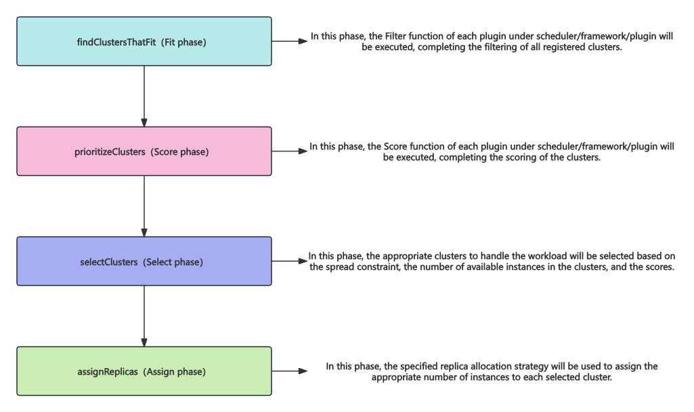
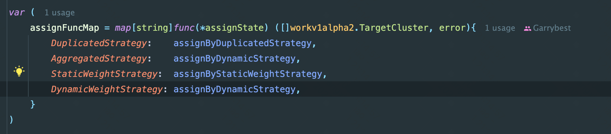
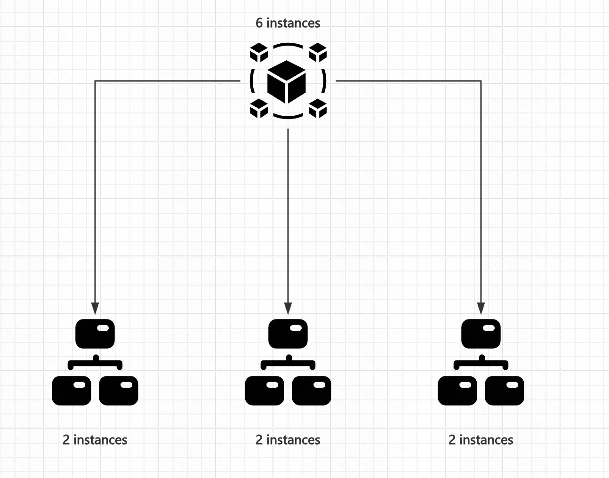
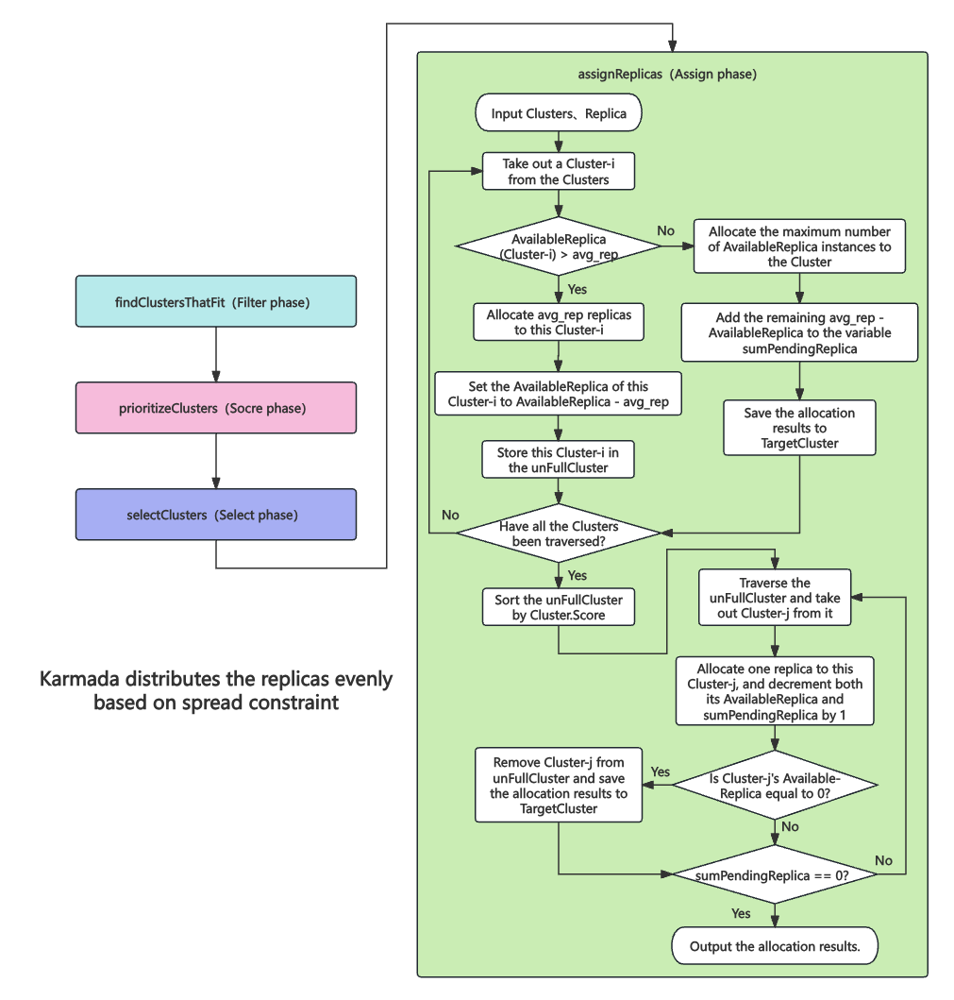

# Average Assign replicas strategy for Karmada

## Summary

In Karmada's current replica scheduling policy, we have supported four replica allocation methods: replication, static weight, aggregation based on available replicas, and dynamic weight based on available replicas.

<!--
在 Karmada 当前的调度器副本数分配策略中，我们已经支持复制、静态权重、基于可用副本数的聚合、基于可用副本数的动态权重这四种副本分配方式。
-->

However, for more complex scheduling scenarios, such as ensuring that the workload replicas are evenly distributed across selected clusters after applying cross-AZ distribution constraints, Karmada currently does not support these scenarios well.

<!--
但是对于更为复杂的调度场景，例如，在跨 AZ 分布约束之后，使工作负载的副本数尽可能地平均分配在所选择的集群中。目前 Karmada 还无法很好地支持这类场景。
-->

Therefore, we plan to introduce a new replica allocation strategy called AverageReplicas for Karmada's scheduler. This strategy will support evenly distributing the target replicas among the selected clusters, and it will:

1. Adhere to spread constraints.
2. Consider the available resources in the member clusters.

<!--
因此我们计划为 Karmada 的调度器引入一种新的副本分配策略 AverageReplicas，该策略能够支持在选定的集群中均匀分配目标副本，并且该策略将：
1.遵守传播约束。
2.考虑工作集群中的可用资源。
-->

## Motivation

By adding the AverageReplicas replica allocation strategy, Karmada can distribute the target replicas as evenly as possible across the member clusters. At the same time, this even distribution will adhere to spread constraints and consider the available resources in the member clusters.

<!--
通过添加 AverageReplicas 副本分配策略，Karmada 能够尽可能平均地将目标副本分配到工作集群中。同时，这种平均是遵守传播约束（spread constraint）且考虑工作集群中的可用资源的。
-->

Such an allocation strategy can significantly improve the system's disaster recovery capability. Even if one cluster fails, it will not have a major impact on the overall system. This is highly beneficial for ensuring high availability of the service.

<!--
这样的分配策略能够显著提高系统的容灾能力，即使某个集群挂掉，也不会对系统整体产生较大的影响。这对于保障服务高可用是非常有益的。
-->

### Goals

By adding the AverageReplicas replica allocation strategy, we ensure that replicas can be evenly distributed among the selected clusters as much as possible. 

<!--
添加 AverageReplicas 副本分配策略，保证副本可以被均匀分配到所选择的集群中，这里的均匀分配是尽力的。
-->

### Non-Goals

Although the AverageReplicas replica allocation strategy to be added will ultimately meet the constraint requirements, we will not be aware of the constraints, nor will we involve writing the constraints. We only need to follow the existing constraints.

<!--
虽然最终要添加的 AverageReplicas 副本分配策略是满足约束限制的，但是我们并不会感知约束限制，或者说不会涉及到对约束限制的编写，只需要遵循现有的约束限制即可。
-->

## Proposal

To add the AverageReplicas replica allocation strategy, it is first necessary to understand the current workflow of the Karmada scheduler:

<!--
为了添加 AverageReplicas 副本分配策略，首先需要了解目前 Karmada 调度器的流程：
-->



Based on the existing Karmada scheduling semantics, if a new replica allocation strategy is to be added, we only need to focus on the Assign phase. Additionally, the clusters selected in the Select phase have already passed the Spread Constraint verification. Therefore, when we focus on the Assign phase, the final allocation results will definitely adhere to the Spread Constraint.

<!--
依据现有 Karmada 的调度语义，如果要添加一个新的副本分配策略，那么只需要着眼于 Assign 阶段。另外，Select 阶段选出来的集群即是通过了 Spread Constraint 校验的集群，因此当我们着眼于 Assign 阶段时，最后的分配结果一定是遵循 Spread Constraint 的。
-->



In the assignFuncMap, we need to add an AverageReplicas allocation strategy. This strategy can utilize the capabilities provided by the estimator to sense how much available resources each member cluster currently has. Based on this information, it will strive to evenly distribute the replicas among the selected clusters.

<!--
在 assignFuncMap 中，我们需要添加一个 AverageReplicas 分配策略，其能够借助 estimator 提供的能力感知目前各个工作集群还有多少资源可用，同时在此基础上尽力将副本平均分配给各个所选出的集群。
-->

The replica allocation strategy can be verified by checking the logs and the instance running status (i.e., which cluster the instances were allocated to and whether they are Running).

<!--
可以通过日志即实例运行情况（即实例被分配到了哪个集群以及是否 Running）来确认副本分配策略是否符合预期。
-->

### User Stories 

#### Story 1 

For example, as developers, we have a service with 6 replicas and three clusters. We hope Karmada can perform high-availability deployment across clusters. With the support of the AverageReplicas allocation strategy, we can ensure that each cluster has 2 replica instances, as shown in the figure below:

<!--
例如，作为开发人员，我们有一个包含 6 个副本的服务且有三个集群，希望 Karmada 能够进行跨集群的高可用性部署。那么在副本分配策略 AverageReplicas 的支持下，我们就能够保证一个集群上有 2 个副本实例，如下图所示：
-->



### Risks and Mitigations

The changes introduced in this proposal will add an AverageReplicas allocation strategy to Karmada. By default, this strategy will not be active, as users have not directly specified the use of the AverageReplicas strategy. If users want to use this feature, they must explicitly specify the AverageReplicas replica allocation strategy.

<!--
该 Proposal 所新增的改动会为 Karmada 添加一个 AverageReplicas 分配策略，默认情况下，该策略是不会生效的，因为用户并没有直接指定使用 AverageReplicas 策略。如果用户想要使用这个功能，则必须明确指定 AverageReplicas 副本分配策略。
-->

Therefore, the introduction of this change in Karmada is compatible with previous user configurations. This proposal does not present any foreseeable risks at this time.

<!--
因此，Karmada 引入这项改动是能够兼容过往用户的配置的，该 Proposal 目前不存在任何可预见性的风险。
-->

## Design Details

### API Design

In Karmada, the API related to scheduling is the PropagationPolicy. Currently, its API design is as follows:

<!--
在 Karmada 中，和调度相关的 API 即为 PropagationPolicy，目前，其 API 设计如下：
-->

```yaml
apiVersion: policy.karmada.io/v1alpha1
kind: PropagationPolicy 
metadata:
spec:
  placement:
    replicaScheduling: 
      replicaDivisionPreference: Average
```

As we can see, to add an AverageReplicas replica allocation strategy, we can consider adding a new value, "Average," to the replicaDivisionPreference. Here is an example.

<!--
可以看到，如果要添加一个 AverageReplicas 副本分配策略，可以考虑给 replicaDivisionPreference 添加一个新的取值 Average。下面是一个例子：
-->

```yaml
apiVersion: policy.karmada.io/v1alpha1
kind: PropagationPolicy
metadata:
  name: foo
  namespace: bar
spec:
  resourceSelectors:
    - apiVersion: apps/v1
      kind: Deployment
      name: foo
  placement:
    replicaScheduling:
      replicaSchedulingType: Divided
      replicaDivisionPreference: Average
```

Note that `replicaDivisionPreference == Average` will only be effective when `replicaSchedulingType == Divided`.

<!--
注意，replicaDivisionPreference == Average 只有在 replicaSchedulingType == Divided 时才会生效。
-->

### Process Design

Currently, Karmada's scheduling process consists of four phases: Filter, Score, Select, and Assign. To achieve an even distribution of replicas across the clusters as much as possible, it is necessary to implement the allocation of replicas to each member cluster in an as-even-as-possible manner during the Assign phase.

<!--
目前 Karmada 的调度分为四个阶段 Filter、Score、Select、Assign。为了能够尽可能地满足将副本平均分配到各个集群上，需要在 Assign 阶段，实现对各个工作集群进行尽力平均地副本分配。
-->

#### Assign

We need to add the AverageReplicas replica allocation strategy in the Assign phase. Since the cluster selection has already been completed in the Select phase, the input for the Assign phase will be:

1. The selected clusters.
2. The number of replicas to be allocated.
3. ResourceBindingSpec, which includes the information of the new replica allocation strategy.

<!--
我们需要在 Assign 阶段添加副本分配策略 AverageReplicas。由于已经在 Select 阶段完成了Cluster 的筛选，因此我们在 Assign 阶段的输入即是：
1.被选出的 Cluster。
2.待分配的 Replica（个数）。
3.ResourceBindingSpec，其中包括新增的副本数分配策略信息。
-->

The logic here is essentially to determine how many replicas should be allocated to each cluster. According to the project's objectives, in the Assign phase, replicas should be evenly distributed among the selected clusters as much as possible. First, we need to calculate the ideal number of replicas each cluster should be allocated:

1. Define the number of selected clusters as L。
2. Calculate the average number of replicas each cluster should be allocated, defined as avg_rep = Replica / L。

<!--
这里执行的逻辑实际上就是确定每个 Cluster 应该分配多少个 replica。依据项目的目标，在 Assign 阶段，应该尽可能地将副本数平均分配到所选择的集群中，首先我们需要计算理想情况下，每个 Cluster 需要被分配多少 Replica：
1.定义被选出的 Cluster 个数为 L。
2.结合待分配的 Replica 计算平均每个 Cluster 要分配多少 replica，定义 avg_rep = Replica / L。
-->

After calculating the average number of replicas to be allocated to each cluster avg_rep, we start traversing the selected clusters and use the predefined TargetCluster struct to define the allocation results.

<!--
在计算出每个保存每个 Cluster 的平均待分配实例数 avg_rep 之后，开始遍历被选出的 Cluster，并使用已经定义好的 TargetCluster 结构体定义分配结果。
-->

It is important to note that to ensure the allocated workloads can be successfully deployed, we also need to consider the current available resources of each member cluster. This can be obtained through the `karmada-scheduler-estimator`.

<!--
需要注意的是，为了保证被分配的负载能够被顺利地拉起，因此还需要考虑各个工作集群目前的可用资源，这可以通过 karmada-scheduler-estimator 获取。
-->

The specific allocation process is as follows:
<!--
具体的分配流程如下：
-->
1. Traverse all selected clusters to check how many replicas they can accommodate (i.e., AvailableReplica), then perform the following **one round** of traversal:
   <!--
   1.遍历所有被选出的 Cluster，查看其能容纳多少 replica（也就是 AvailableReplica），然后进行如下一轮遍历：
   -->
   * If AvailableReplica > the avg_rep corresponding to that cluster, allocate avg_rep instances to that cluster, and set the cluster's AvailableReplica to AvailableReplica - avg_rep. Since this cluster has not reached its full allocation, add it to the **unFullCluster slice (a global variable not bound to any specific cluster)** representing under-allocated clusters.
   <!--
   a.如果 AvailableReplica > 该 Cluster 对应的 avg_rep，那么给该 Cluster 分配 avg_rep 个实例，并将该 Cluster 的 AvailableReplica 设置为 AvailableReplica - avg_rep，由于该 Cluster 还没有分配满额，因此将其存入表示未满额集群的 unFullCluster（这是一个全局变量，不与任何一个 Cluster 绑定）切片中。
   -->
   * If AvailableReplica <= the avg_rep corresponding to that cluster, allocate the maximum AvailableReplica instances to that cluster, and add the remaining pending replicas (avg_rep - AvailableReplica) to the variable **sumPendingReplica (a global variable not bound to any specific cluster)**, which is initialized to zero.
   <!--
   b.如果 AvailableReplica <= 该 Cluster 对应的 avg_rep，那么给该 Cluster 分配满额的 AvailableReplica 个实例，同时将剩余的待分配 pendingReplica，也就是 avg_rep - AvailableReplica，添加到变量 sumPendingReplica（这是一个全局变量，不与任何一个 Cluster 绑定）中，该变量初始时为零。
   -->
2. After completing the first round of traversal, first sort the unFullCluster by Cluster.Score, then start traversing the unFullCluster. For each cluster in it, allocate one replica, and decrement both the cluster's AvailableReplica and sumPendingReplica by 1. Then check if the cluster's AvailableReplica is zero, and if so, remove that cluster from the unFullCluster.
<!--
2.在一轮遍历结束之后，首先对 unFullCluster 按照 Cluster.Score 进行排序，然后开始遍历 unFullCluster，对于其中的每个 Cluster，给其分配一个 replica，同时该集群的 AvailableReplica 和  sumPendingReplica 都自减 1，然后判断该 Cluster 的 AvailableReplica 是否为零，如果为零，则将该 Cluster 移出 unFullCluster。
-->

3. Repeat step 2 until sumPendingReplica is 0, completing the allocation.
<!-- 
3.循环第二步，直至 sumPendingReplica 为 0，分配结束。
-->

Since we have ensured in the Select phase that the total AvailableReplica of the selected clusters is greater than the number of replicas to be allocated, there is no need to worry about resource insufficiency.

<!--
由于在 Select 阶段中，我们已经保证了所选出的 Cluster 的 AvailableReplica 总和是大于待分配的 Replica 的，因此不必担心资源不足的问题。
-->

**This way, we can achieve an even distribution of replicas across different clusters as much as possible.** Below is a detailed flowchart:

<!--
如此一来就能够实现尽力将副本数平均分配给不同的 Cluster。下面给出了详细的流程图：
-->



### Test Plan

The testing plan will be supplemented before the release of this proposal feature.

<!--
该 Proposal 特性发布前，测试计划将会补充。
-->

## Alternatives

Other implementation methods for this proposal have not been considered previously.

<!--
此前没有考虑过该 Proposal 的其他实现方法。
-->
