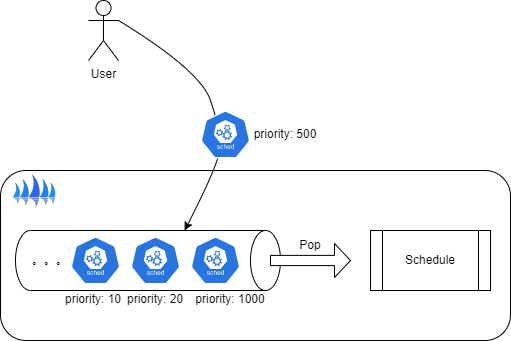
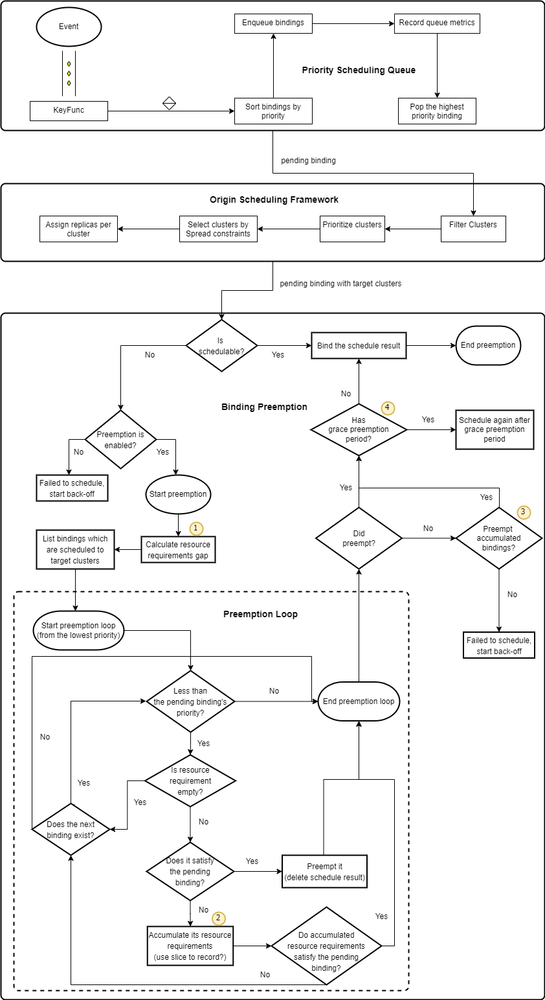

# Binding Priority and Preemption

## Summary

Currently, the scheduler only schedules workloads in order, that is, the workload triggered first can be scheduled first.
And when a new binding has certain scheduling requirements that makes it infeasible on any member cluster,
it may stay in the scheduling queue, until sufficient resources are free, and it can be scheduled.

This proposal proposes the concept of priorities and preemption for bindings in Karmada and how the priority impacts scheduling and preemption of bindings
when the member cluster runs out of resources.
- The priority is independent of its workload type and must be one of the valid values, there is a total order on the values.
- Preemption is the action taken when an important binding requires resources or conditions which are not available in all member clusters. So, one or more bindings need to be preempted to make room for the important binding.

## Motivation

It is fairly common in large-scale clusters to have more tasks than what Karmada can handle, so scheduling responses can become slow.
Often times the workload is a mix of high priority critical tasks, and non-urgent tasks that can wait.
Karmada should be able to distinguish these workloads in order to decide which ones should be scheduled sooner, which ones can wait and which ones can be preempted.

### Goals

- How to specify priority and preemption strategy for bindings.
- Define how the order of these priorities are specified.
- Define how new priority levels are added.
- Effect of priority on scheduling and preemption.
- Define the concept of binding preemption in Karmada.
- Define scenarios under which a binding may get preempted.
- Define mechanics of preemption.

### Non-Goals

- How preemption works in spread constraints.

## Proposal

### Terminology

When a new binding has certain scheduling requirements that makes it infeasible on any member cluster,
scheduler may choose to clear the scheduling result of lower priority bindings to satisfy the scheduling requirements of the new binding.
We call this operation "binding preemption". Binding preemption is distinguished from "[policy preemption](../policy-preemption/README.md)" where high-priority policies preempt low-priority policies.

### User Stories (Optional)

#### As a user, I want to the task I submitted to be scheduled as soon as possible.

I usually classify my workloads based on priority and want high-priority workloads to be scheduled ahead of others, rather than waiting to be scheduled in the order they were queued. This will allow me to maintain the quality of service for important workloads even during resource contention.



#### As a user, I hope that GPU resources can be provided preferred to high-priority AI training tasks.

I submit a AI workload which occupies preferentially GPU resources of member clusters.
Karmada tries to find feasible clusters that can run the AI workload. If no enough member clusters are found,
I hope Karmada tries to remove bindings with lower priority from some arbitrary member clusters in order to make room for the pending bindings.

### Notes/Constraints/Caveats (Optional)

### Risks and Mitigations

Binding priority and preemption can have unwanted side effects. Here is an example of potential problems and ways to deal with them.

#### Bindings are preempted unnecessarily

Preemption removes existing bindings from some member clusters under resource pressure to make room for higher priority pending bindings.
If you give high priorities to certain bindings by mistake, these unintentionally high priority bindings may cause preemption in your multi-cluster system.

To address the problem, you can disable the preemption behavior for your bindings.

When a binding is preempted, there will be events recorded for the preempted binding.
Preemption should happen only when a member cluster does not have enough resources for a binding.
In such cases, preemption happens only when the priority of the pending binding (preemptor) is higher than the preempted bindings.
Preemption must not happen when there is no pending binding, or when the pending bindings have equal or lower priority than the preempted bindings.
If preemption happens in such scenarios, please feel free to file an issue.

## Design Details

### Effect of priority on scheduling

One could generally expect a binding with higher priority has a higher chance of getting scheduled than the same binding with lower priority.
However, there are other parameters that affect scheduling decisions. So, a high priority binding may or may not be scheduled before lower priority bindings.
For example, a high priority binding is marked as unschedulable due to insufficient resources of member clusters, but the preemption behavior is not enabled.
Karmada will try to schedule others with lower priority.

### Effect of priority on preemption

Generally, lower priority bindings are more likely to get preempted by higher priority bindings when member clusters have reached a threshold.
In such a case, scheduler may decide to preempt lower priority bindings to release enough resources for higher priority pending bindings.
As mentioned before, there are other parameters that affect scheduling decisions, such as cluster affinity and spread constraints.
If scheduler determines that a high priority binding cannot be scheduled even if lower priority bindings are preempted, it will not preempt lower priority bindings.

### New API

#### Priority Classes

This proposal will reuse the PriorityClass API of Kubernetes. The priority class defines the mapping between the priority name and its value.
It can have an optional description. It is an arbitrary string and is provided only as a guideline for users.

Similarly, we will follow the semantics of PriorityClass in Karmada. The following example gives a PriorityClass used by the system by default.
```yaml
apiVersion: scheduling.k8s.io/v1
kind: PriorityClass
metadata:
  name: foo
globalDefault: true
preemptionPolicy: PreemptLowerPriority
value: 2000000000
```

**Important notes**: Only one PriorityClass can be marked as `globalDefault`. However, if more than one PriorityClasses exists with their `globalDefault` field set to true, the
smallest value of such global default PriorityClasses will be used as the default priority.

### API change

#### PropagationPolicy/ClusterPropagationPolicy API change

We will introduce a field named `SchedulePriority` to `PropagationPolicy.spec`. User requests sent to Karmada may have PriorityClassName in their `SchedulePriority`.
Karmada resolves a PriorityClassName to its corresponding `Priority` and `PreemptionPolicy`, then populates them of the binding spec.
This proposal are going to add some new fields for specify PriorityClass.

```go
// SchedulePriority represents the scheduling priority of workloads.
type SchedulePriority struct {
    // PriorityClassSource indicates where to find the PriorityClass definition.
    // Valid options are:
    // - KubePriorityClass: refers to Kubernetes PriorityClass with API version scheduling.k8s.io/v1.
    // - PodPriorityClass: refers to PodTemplate(PodSpec.PriorityClassName)
    // - FederatedPriorityClass: refers to Karmada FederatedPriorityClass with the latest API version.
    //
    // +kubebuilder:default="KubePriorityClass"
    // +kubebuilder:validation:Enum=FederatedPriorityClass;KubePriorityClass;PodPriorityClass
    // +required
    PriorityClassSource PriorityClassSource `json:"priorityClassSource,omitempty"`

    // PriorityClassName is the name of the PriorityClass that will be used to resolve the workload's
    // priority and preemption policy. The behavior of this field depends on the value of PriorityClassSource:
    //
    // - If PriorityClassSource is KubePriorityClass:
    //   This field should specify the name of a Kubernetes PriorityClass, if not specified, the workload will
    //   use the global default PriorityClass, if the global default PriorityClass does not exist, the workload's
    //   priority will be set to 0, and its preemption policy will be "Never".
    // - If PriorityClassSource is PodPriorityClass:
    //   This field should be omitted, and the workload will use the name declared in PodTemplate, if the referenced
    //   PriorityClass does not exist, will use the global default, if the global default PriorityClass does not
    //   exist, the workload's priority will be set to 0, and its preemption policy will be "Never".
    // - If PriorityClassSource is FederatedPriorityClass:
    //   This field must specify the name of a FederatedPriorityClass (currently undefined but may be implemented
    //   in future releases).
    // +optional
    PriorityClassName string `json:"priorityClassName,omitempty"`
}
```

```go
type PriorityClassSource string

const (
    // FederatedPriorityClassSource indicates that Karmada will use FederatedPriorityClass as binding's priority class.
    // FederatedPriorityClass is undefined now.
    FederatedPriorityClassSource PriorityClassSource = "FederatedPriorityClass"

    // KubePriorityClassSource indicates that Karmada will use the special "priorityclasses.scheduling.k8s.io" as binding's priority class.
    KubePriorityClassSource PriorityClassSource = "KubePriorityClass"

    // PodPriorityClassSource indicates that Karmada will parse the workload's PodTemplate to find the PriorityClass as binding's priority class.
    PodPriorityClassSource PriorityClassSource = "PodPriorityClass"
```
**Important notes**: This field `PriorityClassSource` is only a design extension and we have no plans to introduce it in the first release.

#### ResourceBinding/ClusterResourceBinding API change

This proposal are going to add a composited field `SchedulePriority`, which contains two new field: `Priority` and `PreemptionPolicy` for determining the behavior for preempting.
By default, preemption is disabled.

```go
// ResourceBindingSpec represents the expectation of ResourceBinding.
type ResourceBindingSpec struct {    
    // SchedulePriority represents the scheduling priority of workloads.
    // +optional
    SchedulePriority *SchedulePriority `json:"schedulePriority,omitempty"`

    ... ...
```

```go
// SchedulePriority represents the scheduling priority of workloads.
type SchedulePriority struct {
    // Priority is the priority value that will be used by the scheduler to sort bindings.
    // The higher the value, the higher the priority.
    // +required
    Priority int32 `json:"priority,omitempty"`

    // PreemptionPolicy describes the policy of if and when to preempt bindings.
    // One of Never, PreemptLowerPriority.
    // +kubebuilder:validation:Enum=Never;PreemptLowerPriority
    // +required
    PreemptionPolicy PreemptionPolicy `json:"preemptionPolicy,omitempty"`
}

// PreemptionPolicy describes a policy for if/when to preempt a binding.
// +enum
type PreemptionPolicy string

const (
    // PreemptLowerPriority means that binding can preempt other bindings with lower priority.
    PreemptLowerPriority PreemptionPolicy = "PreemptLowerPriority"
    // PreemptNever means that binding never preempts other bindings with lower priority.
    PreemptNever PreemptionPolicy = "Never"
)
```

### About priority classes

Priority classes can be added or removed, but we only allow updating `Description`. 
While Karmada can work fine if priority classes are changed at run-time,
the change can be confusing to users as bindings with a priority class which were created before the change will have a different priority and preemptionPolicy than those created after the change.
Deletion of priority classes is allowed, despite the fact that there may be existing bindings that have specified such priority class names in their `placement`.
In other words, there will be no referential integrity for priority classes. This is another reason that all system components should only work with priority and preemptionPolicy and not with the PriorityClassName.

One could delete an existing priority class and create another one with the same name and different content.
By doing so, they can achieve the same effect as updating a priority class, but we still do not allow updating priority classes to prevent accidental changes.

### Preemption scenario

In this proposal, the only scenario under which a group of bindings in Karmada may be preempted is when a higher priority binding cannot be scheduled due to various unmet scheduling requirements,
such as lack of resources, spread constraints, etc., and the preemption of the lower priority bindings allows the higher priority binding to be scheduled.
So, if the preemption of the lower priority bindings does not help with scheduling of the higher priority binding, those lower priority bindings will keep running and the higher priority binding will stay pending.

**Important notes**: 
- The scheduler will only consider bindings whose resource requirements are not empty.
From scheduler's point of view, such a binding needs no resources and its preemption will not release any resources.
- Since the preemption feature is still in the experimental stage, we will not introduce preemption in ClusterResourceBinding first because ClusterResourceBinding are usually more sensitive cluster-level resources.

### Preemption order

When scheduling a pending binding, scheduler tries to place the binding on a member cluster that does not require preemption.
If there is no such a member cluster, scheduler may favor a member cluster where the number and/or priority of victims (preempted bindings) is smallest.
After choosing the member cluster, scheduler considers the lowest priority bindings for preemption first.
Scheduler starts from the lowest priority and considers enough bindings that should be preempted to allow the pending binding to schedule.
Scheduler only considers bindings that have lower priority than the pending binding.

Scheduler will try to minimize the number of preempted bindings.
As a result, it may preempt a binding while leaving lower priority bindings running if preemption of those lower priority bindings is not enough to schedule the pending binding while preemption of the higher priority binding(s) is enough to schedule the pending binding.
For example, if member cluster capacity is 10, and pending binding is priority 10 and requires 5 units of resource, and the running bindings are
```json lines
{
    "priority": 0,
    "request": 1
}
{
    "priority": 1,
    "request": 2
}
{
    "priority": 2,
    "request": 5
}
{
    "priority": 3,
    "request": 2
}
```
, scheduler will preempt the priority 2 binding only and leaves priority 1 and priority 0 running.

### Preemption in multi-scheduler

Karmada allows multiple schedulers to exist in its control plane, This introduces a race condition where multiple schedulers may perform round-robin preemption.
That is, scheduler A may schedule binding A, Scheduler B preempts binding A to schedule binding B which is then preempted by scheduler A to schedule binding A and we go in a loop.

Therefore, we strongly recommend not to enable preemption behavior in multiple schedulers.
If you must enable it, unless you can ensure that they will not have any intersection during preemption.

### Flowchart of the new scheduling algorithm



1. When the pending binding requires 2 units of resource and has 2 replicas, however, the schedule result(`target clusters`) only provide 3 units of resource. 
So we get the resource requirements gap is `2 * 2 - 3 = 1`.
2. If a binding cannot meet the resource requirement of the pending binding,
we don't stop accumulating its resource requirements until the resource requirements of the pending binding are met.
3. If there is no binding can meet the resource requirements of the pending binding, no preemption will be executed when the preemption loop ends.
So we'll try to preempt the accumulated bindings to meet the resource requirements of the pending binding, if can't, just fail.

### Feature gate

This proposal is an experimental feature, so we will introduce the following feature gates, which are disabled by default.
- PriorityBasedScheduling: controls whether to enable the priority scheduling feature.
- PriorityBasedPreemptiveScheduling: controls whether to enable the preemptive scheduling feature.

### Components change

#### karmada-controller-manager

Currently, a binding will be created or updated when resource templates are matched by propagation policy.
When a binding is created or updated, detector tries to find the priority class by `priorityClassName` to populate the binding spec.
detector will populate the binding spec with default priority and preemptionPolicy if the priority class is not found.

Only priority classes changes (by deleting and adding them with a different content) will not trigger bindings' update.

#### karmada-scheduler

Currently, the scheduler only runs a serial scheduling loop by a FIFO queue.
With this proposal, a priority scheduling queue will be implemented to replace the current work queue.
It should retain all the functionality of the current work queue and additionally implement sorting by priority.

In addition, if preemption behavior is enabled, the scheduler should identify the circumstances under which the pending binding should preempt other bindings,
calculate which bindings need to be preempted to meet current resource requirements.

#### karmada-webhook

Since we have strictly defined the binding priority and preemption, so the webhook should perform extra
validation work to prevent misleading configuration.

### Test Plan

- All current testing should be passed, no break change would be involved by this feature.
- Add new E2E tests to cover the feature, the scope should include:
    * bindings are scheduled by priority.
    * preemption between high-priority bindings and low-priority bindings.
    * preemption is disabled.

## Alternatives

In the current proposal, the preemptive scheduling feature is proposed to better understand the priority scheduling feature.
Our design of preemptive scheduling is not complete and needs more iterations.

### Implementation plan

- release 1.13: release priority scheduling feature, provide alpha version preview, feature gate is disable by default.
- release 1.14: complete the preemptive scheduling design and iterate the priority scheduling feature.
- release 1.15: release preemptive scheduling feature, provide alpha version preview, feature gate is disable by default.
- release 1.16+: we will continue to iterate on the above features based on user feedback. When a feature reaches maturity, the corresponding feature gate will be enabled by default.