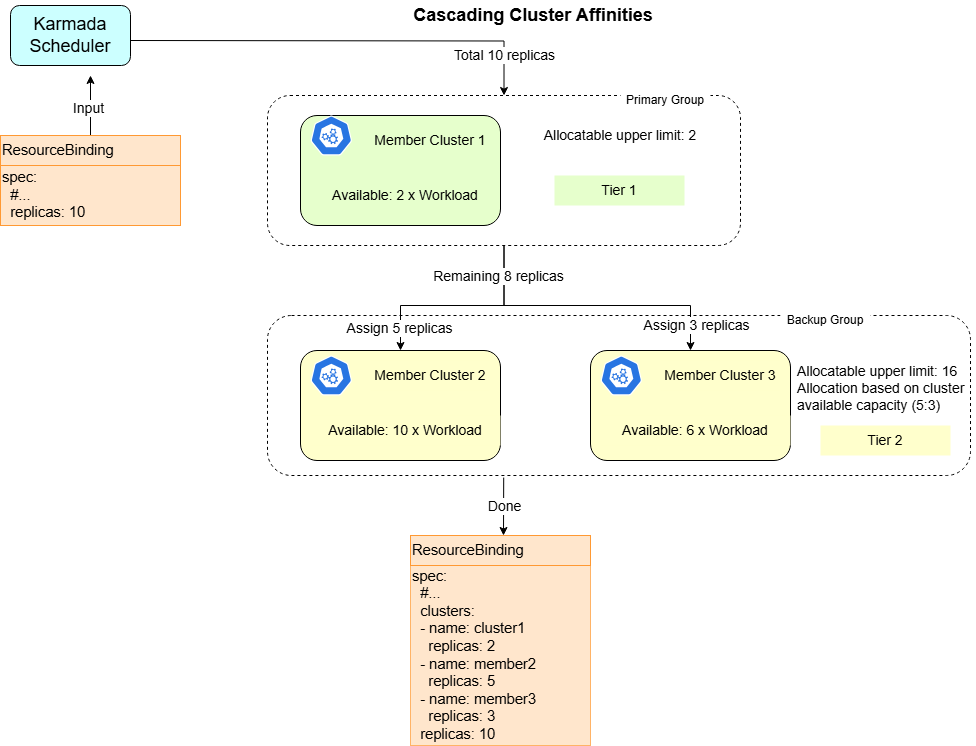

# Cascading Cluster Affinity Scheduling

## Summary

Karmada currently supports declaring a set of candidate clusters through `clusterAffinity`, or multiple sets of candidate clusters through `ClusterAffinities` (which combines multiple `clusterAffinity` terms in a specific order). However, in either approach, each `clusterAffinity` represents an independent, mutually exclusive cluster set during a single scheduling process—the scheduler ultimately selects only one cluster group defined by one `clusterAffinity` or its subset.

This model has limitations in hybrid cloud scenarios (such as coexistence of local data centers and public clouds). In practical use, local clusters typically serve as the preferred resource pool, while public cloud clusters act as extensions or backup resources. The two are not completely independent and mutually exclusive relationships, but should be **automatically used supplementarily based on priority when local resources are insufficient**.

To address this, this proposal introduces cascading cluster affinity scheduling to describe priority relationships between cluster groups. This mechanism will enable Karmada to better support workload scheduling in hybrid cloud environments and improve the deployment practicality of online applications in terms of elasticity.

## Motivation

### Goals

- Extend the API of PropagationPolicy to hold preferred affinity groups declaration.
- Propose the implementation ideas for involved components, including `karmada-controller-manager`, `karmada-webhook` and `karmada-scheduler`.

### Non-Goals

- Cluster utilization is an effective means of controlling cluster resource usage but is not within the scope of this proposal.

## Proposal

### User Stories

#### Story 1
As a user, I have a local cluster and a cloud cluster, and use FHPA for automatic scaling. To effectively control costs, I want my workloads to preferentially use the local cluster, and only use the cloud cluster when resources are insufficient. Critically, during the scaling process, the priority must remain unchanged, and cloud replicas must be removed first.

### Risks and Mitigations

This proposal maintains backward compatibility. It will introduce entirely new APIs, so systems built with previous versions of Karmada can be seamlessly migrated to the new version. Previous configurations (YAMLs) can be applied to the new version of Karmada without any behavior change.

## Design Details

### API change

#### Approach 1:

Extend the `ClusterAffinity` API by adding a `Supplements` field to describe supplementary cluster group configurations. This field allows users to define one or more alternative cluster groups for a single Affinity Group. When the primary cluster group has insufficient resources or is unavailable, the scheduler can automatically cascade to these supplementary cluster groups for workload deployment. Note: Supplements is an array that can set multiple tiers of extensible cluster groups, with scheduling priority decreasing as the tier level increases.

```go
// ClusterAffinity represents the filter to select clusters.
type ClusterAffinity struct {
    // Omitted, as there are no changes.

    // new added API field
    Supplements []ClusterAffinity `json:"supplements,omitempty"`
}
```

The following configuration declares a ClusterAffinity with an extended cluster group:

```yaml
apiVersion: policy.karmada.io/v1alpha1
kind: PropagationPolicy
metadata:
  name: nginx
spec:
  resourceSelectors:
    - apiVersion: apps/v1
      kind: Deployment
      name: nginx
  placement:
    clusterAffinity:
      clusterNames:
        - cluster1
      supplements:
        - clusterNames:
          - cluster2
          - cluster3
```

#### Approach 2:

Currently, ClusterAffinities have mutually exclusive relationships between ClusterAffinity terms, but they can also have cascading supplementary relationships. Add `AffinityStrategy.Mode` to the placement API to describe the relationship between ClusterAffinities.

```go
type Placement struct { 
    ClusterAffinities []ClusterAffinityTerm `json:"clusterAffinities,omitempty"`  
    
    // AffinityStrategy defines how cluster affinities are evaluated  
    // +optional  
    AffinityStrategy *AffinityStrategy `json:"affinityStrategy,omitempty"`  
}  
  
type AffinityStrategy struct {  
    // Mode defines the scheduling mode  
    // +kubebuilder:validation:Enum=Exclusive;Cascade
    // +kubebuilder:default=Exclusive
    // +optional  
    Mode string `json:"mode,omitempty"`  
} 
```

The following configuration declares a cascading expansion relationship between multiple clusterAffinity terms:

```yaml
apiVersion: policy.karmada.io/v1alpha1
kind: PropagationPolicy
metadata:
  name: nginx
spec:
  resourceSelectors:
    - apiVersion: apps/v1
      kind: Deployment
      name: nginx
  placement:
    clusterAffinities:
      - affinityName: primary
        clusterNames:
          - cluster1
      - affinityName: backup
        clusterNames:
          - cluster2
          - cluster3
    affinityStrategy:
      mode: Cascade
```

#### Approach 3:

Add a new API `PreferredClusterAffinities` at the same level as ClusterAffinities to declare cluster groups with priority relationships.

```go
// Placement represents the rule for select clusters.
type Placement struct {
    // PreferredClusterAffinities represents scheduling preferences to multiple cluster
    // groups that indicated by ClusterAffinityTerm with priority-based selection.
    //
    // Unlike ClusterAffinities which are mutually exclusive (scheduler selects only one group),
    // PreferredClusterAffinities allows the scheduler to use multiple cluster groups based on
    // priority and resource availability.
    // +optional
    PreferredClusterAffinities []ClusterAffinityTerm `json:"preferredClusterAffinities,omitempty"`
}
```

The following configuration declares a preferredClusterAffinities with two affinity terms:

```yaml
apiVersion: policy.karmada.io/v1alpha1
kind: PropagationPolicy
metadata:
  name: nginx
spec:
  resourceSelectors:
    - apiVersion: apps/v1
      kind: Deployment
      name: nginx
  placement:
    preferredClusterAffinities:
      - affinityName: primary
        clusterNames:
          - cluster1
      - affinityName: backup
        clusterNames:
          - cluster2
          - cluster3
```

Regardless of which API is used, during the scheduling process, the scheduler will first try to schedule the workload to member cluster `cluster1` as much as possible. If `cluster1` cannot accommodate all replicas, the remaining replicas will continue to be allocated among clusters `cluster2` and `cluster3`.

If `cluster1` is unavailable, the scheduler will use the clusters in the extended cluster group (i.e., `cluster2` and `cluster3`) for scheduling. Note that when `cluster1` becomes available again, **workload migration will not be automatically triggered**; users need to explicitly use the `WorkloadRebalancer` resource to trigger rescheduling, or indirectly trigger it by adjusting workload replica counts.

Each scheduling will **preferentially use the higher priority affinity group** under current conditions, i.e., the group with the earlier order in ClusterAffinityTerm.

The overall process can be described as the following diagram:



### Components change

#### karmada-scheduler

The current scheduler only processes one affinity term in each scheduling loop. So, it needs to adjust the scheduling logic to support cascading cluster affinity scheduling.

### Test Plan

- All current testing should be passed, no break change would be involved by this feature.
- Add new E2E tests to cover the feature, the scope should include:
    * Workload propagating with scheduling type `Duplicated`.
    * Workload propagating with scheduling type `Divided` (including scaling scenarios)

## Discussion Points

**Should multi-cluster priority scheduling support working with `SpreadConstraints`?**

Yes, they are independent APIs.

**How does cascading cluster affinity scheduling behave under different replica scheduling strategies?**

When considering different scheduling strategies, we need to analyze them in combination with the semantics of cascading scheduling. The semantics of cascading scheduling itself are to ensure that clusters can be used in order to achieve cost optimization. 
Extended cluster groups are used when the primary cluster group has insufficient resources (or cannot meet scheduling conditions).

| Replica Scheduling Strategy | Question                                                                                                        | Conclusion                                                                                                                                                                                                          |
|-----------------------------|-----------------------------------------------------------------------------------------------------------------|---------------------------------------------------------------------------------------------------------------------------------------------------------------------------------------------------------------------|
| Duplicated                  | Should distribution occur in all clusters, or only in the first-tier?                                           | Only distribute in first-tier. Because the primary cluster group can meet scheduling requirements                                                                                                                   |
| Aggregated                  | How does it behave?                                                                                             | From the perspective of a certain tier cluster group: this tier will try to fill all remaining replicas with Aggregated strategy until all clusters in this tier are filled or all remaining replicas are allocated |
| Divided/Static              | Is it supported? Fall back to directly splitting replicas among clusters according to configured static weights | Supported, but only distributes in first-tier. Because the primary cluster group can meet scheduling requirements                                                                                                   |
| Divided/Dynamic             | How does it behave?                                                                                             | From the perspective of a certain tier cluster group: this tier will try to fill all remaining replicas with Dynamic strategy until all clusters in this tier are filled or all remaining replicas are allocated    |

**How to handle when a cluster appears multiple times in different tiers?**

Determine its priority order based on the tier where it first appears.

**How to handle the old ClusterAffinities after introducing the new API?**

Cascading scheduling is a new use case that does not conflict with the existing ClusterAffinities use case. They cannot completely replace each other.

Current use case of ClusterAffinities: Multi-cluster group isolation (region, provider) and failover, used to select one from multiple candidate cluster groups.

Cascading scheduling: Used for cost optimization and elastic scaling. There is only one candidate cluster group, and clusters within one candidate cluster group are used in tiered order.
