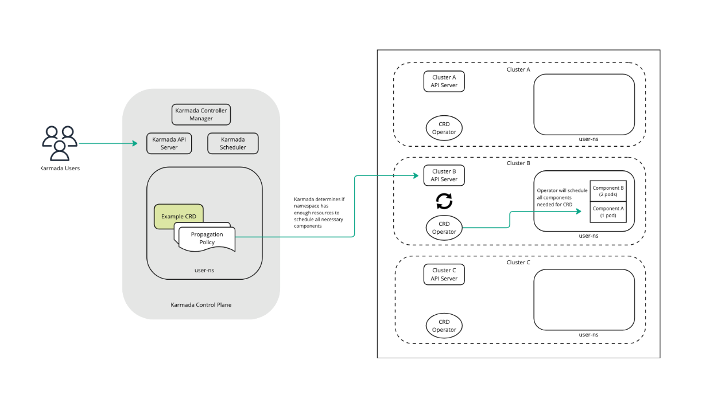
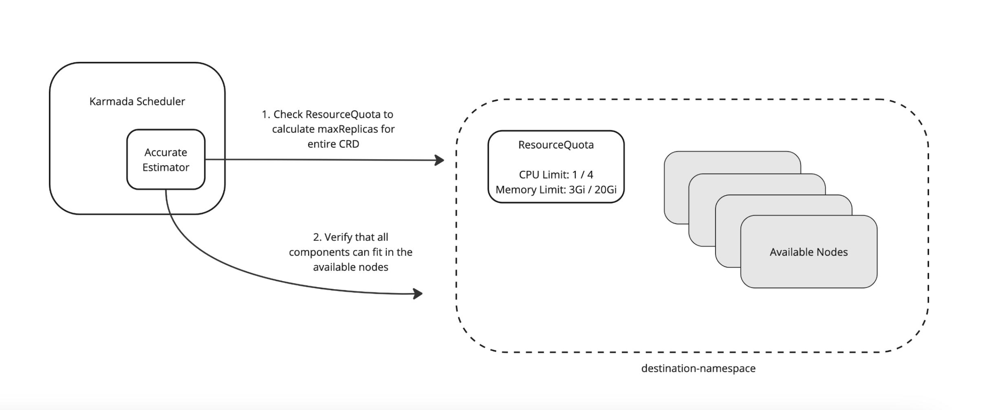

# CRD Component Scheduler Estimation

## Summary

Users may want to use Karmada for resource-aware scheduling of Custom Resources (CRDs). This can be done
if the CRD is comprised of a single podTemplate, which Karmada can already parse if the user defines
the ReplicaRequirements with this in mind. Resource-aware scheduling becomes more difficult however,
if the CRD is comprised of multiple podTemplates or pods of differing resource requirements.

In the case of FlinkDeployments, there is only one podTemplate per CRD. However this podTemplate contains information
related to the resourceRequirements of both the JobManager and TaskManager pods. Karmada cannot currently distinguish between
these different components with the existing ReplicaRequirements API definition.

We could technically add up all the individual component requirements and input those into the replicaRequirements, but Karmada would
treat this like a "super replica", and try to find a node in the destination namespace that could fit the entire replica. In many cases,
this is simply not possible.

For this proposal, we would like to enhance the accurate scheduler to account of complex CRDs with multiple podTemplates or components.

## Background on our Use-Case

Karmada will be used as an intelligent scheduler for FlinkDeployments. We aim to use the accurate estimator (with the
ResourceQuota plugin enabled), to estimate whether a FlinkDeployment can be fully scheduled on the potential destination namespace.
In order to make this estimation, we need to take into account all of the resource requirements of the components that will be
scheduled by the Flink Operator. Once the CRD is scheduled by Karmada, the Flink Operator will take over the rest of the component
scheduling as seen below.



In the case of Flink, these components are the JobManager(s) as well as the TaskManager(s). Both of these components can be comprised of
multiple pods, and the JM and TM frequently do not have the same resource requirements.

## Motivation

Karmada currently provides 2 methods of scheduling estimation through:
1. The general estimator (which analyzes total cluster resources to determine scheduling)
2. The accurate estimator (which can inspect namespaced resource quotas and determine
   number of potential replicas via the ResourceQuota plugin)

This proposal aims to improve the 2nd method by allowing users to define components for their replica
and provide precise resourceRequirements.

## Goals

- Provide a declarative pattern for defining the resourceRequests for individual replica components
- Allow more accurate scheduling estimates for CRDs

## Design Details

### API change

The main changes of this proposal are to the API definition of the ReplicaRequirements struct. We currently include the replicaCount and
replicaRequirements as root level attributes to the ResourceBindingSpec. The limitation here is that we are unable to define unique
replicaRequirements in the case that the resource has more than one podTemplate.

To address this, we can move the concept of replicas and replicaRequirements into a struct related to the individual resource's `Components`.

Each `Component` will have a `Name`, the number of `Replicas`, and corresponding `replicaRequirements`.
These basic fields are necessary to allow the accurate estimator to determine whether all components of the CRD replica
will be able to fit on the destination namespace.

The definition of ReplicaRequirements will stay the same - with the drawback that the user will need to define how Karmada
interprets the individual components of the CRD. Karmada should also support a default component which will use one of the resource's
podTemplates to find requirements.

```go

type ResourceBindingSpec struct {

    . . .

    // The total number of replicas scheduled by this resource. Each replica will represented by exactly one component of the resource.
	TotalReplicas int32 `json:"totalReplicas,omitempty"`

    // Defines the requirements of an individual component of the resource.
	// +optional
	Components []Components `json:"components,omitempty"`

	. . .
}

// A component is a unique representation of a resource's replica. For simple resources, like Deployments, there will only be
// one component, associated with the podTemplate in the Deployment definition.
//
// Complex resources can have multiple components controlled through different podTemplates.
// Each replica for the resource will fall into a component type with requirements defined by its relevant podTemplate.
type ComponentRequirements struct {

    // Name of this component
	Name string `json:"name,omitempty"`

	// Replicas represents the replica number of the resource's component
	// +optional
	Replicas int32 `json:"replicas,omitempty"`

    // ReplicaRequirements represents the requirements required by each replica for this component.
	// +optional
	ReplicaRequirements *ReplicaRequirements `json:"replicaRequirements,omitempty"`

}

// ReplicaRequirements represents the requirements required by each replica.
type ReplicaRequirements struct {

	// NodeClaim represents the node claim HardNodeAffinity, NodeSelector and Tolerations required by each replica.
	// +optional
	NodeClaim *NodeClaim `json:"nodeClaim,omitempty"`

	// ResourceRequest represents the resources required by each replica.
	// +optional
	ResourceRequest corev1.ResourceList `json:"resourceRequest,omitempty"`

	// Namespace represents the resources namespaces
	// +optional
	Namespace string `json:"namespace,omitempty"`

	// PriorityClassName represents the components priorityClassName
	// +optional
	PriorityClassName string `json:"priorityClassName,omitempty"`

}
```

### Accurate Estimator Changes

Besides the change to the ReplicaRequirements API, we will need to make a code change to the accurate estimator's implementation,
which can be found here: https://github.com/karmada-io/karmada/blob/5e354971c78952e4f992cc5e21ad3eddd8d6716e/pkg/estimator/server/estimate.go#L59.

Currently the accurate estimator will calculate the maxReplica count by:
1. Running the maxReplica calculation for each plugin enabled by the accurate estimator.
2. The accurate estimator will then loop through all nodes and determine if the replica can fit in any of them. This is to account for the resource fragmentation issue.

For step 2, we should change this calculation if there are subcomponents set for the replica. However, with the introduction of subcomponents to the
replica, we begin to run into an interesting bin-packing problem.



Here we have a couple of options we can think over:

1. Calculate precise amount of ways we can pack all components into existing nodes *(not recommended)*
- For this option we would have to loop through each subcomponent and through all nodes to calculate the total number of ways we can pack all subcomponents into the namespace.
- This would become very expensive, and I don't see the benefit of being that precise when all we care about is that the CRD can be scheduled at all.

2. Confirm that all components can be scheduled into one combination of nodes
- We would instead confirm that each component could fit into one of the possible nodes contrained by our destination namespace.
- If we confirm that each component can fit in the available nodes, we would simply return the maxReplica estimation made by the plugin since we know that the CRD can be fully scheduled on the namespace.
- If we notice that one or many of the components can not fit in any available node, we would ignore the maxReplica estimation made by the plugin and return 0.


