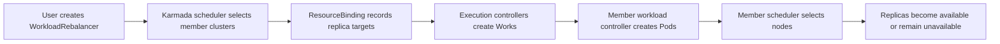
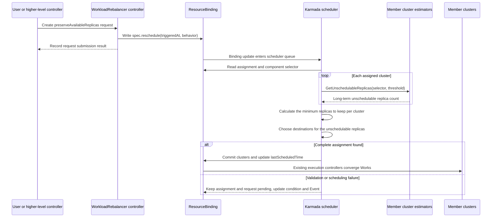

# Preserve Available Replicas in WorkloadRebalancer

## Summary

[`WorkloadRebalancer`](../workload-rebalancer/workload-rebalancer.md) currently asks the scheduler to discard the previous
assignment and perform a Fresh scheduling cycle for each selected workload. Fresh scheduling is appropriate when the
entire placement should be reconsidered. When only part of a divided workload is unavailable, however, it may also reassign
replicas that are already available.

This proposal adds an optional `spec.reschedule.preserveAvailableReplicas` field. When enabled, the scheduler queries the
number of long-term unschedulable Pods in each member cluster. If a cluster has `A` assigned replicas and `U` long-term
unschedulable Pods, at least `A-U` replicas remain assigned to that cluster and only `U` replicas are rescheduled. Omitting
`spec.reschedule` or setting the field to `false` retains the current Fresh scheduling semantics.

The change keeps `WorkloadRebalancer` as a one-shot request created by a user or higher-level controller.

## Motivation

Karmada scheduling and Kubernetes Pod scheduling make decisions at different levels. The Karmada scheduler selects member
clusters and records the replica distribution in a `ResourceBinding`. Execution controllers then create `Work` objects,
and each member cluster's workload controller and scheduler create and place the Pods.



Offline spot and GPU workloads may become only partially available after Karmada completes cluster-level replica
assignment. Concurrent workloads, quota, taints, affinity, topology, device models, or per-node resource constraints in a
member cluster can prevent the remaining Pods from running for a long time. Accelerator workloads are especially exposed:
aggregate free capacity may look sufficient while no node has the required device type, topology, or quantity.

This proposal addresses the semantics of an explicit rescheduling command. After a user or higher-level controller decides
that a distribution should be recalculated, it creates a `WorkloadRebalancer`. The existing controller writes
`spec.rescheduleTriggeredAt` to each target `ResourceBinding` or `ClusterResourceBinding`, after which the scheduler
discards the previous assignment and recalculates the complete placement with Fresh scheduling. When only some replicas
have remained unschedulable, the caller needs another explicit behavior: keep the other replicas in place and ask the
existing scheduler to reassign only the confirmed unschedulable deficit.

Workload status provides aggregate counts but cannot generically identify which Pods should be rescheduled. `GetComponents`
therefore returns a Pod selector for each component, and the member-cluster `GetUnschedulableReplicas` call uses that
selector to count long-term unschedulable Pods. A Pod contributes to the deficit only when `PodScheduled=False`, the reason
is `Unschedulable`, and the condition has lasted longer than the configured threshold.

`preserveAvailableReplicas` states the preservation guarantee; it does not mean that the deficit is calculated as
`desired - available`. The request removes only replicas reported as long-term unschedulable. Every other assigned replica
is preserved. Available replicas are therefore preserved, and replicas that are unready but not reported as long-term
unschedulable are preserved as well.

An explicit retry does not need to discard useful placement. If a 100-replica workload has 20 Pods that the estimator
confirms as long-term unschedulable, the scheduling problem is to place those 20 replicas, not all 100. Reconsidering the
other 80 can cause avoidable restarts, cache or model reloads, loss of in-flight work, and temporary capacity reduction.

The guarantee applies to replica counts per member cluster, not Pod UIDs. The estimator inspects Pods but returns only a
count, not a list of Pod names. The Karmada scheduler changes member-cluster replica targets; the workload controller in the
member cluster still decides which concrete Pods to retain or remove.

### Goals

- Preserve the existing Fresh behavior for all current `WorkloadRebalancer` clients.
- Let a user keep the existing placement except for replicas confirmed as long-term unschedulable by an estimator.
- Extend interpreter component metadata with Pod selectors and pass those selectors to `GetUnschedulableReplicas`.
- Continue to use the scheduling rules stored in `ResourceBinding.spec.placement` and the existing filtering, scoring, and
  replica-allocation logic.
- Fail closed when component selectors are missing or invalid, an estimator is unavailable, or an estimator result is
  inconsistent with the current assignment.
- Fail closed when an upgraded controller sends a new request to an older scheduler, and preserve the ordering of legacy
  and new requests.

### Non-Goals

- Preserving individual Pod UIDs.

## Proposal

Add an optional `spec.reschedule` object to `WorkloadRebalancer`, with independent fields for composable rescheduling
behaviors:

| `spec.reschedule` | Previous assignment | Scheduling work |
| --- | --- | --- |
| omitted, or `preserveAvailableReplicas: false` | Discarded as it is today | Recalculate all desired replicas with Fresh scheduling |
| `preserveAvailableReplicas: true` | All replicas except estimator-confirmed long-term unschedulable replicas remain in their current clusters | Reassign only the confirmed unschedulable deficit |

The preserve behavior reuses the existing dynamic scale-up path rather than introducing another placement algorithm. The
scheduler creates a temporary copy of the binding specification, replaces its per-cluster replica counts with the preserved
baseline, keeps the total desired replicas unchanged, and lets `dynamicScaleUp` fill the resulting deficit. The temporary
baseline is never written to the API; only a complete final assignment can replace the current `spec.clusters`.

`RescheduleBehavior` is a struct rather than an enum that allows only one value. This proposal defines only the
`preserveAvailableReplicas` boolean. Future independent behaviors can add fields without changing this field's meaning.
One `WorkloadRebalancer` represents one request; users create a new object for another scheduling attempt. If multiple
requests target the same `ResourceBinding`, only the request with the latest trigger is processed.

The scheduler uses the scheduling rules stored in `ResourceBinding.spec.placement`; it does not read the current
`PropagationPolicy` or `ClusterPropagationPolicy` again during this request. If a policy change has not yet updated the
`ResourceBinding`, the request still follows the rules currently stored in that `ResourceBinding`.

### User Stories

#### Reassign only long-term unschedulable replicas

A 10-replica Deployment has the following assignment and estimator result:

| Cluster | Assigned | Long-term unschedulable | Preserved |
| --- | ---: | ---: | ---: |
| `member1` | 6 | 2 | 4 |
| `member2` | 4 | 0 | 4 |

The user creates a `WorkloadRebalancer` with `spec.reschedule.preserveAvailableReplicas: true`. The scheduler keeps four
replicas in each existing cluster and assigns only the two replicas confirmed as unschedulable. If `member3` is eligible
and has sufficient capacity, one possible result is:

```text
member1=4, member2=4, member3=2
```

The destination of the two replicas is still determined by `ResourceBinding.spec.placement` and the current scheduling
cycle.

#### Reuse newly available accelerator capacity

A divided 100-replica Deployment represents offline accelerator workers:

| Cluster | Assigned | Long-term unschedulable | Preserved |
| --- | ---: | ---: | ---: |
| `gpu-a` | 60 | 40 | 20 |
| `gpu-b` | 10 | 0 | 10 |
| `gpu-c` | 30 | 0 | 30 |

As time-shared capacity is released overnight, eligible capacity becomes available in `gpu-d`. A preserve-available
request keeps the 60 replicas not selected by the estimator in place and asks the scheduler to place only the 40
long-term unschedulable replicas. If no eligible cluster can place all 40, the request is reported as unschedulable and
the previous assignment remains unchanged.

### Supported Workloads and Preconditions

The mechanism is not specific to Deployment. A namespaced workload can use it when its interpreter implements
`GetComponents` and returns a selector that identifies its Pods. The first implementation accepts
`preserveAvailableReplicas: true` only when all of the following are true:

- the target is referenced by a `ResourceBinding`, and `GetComponents` returns exactly one component with a valid Pod
  selector whose replica count maps one-to-one to the workload replicas;
- the active binding placement uses dynamic divided replica scheduling (`Aggregated`, or `Weighted` with dynamic weights);
- initial scheduling has completed, the current assignment sums to the workload's desired replicas, and no graceful
  eviction task is active;
- the placement stored in `spec.placement` matches the placement recorded as applied by the scheduler; and
- an estimator that supports `GetUnschedulableReplicas` is available for every currently assigned cluster.

These checks avoid combining preserve-available rescheduling with an unfinished scale operation, a concurrent placement
change, or another eviction workflow. Complete requests with an omitted `spec.reschedule` or
`preserveAvailableReplicas: false` remain valid for all workload types supported today.

### Relationship to Karmada Descheduler

The [Karmada descheduler](../697-descheduler/README.md) periodically asks scheduler estimators for long-lived
unschedulable replicas, reduces the affected per-cluster targets, and lets the scheduler assign the removed replicas again.
It currently supports dynamically divided Deployments and uses `readyReplicas` as a safety floor when reducing a target.

Today the descheduler uses binding status as a coarse prefilter, then asks the estimator to inspect Pods. The estimator
fetches the Deployment, resolves its current ReplicaSet, and counts Pods whose `PodScheduled=False` condition has reason
`Unschedulable` for longer than the threshold. The selector added by this proposal replaces that Deployment-specific
workload-to-Pod traversal: `GetComponents` supplies the selector and the estimator lists the matching Pods directly.

| Capability | Trigger | Deficit source | Request scope |
| --- | --- | --- | --- |
| Descheduler | Periodic and automatic | Estimator-confirmed unschedulable Pods | All supported bindings found by the descheduler |
| This proposal | Explicit and one-shot | The same estimator predicate, using selectors from `GetComponents` | Workloads named by one `WorkloadRebalancer` |

The two paths deliberately share the estimator predicate and the same scheduler rather than introducing another placement
algorithm. Their difference is the request source and lifecycle: the descheduler performs periodic discovery, while this
proposal processes an explicit, one-shot command for named workloads.

In the future, the descheduler can create a `WorkloadRebalancer` with the appropriate behavior after its existing estimator
checks, allowing automatic repair and explicit requests to share one command object and behavior semantics. Workload
discovery and rate control remain descheduler responsibilities; the `WorkloadRebalancer` expresses one rescheduling
request, while binding conditions and Events record its processing result and failure reason. This integration requires a
follow-up proposal. The current proposal does not change the descheduler flow and still handles explicit, one-shot requests
only.

## Design Details

### API Changes

#### WorkloadRebalancer

```go
type WorkloadRebalancerSpec struct {
    // Workloads specifies the workloads to be rescheduled.
    // +required
    Workloads []ObjectReference `json:"workloads"`

    // Reschedule declares fine-grained behaviors of the triggered rescheduling.
    // Nil means a complete rescheduling, which totally discards the previous
    // scheduling result.
    // +optional
    Reschedule *RescheduleBehavior `json:"reschedule,omitempty"`

    // +optional
    TTLSecondsAfterFinished *int32 `json:"ttlSecondsAfterFinished,omitempty"`
}

// RescheduleBehavior declares composable behaviors applied to the rescheduling.
type RescheduleBehavior struct {
    // PreserveAvailableReplicas indicates that available replicas keep their
    // placement untouched. Only replicas reported by the estimator as
    // long-term unschedulable are selected for rescheduling.
    // Defaults to false, which means a complete rescheduling.
    // +optional
    PreserveAvailableReplicas *bool `json:"preserveAvailableReplicas,omitempty"`
}
```

The preserve-available request is explicit:

```yaml
apiVersion: apps.karmada.io/v1alpha1
kind: WorkloadRebalancer
metadata:
  name: reschedule-unschedulable
spec:
  workloads:
    - apiVersion: apps/v1
      kind: Deployment
      namespace: default
      name: example
  reschedule:
    preserveAvailableReplicas: true
```

Omitting `reschedule`, using an empty object, or setting `preserveAvailableReplicas: false` means complete rescheduling.

#### ResourceBinding and ClusterResourceBinding

The new `reschedule` carries the trigger timestamp and behaviors together. The existing `rescheduleTriggeredAt` remains
for compatibility with existing clients but is deprecated.

```go
type ResourceBindingSpec struct {
    // ...

    // Reschedule declares a rescheduling request against this binding as well
    // as the expected rescheduling behaviors. The rescheduling actually executes
    // only when TriggeredAt is later than status.lastScheduledTime.
    // +optional
    Reschedule *Reschedule `json:"reschedule,omitempty"`

    // RescheduleTriggeredAt keeps compatibility with existing clients.
    // Deprecated: use Reschedule.TriggeredAt instead.
    // +optional
    RescheduleTriggeredAt *metav1.Time `json:"rescheduleTriggeredAt,omitempty"`
}

type Reschedule struct {
    // TriggeredAt keeps the exact semantics of the deprecated
    // spec.rescheduleTriggeredAt.
    // +required
    TriggeredAt metav1.Time `json:"triggeredAt"`

    // Behavior of this rescheduling. Nil means complete rescheduling.
    // +optional
    Behavior *RescheduleBehavior `json:"behavior,omitempty"`
}
```

The `work/v1alpha2` package defines its own equivalent `RescheduleBehavior` struct so that the work API does not depend on
the apps API package.

`ClusterResourceBinding` uses the same spec and status types, as it does today. The API shape is therefore consistent, but
the first implementation rejects preserve-available requests for cluster-scoped resources.

#### Component Selector

`GetComponents` already provides the scheduler-facing component description stored in `binding.spec.components`. Extend
that description with a Pod selector:

```go
type Component struct {
    // Name of this component.
    Name string `json:"name"`

    // Replicas represents the replica number of the component.
    Replicas int32 `json:"replicas"`

    // ReplicaRequirements represents the scheduling requirements of each replica.
    // +optional
    ReplicaRequirements *ComponentReplicaRequirements `json:"replicaRequirements,omitempty"`

    // Selector identifies the Pods that belong to this component.
    // +optional
    Selector *metav1.LabelSelector `json:"selector,omitempty"`
}
```

The interpreter must return a non-empty selector scoped to the workload namespace. The detector persists it with the other
component metadata, so the scheduler does not need workload-specific owner traversal. The built-in Deployment interpreter
returns one component with the Deployment's Pod selector; custom workloads provide the same contract through their
`GetComponents` hook. A missing or invalid selector makes `preserveAvailableReplicas: true` unsupported for that workload;
it does not change Fresh scheduling.

#### Estimator Request

Extend `UnschedulableReplicasRequest` with the selector. The scheduler converts `metav1.LabelSelector` into the canonical
Kubernetes selector string before making the gRPC call:

```protobuf
message UnschedulableReplicasRequest {
  optional string cluster = 1;
  optional ObjectReference resource = 2;
  optional int64 unschedulableThreshold = 3;
  optional string selector = 4;
}
```

The resource reference retains workload identity and namespace; the selector defines which Pods belong to the component.
The estimator lists Pods in that namespace and counts only Pods with `PodScheduled=False`, reason `Unschedulable`, whose
condition has lasted longer than `unschedulableThreshold`. The scheduler uses a non-negative configurable threshold with
the same five-minute default as the descheduler. No threshold is added to the `WorkloadRebalancer` API.

The scheduler compares `spec.reschedule.triggeredAt` with the deprecated `spec.rescheduleTriggeredAt` and selects the newer
request. The legacy field always means complete rescheduling. A nil new `behavior`, or
`preserveAvailableReplicas: false`, also means complete rescheduling. The selected request executes only when its timestamp
is later than the existing `status.lastScheduledTime`. A successful cycle updates `lastScheduledTime` through the existing
scheduler flow; no new checkpoint is added.

### Backward Compatibility and Version Skew

- The upgraded `WorkloadRebalancer` controller writes only binding `spec.reschedule`. When the WorkloadRebalancer declares
  no behavior, the written `behavior` is nil and still means complete rescheduling.
- An older controller continues to write `spec.rescheduleTriggeredAt`. A new scheduler supports that field and interprets
  it as complete rescheduling.
- Requests with `preserveAvailableReplicas: true` must not be created until every `WorkloadRebalancer` controller replica
  is upgraded. An older controller cannot interpret the behavior and writes the legacy field for complete rescheduling.
- An older scheduler ignores the new `spec.reschedule`, so it cannot accidentally execute a preserve request as Fresh.
  The required upgrade order is CRDs, scheduler, then the `WorkloadRebalancer` controller.
- When both fields are present, the new scheduler selects the request with the later timestamp. A successful cycle updates
  the existing `lastScheduledTime`; an older request superseded by it does not execute again.
- API and CRD updates must be installed before the upgraded controller accepts the new behavior. The
  `WorkloadRebalancerPreserveAvailableReplicas` feature gate is Alpha and disabled by default in its first release.
  While the gate is disabled, the controller rejects `preserveAvailableReplicas: true` as a per-workload failure;
  complete requests without that behavior still use the new `spec.reschedule`.

### Controller and Scheduler Flow



The `WorkloadRebalancer` controller validates the request and writes it to the `ResourceBinding`. It does not choose target
clusters or calculate replica distribution. The Karmada scheduler validates the selector, calls the estimators, checks the
scheduling rules, and creates the final assignment.

As in the current implementation, `triggeredAt` is the `WorkloadRebalancer` creation timestamp. The controller compares it
with both binding request timestamps and writes `spec.reschedule` only when it is newer than the existing requests.
`triggeredAt` and `behavior` are written in one API update. A delayed reconciliation of an older `WorkloadRebalancer`
therefore cannot overwrite a newer request.

### Calculating the Replicas to Reschedule

When the detector processes a workload, it calls the interpreter's `GetComponents` hook and stores the returned component
metadata, including the new selector, in the binding. For a preserve request, the scheduler reads that selector and calls
`GetUnschedulableReplicas` for every cluster with a positive assignment.

For current assignment `assigned[c]` and estimator result `unschedulable[c]`:

```text
preserved[c] = assigned[c] - unschedulable[c]
deficit = sum(unschedulable[c])
```

`preserved[c]` is the minimum number of replicas that must remain assigned to cluster `c`. `deficit` is the total number
of replicas to assign again. The scheduler applies these values to a temporary copy of the binding specification: it
replaces the copied `spec.clusters` with the preserved baseline while leaving the desired `spec.replicas` unchanged. This
makes the existing dynamic scale-up path see exactly `deficit` replicas to place.

Every result must satisfy `0 <= unschedulable[c] <= assigned[c]`. If the selector is missing or invalid, an estimator call
fails, or a result is outside that range, the request fails and the current assignment remains unchanged. The scheduler
does not substitute workload ready/available counts or Pod phase.

Each estimator reports the state at the time of its query, and Pod state may change afterward. The scheduler waits for all
member-cluster responses and writes the `ResourceBinding` only after it has calculated a complete assignment. It does not
first reduce the old assignment and wait for a later scheduling cycle to fill the deficit.

### Scheduling and Commit Semantics

The `preserveAvailableReplicas: true` path runs as follows:

1. Compare `spec.reschedule.triggeredAt` and `spec.rescheduleTriggeredAt`, selecting the later request. Ignore it if its
   timestamp is not later than `status.lastScheduledTime`. The legacy field, a nil new `behavior`, or
   `preserveAvailableReplicas: false` follows the existing Fresh path; the remaining steps apply only when the field is
   `true`.
2. Validate that the workload and `ResourceBinding` meet the supported-scope requirements. If any prerequisite fails, stop
   without changing the current assignment.
3. Call `GetUnschedulableReplicas` for every cluster with assigned replicas. Every call must succeed and every result must
   be within `0..assigned[c]`; otherwise stop without changing the current assignment.
4. Calculate `preserved[c] = assigned[c] - unschedulable[c]` for each cluster. Build a temporary scheduling input whose
   per-cluster replica counts are the preserved baseline and whose desired replica count is unchanged. The final assignment
   must not reduce any cluster below its baseline.
5. Reuse the existing `dynamicScaleUp` path to fill the resulting `sum(unschedulable[c])` deficit. Existing filtering,
   scoring, and replica allocation decide the destination clusters; no separate placement algorithm is introduced.
6. Commit one complete result only if all replicas can be assigned and the final sum equals the workload's desired replica
   count. Otherwise keep the current assignment and `lastScheduledTime` unchanged.
7. If the deficit is zero, leave `spec.clusters` unchanged and update `lastScheduledTime` through the existing flow to mark
   the request as processed.

The current Fresh path is unchanged. The preserve path must not reuse the existing FitError behavior that can replace
`spec.clusters` with an empty result. A validation error, insufficient capacity, API conflict, or scheduler error leaves
both the previous assignment and `lastScheduledTime` unchanged, allowing the normal rate-limited retry path.

### Status Semantics

No new execution-progress fields are added to `WorkloadRebalancerStatus`.

- `ObservedWorkload.result=Successful` keeps its current meaning: the controller wrote the request to the referenced
  `ResourceBinding`. It does not mean scheduling or workload recovery has completed.
- Unsupported workload or placement modes, incomplete initial scheduling, or an active conflicting workflow are rejected
  before submission and recorded as per-workload failures.
- After submission, `ResourceBinding` `Scheduled` conditions and Events report validation and scheduling failures.
- When `status.lastScheduledTime >= spec.reschedule.triggeredAt`, the scheduler considers the request processed and does
  not execute it again. This means a complete assignment was written after the request; it does not mean all Pods are
  running or ready.
- Workload status remains the source of truth for whether the final replicas became available.
- Existing TTL behavior remains unchanged.

### Test Plan

Unit and integration tests cover:

- serialization and validation for an omitted `reschedule`, an empty object, and
  `preserveAvailableReplicas: false` and `true`;
- rejection of `preserveAvailableReplicas: true` while the feature gate is disabled, while complete rescheduling still
  writes binding `spec.reschedule`;
- the legacy `rescheduleTriggeredAt` continuing to mean complete rescheduling, and new-controller/old-scheduler
  fail-closed behavior;
- selection by the later timestamp when both request forms exist, using `lastScheduledTime` as the pending checkpoint;
- serialization and validation of component selectors and the estimator request selector;
- rejection of duplicated, static-weight, multi-component, cluster-scoped, missing-selector, invalid-selector, and
  unsupported workload types;
- estimator Pod matching for `PodScheduled=False` with reason `Unschedulable`, including threshold boundary cases and
  exclusion of merely `Pending`, initializing, and `Running`-unready Pods;
- missing estimators, RPC failures, and negative or greater-than-assigned responses leaving the assignment unchanged;
- zero, partial, and all-unschedulable results;
- final per-cluster assignments not falling below `preserved[c]`;
- assigning only the deficit through dynamic `Aggregated` and dynamic-weight scheduling;
- insufficient capacity and FitError leaving the assignment and `lastScheduledTime` unchanged;
- complete-result commit and the existing `lastScheduledTime` update; and
- unchanged `WorkloadRebalancer` status and TTL behavior.

An end-to-end test creates a dynamically divided Deployment whose interpreter component includes a Pod selector and whose
assigned cluster has Pods that remain `Unschedulable` beyond the threshold. After eligible capacity is added, it creates a
preserve-available `WorkloadRebalancer` and verifies that only the estimator-reported replicas are reassigned, all other
per-cluster counts are preserved, the final result follows active placement, and `lastScheduledTime` is updated. A second
case removes sufficient eligible capacity and verifies that the previous assignment is retained while the binding reports
an unschedulable attempt.

## Alternatives

### Use an enum of mutually exclusive modes

An enum with `Full` and `PreserveAvailableReplicas` can express the two current behaviors, but it makes future behaviors
mutually exclusive. A nested `RescheduleBehavior` struct allows independent boolean behaviors to be added later while
retaining the compatible meaning that a nil `reschedule` means complete rescheduling.

### Derive the deficit from workload status

Aggregate ready or available counts can show that a workload is short of its target, but they cannot identify which Pods
are long-term unschedulable. A Pod selector returned by `GetComponents` lets the estimator inspect Pods directly and apply
the same condition to different workload kinds.
