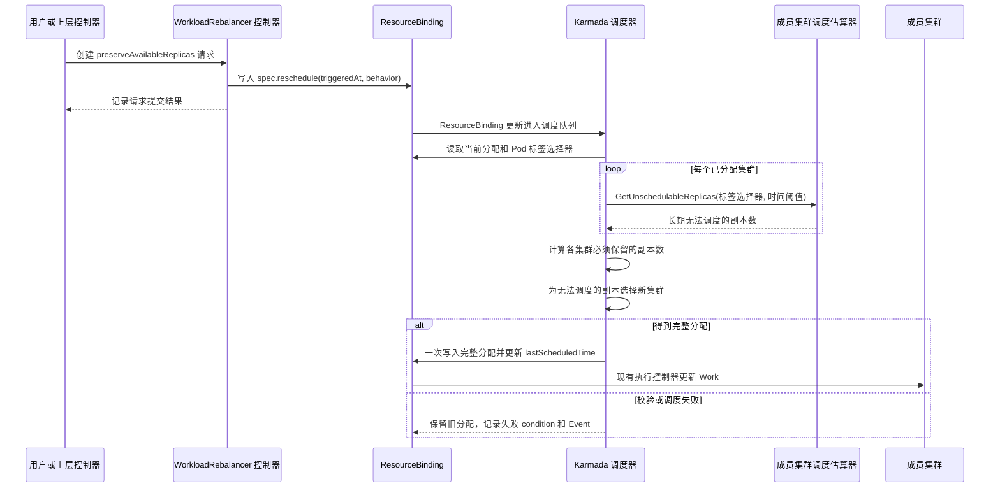

# WorkloadRebalancer 重调度时保留可用副本

## 摘要

[`WorkloadRebalancer`](../workload-rebalancer/workload-rebalancer.md) 当前会要求调度器丢弃旧分配结果，并对每个选中
工作负载执行一次 Fresh 调度。当用户希望重新计算完整分布时，Fresh 调度是合适的；但对于仅有部分副本不可用的
拆分型工作负载，它也可能重新分配已经可用的副本。

本文建议增加可选字段 `spec.reschedule.preserveAvailableReplicas`。启用后，Karmada 调度器查询每个成员集群中长期
无法调度的 Pod 数量。假设某集群当前分配 `A` 个副本，其中 `U` 个长期无法调度，本轮至少在该集群保留 `A-U` 个
副本，只把 `U` 个副本交给调度器重新分配。省略 `spec.reschedule` 或将该字段设为 `false` 时，继续使用当前 Fresh
语义，即丢弃旧分配并重新计算全部副本。

`WorkloadRebalancer` 仍然表示一次重调度请求，可以由用户或上层控制器创建。

## 动机

Karmada 调度和 Kubernetes Pod 调度处在不同层次。Karmada 调度器选择成员集群，并将副本分布写入
`ResourceBinding`。执行控制器随后创建 `Work`，各成员集群的工作负载控制器和调度器再创建、放置 Pod。


离线 spot 和 GPU 工作负载可能在 Karmada 完成集群级副本分配后只实现部分可用。成员集群中的并发工作负载、配额、
污点、亲和性、拓扑、设备型号或单节点资源约束，都可能使其余 Pod 长时间无法运行。加速卡工作负载尤其容易遇到这种
情况：汇总空闲容量看似足够，但没有节点具备所需的设备型号、拓扑或数量。

本文关注显式重调度命令的语义。用户或上层控制器在确认需要重新计算分布后创建 `WorkloadRebalancer`；现有控制器会
向目标 `ResourceBinding` 或 `ClusterResourceBinding` 写入 `spec.rescheduleTriggeredAt`，调度器随后以 Fresh 方式
丢弃旧分配并全量重算。当只有部分副本长期无法调度时，调用方需要另一种明确行为：其余副本留在原集群，只把已确认
无法调度的差额交给现有调度器重新分配。

工作负载状态只能提供汇总数量，不能通用地确定哪些 Pod 应当重新调度。因此，`GetComponents` 为每个组件返回 Pod
标签选择器，成员集群的 `GetUnschedulableReplicas` 根据该选择器统计长期无法调度的 Pod。只有同时满足
`PodScheduled=False`、原因为 `Unschedulable`、持续时间超过配置阈值的 Pod 才计入本轮差额。

`preserveAvailableReplicas` 表示保留保证，不表示用 `期望副本数 - 可用副本数` 计算差额。本方案只移出调度估算器
返回的长期无法调度副本；其余已分配副本全部保留。因此，已经可用的副本一定保留，未就绪但未被判定为长期无法调度
的副本也不会被本次请求移出。

显式重试不需要丢弃仍有价值的分配。如果一个 100 副本工作负载中有 20 个 Pod 被调度估算器确认为长期无法调度，
真正需要重新放置的是这 20 个副本，而不是全部 100 个。重新考虑其余 80 个副本，可能造成不必要的重启、缓存或模型
重新加载、执行中任务丢失和短时容量下降。

本文只保证每个成员集群保留的副本数量，不保证具体 Pod UID 不变。调度估算器检查 Pod，但只向 Karmada 调度器返回
数量，不返回 Pod 名单。Karmada 调度器修改的是成员集群的副本目标，具体删除哪些 Pod 仍由成员集群中的工作负载
控制器决定。

### 目标

- 保持所有现有 `WorkloadRebalancer` 调用方的 Fresh 行为不变。
- 除调度估算器确认长期无法调度的副本外，保持其余副本当前所在的成员集群不变。
- 为解释器返回的组件信息增加 Pod 标签选择器，并把它传给 `GetUnschedulableReplicas`。
- 继续使用 `ResourceBinding.spec.placement` 中保存的调度规则，以及调度器现有的过滤、打分和副本分配逻辑。
- Pod 标签选择器缺失或无效、调度估算器不可用，或返回数量大于当前分配数量时，保持原分配并报错。
- 升级后的控制器向旧调度器提交新式请求时保持原分配，并正确处理新旧请求的先后顺序。

### 非目标

- 保证具体 Pod UID 不变。

## 方案

为 `WorkloadRebalancer` 增加可选的 `spec.reschedule` 对象，用独立字段声明可组合的重调度行为：

| `spec.reschedule` | 如何处理旧分配 | 本轮调度内容 |
| --- | --- | --- |
| 省略，或 `preserveAvailableReplicas: false` | 与当前行为相同，丢弃旧分配 | 以 Fresh 方式重新计算全部期望副本 |
| `preserveAvailableReplicas: true` | 除调度估算器确认长期无法调度的副本外，其余副本留在原集群 | 只重新分配长期无法调度的副本 |

保留行为复用现有动态扩容流程，不引入另一套放置算法。调度器复制当前 Binding 规格，把副本分布临时替换为各集群
需要保留的基线，同时保持总期望副本数不变，再由 `dynamicScaleUp` 补足差额。临时基线不会写入 API；只有包含全部
期望副本的最终分配才能替换当前 `spec.clusters`。

`RescheduleBehavior` 使用结构体，而不使用只能选择一个值的枚举。本文只增加
`preserveAvailableReplicas` 这一个布尔字段。以后如果需要增加其他相互独立的行为，可以继续增加字段，而不用修改该
字段的含义。一个 `WorkloadRebalancer` 只表示一次请求；需要再次调度时，应创建新的对象。多个请求指向同一个
`ResourceBinding` 时，只处理触发时间最新的请求。

调度器继续使用 `ResourceBinding.spec.placement` 中保存的调度规则，不在本次重调度时重新读取
`PropagationPolicy` 或 `ClusterPropagationPolicy`。因此，如果新策略尚未作用到当前 `ResourceBinding`，本次请求
仍按当前 `ResourceBinding` 中的规则执行。

### 用户场景

#### 只重新分配长期无法调度的副本

一个 10 副本 Deployment 的当前分配和调度估算器返回结果如下：

| 集群 | 已分配 | 长期无法调度 | 保留 |
| --- | ---: | ---: | ---: |
| `member1` | 6 | 2 | 4 |
| `member2` | 4 | 0 | 4 |

用户创建设置了 `spec.reschedule.preserveAvailableReplicas: true` 的 `WorkloadRebalancer`。调度器在两个现有集群中
各保留 4 个副本，只重新分配调度估算器确认无法调度的 2 个副本。如果 `member3` 符合约束且容量充足，一种可能的
结果是：

```text
member1=4, member2=4, member3=2
```

这 2 个副本最终分配到哪个集群，仍由 `ResourceBinding.spec.placement` 和本次调度结果决定。

#### 使用新释放的加速卡容量

一个采用副本拆分的 100 副本 Deployment 表示离线加速卡 worker：

| 集群 | 已分配 | 长期无法调度 | 保留 |
| --- | ---: | ---: | ---: |
| `gpu-a` | 60 | 40 | 20 |
| `gpu-b` | 10 | 0 | 10 |
| `gpu-c` | 30 | 0 | 30 |

随着夜间潮汐资源释放，`gpu-d` 出现符合条件的空闲容量后，保留可用副本的请求把未被调度估算器选中的 60 个副本
留在原集群，只让调度器分配 40 个长期无法调度的副本。如果所有合格集群都无法完整容纳这 40 个副本，请求会被
报告为不可调度，旧分配保持不变。

### 支持范围与前置条件

该方案不只适用于 Deployment。其他命名空间级工作负载只要实现解释器的 `GetComponents`，并返回能够找到所属 Pod
的标签选择器，也可以使用相同流程。首个版本只有同时满足以下条件时，才接受
`preserveAvailableReplicas: true`：

- 目标由 `ResourceBinding` 引用，并且 `GetComponents` 只返回一个组件；该组件包含有效的 Pod 标签选择器，组件
  副本数与工作负载副本数一一对应；
- `ResourceBinding.spec.placement` 使用动态副本拆分调度，即 `Aggregated` 或使用动态权重的 `Weighted`；
- 首次调度已经完成，当前分配总和等于工作负载期望副本数，并且没有正在执行的优雅驱逐任务；
- `spec.placement` 与调度器上次使用的调度规则一致；
- 每个当前已分配集群都有可用的调度估算器，并且支持 `GetUnschedulableReplicas`。

这些检查用于避免本次请求与尚未完成的扩缩容、同时发生的调度规则变更或其他驱逐流程相互覆盖。省略
`spec.reschedule` 或将 `preserveAvailableReplicas` 设为 `false` 的全量请求，仍适用于当前已经支持的所有工作负载
类型。

### 与 Karmada Descheduler 的关系

[Karmada descheduler](../697-descheduler/README.md) 会周期调用调度估算器，识别长期无法调度的副本，降低对应集群
的副本目标，再由调度器重新分配被移出的副本。它当前支持动态拆分的 Deployment，并在降低目标时以
`readyReplicas` 作为安全下限。

当前 Descheduler 先根据 `ResourceBinding` 中汇总的就绪副本数找出可能存在问题的集群，再调用调度估算器检查 Pod。
调度估算器读取 Deployment，找到当前 ReplicaSet，然后统计 `PodScheduled=False`、原因为 `Unschedulable` 且持续
时间超过阈值的 Pod。这段查找方式只支持 Deployment。本文改为由 `GetComponents` 提供 Pod 标签选择器，调度估算器
可以直接按标签查找 Pod，因此其他工作负载也能使用同一个接口。

| 能力 | 触发方式 | 差额来源 | 请求范围 |
| --- | --- | --- | --- |
| Descheduler | 周期自动执行 | 调度估算器确认长期无法调度的 Pod | Descheduler 找到的所有受支持 `ResourceBinding` |
| 本文方案 | 用户或控制器显式创建一次请求 | 调度估算器使用 `GetComponents` 返回的标签选择器进行相同判断 | 一个 `WorkloadRebalancer` 指定的工作负载 |

两条路径使用同一种“长期无法调度”判断，也使用同一个 Karmada 调度器。区别只在触发方式：Descheduler 周期检查
所有符合条件的工作负载；本文只处理用户或上层控制器明确指定的一次请求。

后续可以让 Descheduler 在检测到长期无法调度的 Pod 后创建 `WorkloadRebalancer`。Descheduler 仍负责发现工作负载
和控制触发频率，`WorkloadRebalancer` 只记录一次重调度请求，`ResourceBinding` 的 condition 和 Event 记录处理
结果与失败原因。本文暂不修改 Descheduler 的现有流程。

## 设计细节

### API 变更

#### WorkloadRebalancer

```go
type WorkloadRebalancerSpec struct {
    // Workloads specifies the workloads to be rescheduled.
    // +required
    Workloads []ObjectReference `json:"workloads"`

    // Reschedule declares fine-grained behaviors of the triggered rescheduling.
    // Nil means a complete rescheduling, which totally discards the previous
    // scheduling result.
    // +optional
    Reschedule *RescheduleBehavior `json:"reschedule,omitempty"`

    // +optional
    TTLSecondsAfterFinished *int32 `json:"ttlSecondsAfterFinished,omitempty"`
}

// RescheduleBehavior declares composable behaviors applied to the rescheduling.
type RescheduleBehavior struct {
    // PreserveAvailableReplicas indicates that available replicas keep their
    // placement untouched. Only replicas reported by the estimator as
    // long-term unschedulable are selected for rescheduling.
    // Defaults to false, which means a complete rescheduling.
    // +optional
    PreserveAvailableReplicas *bool `json:"preserveAvailableReplicas,omitempty"`
}
```

保留可用副本的请求需要显式声明：

```yaml
apiVersion: apps.karmada.io/v1alpha1
kind: WorkloadRebalancer
metadata:
  name: reschedule-unschedulable
spec:
  workloads:
    - apiVersion: apps/v1
      kind: Deployment
      namespace: default
      name: example
  reschedule:
    preserveAvailableReplicas: true
```

省略 `reschedule`、使用空对象或显式设置 `preserveAvailableReplicas: false` 时，均表示完整重调度。

#### ResourceBinding 和 ClusterResourceBinding

新增的 `reschedule` 同时携带触发时间和行为。现有 `rescheduleTriggeredAt` 保留但标记为废弃，用于兼容已有调用方。

```go
type ResourceBindingSpec struct {
    // ...

    // Reschedule declares a rescheduling request against this binding as well
    // as the expected rescheduling behaviors. The rescheduling actually executes
    // only when TriggeredAt is later than status.lastScheduledTime.
    // +optional
    Reschedule *Reschedule `json:"reschedule,omitempty"`

    // RescheduleTriggeredAt keeps compatibility with existing clients.
    // Deprecated: use Reschedule.TriggeredAt instead.
    // +optional
    RescheduleTriggeredAt *metav1.Time `json:"rescheduleTriggeredAt,omitempty"`
}

type Reschedule struct {
    // TriggeredAt keeps the exact semantics of the deprecated
    // spec.rescheduleTriggeredAt.
    // +required
    TriggeredAt metav1.Time `json:"triggeredAt"`

    // Behavior of this rescheduling. Nil means complete rescheduling.
    // +optional
    Behavior *RescheduleBehavior `json:"behavior,omitempty"`
}
```

`work/v1alpha2` 包定义一份字段相同的 `RescheduleBehavior`，避免 `work/v1alpha2` 导入 `apps/v1alpha1`。

`ClusterResourceBinding` 继续使用相同的 spec 和 status 类型，所以也会出现这些字段；但首个版本不支持对集群级资源
执行保留可用副本的重调度。

#### Pod 标签选择器

`GetComponents` 返回工作负载包含的组件，资源检测控制器将结果保存到 `ResourceBinding.spec.components`。本文为每个
组件增加 `selector` 字段，用它查找属于该组件的 Pod：

```go
type Component struct {
    // Name of this component.
    Name string `json:"name"`

    // Replicas represents the replica number of the component.
    Replicas int32 `json:"replicas"`

    // ReplicaRequirements represents the scheduling requirements of each replica.
    // +optional
    ReplicaRequirements *ComponentReplicaRequirements `json:"replicaRequirements,omitempty"`

    // Selector identifies the Pods that belong to this component.
    // +optional
    Selector *metav1.LabelSelector `json:"selector,omitempty"`
}
```

解释器必须返回非空的标签选择器。查找范围固定为工作负载所在的命名空间。资源检测控制器将标签选择器与其他组件
信息一起写入 `ResourceBinding`，因此调度器不必了解 Deployment、ReplicaSet 或其他工作负载之间的从属关系。
内置 Deployment 解释器返回一个组件，并使用 Deployment 的 Pod 标签选择器；自定义工作负载通过自己的
`GetComponents` 钩子返回相同信息。标签选择器缺失或无效时，该工作负载不能使用
`preserveAvailableReplicas: true`，但仍可使用原有 Fresh 调度。

#### 调度估算器请求

为 `UnschedulableReplicasRequest` 增加 `selector`。Karmada 调度器发起 gRPC 请求前，把
`metav1.LabelSelector` 转换为 Kubernetes 标签选择器字符串：

```protobuf
message UnschedulableReplicasRequest {
  optional string cluster = 1;
  optional ObjectReference resource = 2;
  optional int64 unschedulableThreshold = 3;
  optional string selector = 4;
}
```

请求中的 `resource` 字段说明工作负载的类型、名称和命名空间，`selector` 字段说明要查找哪些 Pod。调度估算器只
统计同时满足以下条件的 Pod：`PodScheduled=False`、原因为 `Unschedulable`，并且该状态持续时间超过
`unschedulableThreshold`。阈值由 Karmada 调度器配置，不能为负数，默认 5 分钟，与 Descheduler 的默认值相同。
`WorkloadRebalancer` API 不增加阈值字段。

调度器比较 `spec.reschedule.triggeredAt` 与已废弃的 `spec.rescheduleTriggeredAt`，选择时间较新的请求。旧字段始终表示
完整重调度；新字段的 `behavior` 为 `nil` 或 `preserveAvailableReplicas` 为 `false` 时也表示完整重调度。只有所选时间
晚于 `status.lastScheduledTime` 时才执行。调度成功后，现有流程会更新 `lastScheduledTime`；本文不增加新的状态字段来
记录请求是否已经处理。

### 向后兼容与升级顺序

- 升级后的 `WorkloadRebalancer` 控制器只写 `ResourceBinding.spec.reschedule`。`WorkloadRebalancer` 未声明行为时，写入的
  `behavior` 为 `nil`，语义仍是完整重调度。
- 旧控制器继续写 `spec.rescheduleTriggeredAt`；新调度器兼容该字段，并将其解释为完整重调度。
- 在所有 `WorkloadRebalancer` 控制器副本升级完成前，不能创建 `preserveAvailableReplicas: true` 的请求。旧控制器
  无法识别该行为，会写入表示完整重调度的旧字段。
- 旧调度器会忽略新的 `spec.reschedule`，因此不会把保留请求误执行为 Fresh。升级顺序必须是 CRD、调度器、
  `WorkloadRebalancer` 控制器。
- 两个字段同时存在时，新调度器选择时间较新的请求。成功处理后更新现有 `lastScheduledTime`；被较新请求取代的旧请求
  不会再次执行。
- 升级后的控制器接受新行为之前，必须先完成 API 和 CRD 更新。功能门控
  `WorkloadRebalancerPreserveAvailableReplicas` 在首个版本处于 Alpha，默认关闭。
  功能门控关闭时，控制器拒绝 `preserveAvailableReplicas: true` 并记录单个工作负载失败；未声明该行为的完整重调度
  请求仍写入新的 `spec.reschedule`。

### 控制器与调度器流程



`WorkloadRebalancer` 控制器只负责检查请求并将其写入 `ResourceBinding`，不选择目标集群，也不计算副本分布。
Karmada 调度器负责检查 Pod 标签选择器、调用调度估算器、检查调度规则并生成最终分配。

与当前实现相同，`triggeredAt` 使用 `WorkloadRebalancer` 的创建时间。控制器将它与 `ResourceBinding` 中新旧两个请求时间比较，
只有它比已有请求更新时才写入 `spec.reschedule`。`triggeredAt` 和 `behavior` 在一次 API 更新中写入。因此，延迟协调的
旧 `WorkloadRebalancer` 不会覆盖新请求。

### 计算需要重新分配的副本数

资源检测控制器处理工作负载时调用解释器的 `GetComponents` 钩子，把组件信息和 Pod 标签选择器保存到
`ResourceBinding`。处理保留请求时，Karmada 调度器读取标签选择器，并对每个已有副本的成员集群调用
`GetUnschedulableReplicas`。

设 `assigned[c]` 是当前分配给集群 `c` 的副本数，`unschedulable[c]` 是该集群的调度估算器返回的长期无法调度 Pod
数量：

```text
preserved[c] = assigned[c] - unschedulable[c]
deficit = sum(unschedulable[c])
```

其中，`preserved[c]` 是本轮必须留在集群 `c` 的副本数，`deficit` 是本轮需要重新分配的副本总数。调度器把这些
值写入一份临时的 Binding 规格副本：用保留基线替换副本分布，同时保持 `spec.replicas` 中的期望副本数不变。这样，
现有动态扩容流程看到的待分配数量正好是 `deficit`。

每个结果都必须满足 `0 <= unschedulable[c] <= assigned[c]`。标签选择器缺失或无法解析、任一调度估算器调用失败，
或者返回数量大于当前分配数量时，本次重调度失败并保留旧分配。Karmada 调度器不会用工作负载的就绪副本数、可用
副本数或 Pod 的 `phase` 猜测一个替代值。

调度估算器返回的是查询时刻的状态。查询完成后，Pod 状态仍可能变化。Karmada 调度器会等待所有成员集群都返回结果，
并且只有在完整分配成功后才一次写入 `ResourceBinding`，不会先减少旧分配再等待后续调度。

### 调度与提交语义

`preserveAvailableReplicas: true` 的处理步骤如下：

1. 比较 `spec.reschedule.triggeredAt` 和 `spec.rescheduleTriggeredAt`，选择时间较新的请求；如果该时间不晚于
   `status.lastScheduledTime`，则忽略。旧字段始终进入现有 Fresh 路径；新字段的 `behavior` 为 `nil`，或
   `preserveAvailableReplicas` 为 `false` 时也进入该路径。以下步骤只处理值为 `true` 的请求。
2. 检查工作负载和 `ResourceBinding` 是否满足支持范围。任何前置条件不满足时，停止处理且不修改当前分配。
3. 对每个当前分配了副本的集群调用 `GetUnschedulableReplicas`。必须收到所有集群的有效结果；任一调用失败或返回值
   超出 `0..assigned[c]` 时，停止处理且不修改当前分配。
4. 对每个集群计算 `preserved[c] = assigned[c] - unschedulable[c]`。构造一份临时调度输入：各集群副本数使用保留
   基线，总期望副本数保持不变。最终结果不得让任何集群的副本数低于对应基线。
5. 复用现有 `dynamicScaleUp` 补足 `sum(unschedulable[c])` 个副本。目标集群仍由现有过滤、打分和副本分配逻辑
   决定，不引入另一套放置算法。
6. 只有调度器能够分配全部待分配副本，并且最终副本总数等于工作负载期望副本数时，才一次写入完整结果。否则保留
   当前分配和 `lastScheduledTime`。
7. 如果待分配副本数为 0，不修改 `spec.clusters`，只按现有流程更新 `lastScheduledTime`，表示本次请求已经处理。

当前 Fresh 路径保持不变。该路径不能使用 Fresh 调度中可能在 `FitError` 时清空 `spec.clusters` 的失败处理。校验错误、
容量不足、API 冲突或调度错误都必须保留旧分配，并由现有的限速重试流程继续处理。

### 状态语义

本文不为 `WorkloadRebalancerStatus` 增加新的执行进度字段。

- `ObservedWorkload.result=Successful` 保持当前含义：控制器已将请求写入对应 `ResourceBinding`；它不表示调度或工作负载恢复
  已完成。
- 不支持的工作负载或副本分配方式、未完成的首次调度以及正在执行的冲突流程，会在请求写入前被拒绝，并记录为
  单个工作负载失败。
- 请求写入后，`ResourceBinding` 的 `Scheduled` condition 和 Event 用于记录校验或调度失败。
- 当 `status.lastScheduledTime >= spec.reschedule.triggeredAt` 时，调度器认为该请求已经处理，不再重复执行。这只表示
  本轮已经生成并写入完整分配，不表示所有 Pod 已经运行或就绪。
- 最终副本是否可用，仍以工作负载状态为准。
- 现有 TTL 行为保持不变。

### 测试计划

单元测试和集成测试覆盖：

- `reschedule` 省略、空对象、`preserveAvailableReplicas: false` 和 `true` 的序列化与校验；
- 功能门控关闭时拒绝 `preserveAvailableReplicas: true`，但完整重调度仍写入 `ResourceBinding.spec.reschedule`；
- 旧 `rescheduleTriggeredAt` 仍表示完整重调度，以及新控制器配合旧调度器时保持原分配；
- 新旧请求同时存在时按较新时间选择，并使用 `lastScheduledTime` 判断是否待处理；
- 组件中的 Pod 标签选择器，以及调度估算器请求中 `selector` 字段的序列化与校验；
- 对复制型、静态权重、多组件、集群级、标签选择器缺失或无效，以及其他不支持类型的拒绝；
- 只统计 `PodScheduled=False`、原因为 `Unschedulable` 且持续时间超过阈值的 Pod；
- 调度估算器缺失、RPC 失败、返回负数或大于已分配副本数时，不修改原分配；
- 无长期无法调度 Pod、部分 Pod 长期无法调度和全部 Pod 长期无法调度三种情况；
- 最终结果不低于各集群必须保留的副本数；
- 动态 `Aggregated` 和动态权重调度只分配差额；
- 容量不足和 FitError 不修改分配与 `lastScheduledTime`；
- 只提交完整分配，并按现有规则更新 `lastScheduledTime`；
- `WorkloadRebalancer` 现有状态和 TTL 行为不变。

端到端测试创建一个动态拆分的 Deployment，其解释器返回 Pod 标签选择器，并让已分配集群中的部分 Pod 超过阈值后
仍为 `Unschedulable`。随后增加合格容量并创建保留可用副本的 `WorkloadRebalancer`。测试验证重新分配的副本数等于
调度估算器返回值，各集群保留数量不被减少，最终结果遵守 `ResourceBinding.spec.placement`，并更新
`lastScheduledTime`。第二个用例移除足够容量，验证 `ResourceBinding` 记录调度失败，同时保留旧分配。

## 备选方案

### 使用互斥的模式枚举

`Full` 与 `PreserveAvailableReplicas` 枚举可以表达当前两种行为，但会把后续行为限制为互斥选项。嵌套的
`RescheduleBehavior` 结构体允许以后增加彼此独立的布尔行为，同时保持 `nil` 表示完整重调度的兼容语义。

### 从工作负载状态推导差额

汇总后的就绪或可用副本数可以说明工作负载尚未达到目标，但不能确定哪些 Pod 是长期无法调度。通过
`GetComponents` 返回 Pod 标签选择器，可以让调度估算器直接检查 Pod，并对不同工作负载使用同一判断条件。
