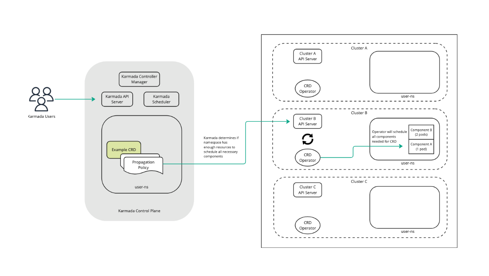
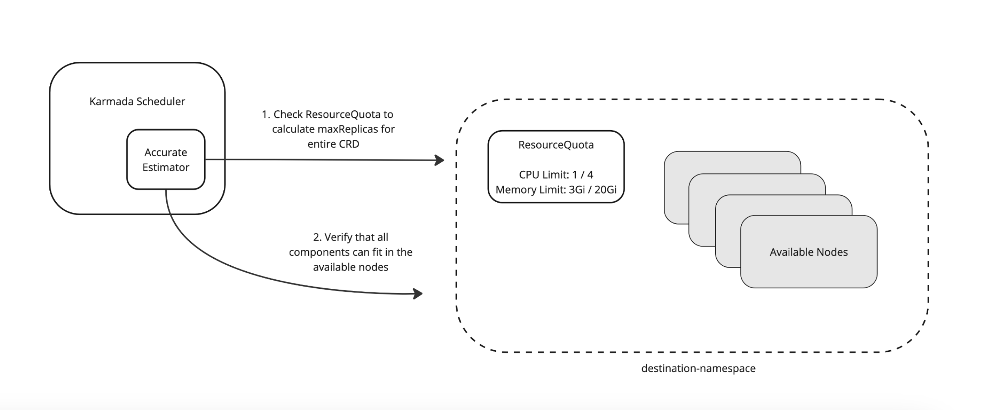

# Multiple Pod Template Support

## Summary

Users may want to use Karmada for resource-aware scheduling of Custom Resources (CRDs). This can be done
if the CRD is comprised of a single podTemplate, which Karmada can already parse if the user defines
the ReplicaRequirements with this in mind. Resource-aware scheduling becomes more difficult however,
if the CRD is comprised of multiple podTemplates or pods of differing resource requirements.

In the case of [FlinkDeployments](https://nightlies.apache.org/flink/flink-kubernetes-operator-docs-main/docs/custom-resource/pod-template/), there are two podTemplates representing the jobManager and taskManagers. Both components can
different resourceRequirements which Karmada cannot currently distinguish while making maxReplica estimates. This is due to a limitation
in the API definition of ReplicaRequirements which assumes that all replicas scheduled by Karmada will have the same resource request.

We could technically add up all the individual component requirements and input those into the replicaRequirements, but Karmada would
treat this like a "super replica", and try to find a node in the destination namespace that could fit the entire replica. In many cases,
this is simply not possible.

For this proposal, we would like to enhance the accurate scheduler to account of complex CRDs with multiple podTemplates or components.

## Background on our Use-Case

Karmada will be used as an intelligent scheduler for FlinkDeployments. We aim to use the accurate estimator (with the
ResourceQuota plugin enabled), to estimate whether a FlinkDeployment can be fully scheduled on the potential destination namespace.
In order to make this estimation, we need to take into account all of the resource requirements of the components that will be
scheduled by the Flink Operator. Once the CRD is scheduled by Karmada, the Flink Operator will take over the rest of the component
scheduling as seen below.



In the case of Flink, these components are the JobManager(s) as well as the TaskManager(s). Both of these components can be comprised of
multiple pods, and the JM and TM frequently do not have the same resource requirements.

## Motivation

Karmada currently provides 2 methods of scheduling estimation through:
1. The general estimator (which analyzes total cluster resources to determine scheduling)
2. The accurate estimator (which can inspect namespaced resource quotas and determine
   number of potential replicas via the ResourceQuota plugin)

This proposal aims to improve the 2nd method by allowing users to define components for their replica
and provide precise resourceRequirements.

## Goals

- Provide a declarative pattern for defining the resourceRequests for individual replica components
- Allow more accurate scheduling estimates for CRDs

## Design Details

### API change

The main changes of this proposal are to the API definition of the ReplicaRequirements struct. We currently include the replicaCount and
replicaRequirements as root level attributes to the ResourceBindingSpec. The limitation here is that we are unable to define unique
replicaRequirements in the case that the resource has more than one podTemplate.

To address this, we can move the concept of replicas and replicaRequirements into a struct related to the individual resource's `Components`.

Each `Component` will have a `Name`, the number of `Replicas`, and corresponding `replicaRequirements`.
These basic fields are necessary to allow the accurate estimator to determine whether all components of the CRD replica
will be able to fit on the destination namespace.

The definition of ReplicaRequirements will stay the same - with the drawback that the user will need to define how Karmada
interprets the individual components of the CRD. Karmada should also support a default component which will use one of the resource's
podTemplates to find requirements.

```go

type ResourceBindingSpec struct {

    . . .

    // The total number of replicas scheduled by this resource. Each replica will represented by exactly one component of the resource.
    TotalReplicas int32 `json:"totalReplicas,omitempty"`

    // Defines the requirements of an individual component of the resource.
	// +optional
    Components []Components `json:"components,omitempty"`

	. . .
}

// A component is a unique representation of a resource's replica. For simple resources, like Deployments, there will only be
// one component, associated with the podTemplate in the Deployment definition.
//
// Complex resources can have multiple components controlled through different podTemplates.
// Each replica for the resource will fall into a component type with requirements defined by its relevant podTemplate.
type ComponentRequirements struct {

    // Name of this component
    Name string `json:"name,omitempty"`

    // Replicas represents the replica number of the resource's component
    // +optional
	Replicas int32 `json:"replicas,omitempty"`

    // ReplicaRequirements represents the requirements required by each replica for this component.
	// +optional
	ReplicaRequirements *ReplicaRequirements `json:"replicaRequirements,omitempty"`

}

// ReplicaRequirements represents the requirements required by each replica.
type ReplicaRequirements struct {

	// NodeClaim represents the node claim HardNodeAffinity, NodeSelector and Tolerations required by each replica.
	// +optional
	NodeClaim *NodeClaim `json:"nodeClaim,omitempty"`

	// ResourceRequest represents the resources required by each replica.
	// +optional
	ResourceRequest corev1.ResourceList `json:"resourceRequest,omitempty"`

	// Namespace represents the resources namespaces
	// +optional
	Namespace string `json:"namespace,omitempty"`

	// PriorityClassName represents the components priorityClassName
	// +optional
	PriorityClassName string `json:"priorityClassName,omitempty"`

}
```

### Overview of Code Changes

Besides the change to the `ResourceBindingSpec` and the `ReplicaRequirements API`, we will need to make a code change to the accurate estimator's implementation,
which can be found here: https://github.com/karmada-io/karmada/blob/5e354971c78952e4f992cc5e21ad3eddd8d6716e/pkg/estimator/server/estimate.go#L59, as well as the maxReplica estimation done by the ResourceQuota plugin.

Currently the accurate estimator will calculate the maxReplica count by:
1. Running the maxReplica calculation (`maxReplicas`) for each plugin enabled by the accurate estimator.
2. The accurate estimator will then loop through all nodes and sum up the amount of replicas (`sumReplicas`) that can fit in each node. This is to account for the resource fragmentation issue.
3. The result returned will be: `Math.min(maxReplicas, sumReplicas)`.



For the proposed implementation, please refer to the next section.

### Accurate Estimator Changes

`Assumption 1`: Resources with more than one replica will always be scheduled to the same cluster.
	- This simplifies the scope of the problem, and accounts for the fact that it is  non-trivial to schedule components of the same CRD across multiple clusters.

`Assumption 2`: MaxReplica estimation will use a sum of all the resource requirement for every component's replica.
	- We could run a maxReplica estimation for each component as is - the difficulty is determining if both components can be scheduled on the same cluster. If we maintain a maxReplica estimate for each component, not only is the estimation more complex, but it is possible to run into edge cases where both components cannot fit on the same cluster even though individually they could be scheduled.
	- Once the MaxReplica estimation is complete, we will return the unit to replicas by multiplying the result with `totalReplicas` field.

Given the above assumptions, we will describe the maxReplica estimation in two parts:

1. The accurate estimator will create an estimate for the maxReplicas that can be scheduled. This estimate will depend on the amount of components set for the resource. If the number of components is 1, then the estimation will be done in the same way that it's done today. If the number of components is greater than 1, then we will sum up all resources required by all replicas to see how many of the total CRD can fit in the available resources.
	- `If components = 1`: maxReplicas = Math.min(Available CPU Resources / replica_cpu, Available Memory Resources / replica_memory)
	- `If components > 1`: maxReplicas = (totalReplicas) * (Math.min(Available CPU Resource / sum(replica_cpu), Available Memory Resource / sum(replica_memory))).
		- `Note`: We multiply the calculation by totalReplicas to bring the unit back to replicas. The calculation is done from the perspective of the entire CRD, but Karmada interprets replicas. That means the maxReplica calculation will always be a multiple of the number of totalReplicas.

Here is an example to illustrate the case in which components > 1. Let's assume we have a CRD with `totalReplicas` = 3, with two components = {component_1: {replicas: 1, cpu: 1, memory: 2GB}, component_2: {replicas: 2, cpu: 1, memory: 1GB}}. We are estimating maxReplica count for a target cluster with a ResourceQuota that has 6CPU available and 8GB of memory available.

During maxReplica estimation, we will take the sum of all resource requirement for the CRD.

Total_CPU = component_1.replicas * (component_1.cpu) + component_2.replicas * (component_2.cpu) = (1 * 1) + (2 * 1) = 3 CPU.
Total_Memory = component_1.replicas * (component_1.memory) + component_2.replicas * (component_2.memory) = (1 * 2GB) + (2 * 1GB) = 8GB.

Now that we have resource totals, we can calculate how many of the total CRD can fit in the available resources:

maxReplica = totalReplicas * Math.min (RQ.cpu / total_cpu, RQ.memory / total_memory) = (1 + 2) * Math.min (2, 2) = 6 replicas (or 2 total CRDs).

2. The accurate estimator will run a decision algorithm to verify that all component's replicas can fit in a combination of available nodes.
	- If the verification step returns `false`: We will return maxReplicas = 0, as the CRD cannot be fully scheduled to the cluster.
	- If the verification step returns `true`: We will return the maxReplica estimate from step 1. The estimate may not be fully accurate, but we will be certain that `at least one` full CRD can be scheduled on the target cluster.

### Bin Packing Verification Step

Optimally packing all component replicas of different resource requirement into nodes of differing sizes is an NP-hard problem. That said, we aren't interested in optimally packing (since Kubernetes will handle scheduling pods), but rather verifying that all replicas from different components of the same resource can be scheduled on the available nodes in the target cluster. This would be like the decision version of a standard bin-packing problem.

Given that we are not looking for an optimal packing, we can try an estimation for our verification. A greedy approach that has quite good performance for these types of problems is `first-fit decreasing`. We would:

1. Sort all our replicas in decreasing order (using cpu, memory, or cpu * memory)
	- We can also decide to sort nodes in decreasing order, in terms of available resources.
2. For each replica, attempt to pack it into the first node that will fit.
	- If the node can fit the replica, we continue to the next replica (and update the node's available resources to reflect the packing)
	- If the node cannot fit the replica, we move to the next available node.

If at some point, a replica cannot fit in any node, we will return false. If we reach the end of our replicas and have packed them all, we will return true without looking at other packing possibilities. The general performance would depend on how many replicas (k) we are packing and how many nodes (n) we are searching. But the average known time complexity of such an algorithm is O(k*logk).
