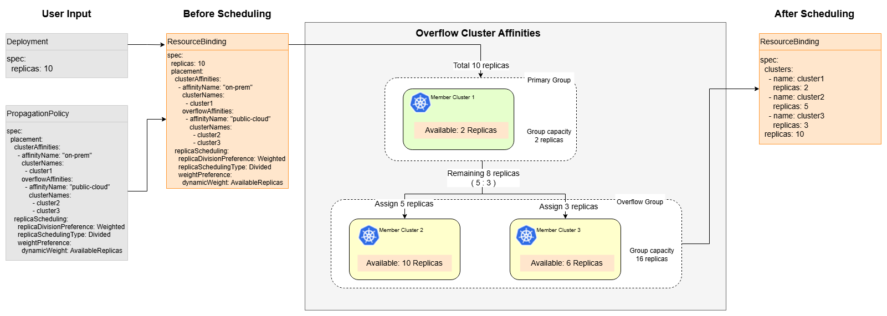

# Overflow Cluster Affinities

## Summary

Karmada currently supports declaring a set of candidate clusters through `clusterAffinity`, or multiple sets of candidate clusters through `ClusterAffinities` (which combines multiple `clusterAffinity` terms in a specific order). However, in either approach, each `clusterAffinity` represents an independent, mutually exclusive cluster set during a single scheduling process—the scheduler ultimately selects only one cluster group defined by one `clusterAffinity` or its subset.

This model has limitations in hybrid cloud scenarios (such as coexistence of local data centers and public clouds). In practical use, local clusters typically serve as the preferred resource pool, while public cloud clusters act as extensions or backup resources. When the capacity of local clusters is exhausted, workloads should **automatically overflow to the next-tier cluster group** rather than failing the scheduling outright.

To address this, this proposal introduces the **Overflow Cluster Affinities** feature. Users can declare multiple tiers of cluster affinity groups with an explicit priority order. During scheduling, the scheduler fills replicas into the highest-priority tier first; only when that tier's clusters are fully exhausted does scheduling **overflow** to the next tier, and so on down the chain. This tiered overflow mechanism enables Karmada to better support elastic workload scheduling in hybrid cloud environments, keeping resource usage cost-efficient under varying traffic conditions.

## Motivation

### Goals

- Extend the API of PropagationPolicy to hold overflow cluster affinities declaration.
- Propose the implementation ideas for involved components, including `karmada-controller-manager`, `karmada-webhook` and `karmada-scheduler`.

### Non-Goals

- Cluster utilization is an effective means of controlling cluster resource usage but is not within the scope of this proposal.

## Proposal

### User Stories

#### Story 1
As a user running GPU-based inference workloads in both my own IDC GPU cluster and a cloud GPU cluster, I need to keep GPU costs low so I only want to use cloud GPUs for extra peak traffic instead of baseline load. When traffic changes and FHPA scales my workloads, Karmada should always scale out in order from IDC to cloud and scale in in reverse order from cloud back to IDC, so that my GPU usage remains cost‑efficient.

### Risks and Mitigations

This proposal maintains backward compatibility. It extends existing APIs by adding optional fields to support overflow cluster affinities, so systems built with previous versions of Karmada can be seamlessly migrated to the new version. Previous configurations (YAMLs) can be applied to the new version of Karmada without any behavior change.

## Design Details

### API change

Extend the `ClusterAffinityTerm` API by adding the `OverflowAffinities` field to describe additional cluster groups. This field allows users to define one or more alternative cluster groups for a single affinity group within `ClusterAffinities`. When the primary cluster group has insufficient resources or is unavailable, the scheduler can progressively expand scheduling to these cluster groups. 

Note: Field `OverflowAffinities` is an ordered array, with scheduling priority decreasing as the tier level increases.

```go
// ClusterAffinityTerm selects a set of cluster.
type ClusterAffinityTerm struct {
	// AffinityName is the name of the cluster group.
	// +kubebuilder:validation:MinLength=1
	// +kubebuilder:validation:MaxLength=32
	// +required
	AffinityName string `json:"affinityName"`

	ClusterAffinity `json:",inline"`


	// OverflowAffinities defines additional cluster groups that the scheduler
	// can progressively include when the primary group (defined by the inline
	// ClusterAffinity) has insufficient resources. Groups are expanded in order
	// and contracted in reverse during scale-down.
	// Can only be used together with the inline ClusterAffinity (the inline
	// ClusterAffinity serves as the primary/preferred group).
	// If a cluster appears in multiple OverflowClusterAffinity entries, it is
	// scheduled according to the first entry in which it appears; subsequent
	// occurrences of the same cluster are ignored.
	// +optional
	OverflowAffinities []OverflowClusterAffinity `json:"overflowAffinities,omitempty"`
}

// OverflowClusterAffinity represents an overflow tier of candidate clusters.
type OverflowClusterAffinity struct {
	// AffinityName is the name of the cluster group.
	// +kubebuilder:validation:MinLength=1
	// +kubebuilder:validation:MaxLength=32
	// +required
	AffinityName string `json:"affinityName"`

	ClusterAffinity `json:",inline"`
}
```

The following configuration declares a `ClusterAffinityTerm` with an overflow cluster group:
```yaml
apiVersion: policy.karmada.io/v1alpha1
kind: PropagationPolicy
metadata:
  name: nginx
spec:
  resourceSelectors:
    - apiVersion: apps/v1
      kind: Deployment
      name: nginx
  placement:
    clusterAffinities:
      - affinityName: "on-prem"
        clusterNames:
          - cluster1
        overflowAffinities:
          - affinityName: "public-cloud"
            clusterNames:
              - cluster2
              - cluster3
    replicaScheduling:
      replicaDivisionPreference: Weighted
      replicaSchedulingType: Divided
      weightPreference:
        dynamicWeight: AvailableReplicas
```

During the scheduling process, the scheduler will first try to place the `replicas` of the `Deployment` into the primary cluster group (`on-prem`), which serves as the highest-priority tier. If the clusters in this primary group cannot accommodate all replicas, the remaining replicas will overflow to the cluster groups defined in `overflowAffinities` tier by tier, following their declared order. In other words, the first overflow affinity acts as the second-priority tier, the next overflow affinity acts as the third-priority tier, and so on.

If `cluster1` is unavailable, the scheduler will use the clusters in the next available overflow tier (i.e., `cluster2` and `cluster3`) for scheduling. Note that when `cluster1` becomes available again, **workload migration will not be automatically triggered** to avoid replica flapping; users need to explicitly use the `WorkloadRebalancer` resource to trigger rescheduling, or indirectly trigger it by adjusting workload replica counts.

Each scheduling will **preferentially use the higher priority affinity group** under current conditions, i.e., the group with the earlier order in `ClusterAffinityTerm`.

The overall process can be described as the following diagram:



### Components change

#### karmada-scheduler

The current scheduler only processes primary cluster group within `ClusterAffinityTerm`. So, it needs to adjust the scheduling logic to support Overflow cluster affinities scheduling.

The details are as follows:
1. The `schedule(Cluster)ResourceBindingWithClusterAffinities` scheduling entrypoint: No changes are needed.
2. `Filter` Stage: The `ClusterAffinity` plugin needs to be adjusted to support Overflow cluster affinities. Specifically, a cluster passes the filter if it satisfies the scheduling conditions of any affinity group within a `ClusterAffinityTerm`.
3. `Score` Stage: No changes are needed.
4. `Select` Stage: The current `Select` stage prioritizes clusters with the highest scores. For overflow affinities scheduling, it needs to be adjusted to prioritize clusters belonging to the primary group and earlier overflow tiers over those in later tiers. This ensures that clusters are selected in strict tier order, so that replicas overflow to lower-priority tiers only after higher-priority tiers are fully utilized.
5. `Assign` Stage: This stage needs to be adjusted to support Overflow cluster affinities. Specifically:
   - 5.1 Group clusters based on their affinity group tier.
   - 5.2 Iterate through the tiers in order, attempting to assign the remaining replicas. Clusters in each tier will be allocated as many replicas as possible until the
   resources for that tier are exhausted or all replicas have been assigned.
   - 5.3 Within each tier, the assignment logic will remain consistent with the current implementation.
   - 5.4 The process concludes successfully once all replicas are assigned. If unassigned replicas remain after iterating through all tiers, the scheduling process fails.

#### karmada-webhook

- Adding a validation for the `(Cluster)PropagationPolicy` resource to restrict that `spec.placement.clusterAffinities[i].overflowAffinities` can only be used together with the inline `ClusterAffinity` and must not be set independently.
- Adding a validation to restrict that `overflowAffinities` can only be used with the `Divided` replica scheduling type combined with `dynamicWeight` (e.g., `AvailableReplicas`).

### Test Plan

- All current testing should be passed, no breaking change would be involved by this feature.
- Add new E2E tests to cover the feature, the scope should include:
    * **Scale-out (overflow) scenario:** When replicas increase beyond the capacity of the primary (highest-priority) tier, the scheduler progressively assigns the excess replicas to the next tier defined in `overflowAffinities`, and continues down subsequent tiers as each becomes exhausted.
    * **Scale-in (contraction) scenario:** When replicas decrease, the scheduler reclaims replicas in reverse tier order—removing replicas from the lowest-priority tier first, then the next tier, and so on back toward the primary tier.

### Discussion Points

**Should multi-cluster priority scheduling support working with `SpreadConstraints`?**

Yes, they are independent APIs.

**How does Overflow cluster affinities scheduling behave under different replica scheduling strategies?**

The overflow scheduling logic is designed to work only with the `Divided` scheduling type with `dynamicWeight` (e.g., `AvailableReplicas`), because only this scheduling mode takes member clusters' available resources into account when assigning replicas—which is a prerequisite for tiered overflow behavior.

**How to handle when a cluster appears multiple times in different tiers?**

Determine its priority order based on the tier where it first appears.

**How to handle the old ClusterAffinities after introducing the new API?**

Overflow cluster affinities scheduling is a new use case that does not conflict with the existing ClusterAffinities use case. They cannot completely replace each other. Instead, it serves as a supplement and extension to the existing multi-scheduling group capabilities.

Current use case of ClusterAffinities: Multi-cluster group isolation (region, provider) and failover, used to select one from multiple candidate cluster groups. It serves as a supplement and extension to the existing multi-scheduling group capabilities.

Overflow cluster affinities: Used for cost optimization and elastic scaling. There is only one candidate cluster group, and clusters within one candidate cluster group are used in tiered order.

## Alternatives

### Approach 1:

Extend the `ClusterAffinity` API by adding a `Supplements` field to describe supplementary cluster group configurations. This field allows users to define one or more alternative cluster groups for a single Affinity Group. When the primary cluster group has insufficient resources or is unavailable, the scheduler can automatically fallback to these supplementary cluster groups for workload deployment. Note: Supplements is an array that can set multiple tiers of extensible cluster groups, with scheduling priority decreasing as the tier level increases.

```go
// ClusterAffinity represents the filter to select clusters.
type ClusterAffinity struct {
    // Omitted, as there are no changes.

    // new added API field
    Supplements []ClusterAffinity `json:"supplements,omitempty"`
}
```

The following configuration declares a ClusterAffinity with an extended cluster group:

```yaml
apiVersion: policy.karmada.io/v1alpha1
kind: PropagationPolicy
metadata:
  name: nginx
spec:
  resourceSelectors:
    - apiVersion: apps/v1
      kind: Deployment
      name: nginx
  placement:
    clusterAffinity:
      clusterNames:
        - cluster1
      supplements:
        - clusterNames:
          - cluster2
          - cluster3
```

Since `ClusterAffinities` is a combination of multiple `ClusterAffinity` terms, it will also support using the `Supplements` field to declare tiered expansion relationships. In this case, the semantics are:
- Each `ClusterAffinity` within `ClusterAffinities` can declare its own `Supplements` field, representing the extended cluster groups for that specific affinity group.
- The relationship between different `ClusterAffinity` terms in `ClusterAffinities` remains mutually exclusive. The next `ClusterAffinity` will only be considered when both the base clusters and the extended clusters of the previous `ClusterAffinity` fail to satisfy the scheduling requirements.

**Why not chosen:** Adding a new field to `ClusterAffinity` would implicitly propagate the field to `ClusterAffinities` as well, increasing the complexity of user configuration and decision-making. Moreover, overflow scheduling is inherently a multi-cluster-group scenario; embedding it within a single `ClusterAffinity` is semantically misplaced.

### Approach 2:

Currently, ClusterAffinities have mutually exclusive relationships between ClusterAffinity terms, but they can also have a tiered supplementary relationship.

In this approach, the role of the existing `ClusterAffinities` is modified to simply declare multiple `ClusterAffinity` groups. By introducing `AffinityStrategy.Mode` to the placement API, this new API determines how to utilize the `ClusterAffinity` terms defined in `ClusterAffinities`. This approach enriches the semantics of the original multi-scheduling group feature and improves extensibility.

```go
type Placement struct { 
    ClusterAffinities []ClusterAffinityTerm `json:"clusterAffinities,omitempty"`  
    
    // AffinityStrategy defines how cluster affinities are evaluated  
    // +optional  
    AffinityStrategy *AffinityStrategy `json:"affinityStrategy,omitempty"`  
}  
  
type AffinityStrategy struct {  
    // Mode defines the scheduling mode  
    // +kubebuilder:validation:Enum=Exclusive;Overflow
    // +kubebuilder:default=Exclusive
    // +optional  
    Mode string `json:"mode,omitempty"`  
} 
```

The following configuration declares an overflow cluster affinities between multiple clusterAffinity terms:

```yaml
apiVersion: policy.karmada.io/v1alpha1
kind: PropagationPolicy
metadata:
  name: nginx
spec:
  resourceSelectors:
    - apiVersion: apps/v1
      kind: Deployment
      name: nginx
  placement:
    clusterAffinities:
      - affinityName: primary
        clusterNames:
          - cluster1
      - affinityName: backup
        clusterNames:
          - cluster2
          - cluster3
    affinityStrategy:
      mode: Overflow
```

**Why not chosen:** Introducing an `AffinityStrategy` field changes the inherent mutually-exclusive semantics of the existing `ClusterAffinities` API. Adding a mode toggle that reinterprets these same terms as overflow tiers breaks that well-established contract and may confuse existing users.

### Approach 3:

Add a new API `PreferredClusterAffinities` at the same level as ClusterAffinities to declare cluster groups with priority relationships.

```go
// Placement represents the rule for select clusters.
type Placement struct {
    // PreferredClusterAffinities represents scheduling preferences to multiple cluster
    // groups that indicated by ClusterAffinityTerm with priority-based selection.
    //
    // Unlike ClusterAffinities which are mutually exclusive (scheduler selects only one group),
    // PreferredClusterAffinities allows the scheduler to use multiple cluster groups based on
    // priority and resource availability.
    // +optional
    PreferredClusterAffinities []ClusterAffinityTerm `json:"preferredClusterAffinities,omitempty"`
}
```

The following configuration declares a preferredClusterAffinities with two affinity terms:

```yaml
apiVersion: policy.karmada.io/v1alpha1
kind: PropagationPolicy
metadata:
  name: nginx
spec:
  resourceSelectors:
    - apiVersion: apps/v1
      kind: Deployment
      name: nginx
  placement:
    preferredClusterAffinities:
      - affinityName: primary
        clusterNames:
          - cluster1
      - affinityName: backup
        clusterNames:
          - cluster2
          - cluster3
```

**Why not chosen:** Overflow cluster affinities is a supplement to the existing multi-scheduling-group capability and represents a subset of `ClusterAffinities` scenarios. Introducing a new top-level API field (`PreferredClusterAffinities`) at the same level as `ClusterAffinities` overstates the scope of the feature and fragments the API surface unnecessarily.
