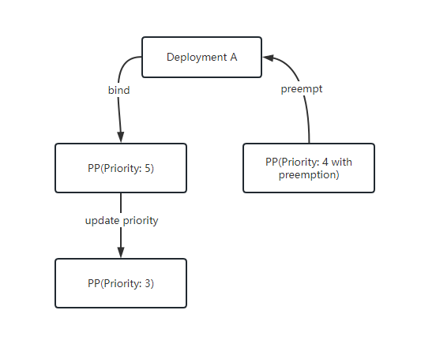
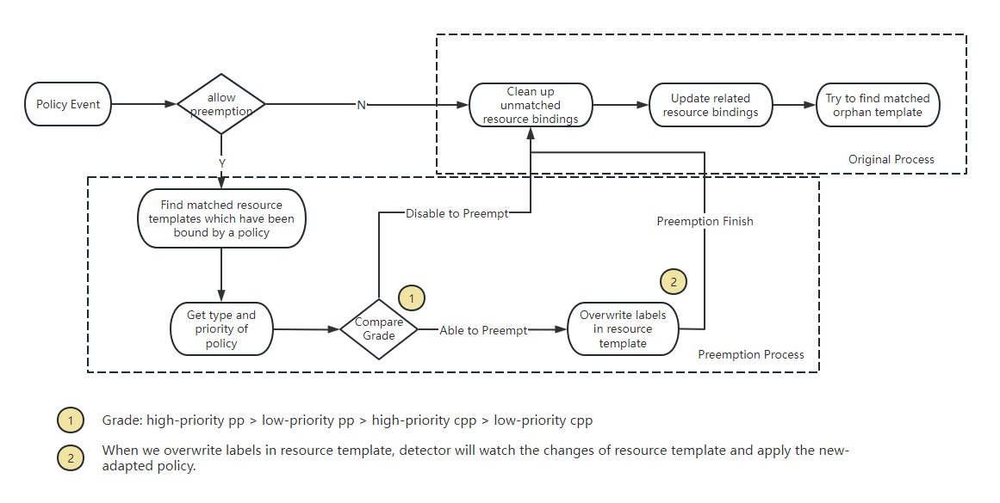

# PropagationPolicy Priority and Preemption

## Summary

Currently, `PropagationPolicy` and `ClusterPropagationPolicy` already have a notion of priority. If multiple PropagationPolicies match the workload, Karmada will select the one with the highest priority. However, the priority only takes effect during the first matching of the resource template. Once a resource template is selected by a PropagationPolicy, it can not be preempted by a subsequent PropagationPolicy even it has higher priority.

```yaml
apiVersion: policy.karmada.io/v1alpha1
kind: PropagationPolicy
metadata:
  name: propagation-high-explicit-priority
spec:
  resourceSelectors:
    - apiVersion: apps/v1
      kind: Deployment
      labelSelector:
        matchLabels:
          app: nginx
  priority: 2 #priority indicates the importance of a policy
  placement:
    clusterAffinity:
      clusterNames:
        - member1
```

This proposal proposes a strategy which allows policies to support preemption by priority at runtime.
Even if workloads have been propagated by a policy, they can be preempted by a high priority of policy.

## Motivation

Cluster administrators usually cannot foresee future expansion scenarios when configuring policies.
They will usually start with a broad policy to set the base strategy. When an application requires special configuration,
the administrator wants to provide a persionalized policy to take over the application.
At this time, it hopes that the high-priority policy can preempt the low-priority policy.

### Goals

- Extend the API of PropagationPolicy/ClusterPropagationPolicy to allow high-priority policies to preempt low-priority policies.
- Propose the implementation ideas for involved components, including `karmada-controller-manager`.
- Propose a solution that is compatible with previous versions. The preemption capability will be disabled by default, 
upgrading the system from the previous version to the new one will not result in any changes in behavior and will not require any additional adaptation work.

### Non-Goals

## Proposal

### User Stories (Optional)

#### As a cluster administrator, I hope that the high-priority propagationPolicy can preempt the low-priority propagationPolicy.

As a cluster administrator, I am responsible for unified management of multi-cluster scheduling policies. 
Workloads are responsible for each business team. For the current businesses under the same namespace, I deploy a generic policy to match all.
At some point, I want to change the scheduling strategy of one of the businesses, so I create a higher-priority policy.
I hope that the high-priority policy can preempt the low-priority policy.

#### As a cluster administrator, I hope that the propagationPolicy can match resources that have been matched by clusterPropagationPolicy under the same namespace.

As a cluster administrator, I am responsible for unified management of multi-cluster scheduling policies.
Workloads are responsible for each business team. For the current business, I deploy a cpp to match all namespace-scoped resources.
At some point, I want to change the scheduling strategy of one of the businesses under one of namespaces, so I create a pp to match it only.
I hope that the propagationPolicy can match it that have been matched by clusterPropagationPolicy.

### Risks and Mitigations

This proposal maintains the backward compatibility, the system built with previous
versions of Karmada can be seamlessly migrated to the new version.
The previous configurations(yamls) could be applied to the new version of Karmada and
without any behavior change.

### Notes/Constraints/Caveats (Optional)

Ref to https://github.com/karmada-io/karmada/pull/3684#issuecomment-1645075275

#### Feature gate

This feature is an experimental feature, so we add a feature gate to control the global enablement. 

#### Details about priority

The priority based on preemption do not include implicit priority when `.spec.priority` of policies are the same.

For example, the following two policies do not preempt.

```
# labelselectormatch.yaml
apiVersion: policy.karmada.io/v1alpha1
kind: PropagationPolicy
metadata:
  name: propagation-labelselectormatch
spec:
  resourceSelectors:
    - apiVersion: apps/v1
      kind: Deployment
      labelSelector:
        matchLabels:
          app: nginx
  placement:
    clusterAffinity:
      clusterNames:
        - member2
---
# namematch.yaml
apiVersion: policy.karmada.io/v1alpha1
kind: PropagationPolicy
metadata:
  name: propagation-namematch
spec:
  resourceSelectors:
    - apiVersion: apps/v1
      kind: Deployment
      name: nginx
  placement:
    clusterAffinity:
      clusterNames:
        - member3
```
And when preemption is enabled, pp will preempt cpp regardless of the priority if they both match a namespace-scoped resource.

**Note**: pp will not preempt cluster-scoped resources which are matched by cpp because it cannot match them.

Overall priority: high-priority pp > low-priority pp > high-priority cpp > low-priority cpp

#### Clarify the scope of preemption

Preemption is a dangerous operation that easily lead to unexpected consequences. And we do facing the scalability challenges during the implementation, such as we need to list all resource templates
during response to preemption. This will have a significant impact on system performance.

Moreover, most of the user cases are that users want to use a pp to preempt a certain resource. In that case, the resource is often specific and can be specifically declared in the pp.

```
apiVersion: policy.karmada.io/v1alpha1
kind: PropagationPolicy
metadata:
  name: foo
spec:
  resourceSelectors:
  - apiVersion: apps/v1
    kind: Deployment
    name: nginx
```

So we narrow down the scope of preemption by introducing a restriction: `for pp, the name in ResourceSelector must be specified; 
for cpp, the namespace/name for namespace-scoped resources and the name for cluster-scoped resources must be specific`. 

#### Corner cases

For the update of priority, if the priority becomes larger, the above process meets our needs. 
On the contrary, assume that there are two policies which match the same resource template, one disables preemption and its priority is 5. Another one enables preemption and its priority is 4. Currently the resource template use the policy with priority 5. However when we update the priority from 5 to 3, users hope that the second policy can preempt this resource template. 



In order to solve this problem, when the priority of the policy drops from A to B, we need to ensure that policies with priority in the range (B, A] have a preemptive trigger.

It can be split into two sub-problems:
* How to identify changes in priority? One optional way is via updateEvent. The disadvantage is that a large amount of calculation will affect the performance of `list-watch`. Another optional way is via webhook.
The disadvantage is that we need to add an extra annotation on the policy
* How to determine which policies need to queued? One optional way is to maintain a inner map which represents the relationship of resource templates and policies.
The key might be policies which enable preemption while the value might be the matched resource templates.

## Design Details

### API change

#### PropagationPolicy API change

This proposal proposes a new field `Preemption` for determining the behavior for preempting.
By default, preemption is disabled.

```go
type PropagationSpec struct {
    // +kubebuilder:default=0
    Priority *int `json:"priority,omitempty"`

    // Preemption declares the behaviors for preempting.
    // Valid options are Always and Never.
    //
    // +kubebuilder:default="Never"
    // +kubebuilder:validation:Enum=Always;Never
    // +optional
    Preemption PreemptionBehavior `json:"preemption,omitempty"`
}
```

```go
// PreemptionBehavior describes whether and how to preempt resources that are
// claimed by lower-priority PropagationPolicy(ClusterPropagationPolicy).
// +enum
type PreemptionBehavior string

const (
    // PreemptAlways means that preemption is allowed.
    //
    // If it is applied to a PropagationPolicy, it can preempt any resource as
    // per Priority, regardless of whether it has been claimed by a PropagationPolicy
    // or a ClusterPropagationPolicy, as long as it can match the rules defined
    // in ResourceSelector. In addition, if a resource has already been claimed by a 
    // ClusterPropagationPolicy, the PropagationPolicy can still preempt it
    // without considering Priority.
    //
    // If it is applied to a ClusterPropagationPolicy, it can only preempt from
    // ClusterPropagationPolicy, and from PropagationPolicy is not allowed.
    PreemptAlways PreemptionBehavior = "Always"

    // PreemptNever means that a PropagationPolicy(ClusterPropagationPolicy) never
    // preempts resources.
    PreemptNever PreemptionBehavior = "Never"
)
```

For example, assume that policy `nginx-propagation` has bound workload `nginx`:

```yaml
apiVersion: policy.karmada.io/v1alpha1
kind: PropagationPolicy
metadata:
  name: nginx-propagation
spec:
  resourceSelectors:
    - apiVersion: apps/v1
      kind: Deployment
      name: nginx
  priority: 2 
  placement:
    clusterAffinity:
      clusterNames:
        - member1
        - member2
```

```yaml
apiVersion: work.karmada.io/v1alpha2
kind: ResourceBinding
metadata:
  labels:
    propagationpolicy.karmada.io/name: nginx-propagation
    propagationpolicy.karmada.io/namespace: default
  name: nginx-deployment
  namespace: default 
```

Assume that there is a high-priority policy which allows preepmtion:

```yaml
apiVersion: policy.karmada.io/v1alpha1
kind: PropagationPolicy
metadata:
  name: nginx-propagation-preemption
spec:
  resourceSelectors:
    - apiVersion: apps/v1
      kind: Deployment
      name: nginx
  priority: 3
  preemption: Always
  placement:
    clusterAffinity:
      clusterNames:
        - member3
```

`nginx-propagation-preemption` will preempt `nginx-propagation` and the deployment will be scheduled to `member3`.

### Components change

#### karmada-controller-manager

Currently, when a new policy creates/updates, `detector` will first check whether existing objects are no longer matched by the current policy to handle the changes of `resourceSelectors`. If yes, clean the labels on the unmatched object. Then it will find the corresponding ResourceBinding and make sure that PropagationPolicy's updates can be synchronized to ResourceBinding. Finally, it will try to find the matched resource templates which have not been scheduled.

To allow preemption, Karmada needs to record the mapping relationship between policies and resource templates. 

Here are some optional implementations:

1. A inner data structure, such as `Map`.

2. Directly record it as a label/annotation, we already have some labels to record the metadata of policy bound to the resource, such as `propagationpolicy.karmada.io/name` and `propagationpolicy.karmada.io/namespace`.

For example, `propagationpolicy.karmada.io/priority`.

3. Get the priority by using client-go `Get` to fetch the policy object

Consider that we have strictly defined the resource object of preemption, getting the policy from the cache has little performance overhead. So we ended up using option 3.

Also, we need to add a preemption logic. The overall process is shown in the picture below.



For each preemption operation, the component needs to have a corresponding metrics record. For metrics, we will record the total number of times
a resource template is preempted. And we will use events to reflect the details of each preemption operation.

For example, preemption_counts_total{namespace=default, name=nginx} 4.

#### karmada-webhook

Since we have strictly defined the resource object of preemption, so the webhook should perform extra
validation work to prevent misleading configuration.

### Test Plan

- All current testing should be passed, no break change would be involved by this feature.
- Add new E2E tests to cover the feature, the scope should include:
  * preemption between high-priority pp/cpp and low-priority pp/cpp
  * preemption between pp and cpp
  * preemption is disabled.
