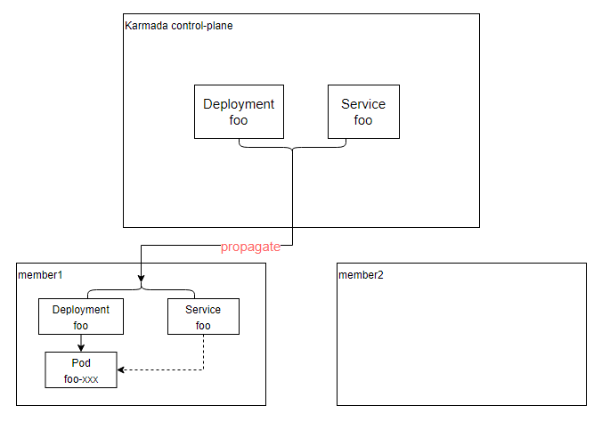
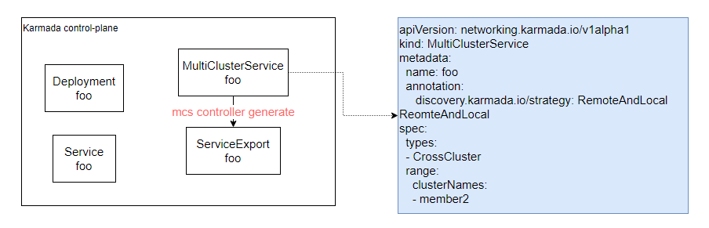
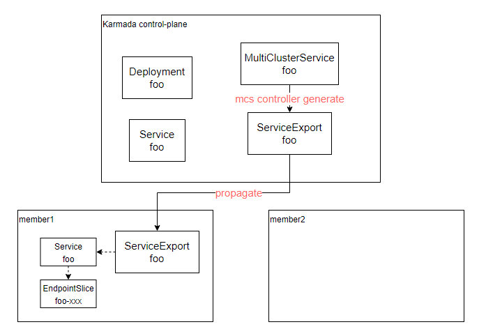
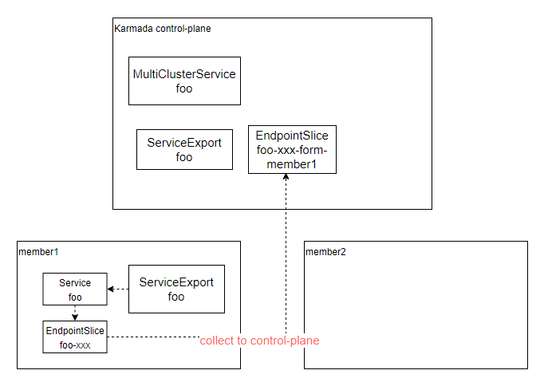
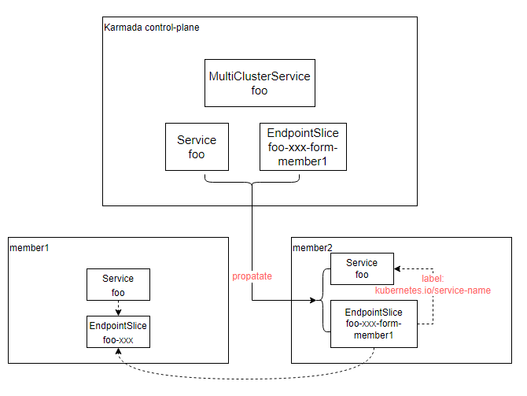
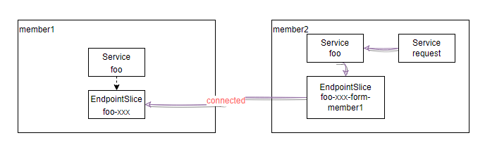

# Service discovery with native Kubernetes naming and resolution

## Summary

With the current `ServiceImportController` when a `ServiceImport` object is reconciled, the derived service is prefixed with `derived-` prefix.

This Proposal propose a method for multi-cluster service discovery using Kubernetes native Service, to modify the current implementation of Karmada's MCS. This approach does not add a `derived-` prefix when accessing services across clusters.

## Motivation

<!--
This section is for explicitly listing the motivation, goals, and non-goals of
this KEP.  Describe why the change is important and the benefits to users.
-->
Having a `derived-` prefix for `Service` resources seems counterintuitive when thinking about service discovery:
- Assuming the pod is exported as the service `foo`
- Another pod that wishes to access it on the same cluster will simply call `foo` and Kubernetes will bind to the correct one
- If that pod is scheduled to another cluster, the original service discovery will fail as there's no service by the name `foo`
- To find the original pod, the other pod is required to know it is in another cluster and use `derived-foo` to work properly

### Goals

- Remove the "derived-" prefix from the service
- User-friendly and native service discovery

### Non-Goals

- Multi cluster connectivity

## Proposal

Following are flows to support the service import proposal:

1. `Deployment` and `Service` are created on cluster member1 and the `Service` imported to cluster member2 using `ServiceImport` (described below as [user story 1](#story-1))
2. `Deployment` and `Service` are created on cluster member1 and both propagated to cluster member2. `Service` from cluster member1 is imported to cluster member2 using `ServiceImport` (described below as [user story 2](#story-2))

The proposal for this flow is what can be referred to as local-and-remote service discovery. In the process handling, it can be simply distinguished into the following scenarios:

1. **Local** only - In case there's a local service by the name `foo` Karmada never attempts to import the remote service and doesn't create an `EndPointSlice`
2. **Local** and **Remote** - Users accessing the `foo` service will reach either member1 or member2
3. **Remote** only - in case there's a local service by the name `foo` Karmada will remove the local `EndPointSlice` and will create an `EndPointSlice` pointing to the other cluster (e.g. instead of resolving member2 cluster is will reach member1)

Based on the above three scenarios, we have proposed two strategies:

- **RemoteAndLocal** - When accessing Service, the traffic will be evenly distributed between the local cluster and remote cluster's Service.
- **LocalFirst** - When accessing Services, if the local cluster Service can provide services, it will directly access the Service of the local cluster. If a failure occurs in the Service on the local cluster, it will access the Service on remote clusters.

> Note: How can we detect the failure?
> Maybe we need to watch the EndpointSlices resources of the relevant Services in the member cluster. If the EndpointSlices resource becomes non-existent or the statue become not ready, we need to synchronize it with other clusters.
> As for the specific implementation of the LocalFirst strategy, we can iterate on it subsequently.

This proposal suggests using the [MultiClusterService API](https://github.com/karmada-io/karmada/blob/24bb5829500658dd1caeea16eeace8252bcef682/pkg/apis/networking/v1alpha1/service_types.go#L30) to enable cross-cluster service discovery. To avoid conflicts with the previously provided [prefixed cross-cluster service discovery](./../networking/multiclusterservice.md#cross-clusters-service-discovery), we can add an annotation on the MultiClusterService API with the key `discovery.karmada.io/strategy`,  its value can be either `RemoteAndLocal` or `LocalFirst`.

```yaml
apiVersion: networking.karmada.io/v1alpha1
kind: MultiClusterService
metadata:
   name: foo
   annotation:
      discovery.karmada.io/strategy: RemoteAndLocal 
spec:
   types:
      - CrossCluster
   range:
      clusterNames:
         - member2
```

### User Stories (Optional)

<!--
Detail the things that people will be able to do if this KEP is implemented.
Include as much detail as possible so that people can understand the "how" of
the system. The goal here is to make this feel real for users without getting
bogged down.
-->

#### Story 1

As a Kubernetes cluster member,
I want to access a service from another cluster member,
So that I can communicate with the service using its original name.

**Background**: The Service named `foo` is created on cluster member1 and imported to cluster member2 using `ServiceImport`.

**Scenario**:

1. Given that the `Service` named `foo` exists on cluster member1
2. And the `ServiceImport` resource is created on cluster member2, specifying the import of `foo`
3. When I try to access the service inside member2
4. Then I can access the service using the name `foo.myspace.svc.cluster.local`

#### Story 2

As a Kubernetes cluster member,
I want to handle conflicts when importing a service from another cluster member,
So that I can access the service without collisions and maintain high availability.

**Background**: The Service named `foo` is created on cluster member1 and has a conflict when attempting to import to cluster member2.
Conflict refers to the situation where there is already a `Service` `foo` existing on the cluster (e.g. propagated with `PropagationPolicy`), but we still need to import `Service` `foo` from other clusters onto this cluster (using `ServiceImport`)

**Scenario**:

1. Given that the `Service` named `foo` exists on cluster member1
2. And there is already a conflicting `Service` named foo on cluster member2
3. When I attempt to access the service in cluster member2 using `foo.myspace.svc.cluster.local`
4. Then the requests round-robin between the local `foo` service and the imported `foo` service (member1 and member2)

### Notes/Constraints/Caveats (Optional)

<!--
What are the caveats to the proposal?
What are some important details that didn't come across above?
Go in to as much detail as necessary here.
This might be a good place to talk about core concepts and how they relate.
-->

### Risks and Mitigations

<!--
What are the risks of this proposal, and how do we mitigate? 

How will security be reviewed, and by whom?

How will UX be reviewed, and by whom?

Consider including folks who also work outside the SIG or subproject.
-->
Adding a `Service` that resolve to a remote cluster will add a network latency of communication between clusters. 

## Design Details

<!--
This section should contain enough information that the specifics of your
change are understandable. This may include API specs (though not always
required) or even code snippets. If there's any ambiguity about HOW your
proposal will be implemented, this is the place to discuss them.
-->

### API changes

The optimization design for the MultiClusterService API needs to be further iterated and improved, such as fixing the annotation `discovery.karmada.io/strategy` in the spec.

### General Idea

Before delving into the specific design details, let's first take a look from the user's perspective at what preparations they need to make.

1. The user creates a foo Deployment and Service on the Karmada control panel, and creates a PropagationPolicy to distribute them into the member cluster member1.



1. The user creates an MCS object on the Karmada control plane to enable cross-cluster service foo. In this way, the service on cluster member2 can access the foo Service on cluster member1.



Then, present our specific plan design.

1. When the `mcs-controller` detects that a user has created a `MultiClusterService` object, it creates a `ServiceExport` in the Karmada control plane and propagates it to the source clusters through creating a `ResourceBinding` (the source clusters can obtain this via the Service associated with `ResourceBinding`).



1. Depending on the existing MCS atomic capabilities, the `service-export-controller` will collect the `EndpointSlices` related to `foo` Service into the Karmada control plane.



1. The `mcs-controller`, on the Karmada control plane, creates a `ResourceBinding` to propagate Service and EndpointSlice to destination clusters. This is done considering that some target Services already exist in certain destination clusters. Therefore, it's necessary to confirm the specific destination cluster based on the strategy specified in the `MultiClusterService` object.

- If there is a Service existing on the target cluster, there is no need to resynchronize the EndpointSlices exported from this cluster to the cluster. Only synchronize the EndpointSlices received from other clusters.
- If there is no Service on the target cluster, both the Service and the EndpointSlices collected from other clusters need to be synchronized to that cluster.



At this point, the entire process is complete, and `foo` Service can now be accessed across clusters.



### Test Plan

<!--
**Note:** *Not required until targeted at a release.*

Consider the following in developing a test plan for this enhancement:
- Will there be e2e and integration tests, in addition to unit tests?
- How will it be tested in isolation vs with other components?

No need to outline all test cases, just the general strategy. Anything
that would count as tricky in the implementation, and anything particularly
challenging to test, should be called out.

-->

- UT cover for new add code
- E2E cover for new add case

## Alternatives

<!--
What other approaches did you consider, and why did you rule them out? These do
not need to be as detailed as the proposal, but should include enough
information to express the idea and why it was not acceptable.
-->

One alternative approach to service discovery with native Kubernetes naming and resolution is to rely on external DNS-based service discovery mechanisms. However, this approach may require additional configuration and management overhead, as well as potential inconsistencies between different DNS implementations. By leveraging the native Kubernetes naming and resolution capabilities, the proposed solution simplifies service discovery and provides a consistent user experience.

Another alternative approach could be to enforce a strict naming convention for imported services, where a specific prefix or suffix is added to the service name to differentiate it from local services. However, this approach may introduce complexity for users and require manual handling of naming collisions. The proposed solution aims to provide a more user-friendly experience by removing the "derived-" prefix and allowing services to be accessed using their original names.

<!--
Note: This is a simplified version of kubernetes enhancement proposal template.
https://github.com/kubernetes/enhancements/tree/3317d4cb548c396a430d1c1ac6625226018adf6a/keps/NNNN-kep-template
-->