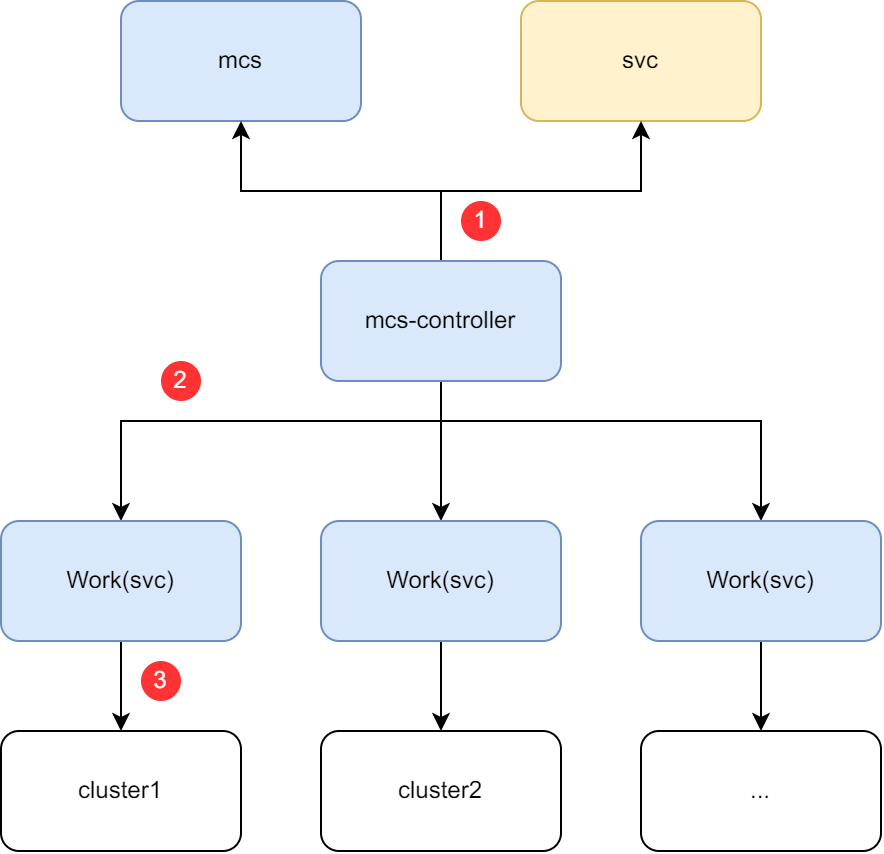
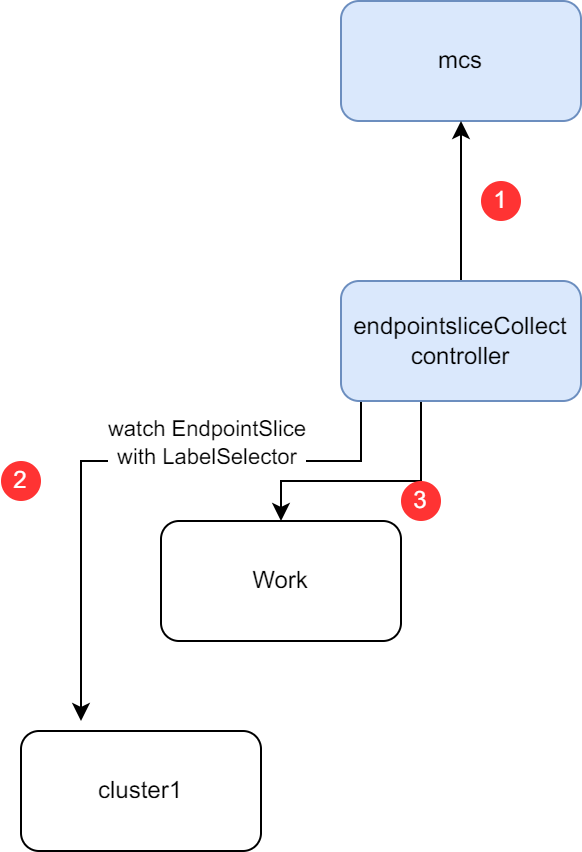
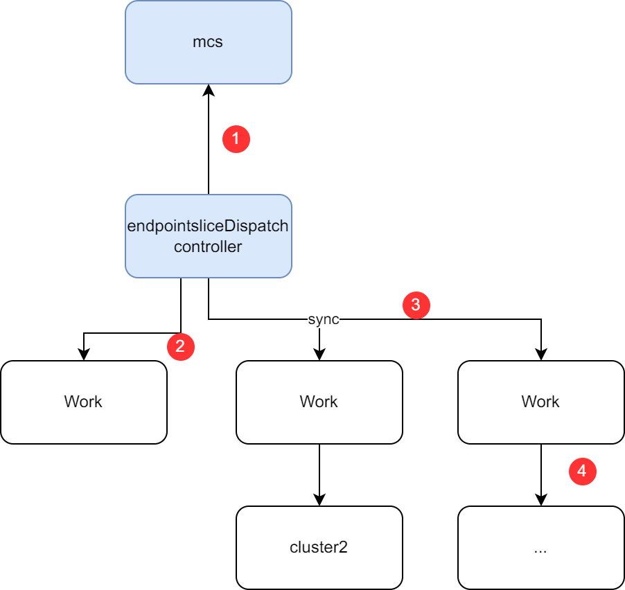

# Service discovery with native Kubernetes naming and resolution

## Summary

In multi-cluster scenarios, there is a need to access services across clusters. Currently, Karmada support this by creating derived service(with `derived-` prefix, ) in other clusters to access the service.

This Proposal propose a method for multi-cluster service discovery using Kubernetes native Service, to modify the current implementation of Karmada's MCS. This approach does not add a `derived-` prefix when accessing services across clusters.

## Motivation

<!--
This section is for explicitly listing the motivation, goals, and non-goals of
this KEP.  Describe why the change is important and the benefits to users.
-->

Having a `derived-` prefix for `Service` resources seems counterintuitive when thinking about service discovery:
- Assuming the pod is exported as the service `foo`
- Another pod that wishes to access it on the same cluster will simply call `foo` and Kubernetes will bind to the correct one
- If that pod is scheduled to another cluster, the original service discovery will fail as there's no service by the name `foo`
- To find the original pod, the other pod is required to know it is in another cluster and use `derived-foo` to work properly

If Karmada supports service discovery using native Kubernetes naming and resolution (without the `derived-` prefix), users can access the service using its original name without needing to modify their code to accommodate services with the `derived-` prefix.

### Goals

- Remove the "derived-" prefix from the service
- User-friendly and native service discovery

### Non-Goals

- Multi cluster connectivity

## Proposal

Following are flows to support the service import proposal:

1. `Deployment` and `Service` are created on cluster member1 and the `Service` imported to cluster member2 using `MultiClusterService` (described below as [user story 1](#story-1))
2. `Deployment` and `Service` are created on cluster member1 and both propagated to cluster member2. `Service` from cluster member1 is imported to cluster member2 using `MultiClusterService` (described below as [user story 2](#story-2))

The proposal for this flow is what can be referred to as local-and-remote service discovery. In the process handling, it can be simply distinguished into the following scenarios:

1. **Local** only - In case there's a local service by the name `foo` Karmada never attempts to import the remote service and doesn't create an `EndPointSlice`
2. **Local** and **Remote** - Users accessing the `foo` service will reach either member1 or member2
3. **Remote** only - in case there's a local service by the name `foo` Karmada will remove the local `EndPointSlice` and will create an `EndPointSlice` pointing to the other cluster (e.g. instead of resolving member2 cluster is will reach member1)

Based on the above three scenarios, we think there is two reasonable strategies(Users can utilize PP to propagate the Service and implement the `Local` scenario, it's not necessary to implement it with `MultiClusterService`):

- **RemoteAndLocal** - When accessing Service, the traffic will be evenly distributed between the local cluster and remote cluster's Service.
- **LocalFirst** - When accessing Services, if the local cluster Service can provide services, it will directly access the Service of the local cluster. If a failure occurs in the Service on the local cluster, it will access the Service on remote clusters.

> Note: How can we detect the failure?
> Maybe we need to watch the EndpointSlices resources of the relevant Services in the member cluster. If the EndpointSlices resource becomes non-existent or the statue become not ready, we need to synchronize it with other clusters.

This proposal suggests using the [MultiClusterService API](https://github.com/karmada-io/karmada/blob/24bb5829500658dd1caeea16eeace8252bcef682/pkg/apis/networking/v1alpha1/service_types.go#L30) to enable cross-cluster service discovery.

This proposal focuses on the `RemoteAndLocal` strategy, and we will subsequently iterate on the `LocalFirst` strategy.

### User Stories (Optional)

<!--
Detail the things that people will be able to do if this KEP is implemented.
Include as much detail as possible so that people can understand the "how" of
the system. The goal here is to make this feel real for users without getting
bogged down.
-->

#### Story 1

As a user of a Kubernetes cluster, I want to be able to access a service whose corresponding pods are located in another cluster. I hope to communicate with the service using its original name.

**Scenario**:

1. Given that the `Service` named `foo` exists on cluster member1
1. When I try to access the service inside member2, I can access the service using the name `foo.myspace.svc.cluster.local`

#### Story 2

As a user of a Kubernetes cluster, I want to access a service that has pods located in both this cluster and another. I expect to communicate with the service using its original name, and have the requests routed to the appropriate pods across clusters.

**Scenario**:

1. Given that the `Service` named `foo` exists on cluster member1
2. And there is already a conflicting `Service` named foo on cluster member2
3. When I attempt to access the service in cluster member2 using `foo.myspace.svc.cluster.local`
4. Then the requests round-robin between the local `foo` service and the imported `foo` service (member1 and member2)

### Notes/Constraints/Caveats (Optional)

<!--
What are the caveats to the proposal?
What are some important details that didn't come across above?
Go in to as much detail as necessary here.
This might be a good place to talk about core concepts and how they relate.
-->

### Risks and Mitigations

<!--
What are the risks of this proposal, and how do we mitigate?

How will security be reviewed, and by whom?

How will UX be reviewed, and by whom?

Consider including folks who also work outside the SIG or subproject.
-->

Adding a `Service` that resolve to a remote cluster will add a network latency of communication between clusters.

## Design Details

<!--
This section should contain enough information that the specifics of your
change are understandable. This may include API specs (though not always
required) or even code snippets. If there's any ambiguity about HOW your
proposal will be implemented, this is the place to discuss them.
-->

### API changes

This proposal proposes two new fields `ServiceProvisionClusters` and `ServiceConsumptionClusters` in `MultiClusterService` API.

```go

type MultiClusterServiceSpec struct {
	...

	// ServiceProvisionClusters specifies the clusters which will provision the service backend.
	// If leave it empty, we will collect the backend endpoints from all clusters and sync
	// them to the ServiceConsumptionClusters.
	// +optional
	ServiceProvisionClusters []string `json:"serviceProvisionClusters,omitempty"`

	// ServiceConsumptionClusters specifies the clusters where the service will be exposed, for clients.
	// If leave it empty, the service will be exposed to all clusters.
	// +optional
	ServiceConsumptionClusters []string `json:"serviceConsumptionClusters,omitempty"`
}

```

With this API, we will:
* Use `ServiceProvisionClusters` to specify the member clusters which will provision the service backend, if leave it empty, we will collect the backend endpoints from all clusters and sync them to the `ServiceConsumptionClusters`.
* Use `ServiceConsumptionClusters` to specify the clusters where the service will be exposed. If leave it empty, the service will be exposed to all clusters.

For example, if we want access `foo`` service which are located in member2 from member3 , we can use the following yaml:
```yaml
apiVersion: v1
kind: Service
metadata:
  name: foo
spec:
  ports:
  - port: 80
    targetPort: 8080
  selector:
    app: foo
---
apiVersion: networking.karmada.io/v1alpha1
kind: MultiClusterService
metadata:
   name: foo
spec:
   types:
      - CrossCluster
    serviceProvisionClusters:
      - member2
    serviceConsumptionClusters:
      - member3
```

### Implementation workflow

#### Service propagation

The process of propagating Service from Karmada control plane to member clusters is as follows:

<p align="center">
  
</p>

1. `multiclusterservice` controller will list&watch `Service` and `MultiClusterService` resources from Karmada control plane.
1. Once there is same name `MultiClusterService` and `Service`, `multiclusterservice` will create the Work(corresponding to `Service`), the target cluster namespace is all the clusters in filed `spec.serviceProvisionClusters` and `spec.serviceConsumptionClusters`.
1. The Work will be synchronized with the member clusters. After synchronization, `EndpointSlice` will be created in member clusters.

#### `EndpointSlice` synchronization

The process of synchronizing `EndpointSlice` from `ServiceProvisionClusters` to `ServiceConsumptionClusters` is as follows:

<p align="center">
  
</p>

1. `endpointsliceCollect` controller will list&watch `MultiClusterService`.
1. `endpointsliceCollect` controller will build the informer to list&watch the target service's EndpointSlice from `ServiceProvisionClusters`.
1. `endpointsliceCollect` controller will create the corresponding Work for each `EndpointSlice` in the cluster namespace.
  When creating the Work, in order to delete the corresponding work when `MultiClusterService` deletion, we should add following labels:
    * `endpointslice.karmada.io/name`: the service name of the original `EndpointSlice`.
    * `endpointslice.karmada.io/namespace`: the service namespace of the original `EndpointSlice`.

<p align="center">
  
</p>

1. `endpointsliceDispatch` controller will list&watch `MultiClusterService`.
1. `endpointsliceDispatch` controller will list&watch `EndpointSlice` from `MultiClusterService`'s `spec.serviceProvisionClusters`.
1. `endpointsliceDispatch` controller will create the corresponding Work for each `EndpointSlice` in the cluster namespace of `MultiClusterService`'s `spec.serviceConsumptionClusters`.
  When creating the Work, in order to facilitate problem investigation, we should add following annotation to record the original `EndpointSlice` information:
    * `endpointslice.karmada.io/work-provision-cluster`: the cluster name of the original `EndpointSlice`.
  Also, we should add the following annotation to the synced `EndpointSlice` record the original information:
    * `endpointslice.karmada.io/endpointslice-generation`: the resource generation of the `EndpointSlice`, it could be used to check whether the `EndpointSlice` is the newest version.
    * `endpointslice.karmada.io/provision-cluster`: the cluster location of the original `EndpointSlice`.
1. Karmada will sync the `EndpointSlice`'s work to the member clusters.

But, there is one point to note that, assume I have following configuration:
```yaml
apiVersion: v1
kind: Service
metadata:
  name: foo
spec:
  ports:
  - port: 80
    targetPort: 8080
  selector:
    app: foo
---
apiVersion: networking.karmada.io/v1alpha1
kind: MultiClusterService
metadata:
   name: foo
spec:
  types:
    - CrossCluster
  serviceProvisionClusters:
    - member1
    - member2
  serviceConsumptionClusters:
    - member2
```

When create the corresponding Work, Karmada should only sync the exists `EndpointSlice` in `member1` to `member2`.

### Components change

#### karmada-controller

* Add `multiclusterservice` controller to support reconcile `MultiClusterService` and Clusters, including creation/deletion/updating.
* Add `endpointsliceCollect` controller to support reconcile `MultiClusterService` and Clusters, collect `EndpointSlice` from `ServerClusters` as work.
* Add `endpointsliceDispatch` controller to support reconcile `MultiClusterService` and Clusters, dispatch `EndpointSlice` work from `serviceProvisionClusters` to `serviceConsumptionClusters`.

### Status Record

We should have following Condition in `MultiClusterService`:
```go
	MCSServiceAppliedConditionType          = "ServiceApplied"

	MCSEndpointSliceCollectedConditionType = "EndpointSliceCollected"

	MCSEndpointSliceAppliedConditionType = "EndpointSliceApplied"
```

`MCSServiceAppliedConditionType` is used to record the status of `Service` propagation, for example:
```yaml
status:
  conditions:
  - lastTransitionTime: "2023-11-20T02:30:49Z"
    message: Service is propagated to target clusters.
    reason: ServiceAppliedSuccess
    status: "True"
    type: ServiceApplied
```

`MCSEndpointSliceCollectedConditionType` is used to record the status of `EndpointSlice` collection, for example:
```yaml
status:
  conditions:
  - lastTransitionTime: "2023-11-20T02:30:49Z"
    message: Failed to list&watch EndpointSlice in member3.
    reason: EndpointSliceCollectedFailed
    status: "False"
    type: EndpointSliceCollected
```

`MCSEndpointSliceAppliedConditionType` is used to record the status of `EndpointSlice` synchronization, for example:
```yaml
status:
  conditions:
  - lastTransitionTime: "2023-11-20T02:30:49Z"
    message: EndpointSlices are propagated to target clusters.
    reason: EndpointSliceAppliedSuccess
    status: "True"
    type: EndpointSliceApplied
```

### Metrics Record

For better monitoring, we should have following metrics:

* `mcs_sync_svc_duration_seconds` - The duration of syncing `Service` from Karmada control plane to member clusters.
* `mcs_sync_eps_duration_seconds` - The time it takes from detecting the EndpointSlice to creating/updating the corresponding Work in a specific namespace.

### Development Plan

* API definition, including API files, CRD files, and generated code. (1d)
* For `multiclusterservice` controller, List&watch mcs and service, reconcile the work in execution namespace. (5d)
* For `multiclusterservice` controller, List&watch cluster creation/deletion, reconcile the work in corresponding cluster execution namespace. (10)
* For `endpointsliceCollect` controller, List&watch mcs, collect the corresponding EndpointSlice from `serviceProvisionClusters`, and `endpointsliceDispatch` controller should sync the corresponding Work. (5d)
* For `endpointsliceCollect` controller, List&watch cluster creation/deletion, reconcile the EndpointSlice's work in corresponding cluster execution namespace. (10d)
* If cluster gets unhealthy, mcs-eps-controller should delete the EndpointSlice from all the cluster execution namespace. (5d)

### Test Plan

<!--
**Note:** *Not required until targeted at a release.*

Consider the following in developing a test plan for this enhancement:
- Will there be e2e and integration tests, in addition to unit tests?
- How will it be tested in isolation vs with other components?

No need to outline all test cases, just the general strategy. Anything
that would count as tricky in the implementation, and anything particularly
challenging to test, should be called out.

-->

- UT cover for new add code
- E2E cover for new add case

## Alternatives

<!--
What other approaches did you consider, and why did you rule them out? These do
not need to be as detailed as the proposal, but should include enough
information to express the idea and why it was not acceptable.
-->

One alternative approach to service discovery with native Kubernetes naming and resolution is to rely on external DNS-based service discovery mechanisms. However, this approach may require additional configuration and management overhead, as well as potential inconsistencies between different DNS implementations. By leveraging the native Kubernetes naming and resolution capabilities, the proposed solution simplifies service discovery and provides a consistent user experience.

Another alternative approach could be to enforce a strict naming convention for imported services, where a specific prefix or suffix is added to the service name to differentiate it from local services. However, this approach may introduce complexity for users and require manual handling of naming collisions. The proposed solution aims to provide a more user-friendly experience by removing the "derived-" prefix and allowing services to be accessed using their original names.

<!--
Note: This is a simplified version of kubernetes enhancement proposal template.
https://github.com/kubernetes/enhancements/tree/3317d4cb548c396a430d1c1ac6625226018adf6a/keps/NNNN-kep-template
-->
