# Staged propagation for PropagationPolicy and ClusterPropagationPolicy

## Summary

Karmada has the primitives for ordered, health-gated multi-cluster
rollouts — per-cluster dispatch suspension
(`spec.suspension.dispatchingOnClusters`) and per-cluster workload health
(`ResourceBinding.status.aggregatedStatus[].health`) — but no
orchestration on top of them. Users do "update cluster A first, verify
healthy, then cluster B" by hand: poll health, patch suspension.
Error-prone, no verification signal, no defined failure behavior, no
observable state machine.

This proposal introduces an opt-in `rolloutStrategy` field on
`PropagationSpec` and a `pkg/rollout/` library invoked from the existing
binding controllers. In v1, `Staged` mode rolls the workload out one
cluster at a time in deterministic (alphabetical) order; users declare
a single gate (health / condition / min-success) that every cluster
must pass before the next one is unsuspended, plus a per-cluster
timeout and failure policy. Karmada drives the state machine. No new
controller; the feature layers on the existing suspension primitive
and reuses the full binding → Work → member-cluster data path.

## Motivation

Karmada's propagation pipeline is all-at-once: the binding controller
fans out to every scheduled cluster in parallel. This is the right
default but unsafe for:

- **Stateful services with a restart-sensitive control plane** (Trino
  coordinator: single-coordinator topology, ~30s unavailability per
  restart; simultaneous DC restart takes the service offline).
- **Blast-radius-sensitive cluster infrastructure** (ingress controllers,
  admission webhooks, CoreDNS overrides — anything managed by
  `ClusterPropagationPolicy`).
- **Tenant-driven validation** (smoke tests or custom readiness signals
  between clusters — beyond what `Health == Healthy` alone can provide).

The [dispatch-suspension
proposal](../dispatch-suspension/README.md) Story 2 describes ordered
rollout as a *manual* pattern (suspend all, release one at a time) and
correctly listed automated ordered rollout as a **Non-Goal**. This
proposal picks up that non-goal as its central goal.

### Goals

- Declare an ordered, health-gated staged rollout across the clusters
  selected by a single PP or CPP. Order is deterministic (sorted by
  cluster name); one cluster at a time.
- Verification gate with three dials — `RequireHealthy`,
  `RequiredConditions`, `MinSuccessTime` — covering health-only
  auto-advance, condition-based validation (workload conditions or
  custom validator signals surfaced via the workload's status), and
  min-success duration. A separate per-cluster `Timeout` (same value
  applied to every cluster; clock reset per cluster) bounds each
  cluster's wall-clock budget.
- Declared, testable failure policy (`Pause | Continue`) so a failing
  cluster does not silently let the rollout roll forward.
- Reuse existing primitives (`spec.suspension.dispatchingOnClusters`,
  `Work.spec.suspendDispatching`, `AggregatedStatusItem.Health`); no new
  data plane, only a new control loop.
- Opt-in per policy, alpha feature gate `StagedPropagation`, no-op for
  every existing policy.
- Symmetric support for `PropagationPolicy` and `ClusterPropagationPolicy`.

### Non-Goals

- **Traffic-shifting canary / blue-green** at the workload layer — belongs
  to Argo Rollouts / Flagger / the mesh.
- **Per-replica progressive rollout inside a single cluster** — Deployment
  / StatefulSet `strategy.rollingUpdate` domain.
- **A general-purpose multi-workload workflow engine** — anything like
  Argo Workflows (DAGs, per-step scripts) belongs outside Karmada.
- **Automatic workload-level rollback.** v1 stops the rollout; reverting
  the resource template is a GitOps concern.
- **Cross-policy synchronization** — independent PPs do not coordinate.

## Proposal

The core primitive is `PropagationSpec.rolloutStrategy`. Setting it to
`Staged` switches propagation from all-at-once dispatch to a
controller-driven state machine that unlocks one cluster at a time in
deterministic sorted order by writing per-cluster suspension onto the
associated `ResourceBinding` / `ClusterResourceBinding`. All other
propagation semantics — scheduling, placement, override policies, work
generation, execution, status aggregation — are unchanged.
`rolloutStrategy` is supported symmetrically on `PropagationPolicy`
and `ClusterPropagationPolicy` from v1. v1 intentionally has no
grouping / batching / user-specified ordering; those are v2 extensions
if requested.

### User Stories

#### Story 1: Sequential cluster-by-cluster rollout with health gating

As a service owner running the same HA workload across multiple
clusters, I want a config change to roll out one cluster at a time,
holding each cluster until it has been continuously healthy for a
minimum period — so surviving clusters keep serving while any single
cluster restarts.

```yaml
kind: PropagationPolicy
spec:
  # ... resourceSelectors, placement (selects member-east, member-west, ...) ...
  rolloutStrategy:
    type: Staged
    staged:
      gate: {requireHealthy: true, minSuccessTime: 60s}
      timeout: 30m           # each cluster has its own 30m budget
      onFailure: {action: Pause}
```

Clusters are visited in `spec.clusters` sorted order (deterministic:
`member-east` before `member-west`). Each cluster must stay Healthy
for a continuous 60s before the next one is unsuspended.

#### Story 2: Tenant-driven validation between clusters

As a service owner, I do not trust "reports Healthy" as sufficient
signal to promote. I want the rollout to hold on each cluster until
the workload is healthy *and* my smoke-test controller writes a
`SmokeTestsPassed=True` condition onto the workload — read by the
gate via the resource's existing `.status.conditions[]` (see API
changes).

```yaml
staged:
  gate:
    requireHealthy: true
    requiredConditions:
      - {type: SmokeTestsPassed, status: "True"}
  timeout: 1h
```

The gate applies identically to every cluster in sorted order. The
smoke-test controller in each cluster writes `SmokeTestsPassed=True`
onto the workload's own `.status.conditions[]`; the gate reads it
via `AggregatedStatusItem.Status`.

#### Story 3: Automatic pause on failure, protecting remaining clusters

If any cluster fails its gate (rollout timeout without reaching
`Healthy`, or required conditions never becoming `True`), I want the
rollout to *pause* without propagating to the remaining clusters, so
they stay on the previous known-good version until I intervene. No
automatic workload-level revert — my resource template is git-controlled.

### Notes/Constraints/Caveats

- **Not a scheduling or data-plane change.** The scheduler still owns
  `RB.spec.clusters`; only the binding controller learns a new
  responsibility (writing `spec.suspension.rollout` + `status.rollout`
  via `pkg/rollout/`). Execution and work-status controllers are
  unchanged.
- **Suspension is a union.** The dispatch decision is the union of
  user-declared (`Dispatching`, `DispatchingOnClusters`) and
  controller-managed (`Rollout.SuspendedClusters`) suspension; a
  user-suspended cluster is never un-suspended by rollout progress.
- **Rollout state is per-workload.** One PP selecting N resource
  templates produces N ResourceBindings, each advancing independently.
  Cross-RB synchronization is a v2 extension.
- **Per-cluster gate is atomic.** The current cluster must satisfy
  the full gate (`RequireHealthy` if set, AND every
  `RequiredConditions` entry) for the entire `MinSuccessTime` window
  before the next cluster is unsuspended; any flap resets the clock.
- **Ordering is deterministic.** Clusters are visited in `spec.clusters`
  alphabetically-sorted order at each reconcile. Reschedules that add
  or remove clusters mid-rollout are handled explicitly (see
  Reschedule mid-rollout).

### Risks and Mitigations

| Risk | Mitigation |
|---|---|
| Binding controller and detector race on `RB.spec.suspension` | Separate controller-owned field (`Suspension.Rollout`); the detector's `MergePolicySuspension` only overwrites the embedded user-declared part. |
| Rollout stalls on unreachable cluster | `Unknown` is treated as "not yet Healthy"; `Timeout` bounds the wait; `OnFailure: Pause` prevents cascading. |
| User edits resource template mid-rollout | Generation change flips `Phase` to `Superseded`, clears `CompletedClusters`, and restarts from the first cluster in sort order on the next reconcile (Deployment precedent). |
| `Health == Healthy` is a weak signal | Users needing stronger validation set `RequiredConditions` (e.g. `Available=True`, `Ready=True`, or a custom `SmokeTestsPassed=True` condition written by an in-cluster validator). Karmada observes; it does not run the tests. |
| Binding controller crashes mid-rollout | `pkg/rollout/` is a pure function; state is fully recovered from `status.rollout` + `spec.suspension.rollout` on the next reconcile. |

## Design Details

The design follows the standard Kubernetes spec-declares / status-progresses
pattern, split across two objects: the `PropagationPolicy` carries the
user-authored rollout *declaration* (`spec.rolloutStrategy` — strategy
type, gate criteria, failure policy), and the `ResourceBinding` carries
the per-workload *actuation state* (`spec.suspension.rollout`) and
*observed progress* (`status.rollout`). This is the same relationship
that `Deployment` has with `ReplicaSet`: policy on the parent,
per-instance progression on the child.

### API changes

Add `RolloutStrategy` to `PropagationSpec` (shared between PP and CPP).

```go
// pkg/apis/policy/v1alpha1/propagation_types.go
type PropagationSpec struct {
    // ... existing fields ...
    RolloutStrategy *RolloutStrategy `json:"rolloutStrategy,omitempty"`
}

// RolloutStrategyType selects the rollout mode. AllAtOnce preserves
// existing behavior; Staged activates the pkg/rollout/ state machine.
type RolloutStrategyType string

const (
    RolloutStrategyAllAtOnce RolloutStrategyType = "AllAtOnce"
    RolloutStrategyStaged    RolloutStrategyType = "Staged"
)

type RolloutStrategy struct {
    // +kubebuilder:validation:Enum=AllAtOnce;Staged
    // +kubebuilder:default=AllAtOnce
    Type   RolloutStrategyType `json:"type"`
    Staged *StagedRollout      `json:"staged,omitempty"` // required when Type=Staged
}

// StagedRollout rolls the workload out one cluster at a time.
// Order is deterministic: `spec.clusters` sorted alphabetically by
// cluster name at each reconcile. A cluster must satisfy `Gate` before
// the next cluster is unsuspended. `Timeout` is a per-cluster budget
// (same value applied to every cluster): each cluster has its own
// fresh clock that starts when it becomes `CurrentCluster`. Exceeding
// it fails the rollout on that cluster (subject to `OnFailure`). One
// cluster's slow bakes never eat into another's budget.
//
// v1 intentionally exposes no grouping / batching / per-cluster stages;
// see Alternatives for the "explicit stages" shape we deferred.
type StagedRollout struct {
    Gate      *RolloutGate          `json:"gate,omitempty"`      // if unset, advance on Applied=true only
    Timeout   *metav1.Duration      `json:"timeout,omitempty"`   // per-cluster budget; default 30m
    OnFailure *RolloutFailurePolicy `json:"onFailure,omitempty"` // default {Action: Pause}
}

// RolloutGate is the per-cluster criterion for advancing the rollout.
// Applied identically to every cluster; there are no per-cluster overrides.
type RolloutGate struct {
    RequireHealthy     *bool                  `json:"requireHealthy,omitempty"`     // default true
    RequiredConditions []ConditionRequirement `json:"requiredConditions,omitempty"` // default nil (no extra conditions)
    MinSuccessTime     *metav1.Duration       `json:"minSuccessTime,omitempty"`     // default 0
}

// ConditionRequirement gates a cluster on a Condition present in the
// workload's own status.conditions[], surfaced via
// AggregatedStatusItem.Status. Missing conditions count as Unknown.
type ConditionRequirement struct {
    Type   string                 `json:"type"`             // e.g. "Available", "SmokeTestsPassed"
    // +kubebuilder:validation:Enum=True;False;Unknown
    // +kubebuilder:default=True
    Status metav1.ConditionStatus `json:"status,omitempty"` // default "True"
}

// RolloutFailureAction selects what a per-cluster gate failure (or a
// whole-rollout Timeout) does to the rollout.
type RolloutFailureAction string

const (
    RolloutFailureActionPause    RolloutFailureAction = "Pause"
    RolloutFailureActionContinue RolloutFailureAction = "Continue"
)

type RolloutFailurePolicy struct {
    // +kubebuilder:validation:Enum=Pause;Continue
    // +kubebuilder:default=Pause
    Action RolloutFailureAction `json:"action"`
}
```

Multiple `RequiredConditions` entries AND together with `RequireHealthy`;
the rollout advances to the next cluster only when the current cluster
satisfies the full gate for the entire `MinSuccessTime` window (see
Notes/Caveats for flap semantics). `StagedRollout.Timeout` is
independent of `MinSuccessTime` — each cluster has its own `Timeout`
clock that starts when it becomes `CurrentCluster` and is reset (not
carried over) when the next cluster begins. Exceeding it triggers
`OnFailure` (default `Pause`) on the cluster whose clock ran out.
Worst-case total wall-clock time is `N × Timeout` for `N` scheduled
clusters — pick `Timeout` for a single cluster's expected bake, not
for the fleet.

Add `Rollout` to `workv1alpha2.Suspension` (per-binding, controller-owned):

```go
// pkg/apis/work/v1alpha2/binding_types.go
type Suspension struct {
    policyv1alpha1.Suspension `json:",inline"`
    Scheduling *bool               `json:"scheduling,omitempty"`
    Rollout    *RolloutSuspension  `json:"rollout,omitempty"` // NEW; controller-owned
}

type RolloutSuspension struct {
    // CurrentCluster is the single cluster the rollout is currently
    // gating on. Empty when the rollout is Pending (before first
    // cluster is picked) or Succeeded (after last cluster passed).
    CurrentCluster    string   `json:"currentCluster,omitempty"`
    // SuspendedClusters is every cluster in the sorted target list
    // that is neither CurrentCluster nor already-completed.
    SuspendedClusters []string `json:"suspendedClusters,omitempty"`
}
```

`Rollout` sits alongside the existing controller-owned `Scheduling`
field, distinct from the embedded `policyv1alpha1.Suspension` block
(`Dispatching`, `DispatchingOnClusters`) that the detector rewrites
via `util.MergePolicySuspension`. This sibling-not-overlapping
structure is what prevents the detector-vs-rollout write race
(Risk #1); `Scheduling` has relied on the same guarantee since
introduction.

Add `Rollout` to `ResourceBindingStatus` (per-binding, controller-owned):

```go
// pkg/apis/work/v1alpha2/binding_types.go
type ResourceBindingStatus struct {
    // ... existing fields (SchedulerObservedGeneration, Conditions,
    // AggregatedStatus, etc.) ...
    Rollout *RolloutStatus `json:"rollout,omitempty"` // NEW; controller-owned
}

type RolloutStatus struct {
    // ObservedGeneration is the workload template revision this rollout
    // is driving toward. Mismatch with the current template generation
    // triggers a restart from the first cluster in sorted order.
    // (See Group C in the review comments for the full revision-tracking
    // contract; this is the identity of "the current template.")
    ObservedGeneration int64 `json:"observedGeneration,omitempty"`

    // +kubebuilder:validation:Enum=Pending;Progressing;Succeeded;Failed;Superseded
    Phase RolloutPhase `json:"phase"`

    // CurrentCluster is the single cluster the rollout is currently
    // gating on. Empty when Phase is Pending or Succeeded. When
    // Phase is Failed, this is the cluster whose gate failed.
    CurrentCluster string `json:"currentCluster,omitempty"`

    // CompletedClusters is the list of clusters that have already
    // passed the gate for ObservedGeneration, in the order they passed.
    CompletedClusters []string `json:"completedClusters,omitempty"`

    // GateSatisfiedSince is when CurrentCluster first continuously
    // satisfied the full gate (RequireHealthy AND RequiredConditions).
    // Reset to nil on flap so MinSuccessTime survives controller restart.
    GateSatisfiedSince *metav1.Time `json:"gateSatisfiedSince,omitempty"`

    // StartedAt is when the whole rollout began (first cluster
    // became CurrentCluster). Informational only.
    StartedAt *metav1.Time `json:"startedAt,omitempty"`
    // CurrentClusterStartedAt is when the CurrentCluster became the
    // current target. Reset every time CurrentCluster changes.
    // Used to enforce StagedRollout.Timeout on the current cluster.
    CurrentClusterStartedAt *metav1.Time `json:"currentClusterStartedAt,omitempty"`
    CompletedAt *metav1.Time `json:"completedAt,omitempty"`

    // Well-known Condition types: "Progressing", "Healthy", "ConditionsMet".
    Conditions []metav1.Condition `json:"conditions,omitempty"`

    Message string `json:"message,omitempty"` // human-readable, populated on transition
}

type RolloutPhase string

const (
    RolloutPhasePending     RolloutPhase = "Pending"
    RolloutPhaseProgressing RolloutPhase = "Progressing"
    RolloutPhaseSucceeded   RolloutPhase = "Succeeded"
    RolloutPhaseFailed      RolloutPhase = "Failed"
    // Superseded is set when the workload template generation changes
    // mid-rollout; the rollout resets to the first cluster on the next
    // reconcile. Kept as a distinct phase so dashboards can distinguish
    // "template changed" from "genuinely failed."
    RolloutPhaseSuperseded  RolloutPhase = "Superseded"
)
```

`ClusterResourceBinding` embeds `ResourceBindingSpec` /
`ResourceBindingStatus`, so `Rollout` applies to CRB unchanged.
Rollout suspension is written onto the RB / CRB, never onto PP / CPP
(rationale in Alternatives). `shouldSuspendDispatching`
(`pkg/controllers/binding/common.go`) is extended to take the union
of user-declared and controller-managed suspension;
`util.MergePolicySuspension` is unchanged.

### Rollout reconciliation

**No new controller.** The state machine lives as a `pkg/rollout/`
library of pure functions invoked from the existing binding controllers
whenever `spec.rolloutStrategy != nil && spec.rolloutStrategy.Type ==
Staged`. `Type: AllAtOnce` (the default) is a documented no-op label:
the library is not invoked and the existing all-at-once dispatch path
runs unchanged. It exposes a single
`Compute(strategy, prevStatus, aggregatedStatus, scheduledClusters, now)`
returning the suspended-cluster set, a new `RolloutStatus`, and a
`requeueAfter` duration. The binding controller writes
`spec.suspension.rollout` + `status.rollout` and requeues; `ensureWork`
reads the updated `Suspension` via `shouldSuspendDispatching` (unchanged
data path).

**Cluster ordering.** `Compute` sorts the effective target set (the
same `mergeTargetClusters(spec.Clusters, spec.RequiredBy)` set that
`ensureWork` uses) alphabetically by cluster name; this ordering is
stable across reconciles and reschedules. `CurrentCluster` is the
first cluster in that sorted list that is not in `CompletedClusters`.

```mermaid
stateDiagram-v2
    [*] --> Pending: spec.rolloutStrategy=Staged\nspec.clusters not yet scheduled
    Pending --> Progressing: scheduler populated spec.clusters\n(pick first cluster; suspend the rest)
    Progressing --> Advance: gate satisfied on CurrentCluster\n(Healthy AND RequiredConditions)\nfor MinSuccessTime
    Progressing --> Failed: Timeout on CurrentCluster\n(clock reset per cluster; OnFailure=Pause)
    Progressing --> Superseded: workload generation changed
    state Advance <<choice>>
    Advance --> Progressing: more clusters remain\n(move CurrentCluster to CompletedClusters;\npick next; unsuspend it)
    Advance --> Succeeded: all clusters passed\n(clear all suspension)
    Superseded --> Pending: reset CompletedClusters,\nadvance ObservedGeneration
    Succeeded --> [*]
    Failed --> [*]
```



`suspendedClusters` on each entry:

- **Pending** — every scheduled cluster (rollout has not picked a target yet).
- **Progressing** — every scheduled cluster except `CurrentCluster` and `CompletedClusters`.
- **Succeeded** — empty (all clusters released).
- **Failed** — every cluster after `CurrentCluster` in sort order (they stay on the previous known-good version); `CompletedClusters` stay released.
- **Superseded** — same as Pending on the next reconcile after `ObservedGeneration` advances.

**Reconcile trigger.** Binding controllers get a rollout-aware
predicate that also wakes on aggregated-status changes; the execution
controller needs no changes since `Suspension.Rollout` writes bump
`metadata.generation`.

### Reschedule mid-rollout

The scheduler owns `RB.spec.clusters` and can update it any time. On
each reconcile, `pkg/rollout/` recomputes the sorted target list from
scratch and picks a new `CurrentCluster` as "the first cluster in sort
order that is not in `CompletedClusters`." No stage-set arithmetic is
needed. Three sub-cases:

- **New cluster added.** It slots into sort order like any other. If
  it sorts *after* `CurrentCluster`, it joins the suspended tail and
  will be visited eventually. If it sorts *before* `CurrentCluster`
  and is not in `CompletedClusters`, `Compute` makes it the new
  `CurrentCluster` (fresh gate) — protecting the invariant that no
  cluster is released without passing the gate for the current
  `ObservedGeneration`.
- **`CurrentCluster` removed.** Rollout advances to the next
  still-scheduled cluster in sort order; the removed cluster is
  dropped from `CompletedClusters` if present. No failure is raised —
  a rescheduled-away cluster is a legitimate scheduling decision, and
  keeping the previously-verified prefix released is safe.
- **All clusters removed.** Rollout enters `Pending` and waits for
  scheduling; this is the same behavior as a brand-new binding.

### Failure handling

`OnFailure.Action`:

- **Pause** (default) — set `phase = Failed`, keep all remaining
  clusters (every cluster after `CurrentCluster` in sort order)
  suspended, emit `RolloutClusterFailed`, stop requeuing. `Failed` is
  terminal; recovery is either (a) any generation bump on the resource
  template (flips to `Superseded` → restart from the first cluster),
  or (b) removing `spec.rolloutStrategy` to fall back to all-at-once.
- **Continue** — advance despite the current cluster failing its gate.
  Adds it to `CompletedClusters` and moves on. Emits a `Warning`
  event. Rare.

No automatic workload-level rollback in v1 — reverting `spec.resource`
is a GitOps concern. What v1 guarantees is that not-yet-reached
clusters stay on the previously known-good version via
`Work.spec.suspendDispatching`.

### Feature gate and defaulting

- Feature gate `StagedPropagation` (alpha in v1). When disabled, the
  webhook rejects any policy with `spec.rolloutStrategy != nil &&
  spec.rolloutStrategy.Type == Staged`; `Type: AllAtOnce` remains
  accepted (it matches existing behavior).
- When `spec.rolloutStrategy` is unset or `Type: AllAtOnce`, existing
  behavior is preserved verbatim; the binding controllers skip
  `pkg/rollout/` entirely.
- Defaults: `RolloutStrategy.Type=AllAtOnce`,
  `StagedRollout.Timeout=30m`, `StagedRollout.OnFailure.Action=Pause`,
  `Gate.RequireHealthy=true`, `Gate.RequiredConditions=nil`,
  `Gate.MinSuccessTime=0`. An omitted `Gate` (`gate: nil`) is
  synthesized as `&RolloutGate{}` before per-field defaulting, so
  `gate: nil` and `gate: {}` are equivalent post-defaulting.

### Corner cases

- **Spec change mid-rollout** — generation bump flips `Phase` to
  `Superseded` and restarts from the first cluster in sort order
  (Deployment precedent).
- **Cluster unreachable / missing condition** — treated as `Unknown`;
  the current cluster's `Timeout` fires eventually. Later clusters are
  unaffected because their clocks haven't started.
- **Deletion during rollout** — `Work` deletion is not blocked by
  `spec.suspendDispatching`; the binding controller clears
  `spec.suspension.rollout` on the deletion-triggered reconcile.
- **Overlap with user-declared static suspension** — static suspension
  wins (union semantics); a validation warning is emitted, the policy
  is not rejected.
- **Interaction with `Failover`** — v1 does not pause failover.
  `Compute` recomputes on the new `spec.clusters`: if the failover
  target sorts before `CurrentCluster` and isn't already completed, it
  becomes the new `CurrentCluster` and gates fresh (preserving the
  "no unverified promotion" invariant); if `spec.clusters` empties,
  the rollout returns to `Pending` and waits for scheduling.

### Test Plan

**Unit** (`pkg/rollout/Compute` + validation webhook):

- Strategy / gate validation — `type=Staged` requires `staged`;
  non-empty `Type` on each `RequiredConditions`; duration bounds.
- State-machine transitions — `Pending → Progressing → Succeeded`
  across an N-cluster set in sort order; `Progressing → Failed` on
  `Timeout` elapsed; `Superseded → Progressing` restart on template
  generation change.
- `RequiredConditions` per-cluster evaluation with missing condition
  treated as `Unknown`.
- Reschedule handling — `spec.clusters` add / remove / reorder
  preserves the "no unverified promotion" invariant.
- `shouldSuspendDispatching` union semantics.

**Integration & E2E:**

- N-cluster Deployment rollout — per-cluster
  `Work.spec.suspendDispatching` toggles in sort order.
- `OnFailure: Pause` — stuck-Unhealthy workload; remaining clusters
  stay suspended.
- Condition-driven promotion — advance only after `Available=True`
  flips; do not advance when the condition is missing.
- CPP path with mixed namespaced + cluster-scoped targets.
- GitOps interaction — Argo CD / Flux sync of the PP does not fight
  rollout progression (proves we do not write to PP spec).
- Mid-rollout reschedule — new cluster inserted ahead of
  `CurrentCluster` gates fresh.

## Alternatives

- **Suspension on PP / CPP spec, not RB / CRB.** Rejected: would cause
  GitOps drift (Argo CD / Flux would fight the rollout), fan out through
  the detector on every rollout transition, and collide with
  user-declared static suspension in the same field.
- **Dedicated `karmada-rollout` controller.** Rejected for v1: the only
  output (`RB.spec.suspension.rollout`) is consumed by the binding
  controller on its own reconcile — an unnecessary inter-controller
  hand-off. Extracting later is a mechanical refactor; the API is
  neutral to which controller writes it.
