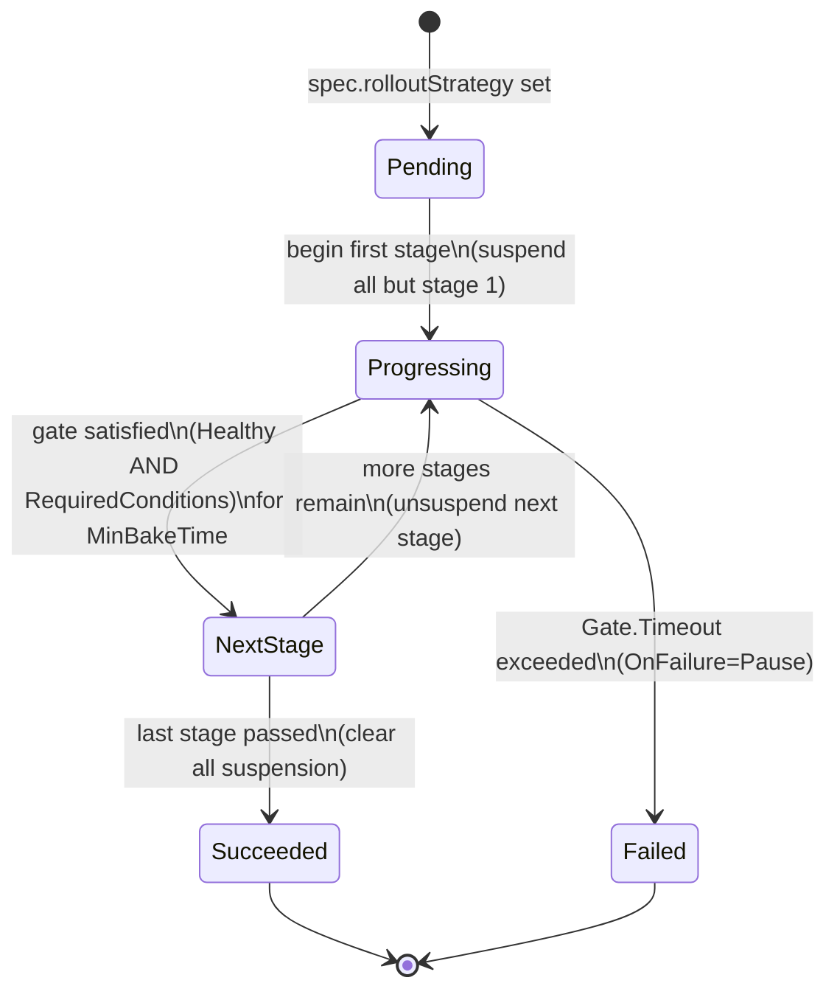

# Staged propagation for PropagationPolicy and ClusterPropagationPolicy

## Summary

Karmada has the primitives for ordered, health-gated multi-cluster
rollouts — per-cluster dispatch suspension
(`spec.suspension.dispatchingOnClusters`) and per-cluster workload health
(`ResourceBinding.status.aggregatedStatus[].health`) — but no
orchestration on top of them. Users do "update cluster A first, verify
healthy, then cluster B" by hand: poll health, patch suspension.
Error-prone, no verification signal, no defined failure behavior, no
observable state machine.

This proposal introduces an opt-in `rolloutStrategy` field on
`PropagationSpec` and a `pkg/rollout/` library invoked from the existing
binding controllers. Users declare *what* the staged rollout looks like
(ordered stages; health / condition / bake / timeout gates; failure
policy); Karmada drives the state machine. No new controller; the
feature layers on the existing suspension primitive and reuses the full
binding → Work → member-cluster data path.

## Motivation

Karmada's propagation pipeline is all-at-once: the binding controller
fans out to every scheduled cluster in parallel. This is the right
default but unsafe for:

- **Stateful services with a restart-sensitive control plane** (Trino
  coordinator: single-coordinator topology, ~30s unavailability per
  restart; simultaneous DC restart takes the service offline).
- **Blast-radius-sensitive cluster infrastructure** (ingress controllers,
  admission webhooks, CoreDNS overrides — anything managed by
  `ClusterPropagationPolicy`).
- **Tenant-driven validation** (smoke tests or custom readiness signals
  between clusters — beyond what `Health == Healthy` alone can provide).

The [dispatch-suspension
proposal](../dispatch-suspension/README.md) Story 2 describes ordered
rollout as a *manual* pattern (suspend all, release one at a time) and
correctly listed automated ordered rollout as a **Non-Goal**. This
proposal picks up that non-goal as its central goal.

### Goals

- Declare an ordered, health-gated staged rollout across the clusters
  selected by a single PP or CPP.
- Verification gate with four dials — `RequireHealthy`,
  `RequiredConditions`, `MinBakeTime`, `Timeout` — covering health-only
  auto-advance, condition-based validation (workload conditions or
  custom validator signals surfaced via the workload's status),
  bake-time, and auto-abort on stall.
- Declared, testable failure policy (`Pause | Continue`) so failed stages
  do not silently roll forward.
- Reuse existing primitives (`spec.suspension.dispatchingOnClusters`,
  `Work.spec.suspendDispatching`, `AggregatedStatusItem.Health`); no new
  data plane, only a new control loop.
- Opt-in per policy, alpha feature gate `StagedPropagation`, no-op for
  every existing policy.
- Symmetric support for `PropagationPolicy` and `ClusterPropagationPolicy`.

### Non-Goals

- **Traffic-shifting canary / blue-green** at the workload layer — belongs
  to Argo Rollouts / Flagger / the mesh.
- **Per-replica progressive rollout inside a single cluster** — Deployment
  / StatefulSet `strategy.rollingUpdate` domain.
- **A general-purpose multi-workload workflow engine** — anything like
  Argo Workflows (DAGs, per-step scripts) belongs outside Karmada.
- **Automatic workload-level rollback.** v1 stops the rollout; reverting
  the resource template is a GitOps concern.
- **Cross-policy synchronization** — independent PPs do not coordinate.

## Proposal

The core primitive is `PropagationSpec.rolloutStrategy`. Setting it to
`Staged` switches propagation from all-at-once dispatch to a
controller-driven state machine that unlocks one stage's clusters at a
time by writing per-cluster suspension onto the associated
`ResourceBinding` / `ClusterResourceBinding`. All other propagation
semantics — scheduling, placement, override policies, work generation,
execution, status aggregation — are unchanged. `rolloutStrategy` is
supported symmetrically on `PropagationPolicy` and
`ClusterPropagationPolicy` from v1.

### User Stories

#### Story 1: Sequential multi-DC rollout with health gating

As a service owner running the same HA workload across DC1 and DC2, I
want a config change to roll out to DC1 first, hold until DC1 has been
healthy for a bake period, then proceed to DC2 — so DC2 keeps serving
while DC1 restarts.

```yaml
kind: PropagationPolicy
spec:
  # ... resourceSelectors, placement ...
  rolloutStrategy:
    type: Staged
    staged:
      stages:
        - name: dc1
          clusterNames: [member-east]
          gate: {requireHealthy: true, minBakeTime: 60s, timeout: 10m}
        - name: dc2
          clusterNames: [member-west]
          gate: {requireHealthy: true, minBakeTime: 60s, timeout: 10m}
      onFailure: {action: Pause}
```

#### Story 2: Tenant-driven validation between stages

As a service owner, I do not trust "reports Healthy" as sufficient
signal to promote. I want the rollout to hold DC2 until DC1 is healthy
*and* my smoke-test controller writes a `SmokeTestsPassed=True`
condition onto the workload — read by the gate via the resource's
existing `.status.conditions[]` (see API changes).

```yaml
stages:
  - name: dc1
    clusterNames: [member-east]
    gate:
      requireHealthy: true
      requiredConditions:
        - {type: SmokeTestsPassed, status: "True"}
  - name: dc2
    clusterNames: [member-west]
    gate: {requireHealthy: true}
```

#### Story 3: Automatic pause on failed stage, protecting later clusters

If DC1 fails its gate (timeout without reaching `Healthy`, or required
conditions never becoming `True`), I want the rollout to *pause*
without propagating to DC2, so DC2 stays on the previous known-good
version until I intervene. No automatic workload-level revert — my
resource template is git-controlled.

### Notes/Constraints/Caveats

- **Not a scheduling or data-plane change.** The scheduler still owns
  `RB.spec.clusters`; only the binding controller learns a new
  responsibility (writing `spec.suspension.rollout` + `status.rollout`
  via `pkg/rollout/`). Execution and work-status controllers are
  unchanged.
- **Suspension is a union.** The dispatch decision is the union of
  user-declared (`Dispatching`, `DispatchingOnClusters`) and
  controller-managed (`Rollout.SuspendedClusters`) suspension; a
  user-suspended cluster is never un-suspended by a rollout stage.
- **Rollout state is per-workload.** One PP selecting N resource
  templates produces N ResourceBindings, each advancing independently.
  Cross-RB synchronization is a v2 extension.
- **Stages are atomic.** Every cluster in a stage must simultaneously
  satisfy the full gate (`RequireHealthy` if set, AND every
  `RequiredConditions` entry) for the entire `MinBakeTime` window; any
  flap resets the bake clock. A stage never partially advances.

### Risks and Mitigations

| Risk | Mitigation |
|---|---|
| Binding controller and detector race on `RB.spec.suspension` | Separate controller-owned field (`Suspension.Rollout`); the detector's `MergePolicySuspension` only overwrites the embedded user-declared part. |
| Rollout stalls on unreachable cluster | `Unknown` is treated as "not yet Healthy"; `Timeout` bounds the wait; `OnFailure: Pause` prevents cascading. |
| User edits resource template mid-rollout | Generation change marks the rollout `Superseded` and restarts from stage 1 (Deployment precedent). |
| `Health == Healthy` is a weak signal | Users needing stronger validation set `RequiredConditions` (e.g. `Available=True`, `Ready=True`, or a custom `SmokeTestsPassed=True` condition written by an in-cluster validator). Karmada observes; it does not run the tests. |
| Binding controller crashes mid-rollout | `pkg/rollout/` is a pure function; state is fully recovered from `status.rollout` + `spec.suspension.rollout` on the next reconcile. |

## Design Details

### API changes

Add `RolloutStrategy` to `PropagationSpec` (shared between PP and CPP).

```go
// pkg/apis/policy/v1alpha1/propagation_types.go
type PropagationSpec struct {
    // ... existing fields ...
    RolloutStrategy *RolloutStrategy `json:"rolloutStrategy,omitempty"`
}

type RolloutStrategy struct {
    // +kubebuilder:validation:Enum=AllAtOnce;Staged
    // +kubebuilder:default=AllAtOnce
    Type   RolloutStrategyType `json:"type"`
    Staged *StagedRollout      `json:"staged,omitempty"` // required when Type=Staged
}

type StagedRollout struct {
    // +kubebuilder:validation:MinItems=1
    Stages    []RolloutStage        `json:"stages"`
    OnFailure *RolloutFailurePolicy `json:"onFailure,omitempty"` // default {Action: Pause}
}

type RolloutStage struct {
    // +kubebuilder:validation:Pattern=`^[a-z0-9]([-a-z0-9]*[a-z0-9])?$`
    Name string `json:"name"`
    // ClusterNames must be a subset of spec.placement's selection at
    // reconcile time; unknown names are ignored and reported in status.
    // +kubebuilder:validation:MinItems=1
    ClusterNames []string          `json:"clusterNames"`
    Gate         *RolloutStageGate `json:"gate,omitempty"` // if unset, advance on Applied=true
}

type RolloutStageGate struct {
    RequireHealthy     *bool                  `json:"requireHealthy,omitempty"`     // default true
    RequiredConditions []ConditionRequirement `json:"requiredConditions,omitempty"` // default nil (no extra conditions)
    MinBakeTime        *metav1.Duration       `json:"minBakeTime,omitempty"`        // default 0
    Timeout            *metav1.Duration       `json:"timeout,omitempty"`            // default 30m
}

// ConditionRequirement gates a stage on a Condition present in the
// workload's own status.conditions[], surfaced per cluster via
// AggregatedStatusItem.Status. Missing conditions count as Unknown.
type ConditionRequirement struct {
    Type   string                 `json:"type"`             // e.g. "Available", "SmokeTestsPassed"
    // +kubebuilder:validation:Enum=True;False;Unknown
    // +kubebuilder:default=True
    Status metav1.ConditionStatus `json:"status,omitempty"` // default "True"
}

// RolloutFailurePolicy.Action is Pause | Continue (default Pause).
```

Multiple `RequiredConditions` entries AND together with `RequireHealthy`;
a stage advances only when every cluster satisfies the full gate for
the entire `MinBakeTime` window (see Notes/Caveats for flap semantics).

Add `Rollout` to `workv1alpha2.Suspension` (per-binding, controller-owned):

```go
// pkg/apis/work/v1alpha2/binding_types.go
type Suspension struct {
    policyv1alpha1.Suspension `json:",inline"`
    Scheduling *bool               `json:"scheduling,omitempty"`
    Rollout    *RolloutSuspension  `json:"rollout,omitempty"` // NEW; controller-owned
}

type RolloutSuspension struct {
    ActiveStage       string   `json:"activeStage,omitempty"`
    SuspendedClusters []string `json:"suspendedClusters,omitempty"`
}
```

`Rollout` sits alongside the existing controller-owned `Scheduling`
field, distinct from the embedded `policyv1alpha1.Suspension` block
(`Dispatching`, `DispatchingOnClusters`) that the detector rewrites
via `util.MergePolicySuspension`. This sibling-not-overlapping
structure is what prevents the detector-vs-rollout write race
(Risk #1); `Scheduling` has relied on the same guarantee since
introduction.

Add `Rollout` to `ResourceBindingStatus` (per-binding, controller-owned):

```go
// pkg/apis/work/v1alpha2/binding_types.go
type ResourceBindingStatus struct {
    // ... existing fields (SchedulerObservedGeneration, Conditions,
    // AggregatedStatus, etc.) ...
    Rollout *RolloutStatus `json:"rollout,omitempty"` // NEW; controller-owned
}

type RolloutStatus struct {
    // Mismatch with metadata.generation triggers a stage-1 restart.
    ObservedGeneration int64 `json:"observedGeneration,omitempty"`

    // +kubebuilder:validation:Enum=Pending;Progressing;Succeeded;Failed
    Phase        RolloutPhase         `json:"phase"`
    CurrentStage string               `json:"currentStage,omitempty"` // empty when Pending/Succeeded
    Stages       []RolloutStageStatus `json:"stages,omitempty"`       // ordered to match spec
    // Well-known Condition types: "Progressing", "Healthy", "ConditionsMet".
    Conditions   []metav1.Condition   `json:"conditions,omitempty"`
}

type RolloutPhase string

const (
    RolloutPhasePending     RolloutPhase = "Pending"
    RolloutPhaseProgressing RolloutPhase = "Progressing"
    RolloutPhaseSucceeded   RolloutPhase = "Succeeded"
    RolloutPhaseFailed      RolloutPhase = "Failed"
)

type RolloutStageStatus struct {
    Name  string       `json:"name"`
    // +kubebuilder:validation:Enum=Pending;Progressing;Succeeded;Failed
    Phase RolloutPhase `json:"phase"`

    HealthyClusters   []string `json:"healthyClusters,omitempty"`   // Health == Healthy
    UnhealthyClusters []string `json:"unhealthyClusters,omitempty"` // Unhealthy or Unknown

    // GateSatisfiedSince is when every cluster first continuously
    // satisfied the full gate (RequireHealthy AND RequiredConditions).
    // Reset to nil on flap so MinBakeTime survives controller restart.
    GateSatisfiedSince *metav1.Time `json:"gateSatisfiedSince,omitempty"`

    StartedAt   *metav1.Time `json:"startedAt,omitempty"`   // used for Gate.Timeout
    CompletedAt *metav1.Time `json:"completedAt,omitempty"`
    Message     string       `json:"message,omitempty"`     // human-readable, populated on transition
}
```

`ClusterResourceBinding` embeds `ResourceBindingSpec` /
`ResourceBindingStatus`, so `Rollout` applies to CRB unchanged.
Rollout suspension is written onto the RB / CRB, never onto PP / CPP
(rationale in Alternatives). `shouldSuspendDispatching`
(`pkg/controllers/binding/common.go`) is extended to take the union
of user-declared and controller-managed suspension;
`util.MergePolicySuspension` is unchanged.

### Rollout reconciliation

**No new controller.** The state machine lives as a `pkg/rollout/`
library of pure functions invoked from the existing binding controllers
whenever `spec.rolloutStrategy != nil`. It exposes a single
`Compute(strategy, prevStatus, aggregatedStatus, scheduledClusters, now)`
returning the suspended-cluster set, a new `RolloutStatus`, and a
`requeueAfter` duration. The binding controller writes
`spec.suspension.rollout` + `status.rollout` and requeues; `ensureWork`
reads the updated `Suspension` via `shouldSuspendDispatching` (unchanged
data path).



`suspendedClusters` on each entry: `Pending` / `Progressing (stage N)`
— every scheduled cluster except those in stage N; `Succeeded` — empty;
`Failed (stage N)` — every cluster in later stages (they stay on the
known-good version).

**Reconcile trigger.** Binding controllers get a rollout-aware
predicate that also wakes on aggregated-status changes; the execution
controller needs no changes since `Suspension.Rollout` writes bump
`metadata.generation`.

### Reschedule mid-rollout

The scheduler owns `RB.spec.clusters` and can update it any time. On each
reconcile, `pkg/rollout/` computes the expected suspended set as
`union(clusters in later stages) ∪ (unreached clusters in the current
stage)`, intersected with the current `spec.clusters`. Clusters that
appear in `spec.clusters` but no stage are left unsuspended and produce a
`Warning` event; clusters removed mid-stage no longer block the gate.

### Failure handling

`OnFailure.Action`:

- **Pause** (default) — set `phase = Failed`, keep later stages'
  clusters suspended, emit `RolloutStageFailed`, stop requeuing.
  `Failed` is terminal; recovery is either (a) any generation bump on
  the resource template (restarts from stage 1), or (b) removing
  `spec.rolloutStrategy` to fall back to all-at-once.
- **Continue** — advance despite failure. Emits a `Warning` event. Rare.

No automatic workload-level rollback in v1 — reverting `spec.resource`
is a GitOps concern. What v1 guarantees is that later stages stay on
the previously known-good version via `Work.spec.suspendDispatching`.

### Feature gate and defaulting

- Feature gate `StagedPropagation` (alpha in v1). When disabled, the
  webhook rejects any policy with `spec.rolloutStrategy != nil`.
- When `spec.rolloutStrategy` is unset, existing behavior is preserved
  verbatim; the binding controllers skip `pkg/rollout/` entirely.
- Defaults: `RolloutStrategy.Type=AllAtOnce`, `Gate.RequireHealthy=true`,
  `Gate.RequiredConditions=nil`, `Gate.MinBakeTime=0`,
  `Gate.Timeout=30m`, `OnFailure.Action=Pause`.

### Corner cases

- **Spec change mid-rollout** — generation bump resets
  `status.rollout.stages` and restarts from stage 1 (Deployment
  precedent).
- **Cluster unreachable / missing condition** — treated as `Unknown`;
  the stage eventually fails via `Timeout`. For CRDs, missing
  `.status.conditions[]` in aggregated status is usually a
  `ResourceInterpreterCustomization` gap — the status message calls
  this out explicitly.
- **Deletion during rollout** — `Work` deletion is not blocked by
  `spec.suspendDispatching`; the binding controller clears
  `spec.suspension.rollout` on the deletion-triggered reconcile.
- **Overlap with user-declared static suspension** — static suspension
  wins (union semantics); a validation warning is emitted, the policy
  is not rejected.
- **Interaction with `Failover`** — v1 does not pause failover during
  a rollout; failover to a still-suspended later-stage cluster is a
  documented limitation. If failover, reschedule, or any other cause
  reduces the current stage's cluster set (intersected with
  `spec.clusters`) to empty, `pkg/rollout.Compute` enters
  `phase = Failed` immediately with reason `EmptyStageAfterReschedule`
  (bypassing `Gate.Timeout`) — this prevents unverified promotion to
  any later-stage cluster when the current stage never had a chance to
  gate.

### Test Plan

**Unit:** validation (`type=Staged` requires `staged`, stage-name
uniqueness, non-empty `clusterNames`, duration bounds; each
`RequiredConditions` entry has a non-empty `Type`);
`pkg/rollout/Compute` transitions (Pending → Progressing → Succeeded;
Progressing → Failed on `Timeout`; `RequiredConditions` evaluated
per-cluster with missing condition treated as `Unknown`; regeneration
restarts from stage 1; scheduler-driven `spec.clusters` changes
reconcile cleanly); widened watch predicate;
`shouldSuspendDispatching` union semantics.

**Integration & E2E:** three-stage Deployment rollout across three
clusters verifying per-stage `Work.spec.suspendDispatching` toggling;
`OnFailure: Pause` with a stuck-Unhealthy workload (later clusters stay
suspended); condition-driven promotion — deploy a workload whose
operator publishes `Available=True` and confirm a stage with
`RequiredConditions: [{type: Available, status: True}]` advances only
after the condition flips (and does *not* advance when the condition is
missing entirely); CPP path with mixed namespaced + cluster-scoped
targets; GitOps interaction (fluxcd/argocd sync of the PP does not
fight rollout progression — proves we do not write to PP spec).

## Alternatives

- **Suspension on PP / CPP spec, not RB / CRB.** Rejected: would cause
  GitOps drift (Argo CD / Flux would fight the rollout), fan out through
  the detector on every stage transition, and collide with
  user-declared static suspension in the same field.
- **Dedicated `karmada-rollout` controller.** Rejected for v1: the only
  output (`RB.spec.suspension.rollout`) is consumed by the binding
  controller on its own reconcile — an unnecessary inter-controller
  hand-off. Extracting later is a mechanical refactor; the API is
  neutral to which controller writes it.
